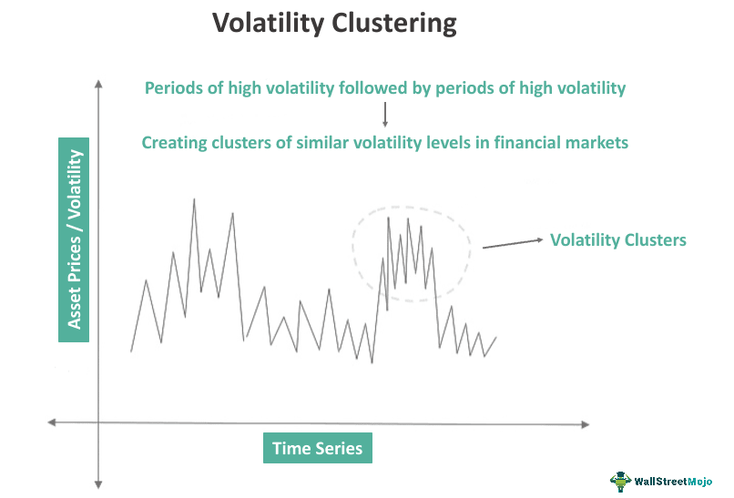

The financial markets have undergone significant transformation over the past few decades, driven by technological advancements, globalization, and regulatory changes. The landscape has shifted from traditional floors of bustling human traders to virtual platforms where algorithms play a central role in executing trades. This evolution has introduced new dynamics and complexities, emphasizing the need to understand concepts such as market trends, price persistence, and algorithmic trading.

Market trends refer to the prevailing direction of market prices over a specific period and serve as an essential indicator for investors and traders. Identifying these trends enables market participants to align their strategies and optimize returns. Trends can be categorized into three primary types: upward, downward, and sideways. Upward trends indicate rising prices, downward trends signify falling prices, and sideways trends denote relatively stable prices with minimal fluctuations.



Price persistence is another crucial concept that refers to the tendency of asset prices to continue moving in their current trajectory over time. This persistence arises from various factors such as investor behavior, market sentiment, and economic conditions. For instance, if a stock price exhibits strong persistence in an upward movement, traders might anticipate further gains and adjust their positions accordingly. Price persistence acts as a signal for potential future market movements, making it a vital aspect for traders seeking to capitalize on short-term market fluctuations.

Algorithmic trading, commonly known as algo trading, has revolutionized how financial markets operate. Originating from the development of computerized trading systems, algorithmic trading utilizes pre-programmed instructions to execute orders based on a set of criteria, such as timing, price, and market conditions. The primary aim of algo trading is to enhance trading efficiency and execution, reduce human error, and capitalize on market opportunities faster than traditional methods.

Understanding market trends, price persistence, and algorithmic trading is paramount in modern trading. These elements are interconnected and significantly influence market dynamics. For instance, algos can leverage historical price data to identify trends and utilize persistence patterns to refine trading strategies, potentially enhancing profitability. As financial markets continue to evolve, traders who comprehend and integrate these concepts into their arsenal are better positioned to navigate the complex landscape and achieve sustained success.

## Table of Contents

## Understanding Market Trends and Economics

Market trends represent the general direction in which a market or the price of an asset moves over time. They are significant in economics because they offer insights into the health and potential future performance of economies and individual sectors. Trends can be upward, downward, or sideways, indicating phases of expansion, contraction, or stagnation within markets. Recognizing these trends allows investors, policymakers, and economic analysts to make informed decisions.

Economic indicators are statistical metrics used to gauge the current state and predict future economic performance. They are pivotal in influencing market trends. Key indicators include Gross Domestic Product (GDP), inflation rates, employment data, interest rates, and consumer confidence indices. For example, a rising GDP typically signals economic growth, encouraging investment and possibly leading to an upward market trend. Conversely, high inflation rates might indicate economic overheating, prompting central banks to raise interest rates, which could slow down investment and result in a downward trend.

Macroeconomic policies and events also play a crucial role in shaping market trends. Fiscal policies, such as government spending and taxation, can stimulate or restrain economic activity. Expansionary fiscal policies, including increased government spending or tax cuts, tend to boost economic activity and lead to bullish market trends. Alternatively, contractionary policies might slow economic growth and cause bearish trends.

Monetary policy, managed by central banks, involves regulating the money supply and interest rates. Lowering interest rates can reduce borrowing costs, encourage spending and investment, and stimulate economic growth, thus influencing upward trends. Conversely, raising rates can slow economic activity and contribute to downward trends. 

External events, such as geopolitical tensions, natural disasters, and pandemics, can abruptly shift market trends by altering investor behavior and economic stability. For instance, the COVID-19 pandemic created unprecedented market [volatility](/wiki/volatility-trading-strategies) and disrupted long-established trends, highlighting how macroeconomic shocks can rapidly reshape market dynamics.

In summary, understanding market trends requires a comprehensive analysis of economic indicators and macroeconomic policies. These elements guide predictions and interpretations about market movements, facilitating strategic decision-making across economic landscapes.

## The Concept of Price Persistence

Price persistence refers to the tendency of asset prices to continue moving in the same direction for a certain period due to various underlying factors. This phenomenon is particularly significant as it often provides valuable insights into market trends and can serve as an early indicator of potential price movements. Understanding price persistence is crucial for traders and investors aiming to capitalize on or hedge against future price changes.

At its core, price persistence is driven by behavioral and structural factors in financial markets. Behavioral factors include the herd behavior of investors, where widespread sentiment or belief in a trend leads to [momentum](/wiki/momentum). Structural factors involve elements like market [liquidity](/wiki/liquidity-risk-premium), transaction costs, and delays in information dissemination, which can affect how rapidly prices adjust to new information.

### Mechanics of Price Persistence

The mechanics of price persistence can vary across different trading instruments. In equity markets, for instance, price persistence might manifest through continued buying or selling pressure, often fueled by news events or macroeconomic data releases. In the foreign exchange market, currency pairs may exhibit persistence when central banks announce monetary policy decisions that align with market expectations.

In mathematical terms, price persistence can often be modeled using time-series analysis. One common approach is to use an autoregressive model, expressed in its simplest form as:

$$
P_t = \alpha + \beta P_{t-1} + \epsilon_t
$$

where $P_t$ is the current price, $P_{t-1}$ is the previous price, $\alpha$ is a constant, $\beta$ represents the degree of persistence, and $\epsilon_t$ is a random error term. A high value of $\beta$ indicates significant persistence, showing that past prices are strong predictors of current prices.

In Python, such a model can be constructed using the statsmodels library:

```python
import statsmodels.api as sm

# Assume `prices` is a Pandas series of the historical prices
model = sm.tsa.AR(prices)
result = model.fit()

# Summary of the model provides information on price persistence
print(result.summary())
```

### Importance for Potential Market Movement

Price persistence provides valuable signals for potential market movement. By analyzing historical price trends and the current persistence level, traders can predict future price changes. For instance, in bullish markets, a high degree of persistence may suggest continued upward momentum, while in bearish markets, it may indicate ongoing downward pressure.

Furthermore, price persistence helps identify potential reversals when there is a declining pattern of persistence. A decrease in persistence, combined with other technical indicators, might signal an upcoming trend reversal. Hence, traders often incorporate price persistence analysis into their broader trend analysis strategies to enhance their decision-making process.

Understanding the nuances of price persistence is essential for navigating the complexities of modern financial markets. By recognizing persisting trends and potential reversals, informed traders can better manage risk and execute profitable trading strategies.

## Algorithmic Trading: An Overview

Algorithmic trading, often referred to as algo trading, represents the use of computer algorithms to manage trading activities in financial markets. The primary goal is to exploit speed and computational efficiency to execute trading orders more effectively than human traders. The roots of [algorithmic trading](/wiki/algorithmic-trading) can be traced back to the early 1970s, when the New York Stock Exchange (NYSE) introduced designated order turnaround (DOT) systems, which allowed for electronic sending and execution of orders. Subsequently, advancements in technology have significantly transformed the trading landscape, leading to the current state where algorithmic trading accounts for a substantial portion of market transactions.

Key strategies employed in algorithmic trading include [trend following](/wiki/trend-following), [arbitrage](/wiki/arbitrage), [market making](/wiki/market-making), and [statistical arbitrage](/wiki/statistical-arbitrage). Among these, trend following is one of the most popular strategies. It involves the use of algorithms to detect and capitalize on sustained market trends. These algorithms can identify trends using various technical indicators such as moving averages, relative strength index (RSI), and momentum indicators. The objective is to enter trades in the direction of the trend and maintain the position until a clear trend reversal is detected.

An example of a simple trend-following strategy is the moving average crossover strategy, where trades are executed based on the crossover of short-term and long-term moving averages. For instance, a buy signal could be generated when a 50-day moving average crosses above a 200-day moving average, while a sell signal occurs when the opposite crossover takes place. Such strategies can be implemented in Python as follows:

```python
import pandas as pd

# Load historical price data
data = pd.read_csv('historical_prices.csv')

# Calculate moving averages
data['Short_MA'] = data['Close'].rolling(window=50, min_periods=1).mean()
data['Long_MA'] = data['Close'].rolling(window=200, min_periods=1).mean()

# Generate buy and sell signals
data['Signal'] = 0
data.loc[data['Short_MA'] > data['Long_MA'], 'Signal'] = 1  # Buy signal
data.loc[data['Short_MA'] < data['Long_MA'], 'Signal'] = -1  # Sell signal
```

The impact of automation in trading is profound, delivering several advantages in terms of efficiency and execution. Automation ensures faster order entry compared to manual trading, reducing latency and allowing traders to capitalize on fleeting market opportunities. Additionally, the precision of algorithmic trading minimizes human errors and emotional biases, which can adversely impact trading decisions.

Moreover, algorithmic trading enhances liquidity in the market by providing continuous matching of buy and sell orders. This increased liquidity often results in narrower bid-ask spreads, benefiting all market participants. Furthermore, the scalability of algorithmic systems allows traders to process large volumes of data and execute orders across multiple markets simultaneously, optimizing their trading strategies in real-time.

Despite these advantages, algorithmic trading requires meticulous design and implementation. Poorly constructed algorithms or inadequate risk management measures can lead to significant financial losses. Hence, continuous monitoring and refinement of algorithms are essential for maintaining trading efficacy and achieving long-term success in the dynamic financial markets.

## The Interplay Between Price Persistence and Algo Trading

Algorithmic trading, or algo trading, has revolutionized financial markets by utilizing computational power to identify opportunities and execute orders at speeds and frequencies impossible for human traders. A crucial aspect of enhancing these algorithmic strategies is incorporating the concept of price persistence.

Price persistence refers to the continuation of a price movement in a consistent direction over time, which can signal trends or reversals. In algorithmic trading, this concept is leveraged to make informed strategic gains. Algorithms that successfully integrate price persistence are able to predict short- to medium-term price movements with greater accuracy. By identifying persistent price movements, these algorithms can optimize entry and [exit](/wiki/exit-strategy) points to enhance profitability.

A fundamental way algo trading systems utilize price persistence is through trend-following strategies. These systems analyze historical price data to detect patterns or trends that indicate price persistence. For example, suppose a particular asset has shown a persistent upward trend over several days. In that case, an algorithm may prioritize buying or holding the asset, anticipating that the trend will continue.

Consider the following simplified example of how an algorithm might be structured in Python to incorporate price persistence:

```python
import numpy as np
import pandas as pd

# Simulate a simple moving average crossover strategy
def moving_average(df, short_window=5, long_window=20):
    df['Short_MA'] = df['Close'].rolling(window=short_window, min_periods=1).mean()
    df['Long_MA'] = df['Close'].rolling(window=long_window, min_periods=1).mean()

    # Generate signals based on price persistence
    df['Signal'] = np.where(df['Short_MA'] > df['Long_MA'], 1, 0)

    return df

# Example usage
# df = pd.read_csv('historical_data.csv')
# signals = moving_average(df)
```

In practice, the integration of price persistence into algo trading systems has been successfully implemented across various hedge funds and trading firms. These institutions develop sophisticated models that not only identify persistent price patterns but also adapt to evolving market conditions.

Challenges, however, are inherent in incorporating price persistence data into algorithms. One primary issue is the assumption that historical price patterns will reliably predict future movements, an assumption that may not always hold true due to market volatility and randomness. Moreover, developing models that can accurately discern between noise and genuine price persistence is computationally complex and requires vast datasets for [backtesting](/wiki/backtesting).

Another challenge is the risk of model overfitting, where an algorithm is tailored too closely to past data, failing to generalize to new data. This can result in significant financial losses if live trading conditions don't align with the modeled scenarios. Implementing proper risk management and constantly updating and monitoring the model's performance is crucial to mitigate these risks.

In conclusion, while the synergy between price persistence and algorithmic trading can lead to strategic advantages, it requires careful consideration of the potential pitfalls and a robust approach to adapting to market changes.

## Advantages and Challenges of Combining these Concepts

Integrating market trend analysis, price persistence, and algorithmic trading offers significant advantages to market participants seeking to optimize their trading strategies. The fusion of these concepts allows for a more comprehensive understanding of market dynamics, enabling traders to anticipate and react to price movements with greater precision.

One primary benefit of integrating these elements is the enhanced capability to predict and capitalize on market movements. Market trend analysis provides insight into the general direction of asset prices, allowing traders to align their strategies with prevailing trends. Coupled with price persistence—the tendency of asset prices to continue moving in a given direction—traders can identify and exploit potential entry and exit points more effectively. Algorithmic trading facilitates the execution of these strategies at a speed and scale beyond human capability, improving the overall efficiency and profitability of trades.

The synergy of these components also enables the development of robust quantitative models that can adapt to changing market conditions. For instance, algorithms can be programmed to recognize and respond to patterns of price persistence, providing timely buy or sell signals as trends begin to form or dissipate. This adaptability is crucial in modern markets, where rapid fluctuations and high-frequency trading environments require swift and informed decision-making.

Despite these advantages, integrating market trend analysis, price persistence, and algorithmic trading poses several challenges. One significant issue is the potential for overfitting, where algorithms become too finely tuned to historical data, resulting in poor performance in live markets. Overfitting can occur when algorithms rely excessively on specific price patterns that may not reoccur, leading to erroneous predictions and financial losses.

Another challenge is the need for high-quality, up-to-date data to inform trading decisions. Incomplete or inaccurate data can mislead algorithms, undermining the effectiveness of trading strategies. Moreover, the complexity of developing algorithms capable of accurately interpreting market signals demands substantial technical expertise and resources.

To mitigate these challenges, risk management strategies should be implemented. These strategies include maintaining a diversified portfolio to spread risk and employing stop-loss orders to minimize potential losses from adverse market movements. Regular backtesting of algorithms on fresh, unseen data is also essential to ensure their robustness and adaptability to current market conditions. Additionally, traders should incorporate [machine learning](/wiki/machine-learning) techniques that allow algorithms to learn and evolve from new data inputs, reducing the risk of overfitting and improving predictive accuracy over time.

Ultimately, the integration of market trend analysis, price persistence, and algorithmic trading represents a promising frontier for traders seeking to enhance their market strategies. By understanding both the advantages and potential pitfalls, traders can harness these concepts to achieve a competitive edge in increasingly complex financial markets.

## Conclusion

The integration of market trend analysis, price persistence, and algorithmic trading offers a substantial advantage in navigating the complexities of modern financial markets. By understanding and leveraging these interconnected concepts, traders can enhance their strategic decision-making, execution efficiency, and ultimately, their overall performance. The synergy between trend analysis and algorithmic trading enables the identification of consistent patterns and momentum within markets, providing a systematic approach to capturing potential opportunities.

Recognizing the implications for traders who embrace this synergy, the future holds the promise of greater precision in market predictions and the execution of trades. Traders equipped with the skills to analyze and interpret price persistence, and seamlessly integrate this data within algorithmic strategies, can gain a competitive edge. These methodologies can foster a robust trading framework adaptable to varied market conditions, leading to more informed and resilient trading practices.

The dynamic nature of financial markets, fueled by technological advancements, underscores the necessity for ongoing learning and adaptation in trading strategies. Continuous engagement with new tools and methodologies is crucial as markets evolve. Traders are encouraged to remain committed to expanding their knowledge, embracing innovative strategies, and incorporating emerging technologies within their trading arsenal. This relentless pursuit of improvement and adaptation can pave the way for sustained success in the ever-evolving landscape of financial markets.

## References & Further Reading

[1]: Bergstra, J., Bardenet, R., Bengio, Y., & Kégl, B. (2011). ["Algorithms for Hyper-Parameter Optimization."](https://dl.acm.org/doi/10.5555/2986459.2986743) Advances in Neural Information Processing Systems 24.

[2]: ["Advances in Financial Machine Learning"](https://www.amazon.com/Advances-Financial-Machine-Learning-Marcos/dp/1119482089) by Marcos Lopez de Prado

[3]: ["Evidence-Based Technical Analysis: Applying the Scientific Method and Statistical Inference to Trading Signals"](https://www.amazon.com/Evidence-Based-Technical-Analysis-Scientific-Statistical/dp/0470008741) by David Aronson

[4]: ["Machine Learning for Algorithmic Trading"](https://github.com/stefan-jansen/machine-learning-for-trading) by Stefan Jansen

[5]: ["Quantitative Trading: How to Build Your Own Algorithmic Trading Business"](https://www.amazon.com/Quantitative-Trading-Build-Algorithmic-Business/dp/1119800064) by Ernest P. Chan