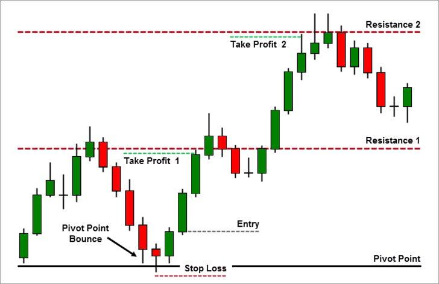

## Table of Contents

## What is a price pivot strategy?

A price pivot strategy is a way traders use to make decisions about buying or selling things like stocks or currencies. It involves looking at a price chart to find points where the price changes direction. These points are called pivots. Traders think that these pivots can show them where the price might go next. By watching these pivots, traders can decide if it's a good time to buy or sell.

Using a price pivot strategy helps traders spot trends and make better guesses about future price movements. For example, if the price keeps going up and then suddenly drops, that drop could be a pivot. If the price starts going up again after that drop, traders might see it as a sign to buy. On the other hand, if the price keeps going down and then suddenly goes up, but then starts falling again, traders might see it as a sign to sell. This strategy helps traders make more informed choices based on what the price has done before.

## How does a price pivot strategy differ from other pricing strategies?

A price pivot strategy is different from other pricing strategies because it focuses on finding specific points on a price chart where the price changes direction. These points, called pivots, help traders predict where the price might go next. Other pricing strategies might look at things like the overall market trend, the cost to make the product, or what competitors are charging. For example, a cost-plus pricing strategy adds a fixed percentage to the cost of making a product to set the price, while a competitive pricing strategy sets prices based on what other sellers are charging.

Unlike these other strategies, a price pivot strategy doesn't rely on external factors like costs or competitors. Instead, it uses historical price data to make decisions. This means traders using a price pivot strategy are more focused on the patterns and movements of the price itself. They believe that by understanding these patterns, they can make better guesses about future price movements. This approach can be more technical and requires a good understanding of charts and price movements, but it can also be very effective for those who master it.

## What are the basic steps to implement a price pivot strategy?

To start using a price pivot strategy, you need to look at a price chart and find the points where the price changes direction. These points are called pivots. You can spot a pivot when the price goes up and then starts to go down, or when it goes down and then starts to go up. Once you find these pivots, you should draw lines on the chart to connect them. These lines help you see the overall trend and where the price might go next.

After you have drawn the lines, you need to watch how the price moves around these pivots. If the price keeps going up after hitting a pivot, it might be a good time to buy. If the price keeps going down after hitting a pivot, it might be a good time to sell. You should also pay attention to how strong the pivots are. A strong pivot is one where the price changes direction a lot, and it can be a more reliable sign of where the price will go next. By keeping an eye on these pivots and the lines you've drawn, you can make better decisions about when to buy or sell.

## Can you explain the concept of price elasticity in relation to price pivots?

Price elasticity tells us how much the demand for something changes when its price changes. If a small change in price leads to a big change in how much people want to buy, the product is said to be elastic. If the price changes but people still buy about the same amount, the product is inelastic. When we talk about price pivots, we look at the points on a price chart where the price changes direction. These pivots can show us where the price might go next, but they don't tell us directly about price elasticity.

However, understanding price elasticity can help us make better decisions when using a price pivot strategy. If a product is elastic, a pivot point where the price goes up might lead to a big drop in demand, and the price might not go up as much as we expect. On the other hand, if a product is inelastic, a pivot point where the price goes up might not affect demand much, and the price might keep going up. By knowing how elastic a product is, we can predict better how the price will move after hitting a pivot point, and make smarter choices about buying or selling.

## What are some common indicators that a price pivot might be necessary?

A price pivot might be necessary when you see the price of something start to change direction on a chart. For example, if the price has been going up for a while and then suddenly starts to go down, that could be a sign that a pivot is happening. Another sign is when the price goes down and then starts to go up again. These changes in direction can show that the market is shifting, and it might be a good time to think about buying or selling.

You can also look at how much the price changes at these points. If the price changes a lot when it turns around, it might be a strong pivot, which means it's more likely to be important for making decisions. Also, if the price keeps bouncing off the same level a few times, that can be a sign that a pivot is happening there. By watching these signs, you can get a better idea of when a price pivot might be necessary and make smarter choices about what to do next.

## How can a business determine the optimal timing for a price pivot?

A business can figure out the best time for a price pivot by looking at the price chart and finding the points where the price changes direction. These points, called pivots, can show when the market might be shifting. If the price has been going up and then suddenly starts to go down, or if it has been going down and then starts to go up, that could be a good time to think about changing the price. The business should also pay attention to how much the price changes at these points. A big change in price at a pivot can mean it's a strong signal, and it might be a good time to make a move.

Another way to find the right time for a price pivot is by looking at how the price moves around these pivots. If the price keeps bouncing off the same level a few times, that can be a sign that a pivot is happening there. The business should also think about how elastic their product is. If the product is elastic, a small change in price can lead to a big change in demand, so the business needs to be careful about when to pivot. If the product is inelastic, the demand won't change much with the price, so the business might have more room to adjust the price at a pivot point. By watching these signs and understanding their product's elasticity, a business can pick the best time for a price pivot.

## What are the potential risks associated with implementing a price pivot strategy?

Using a price pivot strategy can be risky because it depends a lot on guessing where the price will go next. If the business gets it wrong, they might set the price too high or too low, which can hurt their sales and profits. For example, if they raise the price at a pivot point thinking the price will keep going up, but it actually goes down, they could lose customers who are not willing to pay the higher price. On the other hand, if they lower the price thinking it will go down more, but it starts going up, they could miss out on making more money.

Another risk is that price pivots can be hard to spot and predict. Sometimes, what looks like a pivot might just be a small change in the price that doesn't mean much. If the business makes a decision based on a false pivot, they could end up making a big mistake. Also, the market can be unpredictable, and things like news events or changes in the economy can make the price move in ways that are hard to predict. This means that even if the business thinks they have found a good pivot point, something unexpected could happen and mess up their plans.

## How can data analytics be used to enhance the effectiveness of price pivot strategies?

Data analytics can help businesses make better decisions about when to use a price pivot strategy by looking at a lot of information about past prices and how people have bought things before. By using special computer programs, businesses can find patterns in the data that they might not see just by looking at a chart. For example, data analytics can show if certain times of the year or certain events always make the price go up or down. This can help the business know when a pivot might be coming and get ready to change their price at the right time.

Also, data analytics can help businesses understand how their customers react to price changes. By looking at data from sales and customer feedback, the business can see if people buy more or less when the price goes up or down at a pivot point. This can tell them if their product is elastic or inelastic, which is important for deciding when to pivot. With this information, the business can make smarter choices about when to change their price and how much to change it, making their price pivot strategy more effective and less risky.

## What role does customer segmentation play in tailoring price pivot strategies?

Customer segmentation helps businesses make their price pivot strategies work better by dividing their customers into different groups based on things like how much they buy, what they like, or how much money they have. When a business knows these groups well, they can see how each group reacts to price changes at pivot points. For example, if one group of customers always buys more when the price goes down at a pivot, the business can lower the price just for that group to get more sales. This way, the business can use price pivots to make the most money from each group of customers.

By understanding customer segments, a business can also figure out the best time to use a price pivot for each group. Some customers might be more likely to buy at certain times of the year or after certain events, and data can show when these times are. If the business sees that a certain group of customers tends to buy more after a price pivot happens, they can plan to change the price at that time to get the best results. This makes the price pivot strategy more effective because it's tailored to the needs and behaviors of different customer groups.

## How do competitive responses influence the success of a price pivot?

When a business changes its price at a pivot point, what other businesses do can really affect how well it works. If a business raises its price and its competitors don't, the business might lose customers because people can buy the same thing cheaper somewhere else. On the other hand, if the business lowers its price and competitors follow, it might not get more sales because everyone's prices are lower now. So, the business needs to think about what its competitors might do before making a price pivot.

Competitors can also change their prices at the same time as the business, making the price pivot less effective. If everyone raises or lowers their prices at the same time, it can be hard for the business to stand out. The business needs to watch what competitors are doing and maybe wait for the right moment to make a price change. By understanding how competitors might react, the business can make smarter decisions about when and how to use a price pivot to get the best results.

## Can you discuss a case study where a price pivot strategy significantly impacted profitability?

A good example of a price pivot strategy impacting profitability is the case of a well-known electronics company that sells smartphones. The company noticed that the price of their flagship phone had been going up steadily, but then it started to drop. They identified this drop as a pivot point and decided to lower the price of the phone. By doing this, they were able to increase sales volume significantly because more people could afford the phone at the lower price. Even though they were making less money per phone, the increase in sales made up for it, and their overall profits went up.

Another example comes from a retail clothing brand that used data analytics to find the best times to use price pivots. They saw that every year, right after the holiday season, the price of their winter clothes would start to drop. They decided to lower the price of their winter items right at this pivot point, which led to a big increase in sales. Customers were happy to buy winter clothes at a discount, and the company cleared out their inventory faster. This move not only boosted their profits but also helped them get ready for the next season's products. By using price pivots wisely, both companies were able to make more money.

## What advanced techniques can be used to predict the outcomes of different price pivot scenarios?

Advanced techniques like machine learning can help businesses predict what will happen when they use different price pivot strategies. Machine learning uses a lot of past data to find patterns and make guesses about the future. For example, a business can use machine learning to look at how the price of their product has changed in the past and how people bought it at different prices. This can help them see what might happen if they change the price at a pivot point. By using this information, the business can make better choices about when to raise or lower their price to make the most money.

Another technique is called simulation modeling. This is when a business makes a computer model of their market and tries out different price pivot scenarios to see what happens. They can change the price at different pivot points in the model and see how it affects their sales and profits. This can help them find the best time and the best amount to change their price. By using simulation modeling, a business can test their ideas without taking big risks in the real world, and they can be more confident that their price pivot strategy will work well.

## What is the Role of Price Pivots?

Price pivots serve as critical levels where a market trend may shift direction. These key points are identified based on historical price data, serving as potential thresholds for market movements. Traders frequently utilize pivot points to spot potential support and resistance levels, which are essential in making informed trading decisions.

### Understanding Pivot Points

Pivot points are calculated based on the high, low, and closing prices of previous trading sessions. The basic pivot point, $P$, is calculated as:

$$

P = \frac{(H + L + C)}{3} 
$$

where $H$ is the high price, $L$ is the low price, and $C$ is the closing price of the previous session. Once the pivot point is determined, subsequent support and resistance levels can be calculated, guiding traders in their decision-making.

### Methodologies of Pivot Analysis

Pivot analysis employs various methodologies to better interpret market trends:

1. **Standard Pivot Points**: These are the traditional pivot points used to identify potential support and resistance levels. Alongside the basic pivot point, additional calculations provide primary support ($S1, S2$) and resistance ($R1, R2$) levels.

2. **Fibonacci Retracements**: This method incorporates Fibonacci ratios (23.6%, 38.2%, 61.8%) into the pivot point analysis to predict potential reversal levels. Fibonacci retracements are used when a market is experiencing noticeable trends, offering insight into potential correction levels.

3. **Camarilla Pivots**: A more refined technique that homes in on price fluctuations within the day's trading range. Camarilla pivots are particularly useful for day traders, offering numerous levels for tight stop-loss settings.

### Enhancement with Technical Indicators

Integrating pivot points with other technical indicators like moving averages, Relative Strength Index (RSI), or MACD (Moving Average Convergence Divergence) can significantly enhance a trader's decision-making process. For example, if a stock price approaches a pivot point while the RSI indicates overbought conditions, this may signal a potential reversal is imminent.

Below is a simple Python code snippet demonstrating how to compute basic pivot points and associated support and resistance levels for a given stock data:

```python
def calculate_pivot_points(high, low, close):
    pivot = (high + low + close) / 3
    support1 = (pivot * 2) - high
    resistance1 = (pivot * 2) - low
    support2 = pivot - (high - low)
    resistance2 = pivot + (high - low)
    return pivot, support1, resistance1, support2, resistance2

# Example
high_price = 150
low_price = 140
close_price = 145

pivot, S1, R1, S2, R2 = calculate_pivot_points(high_price, low_price, close_price)
print("Pivot:", pivot)
print("Support 1:", S1)
print("Resistance 1:", R1)
print("Support 2:", S2)
print("Resistance 2:", R2)
```

This code calculates the pivot point and typical support and resistance levels using the standard pivot methodology. By rigorously applying pivot point analysis and integrating these levels with techniques like [algorithmic trading](/wiki/algorithmic-trading), traders can improve their ability to anticipate market movements and make more informed trading decisions.

## References & Further Reading

[1]: Bergstra, J., Bardenet, R., Bengio, Y., & Kégl, B. (2011). ["Algorithms for Hyper-Parameter Optimization."](https://dl.acm.org/doi/10.5555/2986459.2986743) Advances in Neural Information Processing Systems 24.

[2]: ["Advances in Financial Machine Learning"](https://www.amazon.com/Advances-Financial-Machine-Learning-Marcos/dp/1119482089) by Marcos Lopez de Prado

[3]: ["Evidence-Based Technical Analysis: Applying the Scientific Method and Statistical Inference to Trading Signals"](https://onlinelibrary.wiley.com/doi/book/10.1002/9781118268315) by David Aronson

[4]: ["Machine Learning for Algorithmic Trading"](https://github.com/stefan-jansen/machine-learning-for-trading) by Stefan Jansen

[5]: ["Quantitative Trading: How to Build Your Own Algorithmic Trading Business"](https://www.amazon.com/Quantitative-Trading-Build-Algorithmic-Business/dp/1119800064) by Ernest P. Chan