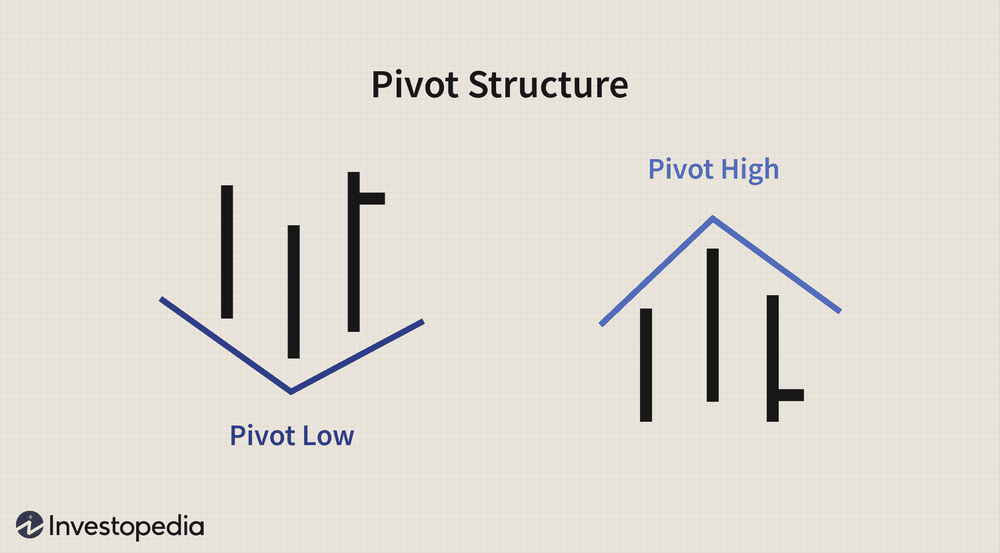

In the world of finance, profit maximization is a primary objective for individuals and institutions engaged in various market activities. The ability to understand financial markets is crucial for developing effective profit strategies, as these markets are complex ecosystems influenced by numerous factors, including economic data, geopolitical events, and investor sentiment. Developing a keen insight into how these elements interact allows traders and investors to identify opportunities and manage risks effectively, thereby optimizing their profit potential.

Price pivots are significant tools in the identification of potential market reversals. These pivots represent key levels where the direction of price movement is anticipated to change, providing traders with valuable insights into market dynamics. By identifying these critical points, traders can make informed decisions about entering or exiting trades, potentially improving their profitability.



Algorithmic trading, also known as algo trading, has transformed the approach traders take in engaging with the financial markets. With the integration of advanced computer algorithms, trading has become more efficient, allowing for rapid decision-making, precise execution, and the ability to process vast amounts of data nearly instantaneously. Algorithmic trading encompasses a variety of strategies, from high-frequency trading to more traditional long-term investment strategies, offering significant advantages in terms of speed, accuracy, and volume handling.

This article will explore the interaction between profit strategies, price pivots, and algorithmic trading. By examining how these components can be effectively combined, traders can potentially leverage these tools to achieve greater success in the financial markets. The integration of well-structured strategies with advanced trading technology can provide a significant competitive advantage, allowing market participants to maximize profits while efficiently managing risks.

## Table of Contents

## Understanding Financial Markets

Financial markets play a pivotal role in the global economy, encompassing the trade of various financial assets such as stocks, bonds, commodities, and derivatives. These markets facilitate the flow of capital, enabling corporations to fund operations and growth, governments to finance projects, and investors to earn returns on their investments. The intricate workings of financial markets are subject to a wide array of influencing factors.

Economic indicators are among the most significant factors impacting financial markets. These indicators, such as gross domestic product (GDP), inflation rates, and employment [statistics](/wiki/bayesian-statistics), provide insights into the health of an economy. Positive economic data often leads to market optimism, driving up asset prices, while negative data can have the opposite effect, leading to bearish market sentiments. For instance, a rise in GDP suggests economic growth, potentially boosting investor confidence and leading to higher stock prices.

Geopolitical events also have a profound influence on financial markets. Political stability, international relations, and policy changes can all trigger market reactions. Events such as elections, trade negotiations, or geopolitical tensions can create uncertainty, causing [volatility](/wiki/volatility-trading-strategies) in asset prices. For example, the announcement of trade tariffs can affect the stock prices of companies reliant on international markets, leading to fluctuations in market valuations.

Understanding the dynamics of financial markets is crucial for traders who seek to identify opportunities and mitigate risks. Price movements and market trends often reflect the collective behavior and sentiment of market participants. Analyzing these patterns can help traders anticipate potential market shifts, allowing them to make informed decisions about buying or selling assets. Risk management strategies, such as diversification and the use of financial derivatives, are essential components in safeguarding investments against adverse market movements.

Market participants are diverse and range from retail investors to large institutional entities. Retail investors, often individual traders, typically engage in markets using personal capital, driven by goals such as saving for retirement or personal wealth accumulation. In contrast, institutional investors, such as mutual funds, pension funds, and hedge funds, operate on a much larger scale, deploying vast amounts of capital across various asset classes. The actions of these institutional players can significantly influence market trends due to the sheer [volume](/wiki/volume-trading-strategy) of their trading activities.

The interplay between these various participants contributes to the [liquidity](/wiki/liquidity-risk-premium) and efficiency of financial markets. High liquidity generally indicates a healthy market environment where assets can be bought and sold with minimal impact on their prices. Conversely, low liquidity can lead to significant price fluctuations and increased risk for traders.

In summary, a comprehensive understanding of financial markets is indispensable for developing effective trading strategies and achieving profit maximization. By monitoring economic indicators, geopolitical developments, and the behavior of diverse market participants, traders can navigate the complexities of financial markets more effectively.

## Developing Profit Strategies

Profit strategies in financial markets are designed to maximize returns while effectively managing risk. Achieving this requires a thorough understanding of various market movements and the implementation of different trading approaches that adapt to these fluctuations.

One of the fundamental strategies employed is [trend following](/wiki/trend-following). This approach involves identifying and capitalizing on market trends. Traders using this strategy look for assets that are consistently moving in a particular direction, whether upwards or downwards. A common technique in trend following is the utilization of moving averages to determine the strength and direction of trends. For example, the moving average crossover strategy, where a short-term moving average crosses above a long-term moving average, can signal a potential upward trend or buying opportunity.

Mean reversion is another popular strategy that relies on the concept that asset prices will return to their historical average over time. Traders employing this strategy often look for deviations from this average, expecting that prices will revert. Implementing mean reversion can involve statistical measures, such as the computation of standard deviation bands (Bollinger Bands) around a moving average to identify potential reversals.

Breakout strategies focus on assets that are expected to move significantly when price levels break through established support or resistance levels. These strategies can involve setting entry points at key [breakout](/wiki/breakout-trading) levels and employing stop-loss orders to manage risk if the breakout proves false.

Risk management is a crucial component of any profit strategy. Tools like stop-loss orders are essential for limiting potential losses. A stop-loss order is set at a predetermined level, automatically selling or buying an asset when that price is reached. Diversification, spreading investments across various asset classes or market sectors, is also critical in minimizing risk exposure.

Backtesting is an integral part of developing profit strategies, allowing traders to evaluate the effectiveness of their strategies against historical data before committing to live trading. By simulating trades based on past market conditions, traders can identify potential weaknesses in their strategies. Python, a popular language for data analysis, offers libraries like `pandas` and `[backtrader](/wiki/backtrader)` that facilitate [backtesting](/wiki/backtesting) efforts. Here's a simplified example of how backtesting a moving average crossover strategy might be implemented using Python:

```python
import backtrader as bt

class MovingAverageStrategy(bt.SignalStrategy):
    def __init__(self):
        short_ma = bt.indicators.SimpleMovingAverage(self.data.close, period=20)
        long_ma = bt.indicators.SimpleMovingAverage(self.data.close, period=50)
        crossover = bt.indicators.CrossOver(short_ma, long_ma)

        self.signal_add(bt.SIGNAL_LONG, crossover)

# Create a Cerebro engine
cerebro = bt.Cerebro()
# Add the data feed
data = bt.feeds.YahooFinanceData(dataname='AAPL', fromdate=datetime(2020,1,1), todate=datetime(2021,1,1))
cerebro.adddata(data)

# Add the strategy
cerebro.addstrategy(MovingAverageStrategy)

# Run the backtest
cerebro.run()
# Plot the result
cerebro.plot()
```

By combining these strategies and tools, traders can develop robust and adaptive profit strategies that maximize potential returns while mitigating risks effectively.

## The Role of Price Pivots

Price pivots serve as critical levels where a market trend may shift direction. These key points are identified based on historical price data, serving as potential thresholds for market movements. Traders frequently utilize pivot points to spot potential support and resistance levels, which are essential in making informed trading decisions.

### Understanding Pivot Points

Pivot points are calculated based on the high, low, and closing prices of previous trading sessions. The basic pivot point, $P$, is calculated as:

$$

P = \frac{(H + L + C)}{3} 
$$

where $H$ is the high price, $L$ is the low price, and $C$ is the closing price of the previous session. Once the pivot point is determined, subsequent support and resistance levels can be calculated, guiding traders in their decision-making.

### Methodologies of Pivot Analysis

Pivot analysis employs various methodologies to better interpret market trends:

1. **Standard Pivot Points**: These are the traditional pivot points used to identify potential support and resistance levels. Alongside the basic pivot point, additional calculations provide primary support ($S1, S2$) and resistance ($R1, R2$) levels.

2. **Fibonacci Retracements**: This method incorporates Fibonacci ratios (23.6%, 38.2%, 61.8%) into the pivot point analysis to predict potential reversal levels. Fibonacci retracements are used when a market is experiencing noticeable trends, offering insight into potential correction levels.

3. **Camarilla Pivots**: A more refined technique that homes in on price fluctuations within the day's trading range. Camarilla pivots are particularly useful for day traders, offering numerous levels for tight stop-loss settings.

### Enhancement with Technical Indicators

Integrating pivot points with other technical indicators like moving averages, Relative Strength Index (RSI), or MACD (Moving Average Convergence Divergence) can significantly enhance a trader's decision-making process. For example, if a stock price approaches a pivot point while the RSI indicates overbought conditions, this may signal a potential reversal is imminent.

Below is a simple Python code snippet demonstrating how to compute basic pivot points and associated support and resistance levels for a given stock data:

```python
def calculate_pivot_points(high, low, close):
    pivot = (high + low + close) / 3
    support1 = (pivot * 2) - high
    resistance1 = (pivot * 2) - low
    support2 = pivot - (high - low)
    resistance2 = pivot + (high - low)
    return pivot, support1, resistance1, support2, resistance2

# Example
high_price = 150
low_price = 140
close_price = 145

pivot, S1, R1, S2, R2 = calculate_pivot_points(high_price, low_price, close_price)
print("Pivot:", pivot)
print("Support 1:", S1)
print("Resistance 1:", R1)
print("Support 2:", S2)
print("Resistance 2:", R2)
```

This code calculates the pivot point and typical support and resistance levels using the standard pivot methodology. By rigorously applying pivot point analysis and integrating these levels with techniques like [algorithmic trading](/wiki/algorithmic-trading), traders can improve their ability to anticipate market movements and make more informed trading decisions.

## Embracing Algorithmic Trading

Algorithmic trading employs computer programs to execute trades according to predefined criteria, utilizing the speed and processing power of modern technology to gain a competitive advantage in financial markets. One of the primary advantages of algorithmic trading is its ability to offer unparalleled speed and precision. Unlike human traders, algorithms can analyze large quantities of data and execute orders within milliseconds, minimizing the time between identifying and capitalizing on market opportunities. Furthermore, algorithms operate without the emotional biases that can affect human decision-making, allowing for consistent execution of strategies.

Algorithms can be tailored to incorporate a variety of trading strategies. High-frequency trading ([HFT](/wiki/high-frequency-trading-strategies)) is one approach, where algorithms execute a large number of orders at extremely fast speeds, often holding positions for only a few seconds. Alternatively, algorithms can be designed to manage long-term positions, adjusting portfolios based on market trends and economic indicators over extended periods. This flexibility enables traders to adapt their strategies to fit different market conditions and investment goals.

Implementing successful algorithmic trading requires robust systems that can effectively handle market volatility and technical issues. Volatility, which refers to the degree of variation in trading prices over time, can significantly impact the performance of trading strategies. Algorithms need to be designed to adapt to various volatility regimes to ensure they remain effective in different market environments. Moreover, technical issues such as network latency, system reliability, and data feed integrity must be carefully managed to prevent errors and ensure the seamless operation of trading systems. 

Here is a basic example in Python of how an algorithm could be implemented to execute trades based on moving averages, a common technical indicator:

```python
import pandas as pd

# Sample data
data = {'price': [101, 102, 103, 102, 101, 104, 105]}
df = pd.DataFrame(data)
df['short_mavg'] = df['price'].rolling(window=2).mean()
df['long_mavg'] = df['price'].rolling(window=3).mean()

def trade_logic(prices):
    if prices['short_mavg'] > prices['long_mavg']:
        return "BUY"
    elif prices['short_mavg'] < prices['long_mavg']:
        return "SELL"
    else:
        return "HOLD"

df['signal'] = df.apply(trade_logic, axis=1)

print(df)
```

This script calculates short-term and long-term moving averages and generates trading signals based on their crossover. Although simplified, it highlights how algorithms can systematically execute trades by following predefined rules. 

Ultimately, the effectiveness of algorithmic trading relies not only on the sophistication of the algorithms themselves but also on the infrastructure that supports them. Robust backtesting, continuous monitoring, and the ability to rapidly adjust to changing market conditions are essential to maintaining the profitability and reliability of algorithmic trading systems.

## Combining Pivots and Algorithms

Combining price pivot strategies with algorithmic trading can create a powerful synergy that enhances trading efficiency and profitability. This integration allows traders to leverage the precision and speed of algorithms to harness the predictive power of pivot points in financial markets.

Algorithms can automate pivot analysis, enabling real-time adjustments to changing market conditions. By programming algorithms to monitor market data continuously, traders can swiftly identify key pivot levels and execute trades accordingly. For instance, a typical algorithm might trigger a buy order when the market price nears a significant support pivot point and a sell order when it approaches a resistance level. This automation reduces the lag often associated with manual trading, ensuring that market opportunities are seized promptly.

Moreover, backtesting pivot-based strategies in an algorithmic trading environment is crucial for refining their effectiveness. The process involves using historical market data to simulate trading strategies and evaluate their potential performance under various conditions. This practice helps traders optimize algorithms by adjusting parameters such as entry and [exit](/wiki/exit-strategy) points, stop-loss levels, and the weighting of different pivot analysis techniques like standard pivots, Fibonacci retracements, or Camarilla pivots. For example, a Python script utilizing libraries like pandas for data manipulation and backtrader for strategy testing can help assess the efficacy of the chosen pivot strategy.

Traders must also ensure their algorithms are adaptable to changing market landscapes. Market conditions are inherently dynamic, influenced by economic shifts, geopolitical events, and evolving technological frameworks. An algorithm's adaptability is vital to maintain robustness across different market environments. This requires constant monitoring and updating of the algorithm's parameters and decision-making logic to align with prevailing market trends. Machine learning techniques can be employed to enhance adaptability, where algorithms learn from past data to predict future market movements with increased accuracy.

By strategically combining pivots and algorithms, traders can achieve substantial gains in both efficiency and profitability. This approach requires diligent design and testing to ensure that pivot points serve their intended purpose in the broader algorithmic framework, enhancing traders' ability to navigate the complexities of modern financial markets.

## Challenges and Considerations

Risk management is a critical aspect of algorithmic trading, particularly when integrating pivot strategies. Algorithmic trading, by its nature, involves executing trades at a pace and complexity beyond human capability. This reliance on technology necessitates a robust risk management framework to safeguard against potential pitfalls.

Market liquidity is a significant [factor](/wiki/factor-investing) that can impact the efficacy of pivot-based algorithms. Liquidity refers to the ease with which an asset can be bought or sold in the market without affecting its price. When liquidity is low, the risk of slippage increases. Slippage occurs when there is a difference between the expected price of a trade and the actual price at which it is executed. This discrepancy can significantly erode the profitability of algorithmic strategies, particularly those relying on precise entry and exit points defined by price pivots. To mitigate this, algorithms can include mechanisms to assess liquidity conditions and adjust trading parameters accordingly.

Regulatory considerations also pose challenges for algorithmic trading strategies. Financial markets are subject to various regulations that can differ widely across jurisdictions. These regulations may affect how algorithms can operate, especially concerning the transparency and fairness of trading practices. Regulations such as the European Union's Markets in Financial Instruments Directive (MiFID II) and similar frameworks globally demand detailed documentation and compliance from algorithmic trading entities. Algorithm developers must ensure that their systems adhere to these legal requirements to avoid penalties and ensure sustainable operations.

Continuous monitoring and adjustment are essential in algorithmic trading to maintain profitability. Markets are dynamic, and unforeseen events can lead to unexpected volatility. Consequently, algorithms need to be adaptable to changing market conditions. This adaptability can be achieved through ongoing monitoring and the implementation of [machine learning](/wiki/machine-learning) techniques that enable algorithms to learn from new data sets and adjust their strategies as needed. For example, by using Python, traders can implement continuous integration and deployment pipelines that not only monitor performance metrics but also retrain models when significant market shifts are detected:

```python
import pandas as pd
from sklearn.model_selection import train_test_split
from sklearn.ensemble import RandomForestClassifier
from sklearn.metrics import accuracy_score

# Load market data
data = pd.read_csv('market_data.csv')

# Feature engineering
features = data[['volatility', 'volume', 'liquidity']]
target = data['pivot_signal']

# Split data
X_train, X_test, y_train, y_test = train_test_split(features, target, test_size=0.3, random_state=42)

# Train model
model = RandomForestClassifier(n_estimators=100, random_state=42)
model.fit(X_train, y_train)

# Predict and evaluate
predictions = model.predict(X_test)
accuracy = accuracy_score(y_test, predictions)
print(f'Model accuracy: {accuracy:.2f}')

# The model can then be iteratively refined and redeployed based on real-time performance and new data.
```

In conclusion, managing the intricacies of market liquidity, regulatory frameworks, and the need for continuous adaptation are vital for the successful deployment of algorithmic trading strategies that leverage price pivots. Establishing effective risk management protocols can help alleviate some of these challenges, promoting more stable and profitable trading operations.

## Conclusion

Effective profit strategies in financial markets hinge on a deep understanding of market dynamics coupled with the utilization of technical tools. Mastery of these elements enables traders to navigate the complexities of financial markets with precision and foresight. Price pivots, for instance, offer valuable insights into potential market turning points, thus enhancing traditional trading strategies. By identifying support and resistance levels, traders can anticipate market reversals and adjust their positions accordingly. This tactical approach aids in optimizing entry and exit points, thereby maximizing returns while minimizing risks.

Algorithmic trading introduces another layer of sophistication by enabling strategies to be executed with unmatched speed and accuracy. Algorithms process vast quantities of market data in real time, allowing traders to capitalize on fleeting market opportunities that might be missed via manual trading. This technological advancement not only increases the efficiency of trade execution but also significantly reduces the emotional biases often associated with trading decisions.

When these two elements—price pivots and algorithmic trading—are combined, traders gain a robust framework for achieving substantial profits. The synergy between pivot-based insights and algorithmic precision enables strategies that adapt quickly to changing market conditions. Advanced backtesting and simulation tools can be used to refine these strategies, ensuring that they are both resilient and responsive.

Ultimately, traders who effectively integrate price pivot techniques with algorithmic trading technology can achieve a competitive edge. By leveraging these tools, they can navigate market volatility with agility, enhance profitability, and manage risks with increased efficacy. This holistic approach not only promises improved financial outcomes but also empowers traders to thrive in the ever-evolving landscape of financial markets.

## References & Further Reading

[1]: Bergstra, J., Bardenet, R., Bengio, Y., & Kégl, B. (2011). ["Algorithms for Hyper-Parameter Optimization."](https://dl.acm.org/doi/10.5555/2986459.2986743) Advances in Neural Information Processing Systems 24.

[2]: ["Advances in Financial Machine Learning"](https://www.amazon.com/Advances-Financial-Machine-Learning-Marcos/dp/1119482089) by Marcos Lopez de Prado

[3]: ["Evidence-Based Technical Analysis: Applying the Scientific Method and Statistical Inference to Trading Signals"](https://onlinelibrary.wiley.com/doi/book/10.1002/9781118268315) by David Aronson

[4]: ["Machine Learning for Algorithmic Trading"](https://github.com/stefan-jansen/machine-learning-for-trading) by Stefan Jansen

[5]: ["Quantitative Trading: How to Build Your Own Algorithmic Trading Business"](https://www.amazon.com/Quantitative-Trading-Build-Algorithmic-Business/dp/1119800064) by Ernest P. Chan