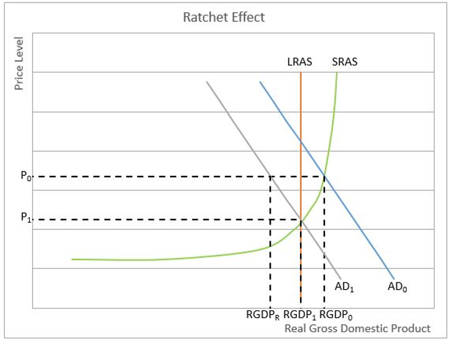

## Table of Contents

## What is a price ratchet?

A price ratchet is a term used in business, especially in the stock market and startup funding. It's a way to protect investors if the value of a company goes down. When a company gets new funding at a lower price than before, a price ratchet lets earlier investors get more shares for the same amount of money they already paid. This makes sure they don't lose as much value in their investment.

For example, imagine you invested $100 in a company when each share was $10. If the company later sells shares for $5 each, a price ratchet might let you get twice as many shares with your $100. This way, your investment keeps more of its value even though the share price dropped. Price ratchets are important because they help keep investors happy and willing to invest in new companies, even if things don't go as planned.

## How does a price ratchet work in simple terms?

A price ratchet is like a safety net for people who invest money in a company early on. Imagine you buy shares in a company for $10 each. If the company later sells new shares for a lower price, like $5 each, a price ratchet helps you. It lets you get more shares for the money you already spent, so you don't lose as much value in your investment.

For example, if you spent $100 to buy 10 shares at $10 each, and then the company sells new shares at $5 each, a price ratchet might give you 20 shares instead of just the 10 you originally bought. This way, even though the price of the shares went down, your investment stays worth more because you have more shares. It's a way to make sure early investors are protected if the company's value drops.

## What are the origins of the price ratchet mechanism?

The price ratchet mechanism started being used in the world of business and investing to protect people who put money into new companies. It became popular in the 1980s and 1990s when a lot of new tech companies were starting up. These companies needed money to grow, but they were risky because they were new and didn't have a long history of making money. Investors wanted a way to feel safer about their money, so the price ratchet was created to help them.

The idea behind the price ratchet is simple. If a company's value goes down and it sells new shares at a lower price than before, early investors can get more shares for the money they already paid. This helps keep their investment from losing too much value. The price ratchet became an important tool in startup funding because it made investors more willing to take risks on new companies, knowing they had some protection if things didn't go as planned.

## In which industries is the price ratchet commonly used?

The price ratchet is most often used in the tech industry. This is because tech startups are usually new and risky. They need a lot of money to grow, but it's hard to know if they will be successful. Investors who put money into these startups want to feel safe. A price ratchet helps them by making sure they get more shares if the company's value goes down. This way, their investment doesn't lose as much value.

It's also used in the biotech industry. Biotech companies work on new medicines and treatments, which can take a long time and a lot of money. There's a lot of risk because it's hard to know if their new ideas will work. Investors in biotech companies use price ratchets to protect their money. If the company's value drops, they can get more shares for what they already paid, which helps keep their investment safer.

## What are the basic effects of implementing a price ratchet on pricing strategies?

When a company uses a price ratchet, it changes how they think about setting prices for new shares. They have to be careful because if they set the price too low, it can make early investors unhappy. This is because the price ratchet means those early investors get more shares for the same amount of money they already paid. So, the company might try to keep the price of new shares from dropping too much to avoid giving away too many extra shares to early investors.

This can make the company more careful about how they raise money. They might wait longer to get new funding or try to find other ways to get money without selling new shares at a lower price. This can be good because it makes the company think more about how to grow without always needing to sell more shares. But it can also be hard because if they need money quickly, they might have to sell shares at a lower price anyway, which can make early investors feel less happy about their investment.

## How does a price ratchet affect consumer behavior?

A price ratchet doesn't directly affect what people buy or how they spend their money. It's a tool that companies use to protect early investors when they raise new money. But it can have some indirect effects on consumers. If a company is careful about setting prices for new shares because of a price ratchet, it might not grow as quickly. This could mean they take longer to bring new products to the market, which might make consumers wait longer for new things they want to buy.

On the other hand, if a company does grow quickly because investors feel safe with a price ratchet, it might bring new products to the market faster. This could make consumers happy because they get new things to buy sooner. But if the company has to sell shares at a lower price and gives more shares to early investors, it might need to find other ways to make money, like raising the prices of their products. This could make consumers less happy because they might have to pay more for the same things.

## What are the potential benefits of using a price ratchet for businesses?

Using a price ratchet can help businesses attract more investors. When people think about putting money into a new company, they want to feel safe. A price ratchet makes them feel safer because it protects their investment if the company's value goes down. This can make more people want to invest, which gives the company more money to grow and try new things. If a company can get more investors, it might be able to bring new products to the market faster or spend more on making their products better.

Another benefit is that a price ratchet can help keep early investors happy. If the company has to sell new shares at a lower price, early investors can get more shares for the same amount of money they already paid. This makes them feel like their investment is still worth a lot, even if the company's value goes down. Happy investors are more likely to keep supporting the company and maybe even put more money into it later. This can help the company stay strong and keep growing, even if things don't go exactly as planned.

## What are the drawbacks or risks associated with price ratchets?

Using a price ratchet can make it harder for a company to raise new money. If the company has to sell new shares at a lower price, the price ratchet means early investors get more shares for the same amount of money they already paid. This can make the company think twice about selling new shares at a lower price because it might have to give away too many extra shares. This can slow down how fast the company grows because it might not want to raise money if it means making early investors unhappy.

Another risk is that price ratchets can make other investors less interested in putting money into the company. If new investors know that early investors get special protection, they might feel like they are at a disadvantage. They might worry that if the company's value goes down, they won't get the same protection as the early investors. This can make it harder for the company to find new people to invest, which can limit how much money it can raise and how fast it can grow.

## How can a price ratchet be integrated into existing pricing models?

To add a price ratchet to the way a company sets prices for new shares, it needs to think about how it will work with what they already do. The company needs to look at its current plan for selling shares and see where the price ratchet can fit in. They need to decide how much protection they want to give to early investors if the price of new shares goes down. This means figuring out how many more shares those early investors will get if the company sells new shares at a lower price. The company also needs to make sure everyone understands how the price ratchet works so there are no surprises later.

Once the company decides on the details, they need to tell everyone about the new plan. This includes early investors, new investors, and anyone else who might be interested. The company should explain how the price ratchet will help protect early investors and how it might change the way they raise money in the future. By being clear and open about the price ratchet, the company can help make sure everyone feels good about the changes and understands how it fits into their overall plan for growing and raising money.

## What advanced strategies can be employed to optimize the use of a price ratchet?

To make the best use of a price ratchet, a company can think about timing when they raise new money. They should try to wait until the company is doing well before selling new shares. This way, the price of the shares might stay the same or go up, and they won't have to use the price ratchet as much. Another strategy is to talk to early investors and explain how the price ratchet works. If everyone understands it and agrees on it, the company can use it without making investors unhappy. They can also set up different levels of protection, so early investors get more shares only if the price drops a lot, not just a little.

Another way to optimize the use of a price ratchet is to look at other ways to raise money without selling new shares. The company can try to get loans or find partners who can help them grow without needing to sell more shares at a lower price. This can help them avoid using the price ratchet and keep early investors happy. By being smart about when and how they raise money, the company can use the price ratchet as a safety net without relying on it too much. This can help them grow in a way that keeps everyone happy and feeling safe about their investments.

## How do regulatory environments impact the use of price ratchets?

The rules that governments make can change how companies use price ratchets. In some places, there are strict rules about how companies can protect early investors. These rules might say that a company can't give too many extra shares to early investors if the price of new shares goes down. This means the company has to be careful about how they use a price ratchet. They need to make sure they follow the rules or they could get in trouble. This can make it harder for the company to use a price ratchet to protect early investors.

In other places, the rules might be more relaxed. This can make it easier for companies to use price ratchets because they don't have to worry as much about breaking the rules. But even if the rules are relaxed, the company still needs to think about how using a price ratchet might affect new investors. If new investors feel like they are at a disadvantage, they might not want to put money into the company. So, the company needs to balance following the rules with keeping all investors happy.

## What are the future trends and potential developments in the use of price ratchets?

In the future, price ratchets might become even more common in the startup world. As more new companies start up and need money to grow, investors will want ways to feel safe about their investments. Price ratchets can help with this by protecting early investors if a company's value goes down. Companies might start using price ratchets more often to attract investors and make them feel more comfortable about putting money into risky new businesses. This could lead to more creative ways of using price ratchets, like setting up different levels of protection based on how much the price drops.

Another trend could be that companies find new ways to balance the needs of early and new investors. They might use price ratchets along with other tools to make sure everyone feels fair. For example, they could offer different kinds of shares with different levels of protection. This way, early investors still get some protection, but new investors don't feel left out. As technology and ways of raising money keep changing, companies will need to stay flexible and think of new ways to use price ratchets that work well for everyone involved.

## What is Understanding Price Stability?

Price stability is a fundamental objective in economic policy, reflecting the aim to maintain low and stable inflation rates. This stability is vital for ensuring a healthy economic environment. When inflation is predictable and low, consumers and businesses are more likely to plan for the future confidently. Stable prices reduce the uncertainty associated with costly inflationary spikes or deflationary periods, enhancing economic predictability and facilitating long-term investment decisions.

Central banks play a crucial role in achieving price stability by employing various monetary policy tools. Interest rate adjustments are among the most potent mechanisms central banks use to control inflation. For instance, when inflation is perceived to be rising, central banks may increase interest rates to curb spending and borrowing, thereby exerting downward pressure on prices. Conversely, in periods of low inflation or deflation risk, interest rates might be reduced to stimulate spending and borrowing. 

Mathematically, the relationship between inflation and interest rates can be expressed through the Fisher Equation:

$$
i = r + \pi^e
$$

where $i$ is the nominal interest rate, $r$ is the real interest rate, and $\pi^e$ is the expected inflation rate. Central banks adjust $i$ to influence $\pi^e$, achieving desired price stability.

Price stability is not just about controlling inflation; it promotes economic growth by fostering an environment where businesses feel secure to make significant investments and consumers feel confident in their purchasing power. When prices are stable, the purchasing power of income remains fairly constant over time, enhancing consumer confidence. Furthermore, it encourages savings, as individuals feel secure that their money will retain its value.

Understanding the impact of price stability on the economy is critical for stakeholders, including policymakers, business leaders, and investors. Policymakers must create strategies that balance inflation control with other economic goals like employment and growth. Business leaders need to anticipate inflation trends to manage costs and pricing strategies effectively. For investors, stable inflation rates reduce risks associated with [volatility](/wiki/volatility-trading-strategies) in asset prices, enabling more accurate predictions of returns on investment. Through informed financial decisions rooted in the understanding of price stability, these stakeholders can contribute to sustained economic growth and resilience.

## References & Further Reading

[1]: ["Advances in Financial Machine Learning"](https://www.amazon.com/Advances-Financial-Machine-Learning-Marcos/dp/1119482089) by Marcos Lopez de Prado

[2]: ["Evidence-Based Technical Analysis: Applying the Scientific Method and Statistical Inference to Trading Signals"](https://www.amazon.com/Evidence-Based-Technical-Analysis-Scientific-Statistical/dp/0470008741) by David Aronson

[3]: ["Machine Learning for Algorithmic Trading"](https://github.com/stefan-jansen/machine-learning-for-trading) by Stefan Jansen

[4]: ["Quantitative Trading: How to Build Your Own Algorithmic Trading Business"](https://www.amazon.com/Quantitative-Trading-Build-Algorithmic-Business/dp/1119800064) by Ernest P. Chan

[5]: Bernanke, B. S. (2007). ["Inflation Expectations and Inflation Forecasting."](https://www.federalreserve.gov/newsevents/speech/Bernanke20070710a.htm) Speech at the Monetary Economics Workshop of the National Bureau of Economic Research Summer Institute, Cambridge, Massachusetts.

[6]: Johnson, H. G., & Caves, R. E. (1969). ["Readings in International Economics."](https://archive.org/details/readingsinintern0000rich) Irwin.

[7]: Aldridge, I. (2013). ["High-Frequency Trading: A Practical Guide to Algorithmic Strategies and Trading Systems."](https://www.amazon.com/High-Frequency-Trading-Practical-Algorithmic-Strategies/dp/1118343506) Wiley.