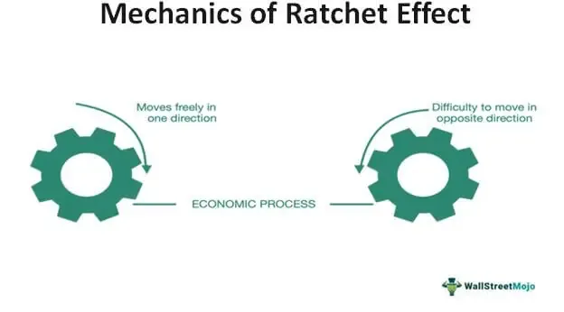

The world of finance and economics encompasses a variety of phenomena that significantly influence market behavior. Key among these are concepts like price stability, the price ratchet effect, and algorithmic trading. Understanding these concepts provides a comprehensive view of their impact on the economic landscape.

Price stability refers to the absence of sharp fluctuations in the prices of goods and services. This constancy is critical for fostering economic growth and maintaining consumer confidence. When prices remain stable, individuals and businesses can make long-term plans without worrying about sudden inflation or deflation disrupting their strategies. Central banks often aim for price stability by adjusting interest rates and implementing monetary policies to control inflation and keep economies on a steady course.



The price ratchet effect describes scenarios where certain triggers lead to irreversible price changes. Such events might include economic crises or natural disasters, which result in a new norm for prices. Once prices are ratcheted up, they seldom revert to previous levels, creating a lasting impact on the market and shaping future economic conditions and strategies. Understanding this effect helps explain why some price changes become entrenched and informs strategies to either mitigate or adapt to these shifts.

Algorithmic trading, meanwhile, employs computer programs to execute trades based on specific, predefined criteria. This method has transformed modern markets by increasing both the speed and volume of trading. By automating the decision-making process, algorithmic trading enhances market liquidity and efficiency. However, it also introduces potential challenges, such as increased volatility and the risk of market disruptions often referred to as flash crashes.

Exploring these concepts grants valuable insights into how markets function and respond to various factors. By examining their roles, investors, policymakers, and businesses can better anticipate market movements and develop strategies that align with the evolving economic landscape. Understanding these interactions is crucial for making informed decisions in the complex world of finance.

## Table of Contents

## Understanding Price Stability

Price stability is a fundamental objective in economic policy, reflecting the aim to maintain low and stable inflation rates. This stability is vital for ensuring a healthy economic environment. When inflation is predictable and low, consumers and businesses are more likely to plan for the future confidently. Stable prices reduce the uncertainty associated with costly inflationary spikes or deflationary periods, enhancing economic predictability and facilitating long-term investment decisions.

Central banks play a crucial role in achieving price stability by employing various monetary policy tools. Interest rate adjustments are among the most potent mechanisms central banks use to control inflation. For instance, when inflation is perceived to be rising, central banks may increase interest rates to curb spending and borrowing, thereby exerting downward pressure on prices. Conversely, in periods of low inflation or deflation risk, interest rates might be reduced to stimulate spending and borrowing. 

Mathematically, the relationship between inflation and interest rates can be expressed through the Fisher Equation:

$$
i = r + \pi^e
$$

where $i$ is the nominal interest rate, $r$ is the real interest rate, and $\pi^e$ is the expected inflation rate. Central banks adjust $i$ to influence $\pi^e$, achieving desired price stability.

Price stability is not just about controlling inflation; it promotes economic growth by fostering an environment where businesses feel secure to make significant investments and consumers feel confident in their purchasing power. When prices are stable, the purchasing power of income remains fairly constant over time, enhancing consumer confidence. Furthermore, it encourages savings, as individuals feel secure that their money will retain its value.

Understanding the impact of price stability on the economy is critical for stakeholders, including policymakers, business leaders, and investors. Policymakers must create strategies that balance inflation control with other economic goals like employment and growth. Business leaders need to anticipate inflation trends to manage costs and pricing strategies effectively. For investors, stable inflation rates reduce risks associated with [volatility](/wiki/volatility-trading-strategies) in asset prices, enabling more accurate predictions of returns on investment. Through informed financial decisions rooted in the understanding of price stability, these stakeholders can contribute to sustained economic growth and resilience.

## The Price Ratchet Effect and Its Implications

The price ratchet effect is a critical economic concept that captures the phenomenon of irreversible price changes prompted by significant events. Such events may include economic crises, natural disasters, or major policy changes. This effect is characterized by a scenario where prices adjust upward due to an external shock and remain at a new elevated level, even when the original conditions subside. 

This effect often stems from a combination of factors that prevent prices from reverting to their previous levels. For instance, supply chain disruptions during a natural disaster can lead to increased production costs, which are passed on to consumers in the form of higher prices. Even after the disruption is resolved, these price increases may become permanent if consumer expectations adjust to this new pricing norm or if companies decide to maintain higher prices to capitalize on increased revenue.

Understanding the price ratchet effect is crucial for businesses and policymakers as it influences long-term economic strategy. For businesses, this may involve adjusting pricing strategies to align with new consumer expectations or recalibrating financial forecasts to manage increased costs. For policymakers, recognizing the effects of a price ratchet can guide decisions regarding inflation control measures and economic interventions. 

Given its implications, the price ratchet effect is often considered a structural change within the economy rather than a temporary fluctuation. Its impact can lead to a "new normal" in economic contexts, affecting everything from wage negotiations to cost-of-living assessments. 

Overall, by acknowledging the permanence of certain price changes, stakeholders can strategically navigate the challenges and opportunities presented by shifts in economic conditions, ensuring more resilient economic planning and decision-making.

## Algorithmic Trading in Modern Markets

Algorithmic trading, often referred to as algo trading, employs sophisticated algorithms to execute trades at speeds and frequencies that are impossible for a human trader. By using pre-programmed instructions, traders can leverage statistical models to determine the optimal timing, price, and quantity for trades. These algorithms can process vast amounts of data in real-time, facilitating decisions that are fractions of a second in the making.

Algo trading is a dominant force in today’s financial markets, enhancing market [liquidity](/wiki/liquidity-risk-premium) and efficiency. According to a report by the Financial Conduct Authority, [algorithmic trading](/wiki/algorithmic-trading) accounts for about 70% of equities trading volumes in the U.S. and Europe. The rapid execution and the ability to harness minuscule [arbitrage](/wiki/arbitrage) opportunities contribute to narrowing bid-ask spreads, thereby reducing transaction costs for all market participants.

However, the rise of algorithmic trading also brings distinct challenges. One significant concern is increased market volatility, where the swift execution can lead to erratic price movements. Flash crashes are notable events where this volatility is evident; the infamous 2010 Flash Crash saw the Dow Jones Industrial Average plummet about 1,000 points within minutes, triggered by a confluence of rapid algorithmic trades. Such events underscore the need for stringent regulatory measures and the development of robust risk management systems to mitigate potential disruptions.

The dynamics of algorithmic trading present both opportunities and challenges. On one hand, it allows for more efficient market operations and can help mitigate the risk of human error. On the other hand, the same speed that offers efficiency can also amplify systemic risks. Understanding these intricacies is essential for market participants and regulators alike, as they navigate the complexities of modern financial markets.

To manage these risks, regulatory bodies continuously evolve frameworks to monitor and control algorithmic trading activities. Implementing circuit breakers, enhancing transparency, and setting limits on high-frequency trades are among the measures aimed at preserving market integrity while allowing the benefits of algo trading to flourish. 

Python is commonly used in developing algorithmic trading strategies due to its powerful libraries and ease of use. The following simple Python code demonstrates how one might simulate a basic moving average crossover strategy using the `pandas` library:

```python
import pandas as pd

# Example function to simulate a moving average crossover strategy
def moving_average_crossover(prices, short_window=40, long_window=100):
    signals = pd.DataFrame(index=prices.index)
    signals['price'] = prices
    signals['short_mavg'] = prices.rolling(window=short_window, min_periods=1, center=False).mean()
    signals['long_mavg'] = prices.rolling(window=long_window, min_periods=1, center=False).mean()
    signals['signal'] = 0.0
    signals['signal'][short_window:] = \
        np.where(signals['short_mavg'][short_window:] > signals['long_mavg'][short_window:], 1.0, 0.0)

    signals['positions'] = signals['signal'].diff()

    return signals
```

This code sets up a framework for implementing a moving average crossover strategy, which generates buy and sell signals when a shorter-term moving average crosses above or below a longer-term average. Such strategies, when scaled and optimized, form the basis of more complex algorithmic trading systems.

## Interconnections Between Economic Phenomena

Economic phenomena such as price stability, the price ratchet effect, and algorithmic trading are intertwined within a complex economic framework, each influencing and being influenced by the others.

Price stability is a fundamental goal of economic policy, maintaining low and stable inflation, which is essential for consumer confidence and economic planning. It directly affects trading behaviors by providing a predictable environment in which consumers and businesses can make informed decisions. When prices are stable, market participants can engage in long-term contracts and investments, increasing their willingness to participate in the market. This, in turn, can reduce the likelihood of impulsive trading behaviors that might arise from short-term price fluctuations or uncertainty.

The price ratchet effect relates to irreversible shifts in price levels caused by significant events such as economic upheavals or policy changes. A stable price environment may prevent unnecessary price ratchets by mitigating the impacts of transient shocks, aiding markets in maintaining equilibrium. However, persistent policy or environmental changes can still trigger a ratchet, altering price baselines.

Algorithmic trading, a cornerstone of modern financial markets, affects price stability and the price ratchet effect through its ability to process vast amounts of data and execute trades at high speed. By increasing market efficiency, algorithmic trading enhances liquidity, narrowing bid-ask spreads, and providing stability. However, it can also contribute to volatility, as seen in instances of flash crashes. These are rapid, significant drops in market prices, often quickly recovered from, caused by automated response systems interacting in unexpected ways.

The interaction of these phenomena results in complex market dynamics. Algorithmic trading, while aimed at exploiting price movements for profit, influences price stability by smoothing out inefficiencies. However, the speed and automated nature of these trades can lead to significant market shifts, impacting not only individual securities but potentially leading to broader systemic changes in price structures. This interplay exemplifies how increased trading efficiency and liquidity from algorithms can sometimes conflict with their potential to induce rapid price shifts.

Understanding these interconnections is essential for predicting market behavior and forming effective economic strategies. The interplay of price stability, price ratchet effects, and algorithmic trading underlines the need for robust market regulations and adaptive strategies that can accommodate rapid shifts while maintaining economic stability. Expanding comprehension in these areas equips policymakers and market participants to anticipate changes, harness opportunities, and mitigate risks within complex market systems.

## Conclusion

Economic phenomena such as price stability, the price ratchet effect, and algorithmic trading are foundational elements influencing financial markets and shaping economic policies. A thorough understanding of these concepts enables investors, policymakers, and businesses to strategize effectively and anticipate changes within the market landscape. This understanding is crucial for making informed decisions that align with both short-term and long-term objectives.

Fostering price stability allows for a predictable economic environment, which is essential for maintaining consumer and investor confidence. It ensures stable conditions conducive to investment and economic planning, ultimately contributing to sustainable economic growth. The comprehension of the price ratchet effect, conversely, sheds light on how significant events can cause irreversible changes to price levels, highlighting the need for adaptable and resilient economic strategies that can persist through shifts in market norms.

The phenomenon of algorithmic trading, with its rapid execution and precision, has dramatically influenced modern markets by increasing liquidity and potentially improving pricing efficiency. Nonetheless, the risks associated with increased market volatility and the potential for systemic disruptions, such as flash crashes, necessitate a balanced approach in evaluating its role within financial markets.

Continued study and adaptation to these dynamic phenomena are imperative for achieving long-term financial stability and growth. As the financial landscape continues to evolve, engaging with and understanding these key concepts broadens financial knowledge and prepares stakeholders for the complexities of modern economic systems. By staying informed and proactive, investors, policymakers, and businesses can navigate the intricacies of the economic terrain more effectively, positioning themselves for success in an ever-changing environment.

## References & Further Reading

[1]: ["Advances in Financial Machine Learning"](https://www.amazon.com/Advances-Financial-Machine-Learning-Marcos/dp/1119482089) by Marcos Lopez de Prado

[2]: ["Evidence-Based Technical Analysis: Applying the Scientific Method and Statistical Inference to Trading Signals"](https://www.amazon.com/Evidence-Based-Technical-Analysis-Scientific-Statistical/dp/0470008741) by David Aronson

[3]: ["Machine Learning for Algorithmic Trading"](https://github.com/stefan-jansen/machine-learning-for-trading) by Stefan Jansen

[4]: ["Quantitative Trading: How to Build Your Own Algorithmic Trading Business"](https://www.amazon.com/Quantitative-Trading-Build-Algorithmic-Business/dp/1119800064) by Ernest P. Chan

[5]: Bernanke, B. S. (2007). ["Inflation Expectations and Inflation Forecasting."](https://www.federalreserve.gov/newsevents/speech/Bernanke20070710a.htm) Speech at the Monetary Economics Workshop of the National Bureau of Economic Research Summer Institute, Cambridge, Massachusetts.

[6]: Johnson, H. G., & Caves, R. E. (1969). ["Readings in International Economics."](https://archive.org/details/readingsinintern0000rich) Irwin.

[7]: Aldridge, I. (2013). ["High-Frequency Trading: A Practical Guide to Algorithmic Strategies and Trading Systems."](https://www.amazon.com/High-Frequency-Trading-Practical-Algorithmic-Strategies/dp/1118343506) Wiley.