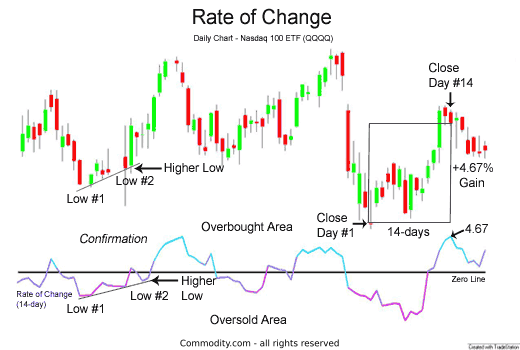

## Table of Contents

## What is the Price Rate of Change (ROC) Indicator?

The Price Rate of Change (ROC) Indicator is a tool used in technical analysis to measure the speed at which a stock's price is changing. It does this by comparing the current price of a stock to its price a certain number of periods ago. For example, if you are looking at a 14-day ROC, it will compare today's price to the price 14 days ago. The result is usually shown as a percentage, which tells you how much the price has changed over that period.

The ROC Indicator is helpful for traders because it can show if a stock is gaining or losing momentum. If the ROC is positive and increasing, it means the stock's price is rising faster, which might be a good sign to buy. On the other hand, if the ROC is negative and decreasing, it means the price is falling faster, which might be a signal to sell. By watching the ROC, traders can make better decisions about when to buy or sell a stock.

## How is the Price Rate of Change Indicator calculated?

The Price Rate of Change Indicator is calculated by taking the difference between the current price of a stock and its price a certain number of periods ago, then dividing that difference by the price from those periods ago. This result is then multiplied by 100 to turn it into a percentage. For example, if you want to calculate the 14-day ROC, you would subtract the stock's price from 14 days ago from today's price, then divide by the price from 14 days ago, and finally multiply by 100.

This calculation gives you a clear picture of how much the stock's price has changed over the chosen period. If the ROC is positive, it means the price has gone up. If it's negative, the price has gone down. Traders use this information to understand the momentum of the stock's price movement. By looking at the ROC over time, they can see if the stock is gaining or losing speed, which helps them decide when to buy or sell.

## What does the Price Rate of Change Indicator tell us about market trends?

The Price Rate of Change Indicator helps us understand how fast a stock's price is changing. It tells us if the price is going up or down quickly or slowly. When the ROC is positive and getting bigger, it means the stock's price is rising faster. This can be a sign that more people want to buy the stock, which might mean the market is trending upwards. On the other hand, if the ROC is negative and getting smaller, it means the stock's price is falling faster. This can be a sign that more people want to sell the stock, which might mean the market is trending downwards.

By looking at the ROC over time, we can see if the stock's price is gaining or losing momentum. If the ROC keeps going up, it might mean the upward trend is getting stronger. If the ROC keeps going down, it might mean the downward trend is getting stronger. Traders use this information to decide when to buy or sell a stock. For example, if the ROC is positive and increasing, a trader might decide to buy the stock because they think the price will keep going up. If the ROC is negative and decreasing, a trader might decide to sell the stock because they think the price will keep going down.

## Can you explain the significance of different ROC values?

The Price Rate of Change (ROC) Indicator shows how fast a stock's price is changing. If the ROC is a big positive number, it means the stock's price is going up quickly. This can be a good sign for traders because it might mean more people want to buy the stock, and the price could keep going up. On the other hand, if the ROC is a big negative number, it means the stock's price is going down quickly. This can be a bad sign for traders because it might mean more people want to sell the stock, and the price could keep going down.

If the ROC is a small positive number, it means the stock's price is going up, but not very fast. This might mean the stock is still doing well, but it's not as exciting as when the ROC is a big positive number. If the ROC is a small negative number, it means the stock's price is going down, but not very fast. This might mean the stock is not doing great, but it's not as worrying as when the ROC is a big negative number. Traders look at these different ROC values to decide if they should buy, sell, or hold onto a stock.

## How does the choice of time period affect the ROC Indicator?

The time period you choose for the ROC Indicator can change what it tells you about a stock's price. If you pick a short time period, like 5 days, the ROC will show you quick changes in the stock's price. This can be good if you want to know what's happening right now, but it might not tell you much about what's happening over a longer time. A short time period can make the ROC go up and down a lot, which can be confusing if you're trying to see bigger trends.

On the other hand, if you pick a longer time period, like 50 days, the ROC will show you slower changes in the stock's price. This can be good if you want to see what's happening over a longer time, but it might not tell you much about what's happening right now. A longer time period can make the ROC smoother and easier to read, which can help you see bigger trends more clearly. So, the time period you choose depends on what you want to know about the stock's price and how you want to trade.

## What are the common settings for the ROC Indicator used by traders?

Traders often use different settings for the ROC Indicator depending on what they want to see. A common setting is the 12-day ROC. This setting is popular because it gives a good balance between showing quick changes in the stock's price and showing what's happening over a longer time. Traders who like to make quick trades might use this setting to see if the stock's price is going up or down fast.

Another common setting is the 25-day ROC. This setting is used by traders who want to see what's happening over a longer time. It can help them see bigger trends in the stock's price, which can be useful if they want to hold onto the stock for a while. Some traders might even use a 50-day ROC to see even longer trends, but this setting can make the ROC slower to react to quick changes in the stock's price.

## How can the ROC Indicator be used to identify overbought or oversold conditions?

The ROC Indicator can help traders see if a stock is overbought or oversold. When the ROC gets really high, like a big positive number, it might mean the stock is overbought. This means the stock's price has gone up a lot very quickly, and it might be time for the price to go down a bit. Traders might see this as a signal to sell the stock or wait for a better time to buy.

On the other hand, when the ROC gets really low, like a big negative number, it might mean the stock is oversold. This means the stock's price has gone down a lot very quickly, and it might be time for the price to go up a bit. Traders might see this as a signal to buy the stock or wait for a better time to sell. By watching the ROC, traders can get a sense of when a stock might be overbought or oversold and make better decisions about when to buy or sell.

## What are the potential pitfalls or limitations of using the ROC Indicator?

Using the ROC Indicator can have some problems. One big problem is that it can give false signals. Sometimes, the ROC might show that a stock's price is going up or down a lot, but then the price might not keep going in that direction. This can trick traders into buying or selling at the wrong time. Also, the ROC can be affected a lot by the time period you choose. If you pick a short time period, the ROC might go up and down a lot and make it hard to see bigger trends. If you pick a long time period, the ROC might not show quick changes in the stock's price, which can make it hard to make quick trades.

Another problem with the ROC Indicator is that it doesn't tell you everything about a stock. It only shows you how fast the price is changing, but it doesn't tell you why the price is changing. There could be other things happening in the market or with the company that the ROC doesn't show. Traders need to use other tools and information along with the ROC to make good decisions. Also, the ROC can be hard to understand for people who are new to trading, because it's just one part of a bigger picture.

## How can the ROC Indicator be combined with other technical indicators for better trading decisions?

The ROC Indicator can be a helpful tool, but it works even better when you use it with other technical indicators. One good way to do this is to use the ROC with the Moving Average Convergence Divergence (MACD) Indicator. The MACD can help you see if a stock's price is trending up or down over time. If the ROC shows a big change in the stock's price and the MACD confirms that the trend is strong, you might feel more confident about making a trade. Another good indicator to use with the ROC is the Relative Strength Index (RSI). The RSI can help you see if a stock is overbought or oversold. If the ROC shows a big positive number and the RSI is also high, it might mean the stock is overbought and could go down soon.

Another way to use the ROC with other indicators is to look at [volume](/wiki/volume-trading-strategy). The On-Balance Volume (OBV) Indicator can show you if more people are buying or selling a stock. If the ROC shows a big change in the stock's price and the OBV also shows a lot of volume, it can mean that the price change is more likely to keep going. You can also use trend lines with the ROC. If you draw a trend line on a chart and see that the ROC is moving in the same direction as the trend line, it can give you more confidence in the trend. By using the ROC with other indicators, you can get a better picture of what's happening with a stock and make smarter trading decisions.

## Can you provide examples of historical market scenarios where the ROC Indicator was particularly useful?

In early 2020, the ROC Indicator was very helpful for traders during the big drop in the stock market caused by the start of the COVID-19 pandemic. As the news about the virus spread, the stock market started to go down fast. The ROC Indicator showed a big negative number, which meant the stock prices were falling quickly. Traders who saw this could decide to sell their stocks before the prices went down even more. Later, when the government and central banks started to help the economy, the ROC Indicator started to show big positive numbers. This meant the stock prices were going up quickly again. Traders who saw this could decide to buy stocks and make money as the market went back up.

Another time the ROC Indicator was useful was during the tech stock boom in the late 1990s. As more and more people started to use the internet, tech companies like Amazon and Microsoft saw their stock prices go up a lot. The ROC Indicator showed big positive numbers, which meant the stock prices were rising quickly. Traders who saw this could decide to buy these stocks and make money as the prices kept going up. But then, in early 2000, the ROC Indicator started to show smaller positive numbers and then big negative numbers. This meant the stock prices were slowing down and then falling quickly. Traders who saw this could decide to sell their stocks before the prices went down even more.

## What advanced techniques can be applied to enhance the effectiveness of the ROC Indicator?

One way to make the ROC Indicator work better is by smoothing it out. You can do this by using a moving average on the ROC values. This means you take the average of the ROC over a few days, like 3 or 5 days. This can help you see the bigger trends in the stock's price instead of the quick ups and downs. By smoothing out the ROC, you can get a clearer picture of whether the stock's price is really going up or down over time. This can help you make better decisions about when to buy or sell the stock.

Another advanced technique is to use the ROC Indicator with other tools like Bollinger Bands. Bollinger Bands can show you if a stock's price is moving a lot or staying the same. If the ROC is high and the stock's price is also near the top of the Bollinger Bands, it might mean the stock is overbought and could go down soon. If the ROC is low and the stock's price is near the bottom of the Bollinger Bands, it might mean the stock is oversold and could go up soon. By using the ROC with Bollinger Bands, you can get a better idea of when to buy or sell a stock.

## How does the ROC Indicator perform in different market conditions, such as trending versus ranging markets?

In a trending market, where the stock's price is going up or down in a clear direction, the ROC Indicator can be very helpful. When the stock's price is going up, the ROC will show a big positive number, which means the price is rising quickly. This can be a good sign for traders to buy the stock because they think the price will keep going up. On the other hand, when the stock's price is going down, the ROC will show a big negative number, which means the price is falling quickly. This can be a good sign for traders to sell the stock because they think the price will keep going down. The ROC Indicator works well in a trending market because it helps traders see the strength of the trend and make decisions based on that.

In a ranging market, where the stock's price is moving up and down but not going in a clear direction, the ROC Indicator can be trickier to use. The ROC might go up and down a lot, showing quick changes in the stock's price, but these changes might not mean much in the long run. Traders might see a big positive ROC and think the stock's price will keep going up, but then the price might go back down. The same thing can happen with a big negative ROC. Because of this, traders need to be careful when using the ROC in a ranging market. They might want to use other tools along with the ROC to get a better picture of what's happening with the stock's price.

## What is the Rate of Change (ROC) Indicator?

The Rate of Change (ROC) indicator is a momentum oscillator utilized to measure the rate at which a security's price changes over a specific period. This tool calculates the percentage change between the current price and the price n periods ago, thus enabling traders to gauge the momentum of market movements. 

Mathematically, the ROC is expressed as:

$$
ROC = \left(\frac{\text{Current Price} - \text{Price n periods ago}}{\text{Price n periods ago}}\right) \times 100
$$

The ROC indicator values oscillate around a central zero line. Positive values suggest that the price is moving upward, reflecting bullish [momentum](/wiki/momentum), whereas negative values indicate downward price movement, pointing to bearish momentum. By analyzing these fluctuations around the zero line, traders can infer potential shifts in market trends.

In addition to detecting momentum, the ROC aids traders in identifying possible overbought or oversold conditions in the market. Rapid price increases can push the ROC to high positive values, signaling an overbought condition that might precede a price reversal. Conversely, markedly negative ROC values could indicate an oversold market, suggesting potential for a price uptick.

The ROC is recognized for its straightforward application, making it a practical tool for assessing the velocity of price changes in the market. It provides traders with crucial insights into the acceleration or deceleration of price movements, supporting more informed trading decisions. Combining its findings with other technical indicators often enhances its effectiveness, providing a more comprehensive view of market momentum.

## What is the ROC Indicator Formula and how is it calculated?

The Rate of Change (ROC) indicator is calculated using the formula:

$$
\text{ROC} = \left(\frac{\text{Current Price} - \text{Price } n \text{ periods ago}}{\text{Price } n \text{ periods ago}}\right) \times 100
$$

This formula enables traders to assess the momentum of a security by measuring the percentage change in price between two points in time. Selecting an appropriate 'n' period is essential for effective analysis. Shorter periods capture rapid momentum fluctuations, ideal for day traders or those interested in immediate movements. Conversely, longer periods are beneficial for capturing overarching market trends, reducing noise from short-term [volatility](/wiki/volatility-trading-strategies).

Traders can implement this calculation in a programming environment like Python to automate the process, making it easier to integrate into [algorithmic trading](/wiki/algorithmic-trading) models. Here is an example of the ROC calculation in Python:

```python
def calculate_roc(prices, n):
    if len(prices) < n:
        raise ValueError("Not enough data points to calculate ROC")
    roc_values = []
    for i in range(n, len(prices)):
        previous_price = prices[i - n]
        roc = ((prices[i] - previous_price) / previous_price) * 100
        roc_values.append(roc)
    return roc_values

# Example usage
price_data = [100, 105, 102, 110, 115]  # Example price data
n = 2  # Number of periods
roc = calculate_roc(price_data, n)
print(roc)
```

In this function, `prices` is a list of historical prices, and `n` is the number of periods over which the ROC is calculated. The function raises an error if there are not enough data points, ensuring robust handling of inputs. This example automates the calculation process, allowing traders to seamlessly integrate ROC values into their trading strategies.

Understanding the ROC formula and its application is vital for effectively employing the indicator across various trading strategies. Properly implemented, ROC offers clear insights into the velocity of price changes, equipping traders with a powerful tool to forecast and respond to market dynamics.

## References & Further Reading

[1]: ["Technical Analysis of the Financial Markets: A Comprehensive Guide to Trading Methods and Applications"](https://archive.org/details/technicalanalysi0000murp) by John J. Murphy

[2]: ["Quantitative Technical Analysis: An Integrated Approach to Trading System Development and Trading Management"](https://www.amazon.com/Quantitative-Technical-Analysis-integrated-development/dp/0979183855) by Dr. Howard B. Bandy

[3]: Achelis, S. B. (2001). ["Technical Analysis from A to Z, 2nd Edition."](https://archive.org/details/technicalanalysi00ache) McGraw-Hill.

[4]: Kirkpatrick, C. D., & Dahlquist, J. R. (2010). ["Technical Analysis: The Complete Resource for Financial Market Technicians, 2nd Edition."](https://ptgmedia.pearsoncmg.com/images/9780134137049/samplepages/9780134137049.pdf) FT Press.

[5]: Murphy, J. J. (2016). ["Trading with Intermarket Analysis: A Visual Approach to Beating the Financial Markets Using Exchange-Traded Funds."](https://onlinelibrary.wiley.com/doi/book/10.1002/9781119205067) Wiley.