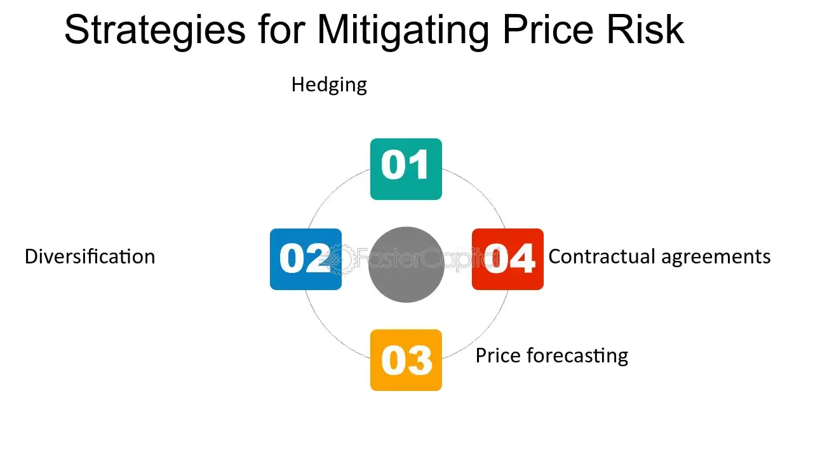

## Table of Contents

## What is price risk in the context of business and finance?

Price risk is the chance that the price of something a business buys or sells will change in a way that hurts the business. For example, if a company buys materials to make its products, and the price of those materials goes up, the company might have to pay more than it expected. This can make it harder for the company to make a profit. On the other hand, if a company sells its products and the price of those products goes down, the company might not make as much money as it planned.

To manage price risk, businesses often use different strategies. One common strategy is to use contracts that lock in prices for a certain time. This can help a business know exactly how much it will have to pay for materials or how much it will get for its products. Another strategy is to buy or sell futures contracts, which are agreements to buy or sell something at a set price in the future. By using these tools, businesses can protect themselves from big changes in prices and plan their finances better.

## How does price risk affect different industries?

Price risk affects different industries in various ways, depending on what they buy and sell. For example, in the farming industry, farmers face price risk because the prices of crops like wheat or corn can change a lot from one season to the next. If the price of wheat goes down right before harvest, farmers might not make enough money to cover their costs. On the other hand, if the price goes up, they could make a good profit. This uncertainty makes it hard for farmers to plan their finances and can affect how much they plant or what they choose to grow.

In the energy sector, companies that produce oil or gas also deal with price risk. The price of oil can change quickly because of things like political events or changes in how much oil people use. If the price of oil drops suddenly, oil companies might lose money because they can't sell their oil for as much as they expected. To manage this risk, energy companies often use futures contracts to lock in prices for oil they plan to sell in the future. This helps them know how much money they will make and plan their budgets better.

In the manufacturing industry, price risk comes from the cost of raw materials like steel or plastic. If the price of steel goes up, a car manufacturer might have to pay more to make each car. This can squeeze their profits unless they can raise the price of their cars. To handle this, manufacturers might use long-term contracts with suppliers to keep the price of materials stable. This way, they can better predict their costs and keep their prices competitive in the market.

## What are the common causes of price risk?

Price risk often comes from changes in supply and demand. If more people want to buy something but there isn't enough of it, the price can go up. On the other hand, if there's too much of something and not enough people want to buy it, the price can go down. For example, if a new technology makes it easier to grow wheat, there might be more wheat than people need, which can make the price of wheat drop. Weather can also affect supply and demand, especially in farming. If there's a drought, less wheat might be grown, which can make the price go up because there's less to go around.

Another cause of price risk is changes in the economy. If the economy is doing well, people might have more money to spend, which can push prices up. But if the economy is struggling, people might not buy as much, which can make prices go down. Political events can also cause price risk. For example, if there's a war in a country that produces a lot of oil, the price of oil might go up because it's harder to get. Governments can also affect prices by changing taxes or putting limits on how much of something can be imported or exported. All these things can make prices change in ways that businesses can't always predict.

## What are the basic strategies for mitigating price risk?

One way to handle price risk is by using contracts that set prices ahead of time. For example, a farmer might agree with a buyer to sell wheat at a certain price before the wheat is even harvested. This helps the farmer know how much money they will get, even if the price of wheat changes later. Companies that need to buy materials can do the same thing, agreeing on a price with their suppliers so they know how much they will have to pay. This can help businesses plan their budgets better and avoid surprises.

Another strategy is to use futures contracts. These are agreements to buy or sell something at a set price in the future. For example, an oil company might use a futures contract to sell oil at a certain price next month. If the price of oil goes down, the company still gets the higher price they agreed on. If the price goes up, they might miss out on some extra money, but they know exactly how much they will get. This can help businesses manage their money better and protect themselves from big changes in prices.

Some businesses also use hedging to manage price risk. Hedging means taking a position in the market that can offset potential losses. For example, an airline might buy fuel futures to lock in the price of jet fuel. If the price of fuel goes up, the airline can use the futures to buy fuel at the lower price they agreed on. This can help the airline avoid paying more for fuel and keep their costs stable. By using these strategies, businesses can better handle the ups and downs of prices and plan for the future.

## How can hedging be used as a tool for price risk management?

Hedging is a way for businesses to protect themselves from big changes in prices. Imagine a farmer who grows corn. The price of corn can go up or down, and the farmer might not know how much money they will make until they sell their corn. To avoid this uncertainty, the farmer can use hedging. They might buy a futures contract that lets them sell their corn at a set price in the future. If the price of corn goes down, the farmer still gets the higher price they agreed on in the futures contract. This way, the farmer can plan their finances better and avoid losing money if the price drops.

Companies in other industries can use hedging too. For example, an airline needs to buy jet fuel, and the price of fuel can change a lot. If the price goes up, the airline might have to pay more than they expected, which can hurt their profits. To manage this risk, the airline can buy fuel futures. This means they agree to buy fuel at a certain price in the future. If the price of fuel goes up, the airline can use the futures contract to buy fuel at the lower price they agreed on. This helps the airline keep their costs stable and plan their budget better, even when prices change.

## What role do futures and options play in mitigating price risk?

Futures and options are important tools for businesses to manage price risk. Futures are agreements to buy or sell something at a set price in the future. For example, a farmer might use a futures contract to sell their wheat at a certain price before they even harvest it. If the price of wheat goes down, the farmer still gets the higher price they agreed on in the futures contract. This helps the farmer know how much money they will make and avoid losing money if the price drops. Companies in other industries, like airlines buying jet fuel, can use futures to lock in prices and keep their costs stable.

Options give businesses more flexibility. An option is like a choice to buy or sell something at a set price, but you don't have to do it if you don't want to. For example, a company might buy an option to buy steel at a certain price. If the price of steel goes up, they can use the option to buy it at the lower price they agreed on. But if the price goes down, they can just let the option expire and buy the steel at the lower market price. This way, options help businesses protect themselves from price increases while still being able to take advantage of price decreases.

## How can diversification help in reducing price risk?

Diversification means spreading out what a business buys or sells so they don't depend too much on one thing. If a company only sells one product, and the price of that product goes down, they might lose a lot of money. But if they sell many different products, a drop in the price of one product might not hurt them as much. For example, a farmer who grows only wheat might be in trouble if the price of wheat falls. But if the farmer also grows corn and soybeans, they can still make money from those other crops even if wheat prices drop.

By having a mix of products or services, a business can protect itself from big changes in prices. If one part of their business is doing badly because of price changes, another part might be doing well. This can help the business keep making money even when prices are unpredictable. For example, a company that makes cars might also make trucks and motorcycles. If the price of steel goes up and makes cars more expensive to produce, the company can still make money from selling trucks and motorcycles, which might use less steel or have different price dynamics.

## What are the advanced financial instruments used for price risk mitigation?

Swaps are one advanced financial instrument that businesses use to manage price risk. A swap is like a trade where two parties agree to exchange cash flows based on different prices or rates. For example, an oil company might use a commodity swap to exchange a variable price for oil with a fixed price. This helps the company know exactly how much they will pay for oil, even if the market price changes. Swaps can be used for many things, like interest rates or currency exchange rates, and they help businesses plan their finances better by reducing uncertainty about future prices.

Another tool is a collar, which combines options to set a range for prices. A collar involves buying a put option, which gives the right to sell something at a set price, and selling a call option, which gives someone else the right to buy something at a set price. For example, a farmer might use a collar to set a minimum and maximum price for their crop. If the price of the crop goes below the minimum, the put option helps the farmer sell at the higher set price. If the price goes above the maximum, the call option means someone else can buy at the lower set price. This way, the farmer can protect against big price drops while still being able to benefit from price increases up to a certain point.

## How do companies assess their exposure to price risk?

Companies figure out how much price risk they face by looking at what they buy and sell. They think about how much the prices of these things might change and how that could affect their business. For example, a car maker might look at the price of steel and see how much it could go up or down. They would then think about how a change in steel prices would change how much it costs to make each car and how that might affect their profits. By doing this, they can see how much risk they are taking and plan how to handle it.

To get a better idea of their price risk, companies often use special tools and methods. They might use computer programs to look at past price changes and guess what might happen in the future. They also talk to experts who know a lot about the markets they work in. This helps them understand what could make prices go up or down. By putting all this information together, companies can see how much price risk they have and decide what they need to do to protect themselves.

## What are the regulatory considerations when implementing price risk mitigation strategies?

When businesses try to manage price risk, they need to think about the rules they have to follow. Different countries have different laws about using things like futures, options, and swaps. These rules are there to make sure that businesses are being fair and not taking too many risks. For example, in the United States, the Commodity Futures Trading Commission (CFTC) and the Securities and Exchange Commission (SEC) set rules for using these financial tools. Companies need to make sure they follow these rules or they could get in trouble.

Also, businesses need to report what they are doing to manage price risk. This means keeping good records and sometimes telling the government about their trades. This helps the government keep an eye on the market and make sure everything is working right. If a company doesn't follow the rules, they might have to pay fines or face other problems. So, it's important for businesses to know the rules and follow them carefully when they are trying to manage price risk.

## How can technology and data analytics enhance price risk management?

Technology and data analytics can really help businesses manage price risk better. They can use special computer programs to look at a lot of information about prices from the past and guess what might happen in the future. This helps businesses see patterns and understand what makes prices go up or down. For example, a company might use a computer program to look at the price of oil over the last ten years and see how things like weather or political events affected those prices. By understanding these patterns, the company can make better plans to protect itself from big price changes.

Also, data analytics can help businesses make quick decisions. With real-time data, companies can see what's happening with prices right now and react fast. For example, if a company sees that the price of steel is starting to go up, they can quickly buy a futures contract to lock in a lower price before it goes up even more. This way, technology and data analytics help businesses stay ahead of price changes and manage their risk better.

## What case studies illustrate successful price risk mitigation strategies in various industries?

In the farming industry, a good example of managing price risk is how a group of wheat farmers in the United States used futures contracts. They knew that the price of wheat could change a lot from one season to the next. So, before they even planted their wheat, they agreed to sell it at a set price using futures contracts. When the price of wheat dropped right before harvest, these farmers still got the higher price they had agreed on. This helped them make enough money to cover their costs and plan their finances better.

In the energy sector, an oil company called ExxonMobil used hedging to manage price risk. The price of oil can change quickly because of things like political events or changes in how much oil people use. ExxonMobil used futures contracts to lock in prices for the oil they planned to sell in the future. When the price of oil dropped suddenly, ExxonMobil was able to sell their oil at the higher price they had agreed on in the futures contracts. This helped them keep their profits stable and plan their budget better, even when the market was unpredictable.

## References & Further Reading

[1]: ["Advances in Financial Machine Learning"](https://www.amazon.com/Advances-Financial-Machine-Learning-Marcos/dp/1119482089) by Marcos Lopez de Prado

[2]: ["Machine Learning for Algorithmic Trading"](https://github.com/stefan-jansen/machine-learning-for-trading) by Stefan Jansen

[3]: ["Quantitative Trading: How to Build Your Own Algorithmic Trading Business"](https://github.com/LucindaYa/quant-resources/blob/master/Quantitative%20Trading%20How%20to%20Build%20Your%20Own%20Algorithmic%20Trading%20Business.pdf) by Ernest P. Chan

[4]: ["Algorithmic Trading: Winning Strategies and Their Rationale"](https://www.wiley.com/en-us/Algorithmic+Trading%3A+Winning+Strategies+and+Their+Rationale-p-9781118746912) by Ernest P. Chan

[5]: Pardo, R. (2008). ["The Evaluation and Optimization of Trading Strategies."](https://onlinelibrary.wiley.com/doi/book/10.1002/9781119196969) Wiley Trading.

[6]: Aldridge, I. (2013). ["High-Frequency Trading: A Practical Guide to Algorithmic Strategies and Trading Systems."](https://books.google.com/books/about/High_Frequency_Trading.html?id=6l0DDQAAQBAJ) Wiley Finance Series.

[7]: ["Evidence-Based Technical Analysis: Applying the Scientific Method and Statistical Inference to Trading Signals"](https://www.amazon.com/Evidence-Based-Technical-Analysis-Scientific-Statistical/dp/0470008741) by David Aronson

[8]: Hull, J. (2017). ["Options, Futures, and Other Derivatives."](https://www.amazon.com/Options-Futures-Other-Derivatives-9th/dp/0133456315) Pearson.