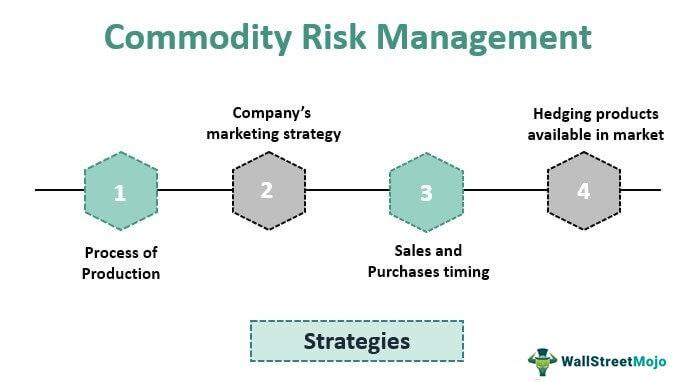

The modern financial market presents a landscape filled with both lucrative opportunities and significant challenges, particularly concerning the management of price risk. Price risk is the possibility that the value of an investment will decrease due to factors beyond general market downturns, such as economic fluctuations, geopolitical events, or changes in supply and demand dynamics. This type of risk is particularly prevalent in sectors subjected to volatility, like commodities and technology.

Algorithmic trading, or algo trading, represents a significant advancement in how these risks are managed. Utilizing sophisticated algorithms, traders can automate the execution of trades based on predefined criteria. This technology minimizes human error, optimizes trade timing, and allows for complex strategies that can mitigate price risk effectively. Algo trading can rapidly analyze large data sets to predict price movements and execute trades faster than a human trader could.

In this article, we will explore various financial strategies and risk mitigation techniques that leverage the power of algorithmic trading. These strategies and techniques are not merely theoretical concepts but practical tools that investors and traders can leverage to enhance their market activity. By understanding and implementing these methods, market participants can better position themselves to capitalize on available opportunities while simultaneously safeguarding their investments against potential losses. This dual approach of maximizing gains and minimizing risks is essential in navigating the complex and dynamic modern financial markets.

## Table of Contents

## Understanding Price Risk

Price risk is a fundamental concern in financial markets, influenced by an array of factors affecting the valuation of assets. One primary source of price risk is earnings volatility, which can result from fluctuating company profits. When earnings are unpredictable, the stability and predictability of a company's cash flow are compromised, leading to increased investment risk. Investors must account for changes in earnings, as these directly impact stock valuations and can cause significant price swings.

Another critical factor contributing to price risk is poor business management. Companies with subpar management often experience inefficient operations, leading to diminished profitability and an unstable financial outlook. Poor management decisions may result in inadequate responses to market changes or technological advancements, thereby heightening the risk of declining asset values.

Sector-specific challenges also play a significant role in price risk. Certain industries face unique vulnerabilities that can exacerbate price fluctuation risks. For instance, the commodities sector, which includes assets like oil, gold, and silver, is particularly susceptible to price volatility due to factors such as geopolitical events, supply chain disruptions, and changes in global demand. These commodities often react sharply to international incidents, influencing not just the commodities themselves but also the stocks of companies engaged in their extraction and production.

Beyond individual assets, macroeconomic factors such as changes in interest rates, inflation, and exchange rates can collectively drive price risk. These elements can affect sectors differently, leading to varying levels of risk across different asset classes and geographic regions. 

Understanding the dynamics of price risk is crucial for investors aiming to construct a resilient investment portfolio. By recognizing the underlying causes of price fluctuation, investors can exploit market inefficiencies. For example, identifying sectors or industries expected to experience price turbulence allows investors to strategically allocate resources or employ hedging techniques to mitigate potential losses.

Implementing financial strategies tailored to the unique risks posed by each market segment enables investors to not only safeguard their investments but also capitalize on potential market opportunities that arise from these inefficiencies. This strategic approach to managing price risk is essential for maintaining a balanced portfolio capable of withstanding market [volatility](/wiki/volatility-trading-strategies).

## Financial Strategies to Minimize Price Risk

Diversification remains a cornerstone strategy for mitigating price risk, achieved by distributing investments across a variety of asset classes and sectors. This method reduces the impact of a single asset's poor performance on the overall portfolio by not relying solely on one market or industry. The concept hinges on the idea that different asset classes—such as equities, bonds, real estate, or commodities—often move independently of each other, meaning a downturn in one area might be offset by gains in another.

For investors seeking further protection against price volatility, financial derivatives offer robust tools. Futures and options, in particular, serve as hedging instruments against adverse price movements. A futures contract allows the investor to agree on a price today for a transaction that will occur at a future date, thus locking in prices and providing predictability. Options provide the right, though not the obligation, to buy or sell an asset at a predetermined price before the contract expires, offering flexibility and a safeguard against unfavorable price shifts.

Short selling represents another advanced strategy to address price risk, especially during anticipated declines in asset prices. By borrowing an asset—a stock, for instance—and selling it at the current market price, investors aim to purchase the asset back at a lower price in the future, pocketing the difference. This strategy not only helps in mitigating the impact of falling markets but also potentially turns price fluctuations into profitable opportunities.

The effective implementation of these financial strategies requires a keen understanding of market dynamics and timing. Investors must carefully assess market indicators, economic trends, and sector-specific challenges to optimize their risk management approaches. Utilizing these financial tools wisely can significantly bolster an investor's ability to protect their portfolio from market volatility while maximizing potential returns.

## Risk Mitigation in Algorithmic Trading

Algorithmic trading platforms utilize advanced algorithms to automate trading processes and minimize human errors. This automation is pivotal in executing trades at speeds and frequencies that are beyond human capability, thus allowing traders to capitalize on minute price discrepancies and market inefficiencies.

Effective risk management in [algorithmic trading](/wiki/algorithmic-trading) involves a multi-faceted approach. Stop-loss orders are crucial tools that automatically close positions once they reach a predetermined price level, thereby limiting potential losses. By using stop-loss orders, traders can control the maximum loss they are willing to withstand on a trade, ensuring that emotions do not interfere with decision-making.

Portfolio diversification is another vital risk mitigation strategy. By spreading investments across various assets and sectors, traders can reduce the impact of a poor-performing asset on the overall portfolio. This approach lessens the portfolio's sensitivity to market volatility and specific asset downturns, consequently enhancing long-term returns.

Hedging strategies serve to protect the portfolio against adverse price movements. Traders employ financial derivatives such as options and futures contracts to create positions that would offset potential losses in their primary investments. For example, a trader holding a long position in a stock could buy a put option to protect against a possible decline in the stock's price.

Implementing dynamic position sizing is essential for adapting to changing market conditions. This involves adjusting the trade size based on the volatility and the trader's risk tolerance. For instance, in a highly volatile market, a trader might reduce their position size to limit exposure, whereas, in a stable market, they might increase the size to capitalize on potential gains.

Trailing stops are another technique used to manage risk by locking in profits as the market moves favorably. A trailing stop adjusts the stop-loss price as the market price moves in the trader's favor. For example, if a trader sets a $10 trailing stop on a stock purchased at $100, and the stock price rises to $120, the stop-loss order will automatically move to $110. This ensures that gains are protected while allowing the trader to benefit from further price advancements.

Algorithmic trading requires disciplined implementation of these risk management strategies to effectively navigate the complexities of financial markets. The combination of technology and well-structured risk measures equips traders to safeguard their capital while exploring potential opportunities for profit.

## The Crucial Role of Risk Management in Algo Trading

Risk management is a critical component of algorithmic trading, aiming to shield trading operations from the dual threats of market unpredictability and technical failures. The importance of risk management in this field cannot be overstated, as trading algorithms operate in highly dynamic and volatile market environments where unforeseen events can lead to rapid and significant financial losses.

Traders employing algorithmic strategies must pay close attention to various types of risks. Firstly, technical risks involve failures in the trading systems, including software bugs, hardware malfunctions, and network issues. Such failures can disrupt trading activities, leading to unintended trades or missed opportunities. To mitigate these risks, robust systems with redundant backups, thorough testing protocols, and regular maintenance are essential.

Market risks, on the other hand, arise from adverse price movements that can affect trading positions. Effective risk management in this context includes using techniques such as stop-loss orders, which automatically [exit](/wiki/exit-strategy) a position at a predetermined price level, limiting potential losses. Additionally, employing portfolio diversification can spread exposure across different asset classes, sectors, or international markets, thus reducing the impact of a downturn in any single asset on the overall portfolio performance.

Operational risk refers to human errors or process failures that can disrupt trading activities. For instance, incorrect data input or a misconfigured algorithm can result in substantial losses. Implementing standardized procedures, continuous monitoring, and a culture of accountability can minimize these risks.

Behavioral risk incorporates the psychological aspects of trading, where fear, greed, or overconfidence might lead an individual to override algorithmic decisions, deviating from the intended trading strategy. Adhering to algorithmic recommendations and predefined risk limits is crucial to avoid such pitfalls.

Effective risk management can even transform market challenges into opportunities. For instance, the application of dynamic position sizing enables adjustments in trade [volume](/wiki/volume-trading-strategy) based on market conditions and estimated risk, thereby optimizing potential returns while controlling risk exposure. Additionally, employing advanced techniques such as [machine learning](/wiki/machine-learning) can enhance predictive analytics, offering more nuanced insights into market trends and aiding in the formulation of adaptive trading strategies.

Overall, by meticulously addressing technical, market, operational, and behavioral risks, traders can ensure that their algorithmic trading strategies remain resilient in volatile markets, thereby safeguarding capital and capitalizing on market inefficiencies.

## Real-World Examples and Case Studies

Diversification and hedging are essential tools in portfolio management, effectively reducing price risks in volatile markets. A notable example is the performance of diversified portfolios during the 2008 financial crisis. Portfolios that included a mix of equities, bonds, and alternative investments demonstrated resilience compared to those heavily weighted in equities alone. The use of financial derivatives, such as options and futures, further highlighted their value during turbulent times. For instance, airlines frequently hedge against fuel price volatility by using futures contracts. This hedging strategy stabilizes operational costs and ensures budget predictability, effectively mitigating the risks associated with sudden oil price fluctuations.

Algorithmic trading strategies have significantly impacted risk management during market fluctuations. One such example is the use of statistical [arbitrage](/wiki/arbitrage), where algorithms exploit price discrepancies between correlated securities. During periods of high volatility, these algorithms can execute trades at high speed and accuracy, capitalizing on short-lived market inefficiencies. A case study of the 2010 "Flash Crash" illustrates how algorithmic strategies, combined with effective risk management protocols, prevented significant losses and even turned a profit for some traders who effectively employed market-neutral strategies.

On the contrary, inadequate risk management can lead to substantial financial setbacks. One prominent case is the collapse of Long-Term Capital Management (LTCM) in 1998. Despite employing sophisticated algorithmic trading strategies, LTCM's failure to diversify adequately and its excessive leverage magnified losses when the Russian government defaulted on its debt, disrupting global financial markets. This highlighted the critical importance of comprehensive risk assessment and management in trading operations.

Lessons learned from these examples underscore the importance of robust risk management frameworks. Diversification and hedging strategies are essential in cushioning against market shocks, while well-implemented algorithmic trading can capitalize on market opportunities. However, the risks associated with over-leverage and insufficient diversification can undermine even the most advanced trading strategies, stressing the need for balanced and cautious financial management practices.

## Conclusion

Navigating the complexities of financial markets calls for a suite of robust strategies designed to mitigate price risk while leveraging the transformative potential of algorithmic trading. Successful risk management is a cornerstone of such strategies, serving not only to protect investments from adverse market conditions but also to identify and exploit new opportunities for profitability. This involves developing a comprehensive understanding of market dynamics and employing cutting-edge technologies to adapt to shifts efficiently.

Advanced risk mitigation techniques play a pivotal role in safeguarding investments. By utilizing tools such as dynamic position sizing, stop-loss orders, and diversification, investors can significantly reduce their exposure to price volatility. For instance, dynamic position sizing allows traders to adjust their investment allocation based on market conditions, thereby optimizing risk-reward ratios.

Moreover, algorithmic trading enhances these strategies by providing the computational power and data-driven insights needed to make informed decisions at a speed and accuracy beyond human capability. Algorithms can analyze vast datasets to discern trends and patterns that inform strategic trades, ensuring that investors remain agile and responsive to market evolutions.

Ultimately, the integration of these sophisticated approaches enables investors to confidently engage with the dynamic and evolving financial landscape. By fostering a proactive mindset and embracing technology-driven strategies, investors can not only shield their assets from potential downturns but also uncover the profitability concealed within volatile markets. This combination of diligent financial strategies and advanced technological assistance positions them well to navigate and thrive in the intricacies of today's financial markets.

## References & Further Reading

[1]: ["Advances in Financial Machine Learning"](https://www.amazon.com/Advances-Financial-Machine-Learning-Marcos/dp/1119482089) by Marcos Lopez de Prado

[2]: ["Machine Learning for Algorithmic Trading"](https://github.com/stefan-jansen/machine-learning-for-trading) by Stefan Jansen

[3]: ["Quantitative Trading: How to Build Your Own Algorithmic Trading Business"](https://github.com/LucindaYa/quant-resources/blob/master/Quantitative%20Trading%20How%20to%20Build%20Your%20Own%20Algorithmic%20Trading%20Business.pdf) by Ernest P. Chan

[4]: ["Algorithmic Trading: Winning Strategies and Their Rationale"](https://www.wiley.com/en-us/Algorithmic+Trading%3A+Winning+Strategies+and+Their+Rationale-p-9781118746912) by Ernest P. Chan

[5]: Pardo, R. (2008). ["The Evaluation and Optimization of Trading Strategies."](https://onlinelibrary.wiley.com/doi/book/10.1002/9781119196969) Wiley Trading.

[6]: Aldridge, I. (2013). ["High-Frequency Trading: A Practical Guide to Algorithmic Strategies and Trading Systems."](https://books.google.com/books/about/High_Frequency_Trading.html?id=6l0DDQAAQBAJ) Wiley Finance Series.

[7]: ["Evidence-Based Technical Analysis: Applying the Scientific Method and Statistical Inference to Trading Signals"](https://www.amazon.com/Evidence-Based-Technical-Analysis-Scientific-Statistical/dp/0470008741) by David Aronson

[8]: Hull, J. (2017). ["Options, Futures, and Other Derivatives."](https://www.amazon.com/Options-Futures-Other-Derivatives-9th/dp/0133456315) Pearson.