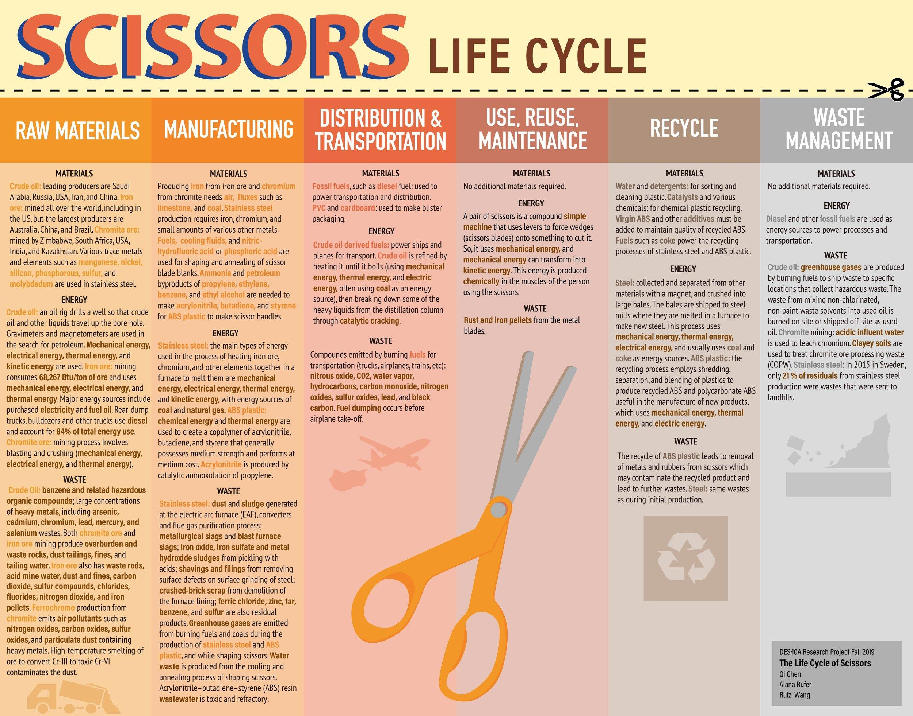

## Table of Contents

## What are price scissors?

Price scissors is a term used to describe a situation where the prices of two related items move in opposite directions. Imagine two blades of a scissors: one blade represents the price of something you sell, like crops, and the other blade represents the price of something you need to buy, like farming equipment. When the price of your crops goes down but the price of farming equipment goes up, it's like the scissors are closing, squeezing your profits.

This situation can be tough for farmers and other producers. When the price they get for their goods falls, but the cost of what they need to keep producing rises, they end up making less money or even losing money. This can happen because of many reasons, like changes in the market or government policies. Understanding price scissors helps people see why some producers struggle even when they work hard.

## How do price scissors affect the economy?

Price scissors can hurt the economy by making it hard for farmers and other producers to make money. When the price they get for what they sell goes down, but the cost of what they need to keep working goes up, they have less money to spend. This means they might buy less from other businesses, which can slow down the whole economy. If many farmers are struggling, it can lead to less food being produced, which might make food prices go up for everyone.

This situation can also lead to bigger problems. If farmers can't make enough money, they might have to borrow money or even stop farming. This can cause job losses in rural areas and make it harder for the economy to grow. Governments might need to step in with help like subsidies or price controls, but these solutions can be tricky and might not fix the problem completely. So, price scissors can create a chain reaction that affects many parts of the economy.

## Can you explain the basic mechanics of price scissors?

Price scissors happen when the price of what you sell goes down, but the price of what you need to buy goes up. Imagine you're a farmer selling wheat. If the price of wheat drops, but the cost of things like seeds and tractors goes up, you're caught in price scissors. It's like the two blades of a scissors closing in on your profits, making it harder to make money.

This situation can really hurt farmers and other producers. When they can't make enough money, they might have to cut back on what they produce or even stop altogether. This can lead to less food or goods being available, which can affect everyone. It's a big problem because it can make the whole economy struggle if lots of people are affected.

## What are some historical examples of price scissors?

One famous example of price scissors happened in the Soviet Union in the 1920s. After the Russian Revolution, the new government wanted to help farmers by giving them more control over their land. But, the prices of things farmers needed to buy, like tools and machines, went up a lot. At the same time, the prices farmers got for their crops went down. This made it really hard for farmers to make money, and many of them struggled. This situation was called the "scissors crisis" and it caused big problems for the Soviet economy.

Another example happened in China during the late 1970s and early 1980s. As China started to open up its economy, the prices of industrial goods like machinery and fertilizers went up quickly. But, the prices farmers got for their crops didn't go up as fast. This made it tough for farmers to afford what they needed to keep farming. The government had to step in with new policies to help balance things out. These price scissors made it clear that big changes were needed to help farmers and keep the economy growing.

## How do price scissors impact farmers and industrial workers?

Price scissors can make life really hard for farmers. Imagine a farmer who sells wheat. If the price of wheat goes down, but the cost of things like seeds and tractors goes up, the farmer ends up with less money. This makes it tough for the farmer to keep farming or even to make ends meet. If lots of farmers are struggling, they might produce less food, which can make food prices go up for everyone. This can lead to big problems in rural areas, where many people might lose their jobs or have to move away.

Industrial workers can also feel the squeeze from price scissors. If farmers can't afford to buy things like machinery and tools because their crop prices are low, then factories that make these things might have to cut back on production. This means fewer jobs for industrial workers, and they might have to work less or even lose their jobs. When both farmers and industrial workers are struggling, it can slow down the whole economy, making it harder for everyone to make a living.

## What role do government policies play in the occurrence of price scissors?

Government policies can play a big role in causing price scissors. Sometimes, governments set prices for certain things, like crops or industrial goods. If they set the price of crops too low but let the price of things farmers need to buy, like tools and seeds, go up, farmers end up with less money. This can happen because the government wants to keep food prices low for people in cities, but it hurts farmers. Governments might also put taxes on certain goods, which can make them more expensive and add to the problem of price scissors.

On the other hand, governments can also try to fix price scissors with their policies. They might give money to farmers to help them afford what they need, which are called subsidies. Or they might control the prices of industrial goods to keep them from going up too fast. But these solutions can be tricky. If the government helps farmers too much, it might make food prices go up for everyone else. So, governments have to be careful and balance things out to stop price scissors from hurting the economy too much.

## How can price scissors be measured and analyzed?

To measure and analyze price scissors, economists look at the prices of what farmers sell, like crops, and the prices of what they need to buy, like tools and seeds. They compare these prices over time to see if they are moving in opposite directions. If the price of crops is going down but the price of tools is going up, that's a sign of price scissors. Economists use charts and graphs to show these trends clearly, making it easier to see when the scissors are closing and squeezing farmers' profits.

Analyzing price scissors involves looking at why these price changes are happening. Economists might study things like government policies, market conditions, and even global events that could affect prices. They use this information to understand how big the problem is and what can be done about it. By keeping a close eye on these trends, economists can help governments and farmers find ways to deal with price scissors and keep the economy strong.

## What are the long-term effects of price scissors on an economy?

Price scissors can cause big problems for an economy over time. When farmers keep getting less money for their crops but have to pay more for what they need, they might not be able to keep farming. This can lead to less food being produced, which can make food prices go up for everyone. If lots of farmers struggle, it can hurt rural areas a lot, with people losing jobs and having to move away. This can make the whole economy slow down because people in rural areas have less money to spend on things.

Over the long term, price scissors can also make it hard for industries that depend on farmers. If farmers can't afford to buy things like machinery and tools, factories that make these things might have to cut back on production. This can lead to fewer jobs for industrial workers, which can make the economy even weaker. Governments might try to help by giving money to farmers or controlling prices, but these solutions can be tricky. If not handled well, price scissors can keep causing problems for the economy for a long time.

## How do price scissors relate to terms of trade?

Price scissors and terms of trade are connected because they both deal with how much you get for what you sell compared to what you have to pay for what you buy. Terms of trade is like a big picture of how much a country's exports are worth compared to its imports. If a country's terms of trade get worse, it means they are getting less for their exports but paying more for their imports. This is similar to price scissors, where farmers get less for their crops but pay more for things like seeds and tools.

When price scissors happen, it's like the terms of trade are getting worse for farmers. They are selling their crops for less money but buying things they need for more. This can make it hard for them to keep farming and can hurt the whole economy. So, price scissors are a specific example of how terms of trade can affect people and businesses within a country.

## What strategies can be used to mitigate the effects of price scissors?

One way to help with price scissors is for the government to give farmers money, called subsidies. This can help farmers afford the things they need, like seeds and tools, even when the price of their crops goes down. Governments can also try to control the prices of things farmers need to buy, so they don't go up too fast. This can stop the scissors from closing too tightly on farmers' profits. But, these solutions can be tricky. If the government helps farmers too much, it might make food prices go up for everyone else.

Another strategy is for farmers to work together in groups, called cooperatives. When farmers join forces, they can buy things they need at lower prices because they are buying in bulk. They can also sell their crops together, which might help them get a better price. This can make it easier for farmers to deal with price scissors. Also, if farmers can find new ways to make money, like growing different crops or starting small businesses, they might be less affected by price scissors. Finding new ways to earn can help farmers keep going, even when the prices are tough.

## How do global market dynamics influence the occurrence of price scissors?

Global market dynamics can make price scissors worse for farmers. When countries trade with each other, the prices of things like crops and tools can change a lot. If a big country starts selling a lot of cheap crops, the price of crops everywhere might go down. But if the price of tools and seeds goes up because they are made in another country where costs are rising, farmers end up getting less money for their crops but paying more for what they need. This is how global markets can squeeze farmers with price scissors.

Governments and big companies can also affect price scissors through global trade. If a government puts taxes on imported goods, it can make those goods more expensive for farmers. At the same time, if they let in cheap crops from other countries, the price farmers get for their own crops might go down. Big companies that control a lot of the market can also change prices to make more money, which can hurt farmers. So, what happens in the global market can really change how hard price scissors hit farmers.

## What are the theoretical models used to study price scissors?

Economists use different models to understand price scissors. One common model is the supply and demand model. This model looks at how the amount of a product available (supply) and how much people want to buy it (demand) affect its price. If there's a lot of a crop, like wheat, the price might go down because there's more than people need. But if the price of tools and seeds goes up because there's not enough of them, farmers get squeezed. This model helps economists see how changes in supply and demand can cause price scissors.

Another model is the cost-price squeeze model. This model focuses on the costs farmers have to pay and the prices they get for their crops. If the costs go up but the prices stay the same or go down, farmers make less money. This model helps explain why farmers might struggle even when they work hard. Economists use these models to study price scissors and figure out ways to help farmers and keep the economy strong.

## References & Further Reading

[1]: Bergstra, J., Bardenet, R., Bengio, Y., & Kégl, B. (2011). ["Algorithms for Hyper-Parameter Optimization."](https://dl.acm.org/doi/10.5555/2986459.2986743) Advances in Neural Information Processing Systems 24.

[2]: ["Advances in Financial Machine Learning"](https://www.amazon.com/Advances-Financial-Machine-Learning-Marcos/dp/1119482089) by Marcos Lopez de Prado

[3]: ["Evidence-Based Technical Analysis: Applying the Scientific Method and Statistical Inference to Trading Signals"](https://www.amazon.com/Evidence-Based-Technical-Analysis-Scientific-Statistical/dp/0470008741) by David Aronson

[4]: ["Machine Learning for Algorithmic Trading"](https://github.com/stefan-jansen/machine-learning-for-trading) by Stefan Jansen

[5]: ["Quantitative Trading: How to Build Your Own Algorithmic Trading Business"](https://www.amazon.com/Quantitative-Trading-Build-Algorithmic-Business/dp/1119800064) by Ernest P. Chan

[6]: Prebisch, R. (1950). ["The Economic Development of Latin America and its Principal Problems."](https://archive.org/details/1950-prebisch-un-the-economic-development-of-latin-america-and-its-principal-problems) United Nations.

[7]: Marx, K. (1906). ["Capital: A Critique of Political Economy, Volume 1."](https://www.marxists.org/archive/marx/works/download/pdf/Capital-Volume-I.pdf) Progress Publishers.

[8]: Keynes, J. M. (1936). ["The General Theory of Employment, Interest, and Money."](https://www.files.ethz.ch/isn/125515/1366_KeynesTheoryofEmployment.pdf) Macmillan.