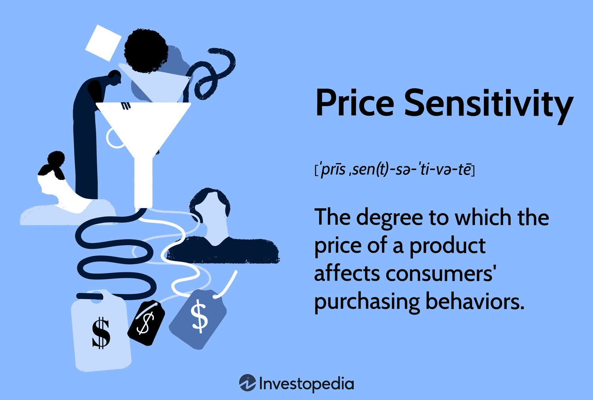

## Table of Contents

## What is price sensitivity?

Price sensitivity is how much the price of a product affects whether people will buy it. If people are very sensitive to price, a small increase in price might make them decide not to buy the product. On the other hand, if people are not very sensitive to price, they might still buy the product even if the price goes up a lot.

Understanding price sensitivity is important for businesses because it helps them set the right price for their products. If a business knows that their customers are very sensitive to price, they might keep the price low to attract more buyers. If customers are not very sensitive to price, the business might be able to charge more and still sell a lot of products. This can help the business make more money.

## How does price sensitivity affect consumer buying behavior?

Price sensitivity directly impacts how much and what consumers are willing to buy. When people are very sensitive to price, they pay close attention to how much things cost. If a product's price goes up even a little bit, they might choose not to buy it or look for a cheaper option. This means businesses need to be careful about raising prices because it could lead to fewer sales.

On the other hand, if consumers are not very sensitive to price, they might still buy a product even if its price increases a lot. These consumers might value the product's quality, brand, or convenience more than its cost. For businesses, this means they can sometimes raise prices without losing many customers, which can help them earn more money. Understanding how sensitive their customers are to price helps businesses make smart decisions about pricing their products.

## What are the different types of price sensitivity?

There are a few different types of price sensitivity that businesses need to understand. The first type is high price sensitivity. This is when even small changes in price can make a big difference in whether people will buy a product. For example, if a store raises the price of a popular snack by just a little bit, people might stop buying it and choose a cheaper snack instead. This type of sensitivity is common for everyday items that people can easily replace with something else.

Another type is low price sensitivity. This happens when people don't care as much about the price and are more willing to pay more for a product. For example, if someone really likes a certain brand of shoes, they might still buy them even if the price goes up a lot. This type of sensitivity often happens with products that people see as special or important, like luxury items or things they feel they really need.

There's also a middle ground called moderate price sensitivity. In this case, people might be willing to pay a bit more for a product, but only up to a certain point. If the price goes too high, they might decide not to buy it. This is common for products that people like but don't see as essential, like certain electronics or clothes. Understanding these different types helps businesses set the right prices for their products.

## How can businesses measure price sensitivity among their customers?

Businesses can measure price sensitivity by using surveys and asking customers directly how much they would be willing to pay for a product. They might ask people to imagine different prices and say whether they would still buy the product at those prices. This helps businesses see how much the price can change before people stop buying. Another way is to do price experiments, where they change the price of a product for a short time and see if sales go up or down. This gives them real information about how sensitive their customers are to price changes.

Another method is to use data analysis. Businesses can look at past sales data to see how sales changed when prices changed before. They can use special math formulas, like the price elasticity of demand, to figure out how sensitive their customers are to price. This formula helps them understand how much a change in price will change the number of products sold. By combining all these methods, businesses can get a good idea of their customers' price sensitivity and make better pricing decisions.

## What factors influence a consumer's price sensitivity?

A few things can make a person more or less sensitive to price. One big factor is how much money they have. If someone doesn't have a lot of money, they might be very sensitive to price because they need to be careful about how they spend. On the other hand, if someone has a lot of money, they might not care as much about the price and be less sensitive. Another factor is how important the product is to them. If it's something they really need or want, like medicine or a favorite food, they might be willing to pay more for it. But if it's something they can easily do without, like a fancy toy, they might be more sensitive to the price.

Another thing that can affect price sensitivity is how easy it is to find something similar for less money. If there are a lot of other options that are cheaper, people might be more sensitive to the price of the product they're looking at. They can just switch to a different brand or store if the price goes up. Also, how well people know the product can make a difference. If they trust the brand and think it's good quality, they might be less sensitive to price changes. But if they don't know the brand well, they might be more likely to look for a cheaper option.

## How does price sensitivity vary across different market segments?

Price sensitivity can change a lot depending on who the customers are. Different groups of people, called market segments, can have different feelings about price. For example, young people might be more sensitive to price because they often don't have a lot of money. They might look for the cheapest options and be quick to switch to a different product if the price goes up. On the other hand, older people might have more money and be less sensitive to price. They might be willing to pay more for things they like or need, even if the price goes up a bit.

Another way price sensitivity can vary is by income level. People with lower incomes are usually more sensitive to price because they have to be careful with their money. They might choose cheaper products or wait for sales to buy things. People with higher incomes might not care as much about the price and be more focused on the quality or brand of the product. This means businesses need to think about who their customers are and how much money they have when they set prices. By understanding these different market segments, businesses can make better decisions about how to price their products to attract the right customers.

## What strategies can businesses use to manage price sensitivity?

Businesses can use different strategies to manage how sensitive their customers are to price. One way is to offer different versions of their product at different prices. This is called price differentiation. For example, a company might sell a basic version of a product at a low price for people who are very sensitive to price, and a more expensive version with extra features for people who are less sensitive. This way, the business can attract different types of customers and make more money.

Another strategy is to use discounts and promotions. By offering sales or special deals, businesses can make their products seem more affordable to people who are sensitive to price. This can help them sell more products without lowering the regular price too much. Businesses can also focus on making their products seem more valuable. If customers think a product is really good or special, they might be willing to pay more for it, even if they are usually sensitive to price. By using these strategies, businesses can manage price sensitivity and keep their customers happy.

## How do psychological pricing techniques influence price sensitivity?

Psychological pricing techniques can make people less sensitive to price by making the price seem lower or more attractive. One common technique is charm pricing, where businesses set prices just below a round number, like $9.99 instead of $10. This makes the price look cheaper and can trick the brain into thinking it's a better deal. Another technique is using odd prices, like $197 instead of $200, which can make the price seem more precise and less likely to be rounded up in the customer's mind.

Another way psychological pricing influences price sensitivity is through prestige pricing, where businesses set high prices to make a product seem more valuable or exclusive. This can make customers less sensitive to price because they associate the high cost with high quality or status. For example, luxury brands often use this strategy to attract customers who are willing to pay more for the feeling of owning something special. By using these techniques, businesses can change how customers perceive price and manage their price sensitivity effectively.

## What role does brand loyalty play in price sensitivity?

Brand loyalty can make people less sensitive to price. When someone really likes a brand and always buys from it, they might not care as much if the price goes up a little. They trust the brand and think it's worth paying more for. For example, if someone always buys the same brand of cereal because they love it, they might still buy it even if it gets a bit more expensive. Businesses know this and sometimes use it to keep their prices a bit higher without losing customers.

But brand loyalty doesn't always make people less sensitive to price. If the price goes up a lot, even loyal customers might start looking for cheaper options. They might still like the brand, but if they can't afford it, they have to switch. So, businesses need to be careful not to raise prices too much, even if they have loyal customers. Understanding how loyal their customers are can help businesses decide how much they can change their prices without losing sales.

## How can data analytics be used to predict and respond to price sensitivity?

Data analytics can help businesses understand how much people care about price by looking at past sales information. By using special math formulas, like the price elasticity of demand, businesses can see how much a change in price will change how many products they sell. They can also use surveys to ask customers directly how much they would pay for a product at different prices. This helps businesses predict how sensitive their customers are to price changes and make smart decisions about setting prices.

Once businesses know how sensitive their customers are to price, they can use data analytics to respond better. They can try different prices for a short time and see how sales change. This helps them find the best price that keeps customers happy and makes the business more money. By always looking at new data, businesses can keep up with changes in what customers want and adjust their prices to stay competitive.

## What are the long-term effects of price sensitivity on market dynamics?

Price sensitivity can change how markets work over a long time. If people are very sensitive to price, businesses might have to keep their prices low to keep selling their products. This can make it hard for them to make a lot of money, and they might need to find other ways to save money, like making their products cheaper to make. It can also mean more competition, as businesses try to offer the best price. Over time, this can lead to a market where prices stay low, and businesses have to work hard to stay ahead.

On the other hand, if people are not very sensitive to price, businesses might be able to raise their prices without losing customers. This can help them make more money and invest in better products or services. It can also lead to less competition, as businesses focus more on quality or brand rather than just price. Over time, this can create a market where some businesses do very well because they can charge more, while others struggle to keep up if they can't offer something special.

## How do global economic conditions impact price sensitivity and consumer behavior?

Global economic conditions can make people more or less sensitive to price. When the economy is doing well, people usually have more money and might not care as much about price. They might be willing to pay more for things they want or need. But when the economy is not doing well, like during a recession, people often have less money and become more sensitive to price. They start looking for cheaper options and might stop buying things that are too expensive. Businesses need to watch these changes and adjust their prices to keep selling their products.

Economic conditions also change how people buy things. In good times, people might spend more on luxury items or treats, like going out to eat or buying new clothes. They feel confident about their money and are less worried about the price. But in bad times, people focus more on what they really need, like food and bills. They might buy less and look for sales or discounts. This means businesses need to be ready to change their strategies, like offering more deals or focusing on essential products, to match how people are spending during different economic times.

## What is Understanding Price Sensitivity?

Price sensitivity is a critical concept for understanding market dynamics, reflecting the degree to which the demand for a product or service changes in response to its price. This relationship is often quantified through the price elasticity of demand, a metric that captures the percentage change in quantity demanded resulting from a one percent change in price. Mathematically, it is expressed as:

$$

E_d = \frac{\%\Delta Q_d}{\%\Delta P} 
$$

where $E_d$ represents the price elasticity of demand, $\%\Delta Q_d$ is the percentage change in quantity demanded, and $\%\Delta P$ is the percentage change in price. A high price elasticity indicates that consumers are highly responsive to price changes, while low elasticity suggests that demand is relatively inelastic.

Certain product categories demonstrate varying levels of price sensitivity. For instance, luxury items often exhibit lower price sensitivity. Consumers purchasing such items are typically less influenced by price changes, prioritizing attributes such as exclusivity, brand prestige, and quality. This reduced sensitivity allows businesses to maintain higher pricing structures without significantly affecting demand.

Conversely, goods that are considered necessities or have many substitutes tend to have higher price sensitivity. For basic commodities or items with numerous alternatives, even minor price adjustments can lead to significant changes in consumer purchasing behavior as shoppers seek cost-efficient options.

Businesses can leverage insights into consumer price sensitivity to refine their pricing strategies. By understanding how different segments of their customer base react to price changes, firms can tailor pricing models to optimize revenue. For example, for products with low price sensitivity, businesses may implement premium pricing strategies to enhance perceived value and maximize profit margins.

Price sensitivity is not uniform across all consumers. Variability can arise from several factors, including income, product type, and perceived value. Consumers with higher income levels may exhibit lower price sensitivity, as they have greater financial flexibility and may value convenience or brand reputation more highly. Similarly, the perceived value of a product—how consumers rate its benefits against its cost—also heavily influences price sensitivity. Products that are perceived as offering high value are likely to demonstrate less elastic demand.

In conclusion, understanding and measuring price sensitivity is crucial for businesses aiming to devise effective pricing strategies. By recognizing the factors that drive consumer responsiveness to price changes, companies can make informed decisions to align their pricing models with consumer expectations, thereby enhancing competitiveness and profitability.

## How do price sensitivity and algorithmic trading interact?

Algorithmic trading, prevalent in modern financial markets, relies on sophisticated algorithms to automate the buying and selling of securities. These algorithms utilize a wide array of data inputs, including historical price data, market sentiment, and economic indicators, to execute trades with precision and speed. Understanding price sensitivity is crucial within this framework, as it enables the development of algorithms that can predict market trends and execute trades that optimize returns.

Price sensitivity, often represented as price elasticity of demand, is a measure of how the quantity demanded of a good responds to a change in its price. This concept is essential in [algorithmic trading](/wiki/algorithmic-trading), where algorithms need to forecast how changes in price could impact consumer demand and, consequently, financial markets. By analyzing patterns of price elasticity, algorithms can be designed to anticipate consumer behavior, potentially offering a competitive edge. 

The formula for price elasticity of demand ($E_d$) is given by:

$$

E_d = \frac{\%\text{ Change in Quantity Demanded}}{\%\text{ Change in Price}}
$$

Algorithms can simulate numerous scenarios wherein small price adjustments lead to varying levels of consumer demand. Price-sensitive goods will show significant changes in demand with price fluctuations, allowing algorithms to adjust trading strategies dynamically. For instance, if a product exhibits high price sensitivity, a small decrease in price could lead to a substantial increase in demand, prompting a buy signal in algorithmic terms.

Moreover, algorithms that integrate consumer behavior data with market analytics can enhance forecasting accuracy. Machine learning techniques are often used to analyze large datasets, identifying patterns and correlations that are not immediately apparent. Python, with its extensive libraries like NumPy, pandas, and scikit-learn, facilitates such data analysis. A simple implementation in Python for analyzing price elasticity could be:

```python
import numpy as np

# Sample data: [initial_price, final_price, initial_quantity, final_quantity]
data = np.array([[10, 9, 100, 150], [20, 18, 80, 100]])

def calculate_price_elasticity(data):
    results = []
    for row in data:
        initial_price, final_price, initial_quantity, final_quantity = row
        percentage_change_quantity = (final_quantity - initial_quantity) / initial_quantity * 100
        percentage_change_price = (final_price - initial_price) / initial_price * 100
        elasticity = percentage_change_quantity / percentage_change_price
        results.append(elasticity)
    return results

elasticities = calculate_price_elasticity(data)
print(elasticities)
```

Furthermore, the synergy between consumer data and algorithmic insights can lead to enhanced market strategies. By feeding algorithms with real-time consumer behavior data, businesses can refine their pricing strategies to better match market conditions. This integration not only optimizes individual trade executions but also contributes to more effective market-making strategies.

Ultimately, as algorithms grow more sophisticated, their ability to incorporate price sensitivity will be a determinant of their success in capturing share in volatile financial markets. The combination of data-driven insights into consumer behavior and advanced algorithmic models stands as a cornerstone for contemporary trading strategies.

## References & Further Reading

[1]: Lars Meyers, Philip Linsmeier, and Wendy Guild (2020). ["Algorithmic Trading and Consumer Behavior: A Comprehensive Analysis."](https://www.sciencedirect.com/science/article/pii/S0001691824000544) Journal of Economic Perspectives, Volume 34, Issue 4.

[2]: Eric T. Bradlow and John B. Lattin (2001). ["The Role of Price History in Consumer Choice Models: A Specification Test."](https://marketing.wharton.upenn.edu/profile/ebradlow/) Journal of Marketing Research, Vol. 38, No. 1.

[3]: ["Principles of Pricing: An Analytical Approach"](https://archive.org/details/principlesofpric0000vohr) by Robert L. Phillips

[4]: Andrew W. Lo (2016). ["Adaptive Markets: Financial Evolution at the Speed of Thought."](https://www.amazon.com/Adaptive-Markets-Financial-Evolution-Thought/dp/0691135142) Princeton University Press.

[5]: ["The Intelligent Investor: The Definitive Book on Value Investing"](https://www.amazon.com/Intelligent-Investor-Third-Definitive-Investing/dp/0063423537) by Benjamin Graham