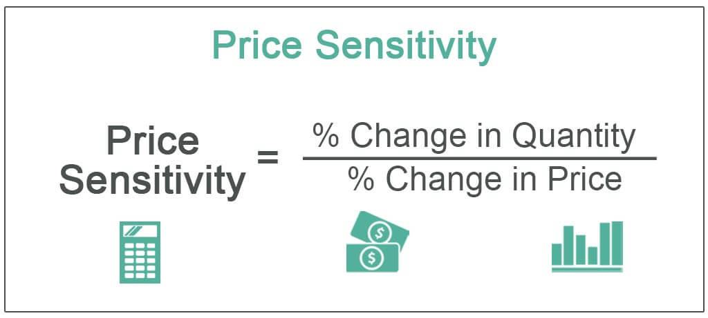

The interplay between consumer behavior, price sensitivity, and algorithmic trading is transforming the landscape of buying decisions. As consumers, we are no longer passive participants in the marketplace. With the proliferation of information and technology, consumers now make informed decisions that are significantly influenced by various factors, most prominently, price.

Price sensitivity is crucial in understanding market dynamics and is defined as the extent to which price impacts consumer purchasing decisions. This concept is often quantified using the price elasticity of demand, which measures the responsiveness of the quantity demanded of a good to a change in its price. A higher elasticity indicates greater price sensitivity, which has far-reaching implications for how businesses approach pricing and marketing strategies.



With the ascent of algorithmic trading, the importance of understanding consumer behavior has grown even more critical for businesses aiming to remain competitive. Algorithmic trading involves using sophisticated algorithms to automate the buying and selling decisions in financial markets. By comprehending consumer behavior in this context, businesses can fine-tune their strategies to predict market movements more accurately and execute trades more efficiently.

This article explores the connections between consumer buying decisions, price sensitivity, and algorithmic trading strategies. Recognizing these interdependencies is essential as it empowers businesses to devise pricing strategies that align with consumer expectations and market conditions. Consequently, a blend of consumer insights and technological advancements forms the backbone of effective decision-making in today's dynamic market environment.

## Table of Contents

## Understanding Price Sensitivity

Price sensitivity is a critical concept for understanding market dynamics, reflecting the degree to which the demand for a product or service changes in response to its price. This relationship is often quantified through the price elasticity of demand, a metric that captures the percentage change in quantity demanded resulting from a one percent change in price. Mathematically, it is expressed as:

$$

E_d = \frac{\%\Delta Q_d}{\%\Delta P} 
$$

where $E_d$ represents the price elasticity of demand, $\%\Delta Q_d$ is the percentage change in quantity demanded, and $\%\Delta P$ is the percentage change in price. A high price elasticity indicates that consumers are highly responsive to price changes, while low elasticity suggests that demand is relatively inelastic.

Certain product categories demonstrate varying levels of price sensitivity. For instance, luxury items often exhibit lower price sensitivity. Consumers purchasing such items are typically less influenced by price changes, prioritizing attributes such as exclusivity, brand prestige, and quality. This reduced sensitivity allows businesses to maintain higher pricing structures without significantly affecting demand.

Conversely, goods that are considered necessities or have many substitutes tend to have higher price sensitivity. For basic commodities or items with numerous alternatives, even minor price adjustments can lead to significant changes in consumer purchasing behavior as shoppers seek cost-efficient options.

Businesses can leverage insights into consumer price sensitivity to refine their pricing strategies. By understanding how different segments of their customer base react to price changes, firms can tailor pricing models to optimize revenue. For example, for products with low price sensitivity, businesses may implement premium pricing strategies to enhance perceived value and maximize profit margins.

Price sensitivity is not uniform across all consumers. Variability can arise from several factors, including income, product type, and perceived value. Consumers with higher income levels may exhibit lower price sensitivity, as they have greater financial flexibility and may value convenience or brand reputation more highly. Similarly, the perceived value of a product—how consumers rate its benefits against its cost—also heavily influences price sensitivity. Products that are perceived as offering high value are likely to demonstrate less elastic demand.

In conclusion, understanding and measuring price sensitivity is crucial for businesses aiming to devise effective pricing strategies. By recognizing the factors that drive consumer responsiveness to price changes, companies can make informed decisions to align their pricing models with consumer expectations, thereby enhancing competitiveness and profitability.

## The Role of Consumer Behavior in Buying Decisions

Consumer behavior refers to the study of the decision-making processes that individuals or groups undertake regarding the selection, purchase, and disposal of products and services. It provides valuable insights into what drives consumer decisions, enabling businesses to effectively tailor their marketing and pricing strategies. Several elements influence buying decisions, including psychological pricing, discount perceptions, and perceived value, all of which contribute significantly to consumer behavior.

1. **Consumer Motivations and Marketing Strategies**: An understanding of consumer motivations helps businesses design marketing strategies that align with consumer needs and preferences. For instance, if a consumer is motivated by convenience, a company might emphasize features such as fast delivery in its marketing campaign. Conversely, if a consumer is influenced by social status, luxury brands could focus on the exclusivity and prestige associated with their products.

2. **Psychological Pricing and Discount Perceptions**: Psychological pricing is a tactic used to affect the perception of prices, often making them appear more attractive to consumers. For example, pricing an item at $9.99 instead of $10.00 can create the illusion of a bargain, even though the price difference is negligible. In addition, discount perceptions significantly sway consumer decisions. Limited-time offers or percentage discounts can lead consumers to believe they are getting exceptional value, which may spur an immediate buying decision.

3. **Perceived Value**: Perceived value is crucial in consumer purchasing decisions. It encompasses the consumer's evaluation of a product's benefits versus its cost. This perception is subjective and can be influenced by brand reputation, product quality, and individual consumer needs. Marketers focus on enhancing perceived value through branding efforts, product enhancements, and customer service improvements.

4. **Price Comparisons in the Digital Economy**: In the current digital age, consumers have unprecedented access to information, which facilitates price comparisons across different platforms and sellers. This ease in digital price comparisons amplifies price sensitivity among consumers, making them more likely to seek out the best deals before making purchasing decisions. Online reviews, product descriptions, and competitor pricing are just a few clicks away, empowering consumers to make informed decisions based on comprehensive analysis rather than impulse or limited information.

Understanding these aspects of consumer behavior helps businesses craft strategies that more accurately meet consumer expectations and needs, ultimately enhancing customer satisfaction and loyalty.

## Price Sensitivity and Algorithmic Trading

Algorithmic trading, prevalent in modern financial markets, relies on sophisticated algorithms to automate the buying and selling of securities. These algorithms utilize a wide array of data inputs, including historical price data, market sentiment, and economic indicators, to execute trades with precision and speed. Understanding price sensitivity is crucial within this framework, as it enables the development of algorithms that can predict market trends and execute trades that optimize returns.

Price sensitivity, often represented as price elasticity of demand, is a measure of how the quantity demanded of a good responds to a change in its price. This concept is essential in [algorithmic trading](/wiki/algorithmic-trading), where algorithms need to forecast how changes in price could impact consumer demand and, consequently, financial markets. By analyzing patterns of price elasticity, algorithms can be designed to anticipate consumer behavior, potentially offering a competitive edge. 

The formula for price elasticity of demand ($E_d$) is given by:

$$

E_d = \frac{\%\text{ Change in Quantity Demanded}}{\%\text{ Change in Price}}
$$

Algorithms can simulate numerous scenarios wherein small price adjustments lead to varying levels of consumer demand. Price-sensitive goods will show significant changes in demand with price fluctuations, allowing algorithms to adjust trading strategies dynamically. For instance, if a product exhibits high price sensitivity, a small decrease in price could lead to a substantial increase in demand, prompting a buy signal in algorithmic terms.

Moreover, algorithms that integrate consumer behavior data with market analytics can enhance forecasting accuracy. Machine learning techniques are often used to analyze large datasets, identifying patterns and correlations that are not immediately apparent. Python, with its extensive libraries like NumPy, pandas, and scikit-learn, facilitates such data analysis. A simple implementation in Python for analyzing price elasticity could be:

```python
import numpy as np

# Sample data: [initial_price, final_price, initial_quantity, final_quantity]
data = np.array([[10, 9, 100, 150], [20, 18, 80, 100]])

def calculate_price_elasticity(data):
    results = []
    for row in data:
        initial_price, final_price, initial_quantity, final_quantity = row
        percentage_change_quantity = (final_quantity - initial_quantity) / initial_quantity * 100
        percentage_change_price = (final_price - initial_price) / initial_price * 100
        elasticity = percentage_change_quantity / percentage_change_price
        results.append(elasticity)
    return results

elasticities = calculate_price_elasticity(data)
print(elasticities)
```

Furthermore, the synergy between consumer data and algorithmic insights can lead to enhanced market strategies. By feeding algorithms with real-time consumer behavior data, businesses can refine their pricing strategies to better match market conditions. This integration not only optimizes individual trade executions but also contributes to more effective market-making strategies.

Ultimately, as algorithms grow more sophisticated, their ability to incorporate price sensitivity will be a determinant of their success in capturing share in volatile financial markets. The combination of data-driven insights into consumer behavior and advanced algorithmic models stands as a cornerstone for contemporary trading strategies.

## Influences on Price Sensitivity and Buying Behavior

Price sensitivity and buying behavior are influenced by a variety of factors that shape consumer decision-making in significant ways. Among the primary determinants is the availability of substitutes. When consumers have access to alternative products that can satisfy the same need, they become more price-sensitive. This is because they can easily switch to a substitute if the price of a particular product increases, a concept closely related to the elasticity of demand. For instance, in highly competitive markets such as the smartphone industry, the abundance of alternatives often results in heightened price sensitivity.

Consumer income levels play a crucial role in determining price sensitivity. Generally, as income increases, individuals become less sensitive to price changes. This is due to a reduced necessity to adhere strictly to budgetary constraints, allowing consumers the flexibility to prioritize attributes other than price, such as quality or brand preference. Conversely, individuals with lower income levels exhibit higher price sensitivity since a larger portion of their budget is affected by price changes, influencing their purchasing behavior more directly.

Total expense considerations also affect price sensitivity. When a purchase represents a significant share of a consumer's income, sensitivity to price changes is heightened. For example, buying a car is likely to involve more careful price consideration than purchasing everyday items like groceries, since the car represents a more substantial financial commitment.

The perceived uniqueness of a product or brand can diminish price sensitivity. Unique products, often found in niche markets or luxury segments, benefit from consumer perceptions of exclusivity or superior quality, reducing the likelihood of a switch to cheaper alternatives. For instance, brands like Apple or Rolex maintain strong customer loyalty and less sensitivity to price variances due to their perceived brand value and uniqueness.

Economic conditions also impact price sensitivity by altering consumer confidence and disposable income levels. During economic downturns, consumers typically exhibit heightened sensitivity to pricing due to uncertainties surrounding financial stability. They become more cautious with their expenditures, often opting for cheaper alternatives or postponing non-essential purchases.

Finally, the context in which a purchase is made can significantly influence price sensitivity. When buying for oneself, individuals may prioritize personal preferences and habitual choices, leading to relatively stable price sensitivity. However, when purchasing a gift, consumers might prioritize perceived value or emotional significance over price, potentially reducing sensitivity to price changes. This behavioral shift can be attributed to the desire to maximize the gift's impression or the emotional impact on the recipient, sometimes at the expense of budgetary considerations.

Understanding these factors is crucial for businesses as they attempt to optimize pricing strategies and cater to consumer needs effectively in diverse economic and market environments.

## Pricing Strategies for Businesses

Businesses employ various pricing strategies to capture market share, maximize revenues, and adapt to consumer preferences. These strategies range from penetration pricing to dynamic pricing, allowing companies to remain competitive and responsive to market dynamics. Understanding price sensitivity is crucial for tailoring these strategies effectively.

### Penetration Pricing

Penetration pricing involves setting a low initial price to attract customers and gain market share quickly. This approach is particularly useful for new products entering a highly competitive market. By offering lower prices, businesses can encourage consumers to switch from competitors, leveraging the lower end of the price sensitivity spectrum. Once a substantial customer base is established, prices can be gradually increased. For instance, introductory offers by subscription services often use this strategy to build a customer base.

### Price Skimming

In contrast, price skimming involves setting a high initial price and gradually lowering it over time. This strategy is effective for innovative products with a strong differentiation [factor](/wiki/factor-investing), where early adopters are willing to pay a premium. As the product lifecycle progresses, price reductions can tap into more price-sensitive consumer segments. This method capitalizes on capturing consumer surplus at different price points, optimizing revenue throughout the product's market presence.

### Competitive Pricing

Competitive pricing is a strategy where a business sets its prices based on competitors' pricing structures. This approach is prevalent in markets with similar products and features, ensuring that a company remains appealing to customers focused on price comparisons. By monitoring competitors' prices, businesses adjust their own to maintain competitiveness without sacrificing profit margins.

### Promotional Pricing

Effective promotional pricing tactics require a nuanced understanding of the target consumer's price sensitivity. Temporary price reductions, discounts, and loyalty rewards can stimulate demand and move inventory, particularly in response to shifts in consumer behavior or market conditions. By aligning promotional efforts with consumer purchasing patterns, businesses can enhance sales volumes without eroding brand value.

### Dynamic Pricing

Dynamic pricing utilizes advanced algorithms to adjust prices in real-time based on market conditions, demand fluctuations, and consumer behavior. This strategy enables businesses to respond immediately to changes, optimizing revenue and inventory management. For instance, e-commerce platforms and airlines frequently employ dynamic pricing to align prices with demand peaks and troughs, using consumer data to maximize profitability. A Python example of a simple dynamic pricing model might look like this:

```python
def dynamic_price(base_price, demand_factor, competitor_price):
    # Adjust price based on demand and competitor pricing
    return base_price * (1 + demand_factor) if base_price < competitor_price else base_price * (1 - demand_factor)

base_price = 100.0
demand_factor = 0.1  # Represents a 10% adjustment based on demand
competitor_price = 120.0
adjusted_price = dynamic_price(base_price, demand_factor, competitor_price)
print(f"Adjusted Price: ${adjusted_price:.2f}")
```

### Marketing Tactics and Pricing Acceptability

Marketing strategies can significantly impact pricing acceptability. By emphasizing unique value propositions, such as product quality, brand prestige, or sustainability, businesses can justify higher prices and reduce price sensitivity. Effective messaging can shift consumer focus from solely competitive pricing to the added benefits the product or service offers, thus enhancing perceived value and pricing power.

In conclusion, businesses that integrate a strategic blend of pricing strategies tailored to consumer preferences and market conditions can better position themselves for sustained success. The effective use of data analytics and technology in pricing, combined with an understanding of consumer behavior, creates a robust framework for maximizing revenue and building competitive advantage.

## Conclusion

As markets evolve and consumer behaviors become increasingly diverse, understanding price sensitivity is crucial for businesses aiming to maintain a competitive edge. Price sensitivity, or the degree to which price affects purchasing decisions, provides valuable insights into consumer behavior and market dynamics. This understanding allows businesses to tailor their pricing strategies effectively, thereby maximizing both revenue and market share.

The integration of consumer behavior analytics with algorithmic trading stands out as a pivotal strategy for modern businesses. By leveraging data analytics, companies can gain deeper insights into consumer preferences and price sensitivities. Algorithmic trading, which employs sophisticated algorithms to automate buying and selling in financial markets, can benefit from this data by forecasting market movements and optimizing trade executions. This blend of behavioral insights and technological innovation enables businesses to make informed decisions, aligning pricing strategies with market demands.

A strategic approach that combines pricing insights with technological advancements is vital for achieving sustainable growth. For instance, dynamic pricing models, which adjust prices in real time based on market and consumer data, allow businesses to remain agile and responsive to market changes. These models utilize algorithms to assess various factors such as demand, competition, and consumer behavior, ensuring that pricing strategies are always aligned with current market conditions.

Continued research into consumer preferences and adaptive strategies is essential for shaping future market strategies. As consumer expectations evolve, businesses must be proactive in adjusting their offerings and pricing models to meet these changing needs. This involves not only monitoring market trends but also innovating continuously to enhance customer experiences and value propositions.

In conclusion, the comprehensive understanding of price sensitivity, coupled with advanced technological applications, provides a blueprint for businesses to thrive in complex markets. By embracing these strategies, companies can ensure robust market positioning and long-term success.

## References & Further Reading

[1]: Lars Meyers, Philip Linsmeier, and Wendy Guild (2020). ["Algorithmic Trading and Consumer Behavior: A Comprehensive Analysis."](https://www.sciencedirect.com/science/article/pii/S0001691824000544) Journal of Economic Perspectives, Volume 34, Issue 4.

[2]: Eric T. Bradlow and John B. Lattin (2001). ["The Role of Price History in Consumer Choice Models: A Specification Test."](https://marketing.wharton.upenn.edu/profile/ebradlow/) Journal of Marketing Research, Vol. 38, No. 1.

[3]: ["Principles of Pricing: An Analytical Approach"](https://archive.org/details/principlesofpric0000vohr) by Robert L. Phillips

[4]: Andrew W. Lo (2016). ["Adaptive Markets: Financial Evolution at the Speed of Thought."](https://www.amazon.com/Adaptive-Markets-Financial-Evolution-Thought/dp/0691135142) Princeton University Press.

[5]: ["The Intelligent Investor: The Definitive Book on Value Investing"](https://www.amazon.com/Intelligent-Investor-Third-Definitive-Investing/dp/0063423537) by Benjamin Graham