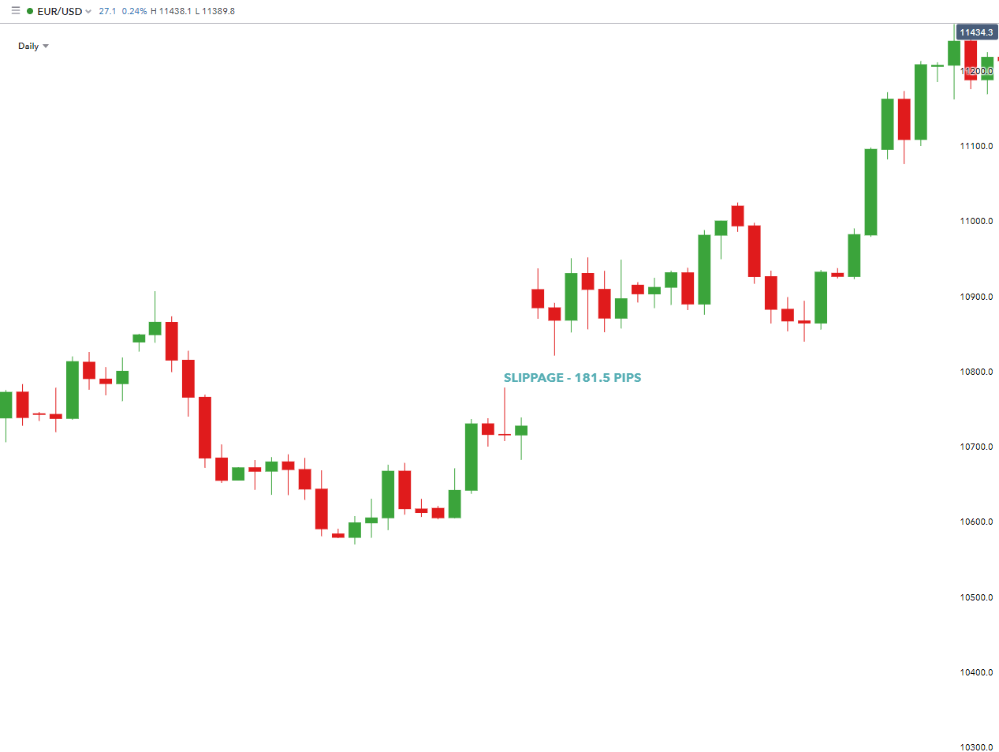

Price slippage in algorithmic trading refers to the divergence between the expected price of a trade, and the actual price at which it is executed. This phenomenon arises when there are changes in the market conditions between the submission of a trade order and its execution. Slippage is particularly relevant in algo trading where trades are executed based on pre-programmed rules and strategies, as even minor discrepancies can significantly affect the performance of advanced trading algorithms.

Understanding slippage is crucial for traders operating within financial markets due to its direct impact on trading costs and profitability. Slippage can transform expected gains into losses or reduce the overall profit margin, influencing the effectiveness of a trading strategy. Thus, traders must equip themselves with knowledge about the causes of slippage, as well as techniques to measure and manage it, to safeguard their investments and optimize strategiic outcomes.



Several factors contribute to slippage, impacting both the execution price of trades and the overall market dynamics. Key factors include market volatility, which can cause rapid price changes; liquidity, with lower levels leading to larger price adjustments; and order size, as larger orders are more susceptible to price shifts during execution. Additionally, latency in the trading system can exacerbate slippage as delays in trade execution can result in significant market movements. Collectively, these factors can diminish the effectiveness of trading strategies, necessitating thorough analysis and adaptive strategies to mitigate slippage-induced losses.

## Table of Contents

## Understanding Algorithmic Trading

Algorithmic trading, often referred to as algo trading, is a method of executing orders using automated pre-programmed trading instructions to account for variables such as timing, price, and volume. Leveraging sophisticated mathematical models and algorithms, this approach allows traders to execute large orders at speeds and frequencies that would be impossible for a human trader.

At its core, algorithmic trading involves establishing a set of rules based on historical data, market conditions, and predefined criteria. An algorithm can be designed to search for arbitrage opportunities, manage portfolio risk, or market make. Upon identifying a favorable trading condition, these algorithms can autonomously execute buy or sell orders rapidly and efficiently.

One of the primary advantages of algorithmic trading is precision. It eliminates emotional decision-making, implementing trades at trigger levels with specified conditions. Furthermore, algo trading can help increase market liquidity and enhance market efficiency by facilitating quicker execution of trades.

However, [algorithmic trading](/wiki/algorithmic-trading) is not without its challenges, particularly regarding slippage. Slippage occurs when an order is executed at a worse price than expected, which can adversely affect trading outcomes. In high-frequency trading environments, even a few milliseconds' delay might lead to discrepancies in expected versus actual execution prices. This deviation, though often slight, can significantly impact profitability, especially for strategies that rely on small margins.

The importance of real-time data and execution speed in minimizing slippage cannot be overstated. Real-time data feeds provide up-to-the-moment market information that algorithms use to make informed decisions. The faster and more accurate this data is, the more likely an algorithm will execute a trade at the desired price. Execution speed, on the other hand, pertains to how swiftly a trading system can process this information and act upon it. Advanced technological infrastructure that can handle high-speed data transmission and processing is crucial for reducing delays and potential for slippage.

Thus, while algorithmic trading offers numerous benefits such as speed and efficiency, it also requires maintaining a robust system setup that includes quick data processing and execution responsiveness to mitigate challenges such as slippage.

## What is Slippage in Algorithmic Trading?

Slippage in algorithmic trading refers to the difference between the expected price of a trade and the actual price at which the trade is executed. This discrepancy primarily arises due to the rapid fluctuations in market prices during the time lag between the initiation of a trade and its execution. Slippage can affect both buying and selling transactions.

**Positive vs. Negative Slippage**

Slippage can be either positive or negative. Positive slippage occurs when the actual execution price is better than the expected price. For example, if a trader sets a buy order at $50, but the order is executed at $49.50, the trader experiences positive slippage, benefiting from a lower purchase price. Conversely, negative slippage happens when the execution price is worse than anticipated. Using the same example, if the order is executed at $50.50, the trader incurs a higher cost than expected, illustrating negative slippage.

**Impact on Trading Profitability and Strategy Adjustments**

Slippage can significantly impact trading profitability, especially for high-frequency and algorithmic traders, where even small deviations can accumulate into significant sums. Positive slippage can enhance profitability by achieving better prices, thereby increasing potential returns. Negative slippage, however, undermines profitability by eroding returns, as trades execute at less favorable prices than anticipated.

To mitigate slippage, traders must consider it in their strategy development and [backtesting](/wiki/backtesting) phases. Incorporating slippage estimates allows traders to simulate more realistic trading conditions, leading to more robust and performance-aligned strategies. For instance, if a backtested strategy does not account for slippage, its live performance might fall short of expectations, necessitating strategic adjustments. This could include modifying order types, such as opting for limit orders over market orders to control the execution price, or enhancing algorithmic execution methods to minimize latency and improve synchronization with market conditions.

Addressing slippage is crucial as it influences decision-making processes and the overall effectiveness of trading strategies. By understanding and adjusting for slippage, traders can optimize their strategies to better accommodate real market conditions, ultimately enhancing their trading outcomes.

## Types of Slippage

Price slippage in algorithmic trading refers to the discrepancy between the expected price of a trade and the actual price at which the trade is executed. Understanding the different types of slippage is essential for traders looking to optimize their trading strategies and improve profitability. The primary types of slippage include market impact slippage, execution slippage, and bid-ask spread slippage.

### Market Impact Slippage

Market impact slippage occurs when a trader's order affects the market price. This type of slippage is often significant in illiquid markets or when executing large orders. When a sizable buy order is placed, it can drive the price up as the order gets filled progressively at higher asking prices. Conversely, a large sell order can push the price down. For example, if a trader intends to buy 10,000 shares of a thinly traded stock, the buying action might cause the share price to rise before the entire order is filled, resulting in a higher average purchase price than initially anticipated.

### Execution Slippage

Execution slippage is the difference between the expected price at which a trade is supposed to be executed and the actual price at which the trade is executed. Various factors might contribute to execution slippage, including delays in order processing and fluctuations in market conditions. During periods of high [volatility](/wiki/volatility-trading-strategies), prices can change rapidly between the time an order is placed and the time it is executed. For instance, if a trader places a market order to buy a stock at $50, and by the time the order is filled, the price has risen to $50.10, the execution slippage is $0.10 per share.

### Bid-Ask Spread Slippage

Bid-ask spread slippage relates to the difference between the bid (buy) and ask (sell) prices in the market. This kind of slippage arises from the intrinsic structure of trading markets, where market makers provide [liquidity](/wiki/liquidity-risk-premium) by quoting slightly different prices for buying and selling an asset. The bid-ask spread can widen during periods of low liquidity or high volatility, increasing the cost of executing trades. For example, if the bid price for a stock is $49.95 and the ask price is $50.05, a market order to buy will be filled at the ask price, resulting in a slippage of $0.10 when compared to the bid price.

Understanding these types of slippage allows traders to anticipate potential price discrepancies and adjust their trading strategies accordingly. By accounting for market impact, execution delays, and bid-ask spreads, traders can develop more effective risk management techniques and optimize their algorithmic trading strategies.

## Causes of Slippage

Slippage in algorithmic trading is influenced by several factors, including market volatility, liquidity, order size, and latency. Each of these elements can lead to discrepancies between the expected and executed prices, potentially impacting the profitability of trading strategies.

**Market Volatility**

Market volatility refers to the degree of variation in trading prices over a certain period. High volatility often results in rapid price changes, which can make it challenging to execute trades at the desired price. For instance, during a significant economic announcement, such as a change in interest rates by a major central bank, markets may experience abrupt price shifts. An algorithm designed to buy a stock at $50 may end up executing at $51 due to a swift spike in market prices, resulting in slippage.

**Liquidity**

Liquidity is the measure of how quickly and easily an asset can be bought or sold in the market without affecting its price. Lower liquidity means fewer available shares or contracts at each price level, which can exacerbate slippage. For example, attempting to sell a large block of a thinly traded stock at a specific price may not be feasible if there are not enough buyers willing to purchase at that price, causing the execution to occur at a lower price than intended.

**Order Size**

The size of the order relative to the average market [volume](/wiki/volume-trading-strategy) can significantly impact slippage. Large orders tend to influence the market price, especially if the asset has low liquidity. Suppose a trader places a sell order for 10,000 shares of a stock, but the market depth shows only 1,000 shares available at the current bid price. The order may partially execute at the desired price, while the remaining shares execute at progressively lower prices, causing slippage.

**Latency**

Latency refers to the time delay between when an order is placed and when it is executed. This delay can result from slow internet connections, inefficient algorithms, or delays in communication between trading platforms and exchanges. High-frequency traders, who rely on millisecond-level execution speeds, are particularly susceptible to slippage due to latency. For example, during peak trading hours, network congestion might delay transmission, causing an order meant to capitalize on minor price differences to execute too late when the opportunity has passed.

In summary, slippage is an inevitable aspect of trading that can be influenced by volatile markets, low liquidity, large orders, and latency. To mitigate these factors, traders can employ various strategies, such as using limit orders, trading in more liquid markets, optimizing the size and timing of orders, and investing in faster execution technology. Understanding and anticipating these causes are crucial for refining algorithmic trading strategies to achieve better outcomes.

## The Impact of Slippage on Algorithmic Trading Strategies

Slippage significantly affects the performance and outcomes of algorithmic trading strategies, influencing both negatively and positively depending on market conditions and strategy implementation. Negative slippage occurs when the executed price is less favorable than expected, reducing profitability. For instance, in a rapidly moving market, the intended buy order for a stock at $100 may instead execute at $101 due to execution delays or price movements, thereby increasing costs and reducing profit margins.

Conversely, positive slippage occurs when trades execute at a more favorable price than expected, enhancing profitability. This might happen during periods of market correction, where a sell order intended at $102 is executed at $103 as the asset price unexpectedly rises. While positive slippage offers a fortuitous profit boost, it is less predictable and not consistently achievable.

The importance of incorporating slippage estimates into backtesting cannot be overstated. Backtesting is a method of evaluating trading strategies using historical data to simulate potential performance. However, backtests that neglect slippage present an incomplete and often overly optimistic picture of strategy success. By simulating slippage in backtesting, traders can create more realistic models of strategy performance. Incorporating slippage estimates involves adjusting historical prices to account for typical slippage values observed under similar market conditions. A simplistic mathematical approach to model slippage in backtesting could be expressed as:

$$
\text{Adjusted Price} = \text{Historical Price} \pm \text{Slippage Value}
$$

Traders often use available historical tick-by-tick data to refine these estimates, creating robust strategies that account for realistic market conditions.

In practical terms, failing to account for slippage can lead to substantial discrepancies between simulated and actual trading results. For instance, if a strategy shows a historical annual return of 10% without considering slippage, incorporating average slippage might reveal a more modest return of 8%. This gap underscores the necessity of integrating slippage impacts into early trading strategy assessments, enabling traders to deploy more resilient strategies under real market pressures.

Ultimately, understanding and mitigating slippage is crucial for maintaining the integrity of algorithmic trading strategies. By incorporating comprehensive slippage models into backtesting and real-time execution, traders can better anticipate actual trading outcomes, adjust strategies appropriately, and optimize overall trading performance.

## Strategies to Minimize Slippage

To effectively mitigate slippage in algorithmic trading, traders can adopt several strategic techniques that focus on precise order types, market analysis, and enhanced execution capabilities. One of the most effective methods to reduce slippage is the use of limit orders. Unlike market orders that may execute at unfavorable prices during periods of high volatility or low liquidity, limit orders specify the maximum or minimum price at which a trader is willing to buy or sell. By setting these boundaries, traders can control the execution price more effectively, thereby reducing slippage risk.

Conducting comprehensive market analysis is another pivotal strategy. By understanding the market's behavior, including its volatility patterns and liquidity levels, traders can better time their trades to coincide with optimal market conditions. This involves using technical indicators and historical data to predict periods of low slippage risk. Enhanced data analytics can improve decision-making, allowing traders to anticipate price movements and adjust their strategies accordingly.

Improving execution speed is crucial, as delays in order processing can exacerbate slippage. Execution latency can be reduced through co-location services, where trading systems are physically proximate to exchange servers, minimizing the transmission time. Additionally, optimizing algorithmic trading systems for speed, such as using high-frequency trading algorithms, can ensure that trades are executed promptly.

Risk management techniques also play a role in controlling slippage. Implementing stop-loss orders can limit potential losses by automatically executing when a price reaches a predefined level. This protects traders from adverse market movements that may lead to significant slippage. Position sizing is another key risk management strategy, where traders determine the amount to invest in a particular trade based on their risk tolerance and the expected slippage. By adjusting position sizes, traders can control their exposure to slippage and manage potential losses more effectively.

Real-world examples illustrate these strategies in action. A notable case involves a [hedge fund](/wiki/hedge-fund-trading-strategies) employing high-frequency trading techniques to execute trades within microseconds, thus minimizing slippage significantly. By using sophisticated algorithms and co-located servers, the fund reduced execution delays, ensuring that trades occurred at or near the intended prices.

In summary, mitigating slippage requires a combination of strategic order types, thorough market analysis, swift execution, and robust risk management practices. Each of these components plays a critical role in reducing the adverse effects of slippage on trading outcomes, ultimately preserving and enhancing profitability.

## Slippage Analysis and Evaluation

Slippage analysis is a crucial component in evaluating the effectiveness of trading strategies and understanding their real-world implications. It involves a systematic approach to assessing how slippage affects trading outcomes and provides insights into optimizing trading performance.

Performing slippage analysis begins with quantifying the difference between the expected price and the actual executed price of trades. This difference can significantly impact the profitability of a trading strategy. To accurately measure slippage, traders must collect and analyze detailed historical trading data, which serves as the foundation for identifying patterns and understanding slippage behavior.

Tools and methodologies for evaluating slippage include statistical analysis software and custom algorithms that parse historical data to compute average slippage. These tools help traders visualize slippage distribution across various market conditions and timeframes. Advanced data analytics platforms and trading algorithms can be employed to model slippage under different scenarios, allowing traders to simulate the impact of varying levels of volatility, liquidity, and order sizes on execution prices.

One widely used methodology is the estimation of slippage by comparing the weighted average executed price with the midpoint of the bid-ask spread at the time of order entry. This comparison provides a baseline measurement of slippage and allows for adjustments to trading strategies according to observed inefficiencies.

An essential aspect of slippage analysis is incorporating historical data to detect trends and refine trading strategies. Historical data provides a comprehensive view of past market behaviors, enabling traders to identify conditions that typically lead to higher slippage. By using this data, traders can adjust their strategies, either by optimizing order types, altering execution times, or enhancing algorithmic parameters to mitigate adverse effects.

For instance, a Python code snippet to calculate slippage might look like the following:

```python
def calculate_slippage(expected_price, executed_price):
    return (executed_price - expected_price) / expected_price * 100

# Example usage
expected_price = 100
executed_price = 101
slippage_percent = calculate_slippage(expected_price, executed_price)
print(f"Slippage: {slippage_percent:.2f}%")
```

Furthermore, backtesting tools integrated with slippage modeling allow traders to simulate trades over historical data, incorporating slippage estimates to evaluate how strategies would have performed in past market conditions. This backtesting process helps in both validating the robustness of strategies and highlighting necessary adjustments to accommodate slippage.

Ultimately, continuous slippage analysis is vital to strategy refinement. By regularly assessing slippage impacts through data analysis and modeling, traders can adapt their strategies to minimize costs associated with slippage and improve overall trading effectiveness. Emphasizing the role of historical data in this analysis ensures that traders can anticipate slippage effects and devise methods to enhance profitability in real-time trading environments.

## Conclusion

Understanding and managing slippage is paramount in algorithmic trading to ensure the reliability and profitability of trading strategies. Slippage, defined as the difference between the expected and the actual execution price of a trade, can significantly impact the performance of an algorithmic trading system. Notably, unchecked slippage can erode potential profits or exacerbate losses, thereby affecting overall trading outcomes.

Several strategies can be employed to mitigate slippage. One of the primary methods is the use of limit orders, which allow traders to set a maximum acceptable price to buy or a minimum price to sell. This approach helps to ensure that trades are executed within a predetermined price range, thereby protecting against adverse price movements. Additionally, conducting thorough market analysis and enhancing execution speed can aid in reducing the likelihood of slippage. This is especially critical in fast-moving markets where prices can change rapidly.

Risk management techniques are also crucial in controlling slippage. Implementing stop-loss orders can limit potential losses, while prudent position sizing ensures that individual trades do not disproportionately affect the overall portfolio. These measures not only protect against unexpected slippage but also contribute to a robust risk management framework.

Moreover, traders are encouraged to continuously refine their trading methods to better account for slippage. This involves regularly performing slippage analysis and leveraging historical data to enhance strategy resilience. By analyzing past trades and adjusting algorithms to accommodate observed slippage patterns, traders can develop more accurate and effective trading models. The iterative refinement of trading strategies ensures that algorithms remain adaptive to changing market conditions, optimizing for maximum profitability.

In conclusion, effective management of slippage is integral to successful algorithmic trading. By implementing strategic measures and maintaining an adaptive approach, traders can mitigate the effects of slippage and enhance their trading outcomes. Continuous examination and refinement of strategies are essential, underscoring the dynamic nature of financial markets and the need for traders to remain vigilant and proactive.

## References & Further Reading

[1]: ["Quantitative Trading: How to Build Your Own Algorithmic Trading Business"](https://www.amazon.com/Quantitative-Trading-Build-Algorithmic-Business/dp/1119800064) by Ernest P. Chan

[2]: Aldridge, I. (2013). ["High-Frequency Trading: A Practical Guide to Algorithmic Strategies and Trading Systems."](https://www.wiley.com/en-us/High+Frequency+Trading%3A+A+Practical+Guide+to+Algorithmic+Strategies+and+Trading+Systems%2C+2nd+Edition-p-9781118343500) Wiley Finance Series.

[3]: Kissell, R. (2013). ["The Science of Algorithmic Trading and Portfolio Management"](https://www.sciencedirect.com/book/9780124016897/the-science-of-algorithmic-trading-and-portfolio-management) Academic Press.

[4]: ["Advances in Financial Machine Learning"](https://www.amazon.com/Advances-Financial-Machine-Learning-Marcos/dp/1119482089) by Marcos Lopez de Prado

[5]: Cartea, Á., Jaimungal, S., & Penalva, J. (2015). ["Algorithmic and High-Frequency Trading."](https://assets.cambridge.org/97811070/91146/frontmatter/9781107091146_frontmatter.pdf) Cambridge University Press.