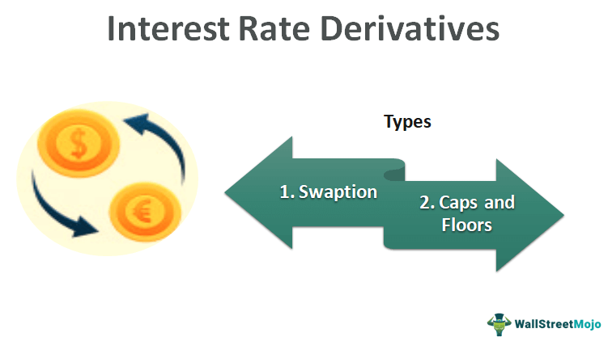

In recent years, financial markets have experienced significant transformation, primarily driven by technological advancements and the diversification of financial instruments. Among these instruments, derivatives have emerged as crucial tools in modern trading, with price swap derivatives playing a particularly influential role. These derivatives are essential for managing and stabilizing asset values, offering mechanisms to mitigate risk and capitalize on fluctuating financial conditions.

Algorithmic trading, an innovation powered by sophisticated computer algorithms, has become integral to the effective use of derivatives in financial markets. By enabling rapid and precise execution of trades based on specific criteria, algorithmic trading optimizes the processes involved in managing complex financial instruments. This capability is particularly relevant for derivatives, where swift adaptations to market conditions can lead to substantial financial gains or avert potential losses.



The interplay between derivatives and algorithmic trading offers several benefits, including improved trading efficiency, better risk management practices, and the ability to successfully navigate market volatility. For traders and investors aiming to harness a competitive edge, understanding how modern technologies enhance these aspects is vital. By leveraging tools like algorithmic trading, they can maximize the potential of derivatives, ensuring strategic advantage in an ever-evolving financial landscape.

## Table of Contents

## What Are Financial Instruments?

Financial instruments are integral to modern financial markets, acting as conduits for the transfer and management of capital. At their core, financial instruments are contractual agreements that possess a certain monetary value and are traded between parties. These instruments accommodate a wide array of economic activities, supporting investment, hedging against risks, and facilitating speculative ventures.

There are several primary categories of financial instruments, each serving distinct roles within the financial system:

1. **Stocks**: Representing ownership in a company, stocks or equities are financial instruments that grant shareholders a proportionate claim on a corporation's assets and earnings. Investors purchase stocks with the expectation of capital appreciation and dividends, constituting a foundational element of investment portfolios.

2. **Bonds**: As fixed-income securities, bonds are essentially loans made by investors to borrowers, which could be corporations or governments. Bondholders are entitled to receive regular interest payments over a specified term, along with the return of the bond's principal amount upon maturity. This dual benefit of income generation and lower risk profiles makes bonds a popular choice for conservative investors.

3. **Derivatives**: These are complex financial instruments whose values are derived from underlying assets such as stocks, bonds, commodities, or market indices. Types of derivatives include options, futures, and swaps, each serving specialized financial functions such as risk management and speculative investment. Derivatives enable parties to hedge against price fluctuations, manage exposure to risks, or speculate on future price movements without necessarily owning the underlying assets.

4. **Cryptocurrencies**: Emerging digital financial instruments, cryptocurrencies are decentralized and rely on blockchain technology to secure and verify transactions. They offer an alternative to traditional fiat currencies and are increasingly used for transactions, investment, and as a hedge against inflation. Cryptocurrencies, like Bitcoin and Ethereum, have gained traction among investors seeking high-return opportunities, albeit with significant volatility.

Each type of financial instrument can be utilized strategically to meet various financial objectives. For instance, investors use stocks and bonds for long-term wealth accumulation, while derivatives are often employed for tactical maneuvers like hedging against price [volatility](/wiki/volatility-trading-strategies) or leveraging market positions. The advent of cryptocurrencies has introduced new dimensions to financial strategy, offering both opportunities for high returns and challenges associated with regulatory and market risks.

In summary, financial instruments form the backbone of financial transactions globally, providing essential mechanisms for capital allocation, risk management, and market operations. They offer diverse opportunities across different economic and financial dimensions, catering to the wide-ranging objectives of market participants.

## Understanding Price Swap Derivatives

Price swap derivatives are financial instruments designed to manage fluctuations in asset values by entering into agreements with counterparties. These instruments function by establishing a contractual agreement where one party commits to maintaining the asset's value over a specified period. To achieve this, the party might deliver securities or cash to compensate for any decrease in asset value. 

The fundamental principle behind price swap derivatives lies in their ability to offer stability amidst volatile market conditions. For instance, consider an entity that holds an asset prone to significant value changes. By engaging in a price swap, this entity can lock in a value with a counterparty, effectively ensuring that any potential loss is counterbalanced by the terms of the swap agreement. This mechanism serves to hedge against adverse financial movements, thus stabilizing the entity's balance sheet.

Price swap derivatives are considered rare due to their specific use case and the requirement for parties to accurately predict and manage future market conditions. Despite this rarity, their impact on financial stability and transparency is noteworthy. Given the ability to mitigate risks associated with asset depreciation, these instruments are crucial for institutions aiming to maintain financial health in unpredictable markets.

This stabilization feature is vital in sectors where asset values are highly susceptible to abrupt changes, such as in commodities or currencies. Moreover, the transparency inherent in swap agreements can contribute positively to financial ecosystems by fostering clearer accounting practices and reducing information asymmetries among market participants.

In summary, price swap derivatives offer a sophisticated tool for managing financial exposures. By ensuring a fixed asset value in dynamic markets, they not only enhance stability but also promote greater transparency within financial transactions.

## Algorithmic Trading: An Overview

Algorithmic trading, commonly referred to as 'algo trading,' relies on sophisticated computer programs to automate the execution of trades. Programmatically defined criteria drive these transactions, allowing algorithms to act upon specified market conditions or execution strategies without the need for human intervention. This method offers a substantial increase in both the speed and accuracy of trading operations, significantly outpacing traditional manual trading methods.

In practice, [algorithmic trading](/wiki/algorithmic-trading) enhances operational efficiency by reducing the susceptibility to human error and capitalize on fleeting market inefficiencies. Given that financial markets operate at a high velocity and complexity, the rapid execution of trades via algorithms is a key advantage. Furthermore, these systems can operate continuously, monitoring multiple markets and instruments simultaneously, ensuring that opportunities are seized promptly as they arise.

Crucially, algo trading plays a significant role in managing complex financial instruments such as derivatives. The strategic flexibility provided by algorithmic systems allows for dynamic adjustments in trading tactics, which is indispensable in navigating volatile and unpredictable market conditions. By employing sophisticated algorithms, traders can effectively implement diverse strategies such as statistical [arbitrage](/wiki/arbitrage), [market making](/wiki/market-making), [trend following](/wiki/trend-following), and mean reversion.

Algorithmic trading systems typically rely on advanced quantitative models to evaluate vast datasets, predicting price movements and determining optimal execution paths. They employ mathematical models and statistical analysis to process historical and real-time market data. A typical approach involves using technical indicators and historical patterns to forecast market trends and price fluctuations, thereby optimizing trading decisions.

In terms of market adaptability, algo trading systems can be fine-tuned to accommodate changes in market conditions. Algorithms can adapt by incorporating [machine learning](/wiki/machine-learning) models that refine themselves through experience with new data. For example, [reinforcement learning](/wiki/reinforcement-learning) algorithms help in improving decision-making over time based on continuous feedback from market conditions.

Overall, algorithmic trading has become a cornerstone of modern financial markets, drastically enhancing the capability of traders to handle complexities associated with various financial instruments. It promotes a more robust trading ecosystem, where strategic decisions are made based on comprehensive analysis and automated precision.

## Integration of Derivatives in Algo Trading

Incorporating derivatives, particularly swaps, into algorithmic trading systems enhances the ability to execute sophisticated risk management and trading strategies. The utilization of algorithms is key in analyzing vast amounts of market data to predict price movements accurately. These algorithms apply advanced derivative pricing models, such as the Black-Scholes model for options or Monte Carlo simulations for complex derivatives, to optimize trade decisions.

Python, a leading language in algorithmic trading due to its robust libraries, can be utilized for this integration. Libraries such as NumPy and pandas assist in data analysis, while libraries like QuantLib provide tools for implementing derivative pricing models. Here is a simple example of how Python might be used to simulate price movement predictions:

```python
import numpy as np
import pandas as pd

# Simulate stochastic price movements 
def generate_price_series(S0, mu, sigma, num_steps):
    dt = 1/252  # Daily returns
    price_series = [S0]
    for _ in range(num_steps):
        price = price_series[-1] * np.exp((mu - 0.5 * sigma ** 2) * dt + sigma * np.sqrt(dt) * np.random.normal())
        price_series.append(price)
    return pd.Series(price_series)

# Initial conditions
initial_price = 100
expected_return = 0.05
volatility = 0.2
trading_days = 252  # One year

price_series_simulation = generate_price_series(initial_price, expected_return, volatility, trading_days)
```

High-frequency trading particularly benefits from derivatives integration. By utilizing swaps, traders can quickly enter and [exit](/wiki/exit-strategy) positions to exploit price discrepancies, a practice known as arbitrage. This process is facilitated through the rapid execution capabilities of algorithmic systems, which can assess and react to market conditions faster than manual trading methods.

Swaps offer a mechanism to hedge against [interest rate](/wiki/interest-rate-trading-strategies) fluctuations or currency exchange risks by locking in exchange rates or interest rates. This practice allows traders to manage leverage effectively, as swaps provide the opportunity to take significant positions with relatively small capital outlay, enhancing potential returns while mitigating exposure to unwanted risk elements.

Overall, the integration of derivatives, such as swaps, into algorithmic trading frameworks maximizes leverage, reduces risk, and amplifies profitability. Successful implementation relies on an intricate balance of mathematical models, technological infrastructure, and strategic foresight, each contributing to a trader's ability to navigate increasingly complex financial markets.

## Case Study: Financial Swaps and Algo Trading

Financial swaps have emerged as indispensable tools for managing risk, especially in environments with fluctuating interest rates. These instruments play a crucial role in aligning financial strategies with market conditions, allowing entities to adjust their exposure, hedge against adverse movements, and pursue speculative opportunities with greater precision. The integration of algorithmic trading with financial swaps enhances these functionalities, thereby advancing both [liquidity](/wiki/liquidity-risk-premium) and price discovery in modern trading platforms.

Algorithmic trading, characterized by the use of computer programs executing trades based on predefined criteria, provides the speed and efficiency necessary for optimizing swap transactions. This is particularly beneficial in variable interest rate conditions, where swaps can be employed to switch from fixed to floating rates or vice versa, depending on market forecasts. For instance, if interest rates are expected to rise, a company might enter into a swap to exchange its fixed-rate liabilities for floating-rate ones, mitigating the impact of increasing costs.

Implementing swaps through algorithmic trading systems enables traders to react swiftly to market shifts. Algorithms can refine the timing and execution of trades, leveraging real-time data analysis to identify profitable swap opportunities and mitigate risks effectively. The process typically involves modeling complex scenarios where parameters such as interest rate trends, credit risk, and counterparty reliability are quantitatively assessed.

Here's a simple Python snippet illustrating interest rate swap evaluation:

```python
def calculate_swap_value(notional, fixed_rate, floating_rate):
    # Assuming floating rate is derived from a market index like LIBOR
    fixed_leg = notional * fixed_rate
    floating_leg = notional * floating_rate
    return floating_leg - fixed_leg

# Example values
notional_amount = 1000000  # 1 million
fixed_rate = 0.03  # 3%
floating_rate = 0.02  # 2% based on an index

swap_value = calculate_swap_value(notional_amount, fixed_rate, floating_rate)
print(f"The net swap value is: ${swap_value:.2f}")
```

In this example, if the floating rate results in a higher value than the fixed rate, the swap would result in a net gain for the swapping entity, enhancing liquidity positions and providing an opportunity for favorable arbitrage.

Moreover, incorporating swaps in algorithmic trading serves to improve liquidity and facilitate better price discovery. By enabling simultaneous execution of complex, high-frequency transactions, swaps help maintain market stability and ensure that prices reflect true supply and demand dynamics. This feature becomes critical during volatile periods when traditional trading methods might falter due to slower execution rates and human biases.

In conclusion, the strategic use of financial swaps within algorithmic trading frameworks allows traders to navigate uncertainty with agility and informed decision-making. This not only maximizes profit potential but also safeguards the interests of participating entities in an ever-evolving financial landscape.

## Challenges and Risks

Derivatives, including price swap derivatives, play a crucial role in financial markets by offering opportunities for hedging, speculation, and optimizing trading strategies. However, these instruments come with inherent risks that traders and financial institutions must navigate carefully.

One of the primary risks associated with derivatives is market volatility. Price movements can be rapid and unpredictable, leading to substantial gains or losses. For instance, options and futures markets can experience rapid shifts due to changing economic indicators, geopolitical events, or sudden market sentiment changes. These fluctuations can be exacerbated when utilizing derivatives with high leverage. Leverage, while amplifying potential returns, also magnifies potential losses. A seemingly small adverse move in the market can result in significant financial setbacks, particularly if risk management strategies are inadequate.

Counterparty risk is another significant concern in derivative trading. Many derivatives are not standardized and are traded over-the-counter (OTC), meaning they depend on the financial health and integrity of the counterparties involved. If a counterparty defaults on their obligations, it can lead to cascading losses across interconnected financial institutions. This risk was notably highlighted during the 2008 financial crisis when the collapse of major financial institutions exposed the vulnerabilities of counterparties unable to fulfill their derivative contracts.

Algorithmic trading, which is heavily utilized in derivatives markets, introduces its own set of risks. While algorithms can process vast amounts of data and execute trades at high speeds, they are susceptible to technological failures. System bugs, software glitches, or hardware malfunctions can lead to incorrect trade executions, potentially resulting in significant losses. Moreover, high-frequency trading algorithms can inadvertently contribute to market volatility, as seen in events like the 2010 Flash Crash.

To mitigate these risks, robust risk management frameworks are essential. This includes implementing stringent position limits, maintaining adequate liquid reserves, and employing real-time monitoring systems to detect and correct irregularities promptly. Additionally, diversification strategies can help reduce exposure to any single asset class or market event.

Algorithm developers must prioritize rigorous testing and continuous monitoring of their systems. Emphasizing fault tolerance and implementing fail-safe mechanisms can protect against unexpected system failures. Furthermore, regulatory compliance and adherence to best practices in algorithmic risk management are critical to safeguarding the integrity and stability of trading systems.

In summary, while derivatives offer substantial opportunities for enhancing trading strategies and managing risks, they also require careful consideration and management of potential challenges. By recognizing and addressing these risks, market participants can make more informed decisions and maintain resilience in the face of market dynamics.

## Future Trends in Derivative Trading

Technological advancements continue to shape the landscape of derivative trading, particularly through the integration of [artificial intelligence](/wiki/ai-artificial-intelligence) (AI) and machine learning. These tools are enhancing algorithmic trading models by improving the accuracy and predictive capabilities of trading algorithms. Machine learning, for instance, is employed to analyze vast amounts of historical and real-time market data, identifying patterns that may not be immediately apparent to human traders. This capability allows algorithms to make more informed predictions about future market movements, thereby optimizing trading strategies.

AI-driven models are particularly effective at tailoring trading strategies based on evolving market conditions. For example, reinforcement learning—a type of machine learning—can be used to develop trading algorithms that adaptively learn the best trading strategies over time by interacting with the market environment. This adaptability is crucial in derivative trading, where market dynamics are often complex and fast-changing.

Furthermore, the integration of [alternative data](/wiki/best-alternative-data) sources, such as social media sentiment, weather patterns, or logistical data, is increasingly influencing derivative trading frameworks. By incorporating these diverse data sets, traders can gain a more holistic view of market conditions, potentially uncovering influential factors that traditional financial metrics might overlook. For instance, natural language processing (NLP) techniques can analyze sentiment data to interpret investor mood, which has been shown to impact market behavior.

Ethical considerations are also becoming more prominent in derivative trading strategies. Traders and financial institutions are now more cognizant of the ethical implications of automated trading systems, focusing on ensuring fairness, transparency, and accountability. Algorithmic biases, which may arise from unrepresentative training data or flawed algorithms, pose significant risks and are under scrutiny from both regulators and market participants. Developers are increasingly required to design algorithms that account for such biases, making ethical algorithms a critical area of future development.

In addition to these technological and ethical dimensions, advancements in computational power continue to facilitate the execution of complex algorithmic strategies. Quantum computing, albeit in its nascent stages, promises to further enhance computational capabilities, potentially revolutionizing the speed and complexity of derivative trading algorithms. The ability to perform complex computations at unprecedented speeds could enable traders to execute highly sophisticated strategies in fractions of a second, capitalizing on fleeting market opportunities.

These trends highlight the necessity for traders and financial institutions to remain agile and well-informed. As technology continues to evolve, so will the frameworks and strategies employed in derivative trading. Embracing ongoing education and development will empower market participants to effectively navigate and harness the transformative changes within this dynamic sector.

## Conclusion

The interplay between financial instruments, particularly price swap derivatives, and algorithmic trading is significantly reshaping modern financial markets. This transformation is primarily driven by the capability of algorithmic trading to optimize the use of complex financial instruments, enabling traders and investors to enhance their operational efficiencies. By understanding and mastering these tools, market participants can efficiently manage risks and capitalize on strategic financial opportunities.

Price swaps, as a type of derivative, provide vital functions in terms of financial stability and risk management. They allow parties to exchange cash flows or liabilities, often to hedge against potential adverse price movements in financial markets. When integrated with algorithmic trading systems, these instruments can be deployed to automatically adjust positions in response to market fluctuations, mitigating risks associated with volatile price changes.

Algorithmic trading systems, leveraging sophisticated algorithms, analyze vast datasets to make informed trading decisions. This capability is especially pertinent when dealing with derivatives like swaps, where pricing complexities require robust computational frameworks to maximize returns and minimize risks. These algorithms can execute trades with precision and speed, far exceeding human capabilities, thereby gaining an edge in competitive trading environments.

The continuous advancement in technology, particularly in AI and machine learning, promises to further enhance these algorithmic systems. By incorporating alternative data sources, these technologies can improve predictive accuracy and trading outcomes. This technological evolution suggests a future where the boundaries of traditional trading are expanded and redefined.

For traders and investors, staying informed and adaptable to such technological progress is crucial. In an ever-changing financial landscape, maintaining a comprehensive understanding of how derivative instruments interact within automated trading frameworks will be a key determinant of success. As these dynamics continue to evolve, so too must the strategies of those participating in the markets, ensuring they can navigate and capitalize on new opportunities that arise within this complex ecosystem.

## References & Further Reading

[1]: Hull, J. C. (2018). ["Options, Futures, and Other Derivatives"](https://www.semanticscholar.org/paper/Options%2C-Futures%2C-and-Other-Derivatives-Hull/89bdee500c8623864fc9eb7a471546aa713acc44) (10th ed.). Pearson.

[2]: Lopez de Prado, M. (2018). ["Advances in Financial Machine Learning"](https://www.amazon.com/Advances-Financial-Machine-Learning-Marcos/dp/1119482089). Wiley.

[3]: Chan, E. (2009). ["Quantitative Trading: How to Build Your Own Algorithmic Trading Business"](https://github.com/ftvision/quant_trading_echan_book). Wiley.

[4]: Aronson, D. R. (2007). ["Evidence-Based Technical Analysis: Applying the Scientific Method and Statistical Inference to Trading Signals"](https://onlinelibrary.wiley.com/doi/book/10.1002/9781118268315). Wiley.

[5]: Jansen, S. (2020). ["Machine Learning for Algorithmic Trading"](https://github.com/stefan-jansen/machine-learning-for-trading). Packt Publishing.

[6]: Murphy, A. B. (1999). ["Technical Analysis of the Financial Markets: A Comprehensive Guide to Trading Methods and Applications"](https://archive.org/details/technicalanalysi0000murp). New York Institute of Finance.

[7]: Merton, R. C. (1973). ["Theory of Rational Option Pricing."](https://www.jstor.org/stable/3003143) The Bell Journal of Economics and Management Science, 4(1), 141-183.

[8]: Shreve, S. E. (2004). ["Stochastic Calculus for Finance II: Continuous-Time Models"](https://link.springer.com/book/9780387401010). Springer.