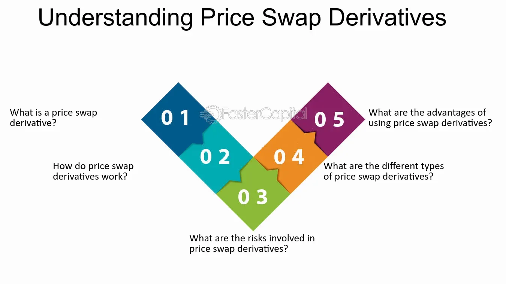

## Table of Contents

## What is a price swap derivative?

A price swap derivative is a financial contract between two parties where they agree to exchange cash flows based on different price indices or rates. Imagine you and a friend agree to swap the money you get from different sources. One of you might get money based on the price of oil, while the other gets money based on the price of gold. You both agree to swap these payments at certain times. This can help both of you manage risks or take advantage of price movements in different markets.

These swaps are often used by companies and investors to hedge against price changes. For example, an airline might use a price swap to protect against rising fuel costs. By entering into a swap, the airline can agree to pay a fixed rate for fuel, while receiving payments based on the actual market price of fuel. This way, if fuel prices go up, the airline is protected because it gets more money from the swap to cover the higher costs. Price swaps can be complex, but they are a useful tool for managing financial risks.

## How does a price swap derivative work?

A price swap derivative is like a deal between two people where they agree to swap money based on different things. Imagine one person gets money from the price of oil, and the other gets money from the price of gold. They decide to swap these payments at certain times. This helps them manage risks or take advantage of price changes in different markets. For example, if oil prices go up, the person who gets money from oil will pay more to the other person, but they will receive more money from the gold price in return.

Companies and investors often use price swaps to protect themselves from price changes. Let's say an airline wants to avoid paying more if fuel prices go up. They can enter into a price swap where they agree to pay a fixed amount for fuel, and in return, they get payments based on the actual market price of fuel. If fuel prices rise, the airline gets more money from the swap to cover the higher costs. This way, they can plan their budget better and not worry about sudden price jumps. Price swaps can be tricky, but they help manage financial risks.

## What are the main types of price swap derivatives?

Price swap derivatives come in different forms, but the main types are commodity swaps and interest rate swaps. A commodity swap is when two people agree to swap payments based on the price of a commodity, like oil or wheat. One person might pay a fixed price for the commodity, while the other pays based on the market price. This helps them manage the risk of price changes in commodities. For example, a farmer might use a commodity swap to lock in a price for their crops, so they know how much money they will get even if the market price goes down.

Another common type is an interest rate swap. This is when two people agree to swap payments based on different interest rates. One person might pay a fixed interest rate, while the other pays a floating rate that changes with the market. This can help them manage the risk of interest rate changes. For example, a company with a loan that has a floating interest rate might use an interest rate swap to switch to a fixed rate, so they know exactly how much they will pay each month, even if interest rates go up.

## What are the benefits of using price swap derivatives?

Price swap derivatives help people and businesses manage risks. If you're worried about prices going up or down, a price swap can help you stay safe. For example, if you're a farmer and you want to make sure you get a good price for your crops, you can use a commodity swap to lock in a price. This way, even if the market price drops, you know how much money you'll get. It's like having an insurance policy for your prices.

Another big benefit is that price swaps can help you take advantage of price changes. If you think the price of something will go up, you can use a swap to make money from that change. For example, if you think oil prices will rise, you can enter into a swap where you pay a fixed price and receive payments based on the market price. If oil prices do go up, you'll make more money from the swap than you pay. This way, you can profit from your predictions about the market.

## What are the risks associated with price swap derivatives?

Using price swap derivatives can be risky because the market can be unpredictable. If you enter into a swap and the price moves in the opposite direction of what you expected, you could lose money. For example, if you agree to pay a fixed price for oil and the market price goes down, you'll still have to pay the higher fixed price, which means you lose money. This can be a big problem if you're not prepared for it.

Another risk is that the other person in the swap might not be able to pay what they owe. If they run into financial trouble, you might not get the money you were expecting. This is called counterparty risk, and it can be a big deal, especially if you're relying on the swap to manage your own financial risks. It's important to know who you're dealing with and make sure they're reliable.

Finally, price swaps can be complicated and hard to understand. If you don't fully understand how they work, you could make a mistake that costs you money. It's a good idea to get advice from someone who knows about these things before you enter into a swap. That way, you can be sure you're making a smart decision and not taking on more risk than you can handle.

## How are price swap derivatives priced?

Pricing a price swap derivative involves figuring out what the payments will be worth in the future. Imagine you and a friend are swapping payments based on the price of oil and gold. To price this swap, you need to guess what the prices of oil and gold will be when you make the payments. You also need to think about how much money is worth now compared to later, which is called the present value. If you think oil prices will go up a lot, the swap might be worth more to you because you'll get more money from your friend.

Another important thing to consider is the risk that one of you might not be able to pay. This is called counterparty risk. If your friend might not be able to pay you, you'll want to be paid more to take that risk. Also, the cost of the swap can change based on how easy it is to buy or sell it in the market, which is called liquidity. If it's hard to find someone else to take over the swap, it might be worth less. All these things together help decide the price of a price swap derivative.

## What is the role of counterparties in a price swap derivative?

In a price swap derivative, the counterparties are the two people or companies who agree to swap payments. One person might pay based on a fixed price, while the other pays based on a changing market price. They both agree on the terms of the swap, like how much they will pay and when they will make the payments. The role of the counterparties is to make sure they follow the agreement and make the payments on time. This helps both of them manage their risks or take advantage of price changes in the market.

However, there is a risk that one of the counterparties might not be able to pay what they owe. This is called counterparty risk. If one person can't pay, the other person could lose money. To reduce this risk, counterparties often check each other's financial health before entering into a swap. They might also use a third party, like a bank, to help make sure the payments are made safely. This way, both counterparties can feel more secure about the swap.

## How do regulatory requirements affect price swap derivatives?

Regulatory requirements can have a big impact on price swap derivatives. Governments and financial authorities set rules to make sure that these financial deals are safe and fair. For example, they might require companies to report their swaps to a central place, so everyone can see what's happening in the market. This helps prevent big problems, like a financial crisis. Also, regulators might ask companies to keep some money aside, just in case they can't pay what they owe. This is called margin requirements, and it helps make sure that everyone can meet their obligations.

These rules can change how companies use price swap derivatives. Sometimes, the rules can make swaps more expensive or harder to do. Companies might have to spend more time and money to follow the rules, which could make them think twice before entering into a swap. On the other hand, the rules can also make the market safer and more reliable. When everyone follows the same rules, it's easier to trust that the swaps will work as expected. This can encourage more people to use swaps to manage their risks or take advantage of price changes.

## What are some common strategies for using price swap derivatives?

One common strategy for using price swap derivatives is to hedge against price changes. Imagine you're an airline and you're worried about fuel prices going up. You can use a commodity swap to lock in a fixed price for fuel. This way, even if the market price of fuel goes up, you'll still pay the same fixed price, and the swap will give you extra money to cover the difference. This helps you plan your budget better and avoid surprises. Another example is a company with a loan that has a floating interest rate. They can use an interest rate swap to switch to a fixed rate, so they know exactly how much they'll pay each month, even if interest rates go up.

Another strategy is to take advantage of price movements. If you think the price of something, like oil, will go up, you can enter into a swap where you pay a fixed price and receive payments based on the market price. If oil prices do go up, you'll make more money from the swap than you pay. This can be a good way to make money if you're good at predicting the market. However, it's risky because if the price goes down instead, you'll lose money. So, it's important to think carefully and maybe get advice before using this strategy.

## How do price swap derivatives compare to other financial derivatives?

Price swap derivatives are different from other financial derivatives like options and futures, but they all help people manage risk or make money from price changes. A price swap is like a deal where two people agree to swap money based on different prices, like the price of oil or interest rates. This is different from an option, which gives you the right to buy or sell something at a set price, but you don't have to do it. A future is a promise to buy or sell something at a set price in the future, and you have to do it. So, swaps are more about swapping payments, while options and futures are more about buying or selling things.

Another difference is how they are used. Swaps are often used by big companies to manage their risks over a long time. For example, an airline might use a swap to protect against rising fuel costs for years. Options and futures can be used for shorter times and by more people, like farmers or investors. They can be bought and sold easily on exchanges, while swaps are usually done directly between two people or through a bank. So, while all these derivatives help with risk and price changes, they work in different ways and are used for different reasons.

## What are the historical developments that have shaped price swap derivatives?

Price swap derivatives started becoming popular in the 1980s. Before that, companies had fewer ways to manage risks from changing prices. The first swaps were interest rate swaps, where companies swapped payments based on different interest rates. This helped them manage the risk of interest rates going up or down. As more people saw how useful swaps were, they started using them for other things, like the price of oil or other commodities. By the 1990s, swaps were a big part of the financial world, helping all kinds of businesses protect themselves from price changes.

Over time, the rules for swaps changed too. After the financial crisis in 2008, governments and financial authorities made new rules to make swaps safer. They wanted to stop big problems from happening again. These rules made companies report their swaps to a central place and keep some money aside in case they couldn't pay. This made swaps a bit more complicated and expensive, but it also made them more reliable. Today, price swap derivatives are still used a lot, but they are used more carefully because of these rules.

## What advanced techniques can be used to optimize the use of price swap derivatives?

One advanced technique to optimize the use of price swap derivatives is to use them in combination with other financial tools, like options or futures. Imagine you're a farmer who wants to protect the price of your crops. You can use a commodity swap to lock in a fixed price, but you might also buy an option that lets you sell your crops at a higher price if the market goes up. This way, you're protected if prices go down, but you can still make more money if prices go up. It's like having a safety net and a chance to win big at the same time.

Another technique is to use complex models to predict how prices will change. These models can look at lots of information, like past prices, weather, and even news, to guess what will happen next. If you're good at using these models, you can enter into swaps that will make you money when prices move the way you expect. But be careful, because these models can be wrong, and if prices don't go the way you think, you could lose money. It's a bit like playing a game where you need to guess what will happen, and the better you guess, the more you can win.

## References & Further Reading

[1]: Hull, J. C. (2018). ["Options, Futures, and Other Derivatives"](https://www.semanticscholar.org/paper/Options%2C-Futures%2C-and-Other-Derivatives-Hull/89bdee500c8623864fc9eb7a471546aa713acc44) (10th ed.). Pearson.

[2]: Lopez de Prado, M. (2018). ["Advances in Financial Machine Learning"](https://www.amazon.com/Advances-Financial-Machine-Learning-Marcos/dp/1119482089). Wiley.

[3]: Chan, E. (2009). ["Quantitative Trading: How to Build Your Own Algorithmic Trading Business"](https://github.com/ftvision/quant_trading_echan_book). Wiley.

[4]: Aronson, D. R. (2007). ["Evidence-Based Technical Analysis: Applying the Scientific Method and Statistical Inference to Trading Signals"](https://onlinelibrary.wiley.com/doi/book/10.1002/9781118268315). Wiley.

[5]: Jansen, S. (2020). ["Machine Learning for Algorithmic Trading"](https://github.com/stefan-jansen/machine-learning-for-trading). Packt Publishing.

[6]: Murphy, A. B. (1999). ["Technical Analysis of the Financial Markets: A Comprehensive Guide to Trading Methods and Applications"](https://archive.org/details/technicalanalysi0000murp). New York Institute of Finance.

[7]: Merton, R. C. (1973). ["Theory of Rational Option Pricing."](https://www.jstor.org/stable/3003143) The Bell Journal of Economics and Management Science, 4(1), 141-183.

[8]: Shreve, S. E. (2004). ["Stochastic Calculus for Finance II: Continuous-Time Models"](https://link.springer.com/book/9780387401010). Springer.