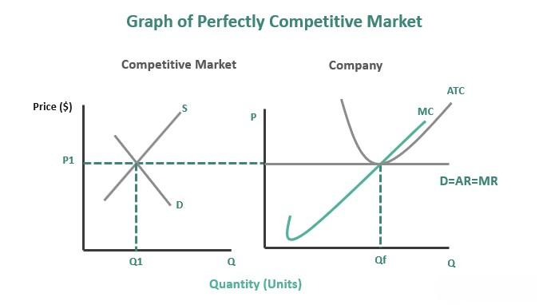

Price takers, perfect competition, and algorithmic trading are integral components of economic theory and modern financial markets. Perfect competition is a theoretical market structure characterized by a large number of small firms or individuals who sell identical products, meaning no single entity can influence prices. In such markets, firms are considered price takers—they accept the market price as given because their individual transactions are insufficient to sway it. This contrasts with monopolistic or oligopolistic markets where firms can exert some degree of price control.

The concept of price takers is central to understanding how perfect competition operates. In this idealized environment, the market's equilibrium price is determined by aggregate supply and demand, and individual firms must adjust their production to match this price. This ensures maximum allocative efficiency, where resources are distributed in a way that maximizes total benefit to society.

Algorithmic trading, a contemporary development in financial markets, employs computer programs to execute trades at high speed and volume, based on predetermined criteria. It plays a significant role by behaving similarly to price takers. Algorithms generally do not attempt to influence market prices directly; instead, they exploit inefficiencies or price discrepancies to execute trades very quickly. This practice can enhance market liquidity and price efficiency, contributing to competition.

The interaction between these concepts—the theoretical purity of perfect competition, the role of price takers therein, and the impact of algorithmic trading—illustrates their interconnectedness and relevance. The purpose of this article is to demystify these foundational economic theories and their real-world applications, providing a clearer understanding of how market dynamics function and evolve with technological advancements.

## Table of Contents

## What is Perfect Competition?

Perfect competition is a theoretical market structure characterized by several distinct features that collectively create an idealized form of economic efficiency. In a perfectly competitive market, numerous buyers and sellers interact, each possessing full knowledge of market prices and conditions. Consequently, individual firms or consumers cannot influence market prices, leading to all participants being price takers. 

Key Characteristics:

1. **Numerous Participants**: In a perfectly competitive market, there are so many buyers and sellers that no single entity can influence the price of the product. Each firm’s output is so small compared to the total market supply that changes in its output do not affect market prices.

2. **Homogeneous Products**: Products in a perfectly competitive market are identical, meaning that consumers view them as perfect substitutes. This makes advertising unnecessary, as there are no differences between products that could influence consumer preference.

3. **Free Entry and Exit**: There are no barriers to entering or leaving the market. Firms can easily begin or cease operations, allowing supply to adjust naturally to changes in demand.

4. **Perfect Information**: Both buyers and sellers have complete and instantaneous knowledge of product prices and other pertinent market information, leading to optimal decision-making.

5. **Price-Taking Behavior**: Firms in a perfectly competitive market are price takers; they accept the market price determined by the intersection of total industry supply and demand. Firms adjust their output levels based on marginal costs, which is given by the formula: 
$$
   P = MC

$$
   where $P$ is price and $MC$ is marginal cost.

**Comparison with Monopolistic Markets**:

Perfect competition is notably different from monopolistic markets, where a single seller dominates and controls prices. In monopoly, significant barriers to entry prevent other firms from entering the market, leading to less consumer choice and often higher prices. Whereas monopolistic competition features product differentiation that gives firms some control over pricing, perfect competition allows no such differentiation, emphasizing efficiency and consumer welfare.

**Examples of Industries**:

While perfect competition is theoretical, industries such as agriculture and commodity markets often exhibit characteristics similar to perfect competition. In agriculture, many farmers produce nearly identical products (e.g., wheat), which helps approximate conditions of perfect competition. Commodity trading, involving standardized raw materials like metals, often displays competitive features due to the presence of numerous global sellers.

**Rarity in Real-World Markets**:

Despite its theoretical appeal, perfect competition is rare in the real world primarily due to the difficulty of meeting all its stringent requirements. Most markets feature some degree of product differentiation, barriers to entry, or information asymmetry. For instance, technology, brand identity, and regulatory controls often introduce elements inconsistent with perfect competition. However, understanding perfect competition provides a foundational benchmark against which to measure the efficiency and performance of real-world markets, offering insights into how markets can be improved to enhance consumer welfare and resource allocation.

## Understanding Price Takers

Price takers are fundamental actors in economic theory, particularly within the framework of perfectly competitive markets. In economic terms, a price taker is a buyer or seller who has no influence over the market price of goods or services. This condition arises because the individual participant's transactions are too insignificant to affect the overall market dynamics. 

In perfectly competitive markets, the presence of numerous buyers and sellers ensures that no single entity can dictate the price. Each participant must accept the prevailing market price, which is determined by the aggregate supply and demand across the market. This characteristic leads to the defining equation for perfect competition, $P = MC$, where $P$ is the price, and $MC$ is the marginal cost of production. Essentially, firms produce output where their marginal cost equals the market price, ensuring that resources are allocated efficiently.

In practical terms, industries such as agriculture often exhibit features of perfect competition, thereby making many farmers price takers. For example, an individual wheat farmer typically has to accept the world market price for wheat, as their individual output is minuscule relative to total global production. Similarly, in stock markets, individual retail investors act as price takers. Trades occur at prevailing market prices set by analysts and institutional investors, whose collective trading activities define market trends. 

The distinction between price takers and price makers lies in the influence each has over pricing. Price makers have the power to influence prices due to their market share or unique product offerings, often seen in monopolistic or oligopolistic markets. Unlike price takers, a price maker can adjust prices without losing all market share, because competitors are either few or unable to replicate the product entirely. For instance, a tech company with a patented innovation might set prices higher than the marginal cost, benefiting from reduced competition.

Understanding the role of price takers is crucial as it underscores the conditions needed for perfect competition, where resources are utilized efficiently, and economic surplus is maximized. This distinction also highlights the dynamics of different market structures and the strategic approaches businesses must adopt within their respective competitive environments.

## Role of Algorithmic Trading

Algorithmic trading, also known as algo-trading, refers to the use of computer programs and algorithms to execute trades in financial markets. It has become a pervasive force, revolutionizing the way transactions are made across stock exchanges globally. The rise of [algorithmic trading](/wiki/algorithmic-trading) can be attributed to the advent of faster computer processing speeds, access to large datasets, and the sophistication of algorithm development.

In the context of stock markets, algorithmic trading often functions as a price taker. A price taker is an entity that accepts the prevailing market prices as given, without having the power to influence them. In perfectly competitive markets, individual traders or trading strategies do not have enough market power to determine the price of securities. Algorithmic trading systems react to price changes and execute a large [volume](/wiki/volume-trading-strategy) of trades based on pre-defined criteria, such as price movements, timing, or other market conditions.

These algorithmic strategies can significantly impact market efficiency and competition. They enhance market [liquidity](/wiki/liquidity-risk-premium) by providing continuous buy and sell orders, which can narrow bid-ask spreads. This contributes to efficient price discovery and reduces transaction costs for all market participants. However, the rapid and high-frequency nature of these trades can also lead to increased market [volatility](/wiki/volatility-trading-strategies) and instances of 'flash crashes,' where prices fall precipitously and are rapidly corrected.

Various platforms and tools are utilized in algorithmic trading. Examples include MultiCharts, MetaTrader, and [Interactive Brokers](/wiki/interactive-brokers-api), which offer robust environments for developing and testing trading algorithms. Additionally, languages such as Python, R, and C++ are commonly used due to their capabilities in statistical analysis and real-time data processing.

Despite its advantages, algorithmic trading presents several challenges. One major advantage is the speed and precision at which trades can be executed, far surpassing human capabilities. However, challenges include the significant initial investment in technology and expertise required to develop effective algorithms. Furthermore, there's the risk of algorithmic failure due to coding errors or unexpected market conditions, which can result in substantial losses. Regulatory scrutiny also poses a challenge, as governing bodies seek to mitigate risks associated with high-frequency trading practices.

In conclusion, algorithmic trading plays a crucial role in enhancing market efficiency and liquidity. Its capacity to function as a price taker in stock exchanges emphasizes its integral role in the current financial landscape. However, the complexities and risks associated with algorithmic practices warrant careful consideration by market participants and regulators alike.

## Economic Examples of Perfect Competition

Perfect competition is an economic model where numerous small firms compete against each other, producing homogenous products, and none have the power to influence market prices. This theoretical structure rarely exists perfectly in the real world due to various practical limitations, but certain industries approximate its conditions.

The agriculture sector is frequently cited as a classic example of near perfect competition. Farmers typically produce similar or identical products such as wheat, corn, or soybeans. These products are standardized to a degree where the output from one producer is largely indistinguishable from another. Because individual farmers hold no sway over the prices in broader markets, they operate as price takers. Their decision to produce and sell at given market prices aligns closely with the model of perfect competition.

Commodity markets further illustrate this phenomenon. Commodities like gold, silver, or [crude oil](/wiki/crude-oil) are traded on a global scale, where prices are determined by overall supply and demand rather than actions of single entities. Traders in these markets, much like farmers, accept prevailing prices set by aggregated market dynamics. This is primarily because commodities are fungible, meaning they are interchangeable with another unit of the same product.

Case studies of agricultural markets reveal multiple characteristics of perfect competition. For instance, the U.S. dairy industry, despite its complexities, provides insights into price-taking behaviors. Milk, as a relatively homogenous product, sees thousands of farms across the country selling to a large number of buyers, like dairy processors, who compete intensely on factors other than price, such as quality and service. Here, government policies and subsidies can complicate market dynamics, but the core characteristics of many producers and buyers and standard products remain.

Analyzing market conditions that foster perfect competition often points to low barriers to entry and [exit](/wiki/exit-strategy). In agriculture, relatively low capital requirements allow new entrants to start production without facing prohibitive costs, especially in crop farming. Moreover, the almost perfect information available regarding prices and techniques enables farmers to adapt quickly to market conditions, thereby enhancing their role as price takers.

In summary, while perfect competition serves primarily as a theoretical model, certain sectors like agriculture and commodity markets exhibit several of its properties. These examples underscore the influence of numerous small producers and homogenous products on market prices and competition. As global demand and supply continue to evolve, understanding these dynamics remains critical for stakeholders operating within these industries.

## Price Takers in Action

Price takers are entities in a market that have no influence over the price of goods or services they buy or sell. They operate in environments where the market dictates pricing, primarily because of the high level of competition and the standardized nature of the products or services involved.

One of the most visible examples of price-taker scenarios can be found in agricultural markets. Farmers producing generic crops like wheat, corn, or soybeans cannot set the price of their produce; they must accept the prevailing market price determined by the aggregate supply and demand. This dynamic is influenced significantly by global supply and demand factors. For instance, an abundant harvest across major producing regions can lead to a dramatic reduction in prices due to oversupply, while poor harvests can cause prices to soar. Additionally, global demand changes, such as increased consumption in emerging economies or declines due to economic downturns, directly impact prices, leaving individual producers to adapt without negotiation power over price.

Technological advances have profoundly affected industries where price-takers are prevalent. Automation and data analytics have enabled greater efficiency and cost reduction in production, exerting downward pressure on prices. For example, in the agricultural sector, precision farming technologies like drones and satellite imagery allow for optimized resource utilization and yield predictions, enhancing the competitiveness of agriculture. Farmers using these technologies can better manage costs even if they can’t influence market prices.

Similarly, the stock market is another domain where price-takers operate, particularly in the context of individual retail investors. Here, the overwhelming influence of institutional investors and algorithmic trading systems dictates stock prices. Retail investors typically accept prices as given when buying or selling shares. Technological advancements, such as high-frequency trading and automated trading platforms, have accelerated transaction speeds and increased market liquidity, creating a fast-paced environment where individual investors have minimal impact on pricing.

In conclusion, price-taker scenarios are prevalent in industries characterized by intense competition and standardized products, such as agriculture and certain segments of financial markets. Global supply and demand dynamics heavily influence these markets, and technological advancements play a significant role in shaping the competitive landscape, impacting how price takers operate and adapt to ever-evolving market conditions.

## The Future of Algorithmic Trading in Competitive Markets

Algorithmic trading has become a cornerstone of modern financial markets, driven by the rapid evolution of technology and data analytics. As it continues to grow, several key trends are shaping its future and influencing market dynamics, particularly concerning perfect competition.

Recent advancements in [artificial intelligence](/wiki/ai-artificial-intelligence) and [machine learning](/wiki/machine-learning) have significantly enhanced the capabilities of algorithmic trading. These technologies allow for more sophisticated trading strategies, capable of processing vast amounts of data in real-time and making autonomous decisions. This technological evolution contributes to a more efficient market by potentially narrowing bid-ask spreads and improving liquidity. However, it also challenges the ideal traits of perfect competition, such as complete transparency and homogeneity, by creating disparities in trading speed and information processing capabilities among market participants.

Moreover, algorithmic trading amplifies the need for robust regulatory frameworks to ensure fair market practices. Potential regulatory challenges include detecting and mitigating the risks associated with high-frequency trading ([HFT](/wiki/high-frequency-trading-strategies)), such as market manipulation and flash crashes. Regulatory bodies must strike a balance between encouraging innovation and preventing practices that could harm market integrity. These challenges could impact the role of algorithmic trading as price takers, especially if regulations impose constraints on trading algorithms’ autonomy and speed.

Looking ahead, the integration of algorithmic trading into various markets is expected to deepen, extending beyond traditional equities to commodities, [forex](/wiki/forex-system), and even emerging asset classes like cryptocurrencies. This expansion will likely spur innovations in algorithmic strategies tailored to the unique characteristics of each market. As technology continues to transform market dynamics, the ability of algorithmic trading to act within the constructs of perfect competition will depend on continued advancements in transparency and fair access to resources and technologies. The future of algorithmic trading notably hinges on its adaptability to evolving regulatory landscapes and technological breakthroughs, shaping a competitive yet equitable market environment.

## Conclusion

The exploration of key economic concepts such as perfect competition, price takers, and algorithmic trading provides valuable insights into the dynamics of market structures. Understanding the role each player has within these structures is vital for grasping how markets function effectively. Price takers operate under the premise that they must accept market prices determined by aggregate supply and demand, especially within perfectly competitive markets, which serve as an idealized benchmark where numerous buyers and sellers exist, leading to efficient allocation of resources.

Algorithmic trading has introduced a new dimension to modern financial markets, functioning as both a participant and a transformative force in market dynamics. By employing mathematical models and automated instructions to execute trades, algorithmic trading enhances market efficiency, but also presents challenges such as increased volatility and complex market interactions. These advancements necessitate a deeper understanding of how algorithmic strategies integrate with existing market frameworks.

Technological progress continues to redefine market structures and the roles of different players. Algorithmic trading, in particular, underscores the importance of adapting to and understanding these innovations to maintain competitive advantage. As markets evolve, so too must our comprehension of the forces at play, prompting ongoing analysis and study.

In conclusion, a thorough grasp of market structures and participant roles is essential for navigating the complexities of modern economic environments. As trading technologies advance, they reshape the landscape, urging economists, traders, and policymakers alike to pursue further exploration and understanding, ensuring informed decision-making and fostering market integrity.

## References & Further Reading

[1]: Stigler, G. J. (1957). ["Perfect competition, historically contemplated."](https://www.jstor.org/stable/pdf/1824830.pdf) Journal of Political Economy, 65(1), 1-17.

[2]: Friedman, M. (1953). ["Essays in Positive Economics."](https://en.wikipedia.org/wiki/Essays_in_Positive_Economics) University of Chicago Press.

[3]: Gomber, P., Arndt, B., Lutat, M., & Uhle, T. (2011). ["High-frequency trading."](https://papers.ssrn.com/sol3/papers.cfm?abstract_id=1858626) Business & Information Systems Engineering, 3(2), 65-69.

[4]: Farmer, J. D., & Skouras, S. (2012). ["An ecological perspective on the future of computer trading."](https://www.tandfonline.com/doi/full/10.1080/14697688.2012.757636) Quantitative Finance, 12(3), 377-385.

[5]: Kirzner, I. M. (1973). ["Competition and Entrepreneurship."](https://papers.ssrn.com/sol3/papers.cfm?abstract_id=1496174) University of Chicago Press.