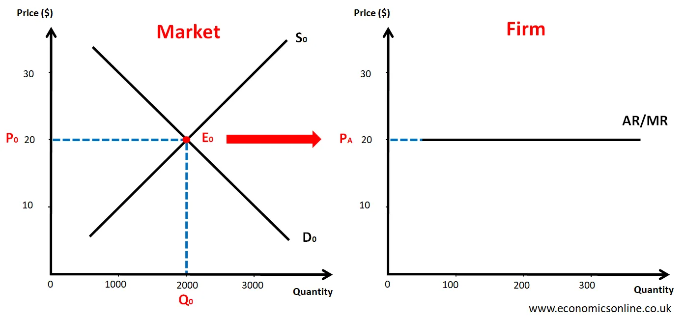

## Table of Contents

## What is a price taker?

A price taker is a business or individual that has to accept the market price for a product or service. They cannot change the price because they do not have enough power in the market. For example, a small farmer selling wheat must accept the price set by larger market forces, like big buyers or overall supply and demand.

In a perfectly competitive market, many price takers exist. This is because there are lots of buyers and sellers, and no single one can influence the price. If a price taker tries to charge more than the market price, customers will simply buy from someone else offering the same product for less. This keeps the price stable and controlled by the overall market, not by individual sellers or buyers.

## How does a price taker operate in a perfectly competitive market?

In a perfectly competitive market, a price taker operates by selling their products at the market price, which they cannot change. They are one of many sellers offering the same product, so they have to accept whatever price the market sets. If they try to charge more, no one will buy from them because customers can easily find the same product for less from other sellers. This means the price taker has to focus on keeping their costs low to make a profit, rather than trying to set a higher price.

Because there are many buyers and sellers, no single price taker can influence the overall market price. They just have to go along with it. This setup encourages price takers to be efficient and innovative to stay competitive. For example, a farmer growing wheat in a perfectly competitive market will work hard to grow more wheat at a lower cost, so they can still make money even when the market price for wheat is low.

## What are the characteristics of a perfectly competitive market?

A perfectly competitive market is one where there are many buyers and sellers. No single buyer or seller can control the price of the product. Everyone in the market is a price taker, meaning they have to sell at the price the market sets. If someone tries to sell for more, no one will buy from them because they can get the same thing cheaper from someone else. This keeps the price the same for everyone.

The products in a perfectly competitive market are also the same. This means that buyers see all the products as identical, so they don't care who they buy from as long as the price is right. There are no barriers to entering or leaving the market, so new sellers can start selling easily, and existing sellers can stop if they want. This competition keeps everyone working hard to keep their costs low and sell at the market price.

## Why can't a price taker influence the market price?

A price taker can't influence the market price because they are just one of many sellers in a perfectly competitive market. There are lots of other sellers offering the same thing, so if one seller tries to charge more, people will just buy from someone else who is selling for less. This means that no single seller can change the price because the market price is set by the overall supply and demand, not by any one person.

In a perfectly competitive market, all the products are the same, so buyers don't care who they buy from as long as the price is the same. If a price taker tries to sell for more, no one will buy from them, and they will lose business. Because of this, price takers have to accept the market price and focus on keeping their own costs low to make a profit, instead of trying to change the price.

## How does a price taker determine its output level?

A price taker decides how much to produce by looking at the market price and their own costs. They want to make as much money as they can, so they keep making more of their product as long as the price they get for it is higher than what it costs them to make it. If making one more unit costs more than what they can sell it for, they stop producing at that point.

For example, if a farmer can sell wheat at $5 per bushel and it costs them $3 to grow each bushel, they will keep growing more wheat because they are making a profit. But if the cost goes up to $6 per bushel, they will stop because they would lose money on each bushel they grow. So, the farmer, as a price taker, adjusts their output to where the market price equals their cost of production, which is called the profit-maximizing level of output.

## What is the relationship between a price taker's marginal cost and the market price?

A price taker decides how much to make by comparing their marginal cost to the market price. Marginal cost is what it costs to make one more unit of their product. If the market price is higher than their marginal cost, they will keep making more because they are making a profit on each extra unit. But if the marginal cost becomes higher than the market price, they will stop because making more would lose them money.

For example, imagine a farmer who grows wheat. If the market price for wheat is $5 per bushel and it costs the farmer $3 to grow one more bushel, they will keep growing more wheat. But if the cost to grow one more bushel goes up to $6, the farmer will stop because selling that bushel for $5 would mean losing $1. So, the farmer will produce up to the point where the market price equals their marginal cost, which is the best way to make the most profit.

## How does the concept of price taking affect a firm's profit maximization?

In a perfectly competitive market, a firm that is a price taker cannot change the price of its product. It has to sell at the price set by the market. This means that to make the most profit, the firm needs to focus on how much it produces. The firm will keep making more of its product as long as the price it gets for it is more than what it costs to make one more unit. This cost is called the marginal cost. When the marginal cost gets higher than the market price, the firm will stop making more because it would start losing money.

For example, if a farmer can sell wheat at $5 per bushel and it costs $3 to grow one more bushel, the farmer will keep growing more wheat to make a profit. But if the cost to grow one more bushel goes up to $6, the farmer will stop because selling that bushel for $5 would mean losing money. So, the key to profit maximization for a price taker is finding the right amount to produce where the market price equals the marginal cost. This way, the firm makes the most profit it can in a market where it has no control over the price.

## Can a price taker earn economic profits in the long run? Why or why not?

In the long run, a price taker usually cannot earn economic profits. This is because if a price taker is making more money than just covering their costs, other businesses will see this and want to join in. They will start selling the same thing, which means more sellers in the market. With more sellers, the supply of the product goes up, and this pushes the market price down until it just covers the cost of making the product. At this point, the price taker is only making enough money to stay in business, but not any extra profit.

This happens because, in a perfectly competitive market, there are no barriers stopping new sellers from coming in. If one seller is doing well, others will follow, and this keeps happening until no one can make economic profits anymore. The only way a price taker might keep making economic profits in the long run is if there are some special barriers that stop new sellers from coming into the market. But in a truly perfectly competitive market, this doesn't happen, so price takers end up just breaking even in the long run.

## What role do price takers play in achieving allocative efficiency?

Price takers help the market use resources in the best way, which is called allocative efficiency. This happens because price takers have to sell their products at the market price. They can't change the price, so they work hard to make their products at the lowest cost possible. When they do this, they produce just the right amount that people want to buy at the market price. This means resources are used where they are most needed, and nothing is wasted.

In a perfectly competitive market, price takers keep making more of their product as long as it costs less to make it than what they can sell it for. When the cost to make one more unit equals the market price, they stop. This balance makes sure that the market has the right amount of goods. If there were too many goods, the price would go down, and if there were too few, the price would go up. Price takers help keep this balance, making sure the market is efficient and resources are used well.

## How do market entry and exit affect price takers in perfect competition?

In a perfectly competitive market, it's easy for new sellers to start selling and for old sellers to stop. This is good for price takers because it helps keep the market fair. If a price taker is making more money than just covering their costs, new sellers will see this and want to join in. They'll start selling the same thing, which means more sellers in the market. With more sellers, there's more of the product to buy, so the price goes down until it's just enough to cover the cost of making it. This means price takers can't keep making big profits for long because new sellers will always come in and bring the price back down.

On the other hand, if price takers are losing money because the market price is too low, some will leave the market. When sellers leave, there's less of the product to buy, so the price goes up until it's enough for the sellers who stay to at least break even. This coming and going of sellers helps keep the market balanced. Price takers have to deal with this, but it also means they don't have to stay in a market that's not making them money. They can leave if they need to, and new sellers can take their place, making sure the market stays efficient and fair.

## What are the implications of being a price taker for a firm's strategic decisions?

Being a price taker means a firm has to accept the market price and can't change it. This affects the firm's strategic decisions a lot. Instead of trying to set a higher price, the firm focuses on making its product at the lowest cost possible. This means they might look for cheaper ways to make their product or find new ways to be more efficient. They might also try to make more of their product if it costs less to make than the market price, but they'll stop if the cost gets too high.

Another big part of a price taker's strategy is deciding when to enter or leave the market. If they see they can make a profit, they might decide to start selling. But if the market price goes down and they start losing money, they might choose to leave. This coming and going helps keep the market balanced. Price takers don't have control over the price, so their main strategy is to be as efficient as possible and be ready to change their plans based on what's happening in the market.

## How do technological changes impact price takers in a perfectly competitive market?

Technological changes can really help price takers in a perfectly competitive market. When new technology comes along, it can make it cheaper or faster for price takers to make their products. For example, if a farmer gets a new kind of tractor that uses less gas and works faster, they can grow more wheat for less money. This means they can still make a profit even if the market price for wheat stays the same or goes down a bit. So, price takers who use new technology can keep their costs lower than others, which helps them stay in business and maybe even make more money.

But technological changes can also make things harder for price takers. If everyone in the market starts using the new technology, it can make the market even more competitive. More people can make the product cheaper, which means more sellers and more of the product to buy. This can push the market price down even more. Price takers who don't keep up with the new technology might find it hard to stay in the market because their costs are higher than everyone else's. So, they have to be ready to change and use new technology to keep up with everyone else.

## What is Perfect Competition?

Perfect competition is a theoretical market structure characterized by several distinct features that collectively create an idealized form of economic efficiency. In a perfectly competitive market, numerous buyers and sellers interact, each possessing full knowledge of market prices and conditions. Consequently, individual firms or consumers cannot influence market prices, leading to all participants being price takers. 

Key Characteristics:

1. **Numerous Participants**: In a perfectly competitive market, there are so many buyers and sellers that no single entity can influence the price of the product. Each firm’s output is so small compared to the total market supply that changes in its output do not affect market prices.

2. **Homogeneous Products**: Products in a perfectly competitive market are identical, meaning that consumers view them as perfect substitutes. This makes advertising unnecessary, as there are no differences between products that could influence consumer preference.

3. **Free Entry and Exit**: There are no barriers to entering or leaving the market. Firms can easily begin or cease operations, allowing supply to adjust naturally to changes in demand.

4. **Perfect Information**: Both buyers and sellers have complete and instantaneous knowledge of product prices and other pertinent market information, leading to optimal decision-making.

5. **Price-Taking Behavior**: Firms in a perfectly competitive market are price takers; they accept the market price determined by the intersection of total industry supply and demand. Firms adjust their output levels based on marginal costs, which is given by the formula: 
$$
   P = MC

$$
   where $P$ is price and $MC$ is marginal cost.

**Comparison with Monopolistic Markets**:

Perfect competition is notably different from monopolistic markets, where a single seller dominates and controls prices. In monopoly, significant barriers to entry prevent other firms from entering the market, leading to less consumer choice and often higher prices. Whereas monopolistic competition features product differentiation that gives firms some control over pricing, perfect competition allows no such differentiation, emphasizing efficiency and consumer welfare.

**Examples of Industries**:

While perfect competition is theoretical, industries such as agriculture and commodity markets often exhibit characteristics similar to perfect competition. In agriculture, many farmers produce nearly identical products (e.g., wheat), which helps approximate conditions of perfect competition. Commodity trading, involving standardized raw materials like metals, often displays competitive features due to the presence of numerous global sellers.

**Rarity in Real-World Markets**:

Despite its theoretical appeal, perfect competition is rare in the real world primarily due to the difficulty of meeting all its stringent requirements. Most markets feature some degree of product differentiation, barriers to entry, or information asymmetry. For instance, technology, brand identity, and regulatory controls often introduce elements inconsistent with perfect competition. However, understanding perfect competition provides a foundational benchmark against which to measure the efficiency and performance of real-world markets, offering insights into how markets can be improved to enhance consumer welfare and resource allocation.

## References & Further Reading

[1]: Stigler, G. J. (1957). ["Perfect competition, historically contemplated."](https://www.jstor.org/stable/pdf/1824830.pdf) Journal of Political Economy, 65(1), 1-17.

[2]: Friedman, M. (1953). ["Essays in Positive Economics."](https://en.wikipedia.org/wiki/Essays_in_Positive_Economics) University of Chicago Press.

[3]: Gomber, P., Arndt, B., Lutat, M., & Uhle, T. (2011). ["High-frequency trading."](https://papers.ssrn.com/sol3/papers.cfm?abstract_id=1858626) Business & Information Systems Engineering, 3(2), 65-69.

[4]: Farmer, J. D., & Skouras, S. (2012). ["An ecological perspective on the future of computer trading."](https://www.tandfonline.com/doi/full/10.1080/14697688.2012.757636) Quantitative Finance, 12(3), 377-385.

[5]: Kirzner, I. M. (1973). ["Competition and Entrepreneurship."](https://papers.ssrn.com/sol3/papers.cfm?abstract_id=1496174) University of Chicago Press.