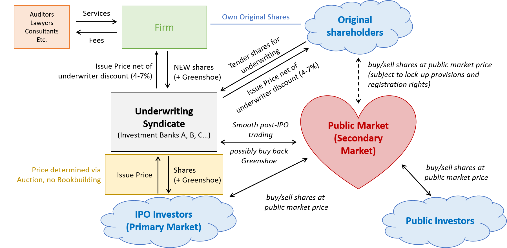

## Table of Contents

## What is a price talk?

A price talk is a discussion that happens before a bond is sold. It's when the people selling the bond and the people who might buy it talk about what the price of the bond should be. They try to agree on a price that everyone thinks is fair before they start selling the bond to the public.

This talk is important because it helps make sure the bond will sell well. If the price is too high, people might not want to buy the bond. If it's too low, the people selling the bond might not make enough money. So, the price talk helps find a good middle ground that works for everyone.

## How does a Dutch auction work?

A Dutch auction is a way to sell things where the price starts high and then goes down until someone decides to buy. Imagine you want to sell a painting. You start by saying the painting costs $100. If no one wants to buy it at $100, you lower the price to $90, then $80, and keep going down until someone says, "I'll buy it at that price!" The first person to say they'll buy it gets the painting at the lowest price offered so far.

This kind of auction is different from a regular auction where people keep bidding higher and higher. In a Dutch auction, it's all about waiting for the right price to come down to what someone is willing to pay. It's used a lot for selling flowers, like in the Netherlands, and also for selling stocks or bonds. It's a fast way to find out the lowest price someone is willing to pay for something.

## What are the key differences between a Dutch auction and a traditional auction?

In a Dutch auction, the price starts high and goes down until someone buys the item. It's like a countdown where the seller keeps lowering the price until someone says, "I'll take it!" This is different from a traditional auction where people bid higher and higher prices. In a traditional auction, the price goes up with each new bid until no one wants to bid higher, and then the highest bidder wins.

The main difference is the direction of the price. In a Dutch auction, the seller is trying to find the lowest price someone will pay, while in a traditional auction, buyers are trying to outbid each other to pay the highest price. This makes Dutch auctions quicker because the price drops until someone buys, while traditional auctions can take longer as people keep bidding. Both types of auctions are used to find out what people are willing to pay, but they do it in opposite ways.

## What industries commonly use Dutch auctions?

Dutch auctions are often used in the flower industry, especially in the Netherlands. This is where the name "Dutch auction" comes from. Flower sellers use this method to quickly sell large amounts of flowers. They start with a high price and lower it until someone buys the flowers. This way, they can sell their flowers fast and find out the lowest price people are willing to pay.

Another industry that uses Dutch auctions is the financial sector. Companies selling stocks or bonds might use a Dutch auction to figure out the best price. They start with a high price and lower it until investors are willing to buy. This helps them sell their stocks or bonds quickly and at a fair price. It's a good way to find out what investors are willing to pay without taking too much time.

## How is price talk used in bond markets?

In the bond market, price talk is a way for people who want to sell bonds and people who might buy them to talk about what the price of the bond should be. Before the bond is sold to everyone, these two groups get together to guess what the price should be. They want to make sure the price is not too high, so people will want to buy the bond, and not too low, so the sellers can make enough money. This talk helps them agree on a price that seems fair to both sides before they start selling the bond to the public.

This process is important because it helps make the bond sale go smoothly. If the price is set right, more people will be interested in buying the bond. This means the bond will sell faster and the sellers will get the money they need. Price talk is like a planning meeting where everyone tries to find a good price that works for everyone involved in the bond market.

## What are the advantages of using a Dutch auction for IPOs?

Using a Dutch auction for an Initial Public Offering (IPO) can help a company find the right price for its shares in a fair way. In a Dutch auction, the company starts with a high price and then lowers it until investors are willing to buy. This means the company can see what price people are really willing to pay, instead of just guessing. It's like a big group of people deciding together what the shares are worth, which can lead to a more accurate price than if the company just picked a number.

Another advantage is that Dutch auctions can make the IPO process more open and fair for everyone. In a regular IPO, big investors often get special deals and can buy shares at lower prices before everyone else. But in a Dutch auction, everyone gets a chance to buy shares at the same time, and the price is the same for everyone. This can help smaller investors feel like they have a fair shot at buying into the company, which can make the IPO more popular and successful.

## Can you explain the role of price talk in setting initial bond prices?

Price talk is a conversation that happens before a bond is sold to the public. It's a way for the people selling the bond and the people who might buy it to talk about what the price should be. They want to find a price that everyone thinks is fair. This helps make sure the bond will sell well. If the price is too high, nobody might want to buy the bond. If it's too low, the people selling the bond might not make enough money. So, the price talk helps them agree on a good price before they start selling the bond.

This process is important because it sets the stage for the bond sale. When everyone agrees on a price during the price talk, it makes the actual selling of the bond easier. The agreed-upon price gives everyone a starting point, and it helps the bond sell faster because people know what to expect. This way, the sellers can get the money they need, and the buyers feel like they are getting a fair deal. Price talk is like a planning meeting that helps everyone involved feel good about the bond sale.

## What are the potential risks and challenges associated with Dutch auctions?

Dutch auctions can be tricky because they might not always find the best price for everyone. Since the price starts high and goes down, if the auction goes too fast, the price might drop too low before people have a chance to think about it. This can mean the seller gets less money than they could have. Also, if not enough people are interested in what's being sold, the price might keep dropping until it's too low, which is bad for the seller.

Another challenge is that Dutch auctions can be confusing for people who are used to regular auctions. In a regular auction, people bid higher and higher, but in a Dutch auction, they have to decide quickly if they want to buy at the current price before it goes down more. This can make some people nervous or unsure, and they might miss out on buying something they want. It's important for everyone to understand how a Dutch auction works so they can make good choices.

## How do issuers and underwriters collaborate during the price talk process?

During the price talk process, issuers and underwriters work together to figure out a good price for the bond. The issuer is the company or group that wants to sell the bond, and the underwriter is the bank or financial group that helps them sell it. They talk about what they think the bond should cost. They look at things like how much interest the bond will pay, how long it will last, and what other bonds like it are selling for. They want to find a price that will make people want to buy the bond but also make sure the issuer gets the money they need.

This teamwork is important because it helps make sure the bond sale goes well. The underwriter knows a lot about the bond market and can give the issuer good advice on what price will work best. They might talk to investors to see what they think about the bond and use that information to help set the price. By working together, the issuer and underwriter can agree on a price that everyone thinks is fair. This makes it more likely that the bond will sell quickly and smoothly.

## What advanced strategies can be employed in a Dutch auction to maximize returns?

In a Dutch auction, one advanced strategy to maximize returns is to carefully watch the price as it drops and jump in at the right moment. If you think the item or stock is worth more than the current price, you can buy it before the price goes down too much. This means you need to know a lot about what you're buying and have a good idea of what it's really worth. By waiting for the price to come down to a point where you think it's a good deal, you can buy at a lower price and then sell it later for more money, making a profit.

Another strategy is to use information about how other people are acting in the auction. If you see that a lot of people are interested in the item, you might want to buy it quickly before the price drops too low. On the other hand, if not many people seem to want it, you might wait longer for the price to go down even more. This way, you can get a better deal. It's also helpful to know about the market and what similar items are selling for, so you can make a smart choice about when to buy. By using these strategies, you can try to get the best price and make the most money from your purchase.

## How does the feedback loop in price talk influence the final pricing of securities?

The feedback loop in price talk is like a conversation that keeps going back and forth between the people selling the securities and the people who might buy them. They talk about what they think the price should be, and this helps them find a price that everyone thinks is fair. The sellers listen to what the buyers say about the price, and then they might change the price a little bit to make it better. This back-and-forth keeps happening until they all agree on a good price. It's like playing a game where you keep adjusting your guess until you get it right.

This feedback loop is important because it helps make sure the final price of the securities is just right. If the sellers set the price too high at first, the buyers might say it's too much, and then the sellers can lower it. If the price is too low, the buyers might say it's a great deal, and the sellers can raise it a bit. By listening to each other, they can find a price that works for everyone. This way, the securities are more likely to sell well, and everyone feels good about the deal.

## What are some case studies where Dutch auctions significantly impacted market outcomes?

One famous case where a Dutch auction made a big difference was when Google went public in 2004. They used a Dutch auction to sell their shares, which meant they started with a high price and then lowered it until enough people wanted to buy. This was different from most IPOs, where big banks set the price. Google wanted to make the process fair for everyone, so more people could buy shares. The Dutch auction helped Google find a good price and let smaller investors have a chance to buy shares, which made the IPO very popular and successful.

Another case was when the U.S. Treasury used Dutch auctions to sell bonds. They wanted to find the best price for their bonds, so they started with a high price and lowered it until enough people were willing to buy. This helped the Treasury get a fair price for their bonds and made sure they could sell them quickly. Using Dutch auctions for bonds showed that this method could work well for big financial sales, not just for things like flowers or stocks. It helped the Treasury manage their money better and made the bond market more efficient.

## References & Further Reading

1. **Klemperer, P. (2004). "Auctions: Theory and Practice."** This book provides a comprehensive exploration of auction theory, including a detailed analysis of various auction mechanisms like the Dutch auction. It discusses the strategic considerations and economic implications of using such auctions in financial markets.

2. **Milgrom, P. R., & Weber, R. J. (1982). "A Theory of Auctions and Competitive Bidding." Econometrica, 50(5), 1089-1122.** This seminal paper introduces foundational concepts in auction theory and offers insights into the mathematical frameworks underpinning auction strategies, including the Dutch auction model.

3. **Book: "Financial Markets and Algorithmic Trading" by Vallabhaneni, S. R., & A. K. Jha (2020).** Focuses on how algorithmic trading systems can incorporate auction-based strategies, highlighting the role of Dutch auctions in enhancing trading efficiency and risk management.

4. **Google's IPO Case Study: "Google's Dutch Auction IPO: A Case for Innovation in Investment Banking."** Provides a detailed analysis of Google's adoption of the Dutch auction method for its initial public offering, emphasizing the impact on democratizing investor participation and challenging traditional IPO processes.

5. **Article: "The Use of Dutch Auctions in Modern IPOs" – Journal of Finance.** This article examines the resurgence of Dutch auctions in public offerings, discussing the benefits of transparency and broad investor involvement.

6. **Brooks, C., & Prokopczuk, M. (2013). "The Dynamics of Commodity Prices: A Study in Dutch Auction Settings." Journal of Commodity Markets, 2(1), 24-37.** An empirical study that evaluates the effectiveness of Dutch auctions in commodity markets, illustrating applications beyond equity offerings.

7. **Yadav, V., & Singh, V. K. (2019). "Algorithmic Trading, Dutch Auctions, and Market Stability." IEEE Transactions on Financial Computing, 6(4), 152-161.** Discusses the technical integration of Dutch auction mechanisms into automated trading systems, focusing on market stability and price discovery.

8. **Krishna, V. (2010). "Auction Theory." Academic Publication.** A textbook offering a detailed theoretical foundation on auction types, with a section dedicated to Dutch auctions, catering to students and professionals in economics and finance.

9. **Study: "Risk Management in Auctions: Comparative Analysis of Dutch and English Models" – Risk Analysis Journal.** Analyses the risk factors associated with different auction mechanisms, providing insights into the mathematical modeling of price volatility in Dutch auctions.

These resources offer a diverse set of insights and comprehensive analyses on Dutch auctions, providing readers with foundational theories and practical applications across various financial markets.

