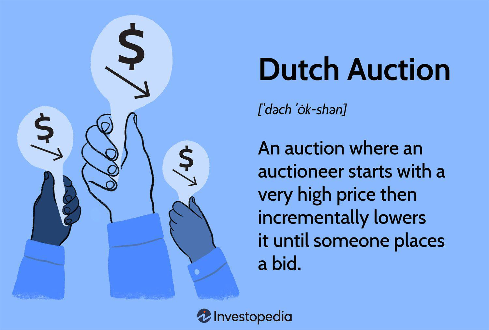

Auction mechanisms serve as essential tools for price discovery and resource allocation in various economic and financial settings. Among these mechanisms, the Dutch auction stands out for its unique approach and historical roots. Originating in the bustling flower markets of the Netherlands, the Dutch auction employs a descending price strategy that is distinct from the traditional ascending bid auctions. Unlike conventional auctions, where the price starts low and bidders drive it higher, the Dutch auction begins with a high asking price that incrementally decreases until a participant accepts it. This method not only expedites the auction process but also ensures that the sale is concluded with a single decisive bid.

The Dutch auction model has found significant utility in financial markets, offering a robust framework for price setting and allocation of large offerings. Its ability to democratize access to financial products has been particularly noted in public offerings, allowing for broader participation beyond institutional investors. The transparent and efficient nature of Dutch auctions makes them appealing for initial public offerings (IPOs), bond issues, and other financial instruments needing effective price discovery.



In recent years, the principles of the Dutch auction model have been integrated into algorithmic trading strategies, providing enhancements in trading efficiency and price optimization. By leveraging automation and rapid price adjustments, algorithmic trading systems benefit from the inherent characteristics of Dutch auctions, such as reduced volatility and the mitigation of speculative price swings.

This article aims to explore the Dutch auction model's relevance and potential in current financial markets, with a particular focus on its application in algorithmic trading. By examining the advantages, challenges, and real-world applications of this auction type, the article seeks to highlight opportunities for advancing trading strategies and improving market operations. Through comprehensive analysis and insights, readers will gain an understanding of how Dutch auctions can transform conventional auction and trading practices, offering a path toward more stable and transparent financial markets.

## Table of Contents

## Understanding Dutch Auctions

A Dutch auction is a type of auction in which the auctioneer begins with a high asking price that is lowered incrementally until a participant is willing to accept the auctioneer's price or until a predetermined minimum price is reached. Named after its origins in the 17th-century Dutch tulip market, this auction model holds historical significance as it was initially employed to sell flowers rapidly in bustling marketplaces. By allowing prices to decrease, vendors could ensure that vast quantities could be sold efficiently, facilitating a fluid and dynamic market environment.

The descending price strategy is a hallmark of Dutch auctions, where the auctioneer reduces the price until a bidder signals willingness to buy at that specific asking price. This is in stark contrast to the traditional English auction, where prices are bid upwards with participants continually outbidding each other until a high bidder prevails. In the Dutch model, the first bid is the winning bid, and this process often ensures quicker sales.

Mathematically, Dutch auctions are grounded in principles that promote effective price discovery by allowing bidders to react to price cues in real-time. The auction is concluded when a bidder accepts the current price $P_t$ at time $t$, offering a rapid resolution to the transaction process. One might consider using a simple algorithm to simulate this auction type:

```python
def dutch_auction(start_price, decrement, min_price, interested_parties):
    price = start_price
    while price >= min_price:
        for party in interested_parties:
            if party.is_interested(price):
                return f"Sold to {party.name} at {price}"
        price -= decrement
    return "No sale"

# Example participant class
class Participant:
    def __init__(self, name, max_price):
        self.name = name
        self.max_price = max_price

    def is_interested(self, price):
        return price <= self.max_price

# Example usage
party_a = Participant("Party A", 80)
party_b = Participant("Party B", 100)

outcome = dutch_auction(120, 5, 75, [party_a, party_b])
print(outcome)
```

This model is particularly useful in revealing a product's market-clearing price swiftly. With a focus on price discovery, Dutch auctions can minimize the period of uncertainty by directly mapping bidders' value assessments against the descending price curve until an equilibrium is reached. This aids sellers in determining a realistic market price while providing buyers with an immediate purchase opportunity without protracted bidding wars.

## Price Talk in Dutch Auctions

Price talk is a crucial component of the Dutch auction mechanism, serving as the informal dialogue or negotiation process whereby the initial price range is established for an auction. This preliminary discourse sets the stage for the subsequent auction process by providing potential bidders with guidance on where the starting price for the auction will lie. In a Dutch auction, the auctioneer sets an opening high price, which sequentially descends until a participant accepts the current price. The role of price talk is particularly pivotal as it helps in fine-tuning this starting price to reflect market conditions and investor sentiment accurately.

In financial contexts, particularly during initial public offerings (IPOs) and bond issues, price talk becomes an instrument for aligning expectations between issuers and investors. By circulating an indicative price range, issuers can gauge interest levels and obtain feedback on investor appetite and valuation perspectives. This feedback loop not only facilitates optimal price setting but also ensures that the auction is anchored in realistic market trends.

The importance of price talk is underscored in its ability to minimize the risks of mispricing. In IPOs, for instance, accurate price talk can democratize investor access by preventing sharp underpricing or overvaluation, thereby ensuring a more equitable distribution of shares among participants. Similarly, in bond issues, the indicative price discussions guide issuers in calibrating the offer to attract a diversified pool of investors, thus enhancing the [liquidity](/wiki/liquidity-risk-premium) and stability of the issue. 

Overall, price talk acts as a strategic guidepost for bidders, harmonizing their bidding strategies with the overarching auction framework while promoting an informed and balanced auction environment.

## Dutch Auctions in Public Offerings

Dutch auctions serve as a unique mechanism for executing initial public offerings (IPOs), characterized by a descending price auction process that offers equal access to all potential investors. This methodology stands in contrast to traditional book-building processes that often favor institutional investors. One high-profile example of a Dutch auction IPO is Google's public offering in 2004. Google's choice to utilize a Dutch auction was driven by the company's intent to democratize the investment process, allowing both institutional and retail investors to participate on an equal footing.

In a Dutch auction for an IPO, the process starts with the issuing company and its underwriters determining a price range for the offering. Investors are invited to submit bids specifying the number of shares they are willing to purchase at various price points within this range. The auction then aggregates these bids starting from the highest price, proceeding downward until the total desired capital is raised or all available shares are allocated. The final price at which the shares are sold is known as the "clearing price," and all successful bidders pay this uniform price.

The adoption of Dutch auctions in public offerings confers several advantages, primarily the enhanced transparency and fairness it provides. By publicizing the allocation process, it mitigates the concerns associated with underpricing, which can often result in significant "first-day pops" that benefit select investors disproportionately. Furthermore, this method minimizes information asymmetry, granting small investors access historically reserved for large institutions.

Google's IPO via a Dutch auction exemplified these benefits, opening up the market to a broader array of investors and potentially maximizing capital raised for the company. However, there are notable challenges associated with this method. Dutch auctions may lead to [volatility](/wiki/volatility-trading-strategies) in the pricing process due to varying investor valuations and the potential lack of market-making by underwriters. Additionally, uncertainty surrounding the auction outcome can deter investor participation, especially if they perceive it as unfavorable compared to the predictability of traditional IPO methods.

Despite these challenges, Dutch auctions provide a compelling alternative to conventional IPO processes, encouraging a more democratic distribution of shares and potentially optimizing the resources raised. As the financial landscape continues to evolve, the use of such innovative mechanisms offers valuable insights into fostering inclusive capital markets.

## Integration into Algorithmic Trading

The integration of Dutch auction strategies into [algorithmic trading](/wiki/algorithmic-trading) systems presents a significant opportunity to enhance trading efficiency and optimize decision-making. Dutch auctions, characterized by their descending price structure, are uniquely suited for algorithmic trading because of their innate adaptability to automated processes and real-time data analysis.

### Automation and Rapid Price Adjustments

In algorithmic trading, automation allows systems to execute trades based on pre-defined instructions or models without human intervention. The nature of Dutch auctions, with prices decreasing at set intervals until a match or sale is made, aligns well with automated trading platforms. This system enables continuous monitoring and rapid execution of orders as prices adjust, minimizing latency and allowing traders to capitalize on fleeting market conditions.

For instance, an algorithm designed to operate in a Dutch auction setting might monitor multiple bids and adjust its strategy in real-time based on the price descent. Python scripts can be utilized to simulate such trading environments. Here is a simple conceptual example of how a Dutch auction might be integrated into an algorithmic trading strategy:

```python
import time
import random

# Define initial variables for the auction
initial_price = 100  # Starting price
price_decrement = 1  # Amount to decrease in each round
duration = 60  # Duration of the auction in seconds
bidder_strategy = lambda current_price: current_price < random.randint(80, 120)  # Bid when below a threshold

def dutch_auction_simulator(initial_price, price_decrement, duration, bidder_strategy):
    current_price = initial_price
    auction_end_time = time.time() + duration

    while time.time() < auction_end_time:
        if bidder_strategy(current_price):
            return f"Bid accepted at price: {current_price}"
        current_price -= price_decrement
        time.sleep(1)  # Simulate time delay for price decrement
    return "Auction ended without a successful bid"

result = dutch_auction_simulator(initial_price, price_decrement, duration, bidder_strategy)
print(result)
```

This basic structure allows algorithms to continually assess market dynamics and capitalize on potentially favorable price changes, increasing the overall trading efficiency.

### Risk Management and Trade Optimization

Dutch auctions can also provide considerable benefits in risk management and trade optimization. The transparency inherent in the auction process aids in mitigating the risk of price manipulation and speculative bubbles, which can be common in traditional auction formats. Algorithmic interventions can be programmed to adhere to specific risk profiles, effectively managing exposure by enforcing buying or selling only within defined parameters.

In terms of trade optimization, Dutch auctions allow for precise adjustments to trading strategies based on real-time feedback. By aggregating data from auction outcomes, algorithms can refine predictive models, enhancing their accuracy and effectiveness over time. These insights equip traders with a robust framework for analyzing market trends and optimizing their entry and [exit](/wiki/exit-strategy) strategies accordingly.

Moreover, the adaptability of Dutch auction strategies to high-frequency trading environments ensures they remain relevant in rapidly evolving financial markets. By harnessing the power of [machine learning](/wiki/machine-learning) and big data analytics, traders can further improve the accuracy of their algorithms, fostering more precise predictions and efficient outcomes.

In conclusion, integrating Dutch auction strategies into algorithmic trading systems offers a streamlined approach to handling descending price mechanisms, optimizing trade execution, reducing risks, and ensuring market stability. The inherent adaptability of these strategies to automated solutions paves the way for innovative trading practices and the potential for significant gains in trading efficiency.

## Advantages of Dutch Auctions in Trading

Dutch auctions offer several advantages in trading, particularly through cost efficiencies and enhanced transparency. Unlike traditional auction methods where the price ascends until the highest bidder prevails, Dutch auctions employ a descending price strategy. This difference inherently contributes to cost savings. Sellers avoid potentially prolonged bidding wars that could inflate transaction costs. The Dutch auction mechanism initiates with a high asking price, which decreases at set intervals until a bidder accepts the current price, allowing transactions to occur more swiftly and reducing administrative expenses.

Transparency is another significant benefit offered by Dutch auctions. Since all participants receive the same price and information simultaneously, it eliminates the information asymmetry that may occur in other auction formats. This uniformity ensures that no single bidder has a competitive advantage, promoting fairness in the bidding process. The transparent nature of Dutch auctions can help mitigate issues related to collusion or insider trading, which can distort fair market pricing.

Dutch auctions also contribute to market stabilization by reducing speculative price fluctuations. The continuous price reduction model encourages bidders to act decisively to secure their desired quantities. This contrasts with the competitive bidding environment in ascending auctions, where aggressive bidding can lead to overbidding and volatile price surges. The efficiency of Dutch auctions in price discovery through a straightforward mechanism helps stabilize asset prices, providing more reliable pricing signals to the market.

A notable consequence of this structure is the increased participation from retail investors. Traditional auction formats, particularly in Initial Public Offerings (IPOs) or large-scale bond offerings, often favor institutional investors due to complex bidding strategies and significant capital requirements. In contrast, Dutch auctions offer a level playing field that requires less sophisticated bidding tactics. This accessibility empowers retail investors, providing them equitable opportunities to participate alongside larger, institutional investors, fostering a more inclusive financial environment.

Such democratization and fairness offered by Dutch auctions not only benefits individual participants but also enriches the trading ecosystem by broadening the base of market participants. The introduction of diverse investor profiles can enhance liquidity and lead to more comprehensive market insights, culminating in a more robust financial landscape. 

Incorporating Dutch auction frameworks in trading signifies a move towards efficient, transparent, and inclusive market operations, aligning with modern financial systems' evolving needs.

## Potential Drawbacks and Considerations

Dutch auctions, while offering numerous advantages, are not without potential drawbacks and considerations, particularly in certain market conditions. Understanding these challenges is crucial for effectively utilizing Dutch auction mechanisms in financial markets.

One significant risk in Dutch auctions is price volatility. During the auction process, the descending price model can lead to sudden price swings, especially if market participants react unpredictably. Such volatility may stem from the strategic behavior of bidders who wait for lower prices, thus delaying the transaction and potentially intensifying market fluctuations. This scenario can destabilize the auction, deterring participants and affecting the final outcome. 

Moreover, Dutch auctions might not be ideal in markets where the liquidity is low or where there is insufficient interest in the asset being auctioned. In such cases, the descending price mechanism could fail to attract bids, leading to an undervaluation of the asset. To mitigate this, it's crucial for companies to assess the market demand and participant interest prior to selecting this auction model.

Planning and analysis are essential when opting for a Dutch auction approach. Companies need to thoroughly evaluate whether the auction aligns with their strategic goals. This includes examining market conditions, understanding potential participant behavior, and assessing the overall risks involved. A comprehensive analysis might incorporate statistical models or simulations to predict how different auction scenarios could unfold. For instance, companies can use Monte Carlo simulations to model bidder strategies and forecast potential auction outcomes.

```python
import numpy as np

# Example of simple Monte Carlo simulation to predict price behavior
num_simulations = 1000
num_steps = 100
initial_price = 100
volatility = 0.02
results = []

for _ in range(num_simulations):
    prices = [initial_price]
    for _ in range(num_steps):
        dt = 1/num_steps
        random_change = np.random.normal(0, volatility * np.sqrt(dt))
        new_price = prices[-1] * (1 + random_change)
        prices.append(new_price)
    results.append(prices)

# Analyzing simulated data for price volatility impact
average_final_price = np.mean([result[-1] for result in results])
print(f"Average final price after simulation: {average_final_price}")
```

This code snippet demonstrates how simulations can help in understanding the impact of volatility on auction outcomes. By simulating bid strategies and price paths, companies can make more informed decisions about whether a Dutch auction is suitable for their needs.

In summary, while Dutch auctions can enhance price discovery and access, they require careful consideration of market conditions and potential risks like volatility. Adequate planning and strategic analysis can help companies mitigate these drawbacks and optimize the benefits of this auction model.

## Real-World Applications and Examples

Dutch auctions have found successful implementations across various financial markets due to their unique pricing mechanism. This section explores examples in different sectors, including foreign exchange ([forex](/wiki/forex-system)) trading, commodity trading, and public offerings, illustrating how the Dutch auction model is applied effectively.

One significant application of Dutch auctions is in the domain of public offerings. A notable example is Google's initial public offering (IPO) in 2004, which utilized a Dutch auction process to democratize the allocation of shares. This approach allowed a wider array of investors to participate, breaking the traditional dominance of institutional investors and investment banks in the allocation process. By utilizing a Dutch auction, Google aimed to establish a fair market price through direct input from participants, enhancing transparency and price discovery.

In the forex market, Dutch auctions can be employed to facilitate currency exchange rate determination. Central banks or large financial institutions may use this method to allocate currency at a fair market price, considering the collective willingness to pay among participants. By starting with a high asking price and progressively lowering it until a bid is met, this auction model helps in attaining a competitive exchange rate that reflects current market conditions.

Similarly, in commodity trading, Dutch auctions provide a viable solution for pricing commodities like agricultural products, metals, and energy resources. For instance, the Dutch flower markets, where this auction concept originated, continue to use it for selling flowers in bulk efficiently. The auction mechanism ensures that perishables like flowers are sold promptly at real-time market prices, which is crucial for minimizing wastage and maximizing revenue.

Dutch auctions are also effective in allocating treasury bonds and other fixed-income securities. By determining the [interest rate](/wiki/interest-rate-trading-strategies) through an open and competitive bidding process, governments can ensure that the issued bonds reflect the investor communities' collective assessments of value, interest rates, and associated risks.

Through these diversified applications, Dutch auctions demonstrate their versatility and effectiveness in establishing market-driven pricing, enhancing transparency, and fostering broader participation across different sectors. Whether in public offerings or commodities, this auction model is instrumental in enabling efficient market operations.

## Conclusion

The Dutch auction model has proven to be a versatile and effective mechanism in various financial markets, including initial public offerings and algorithmic trading. One of the key findings is its capacity for transparent and efficient price discovery. Unlike traditional auctions, where prices ascend, the Dutch auction employs a descending price strategy, which often leads to more equitable outcomes for both sellers and buyers. This attribute is particularly beneficial in public offerings, where it democratizes access to investors across the spectrum, from institutional to retail participants.

The flexibility of Dutch auctions allows them to integrate seamlessly into algorithmic trading systems. Automation in such environments can leverage the descending price format to execute trades rapidly and adjust prices swiftly, enhancing overall trading efficiency. This integration is not just limited to cost efficiencies but extends to risk management and trade optimization. By mitigating speculative price fluctuations and stabilizing markets, Dutch auctions can lower transaction costs and increase market transparency.

Moreover, the Dutch auction model encourages broader participation, which can lead to more stable and inclusive markets. As more retail investors engage in these auctions, the assumption that financial markets serve only a select few becomes progressively obsolete. This broad participation can also reduce the volatility typically associated with speculative trading.

To capitalize on these benefits, further exploration and [backtesting](/wiki/backtesting) of Dutch auction strategies in algorithmic trading are essential. Continuous refinement and evaluation of these strategies through empirical testing can yield valuable insights, paving the way for innovative trading models. As financial markets evolve, the adaptability and robustness of the Dutch auction make it a compelling subject for further research and application in modern trading systems.

## References & Further Reading

1. **Klemperer, P. (2004). "Auctions: Theory and Practice."** This book provides a comprehensive exploration of auction theory, including a detailed analysis of various auction mechanisms like the Dutch auction. It discusses the strategic considerations and economic implications of using such auctions in financial markets.

2. **Milgrom, P. R., & Weber, R. J. (1982). "A Theory of Auctions and Competitive Bidding." Econometrica, 50(5), 1089-1122.** This seminal paper introduces foundational concepts in auction theory and offers insights into the mathematical frameworks underpinning auction strategies, including the Dutch auction model.

3. **Book: "Financial Markets and Algorithmic Trading" by Vallabhaneni, S. R., & A. K. Jha (2020).** Focuses on how algorithmic trading systems can incorporate auction-based strategies, highlighting the role of Dutch auctions in enhancing trading efficiency and risk management.

4. **Google's IPO Case Study: "Google's Dutch Auction IPO: A Case for Innovation in Investment Banking."** Provides a detailed analysis of Google's adoption of the Dutch auction method for its initial public offering, emphasizing the impact on democratizing investor participation and challenging traditional IPO processes.

5. **Article: "The Use of Dutch Auctions in Modern IPOs" – Journal of Finance.** This article examines the resurgence of Dutch auctions in public offerings, discussing the benefits of transparency and broad investor involvement.

6. **Brooks, C., & Prokopczuk, M. (2013). "The Dynamics of Commodity Prices: A Study in Dutch Auction Settings." Journal of Commodity Markets, 2(1), 24-37.** An empirical study that evaluates the effectiveness of Dutch auctions in commodity markets, illustrating applications beyond equity offerings.

7. **Yadav, V., & Singh, V. K. (2019). "Algorithmic Trading, Dutch Auctions, and Market Stability." IEEE Transactions on Financial Computing, 6(4), 152-161.** Discusses the technical integration of Dutch auction mechanisms into automated trading systems, focusing on market stability and price discovery.

8. **Krishna, V. (2010). "Auction Theory." Academic Publication.** A textbook offering a detailed theoretical foundation on auction types, with a section dedicated to Dutch auctions, catering to students and professionals in economics and finance.

9. **Study: "Risk Management in Auctions: Comparative Analysis of Dutch and English Models" – Risk Analysis Journal.** Analyses the risk factors associated with different auction mechanisms, providing insights into the mathematical modeling of price volatility in Dutch auctions.

These resources offer a diverse set of insights and comprehensive analyses on Dutch auctions, providing readers with foundational theories and practical applications across various financial markets.