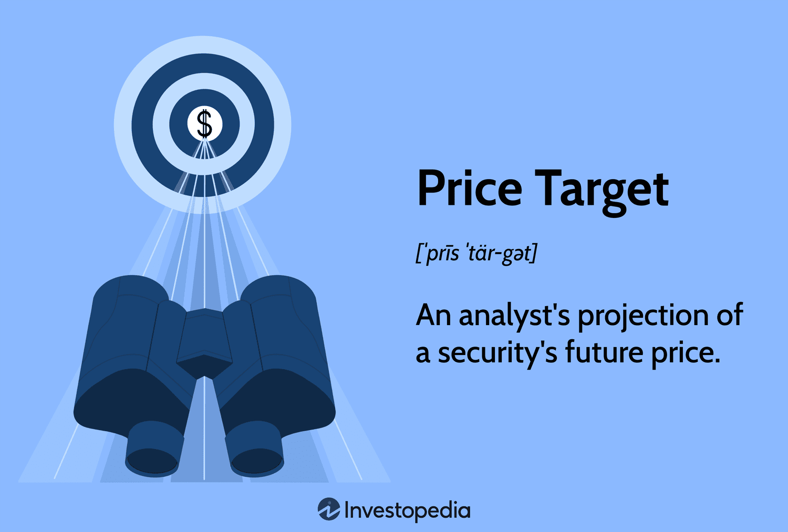

## Table of Contents

## What is a price target in stock analysis?

A price target in stock analysis is a prediction made by financial analysts about where they think a stock's price will go in the future. It's like a goalpost that helps investors decide if they should buy, sell, or hold onto a stock. Analysts look at many things to come up with a price target, like the company's earnings, how the industry is doing, and what's happening in the economy.

These predictions are not always right, but they give investors a good idea of what might happen. If the current price of a stock is lower than the price target, it might be a good time to buy because the stock could go up. On the other hand, if the stock's price is higher than the target, it might be a good time to sell because the stock could go down. Remember, price targets are just estimates and the stock market can be unpredictable.

## How do analysts determine a price target for a stock?

Analysts use a mix of different methods to figure out a price target for a stock. They look at the company's financial health, like how much money it makes and how much it spends. They also check out what the company might do in the future, like if it's going to grow or if it's going to have problems. Another big thing they look at is what's happening in the world, like the economy and what other companies in the same business are doing. All these pieces help analysts make a guess about where the stock price might go.

Sometimes, analysts use math formulas to help them. These formulas, called valuation models, take the company's numbers and turn them into a price target. Two common models are the Discounted Cash Flow (DCF) model, which looks at how much money the company will make in the future, and the Price-to-Earnings (P/E) ratio, which compares the stock price to the company's earnings. By using these models and their own research, analysts can come up with a price target that they think makes sense for the stock.

## What are the common methods used for calculating price targets?

Analysts use different methods to figure out a price target for a stock. One common way is the Discounted Cash Flow (DCF) model. This method looks at how much money a company is expected to make in the future. The idea is to guess all the money the company will bring in and then figure out what that money is worth today. It's like saying, "If I get $100 in the future, how much is that worth to me right now?" This helps analysts see if the stock is a good buy based on future earnings.

Another popular method is the Price-to-Earnings (P/E) ratio. This compares the stock's current price to the company's earnings per share. If a company makes $1 per share and the stock costs $20, the P/E ratio is 20. Analysts use this to see if the stock is priced right compared to other companies in the same industry. They might look at the average P/E ratio for similar companies and use that to set a price target.

Sometimes, analysts also use other methods like the Price-to-Book (P/B) ratio, which compares the stock's market value to its book value, or the Dividend Discount Model (DDM), which focuses on the dividends a company pays out. Each method gives a different view of the stock's value, and analysts often use a mix of these to come up with a final price target.

## What is the difference between a price target and a stock's current market price?

A price target is what financial analysts think a stock's price will be in the future. It's like a guess or prediction based on lots of information about the company and the market. The current market price, on the other hand, is what the stock is actually selling for right now. It's the price you would pay if you bought the stock today.

The big difference is that the price target is a future goal, while the current market price is what's happening at this very moment. If the price target is higher than the current market price, it might mean the stock is a good buy because it could go up. If the price target is lower, it might be a sign to sell because the stock could go down. But remember, price targets are just predictions and the stock market can be unpredictable.

## How often do analysts update their price targets?

Analysts usually update their price targets when there's new information about the company or the market. This could be after the company releases its earnings report, when there are big changes in the industry, or if something important happens in the economy. They want to make sure their predictions are as accurate as possible, so they keep an eye out for anything that might change how they think about the stock's future price.

How often these updates happen can vary a lot. Some analysts might change their price targets every few months, while others might do it more often, like every month or even every week if there's a lot going on. It all depends on how fast things are changing and how much new information comes out. So, if you're looking at price targets, it's a good idea to check when they were last updated to get the most current view.

## What factors can influence the accuracy of a price target?

Many things can make a price target more or less accurate. One big thing is how good the information is that the analyst uses. If the analyst has all the latest numbers and knows what's going on with the company and the market, their price target might be pretty close to the mark. But if they're missing important details or using old data, their guess might be way off. Also, how well the analyst understands the company and the industry matters a lot. If they know a lot about it, they can make better predictions.

Another thing that can affect how right a price target is, is how unpredictable the market can be. Things like big news events, changes in the economy, or even what other investors are doing can make stock prices jump around a lot. These surprises can throw off even the best guesses. Plus, sometimes the company itself does something unexpected, like announcing a new product or having a big problem, which can change its stock price a lot. So, even with all the careful analysis, there's always a chance that something unexpected will make the price target not as accurate as hoped.

## How can investors use price targets in their investment strategy?

Investors can use price targets as a guide to help them decide when to buy or sell a stock. If a price target is higher than the current price, it might be a good time to buy the stock because it could go up. On the other hand, if the price target is lower than the current price, it might be a good idea to sell the stock before it goes down. Price targets give investors a goal to aim for, helping them make smarter choices about their investments.

But, it's important to remember that price targets are just predictions and they can be wrong. The stock market can change quickly because of things like news events or changes in the economy. So, investors shouldn't rely only on price targets. They should also look at other things like the company's financial health and what's happening in the world. By using price targets along with other information, investors can make better decisions and maybe even make more money.

## What are the limitations of relying on price targets for investment decisions?

Price targets can be helpful, but they have some big problems. One problem is that they are just guesses. Analysts use a lot of information to make their predictions, but they can still be wrong. The stock market can change quickly because of things like news events or changes in the economy. So, even if an analyst thinks a stock will go up, it might go down instead. This means that if you only use price targets to make decisions, you could lose money.

Another problem is that price targets are just one piece of the puzzle. They don't tell you everything about a stock. For example, they don't show you how risky a stock might be or what's happening with the company's management. If you only look at price targets, you might miss important details that could affect your investment. It's better to use price targets along with other information, like the company's financial health and what's happening in the world, to make smarter choices.

## How do you measure the accuracy of price targets over time?

To measure the accuracy of price targets over time, you can look at how often the stock actually reaches the price that analysts predicted. You do this by keeping track of the price targets set by analysts and then comparing those targets to the actual stock prices at the time the targets were supposed to be met. If a stock hits the price target a lot, it means the analysts were pretty good at guessing where the price would go. If the stock rarely hits the target, it shows that the predictions were not very accurate.

Another way to measure accuracy is by looking at how close the actual stock price gets to the price target, even if it doesn't hit it exactly. You can figure out the average difference between the price targets and the actual prices. If this difference is small, it means the price targets were pretty close to what happened. If the difference is big, it shows that the predictions were way off. By doing these checks over time, you can see if price targets are getting better or worse at predicting stock prices.

## What advanced statistical models are used to improve price target accuracy?

To make price targets more accurate, analysts often use advanced statistical models like [machine learning](/wiki/machine-learning) and regression analysis. Machine learning can look at huge amounts of data, like past stock prices, company earnings, and even what people are saying on social media. It uses this information to find patterns and make predictions about where stock prices might go. This can be better than older methods because it can keep learning and getting better over time. Regression analysis, on the other hand, helps by figuring out how different things, like interest rates or how the economy is doing, affect stock prices. By understanding these relationships, analysts can make more accurate price targets.

Another model that helps is the Monte Carlo simulation. This method runs many different scenarios to see how a stock might perform under different conditions. It's like playing out many possible futures and seeing what happens to the stock price in each one. This can give analysts a better idea of the range of possible outcomes, helping them set price targets that are more likely to be right. By using these advanced models, analysts can improve their predictions and give investors better information to make their decisions.

## How do market conditions affect the reliability of price targets?

Market conditions can really shake up how reliable price targets are. When the market is calm and things are going smoothly, price targets might be pretty close to what happens. Analysts can look at how the company is doing and what's happening in the economy to make good guesses. But if the market gets wild, like when there's a big surprise or a lot of ups and downs, those guesses can be way off. Things like a sudden change in interest rates, a big news event, or even a global crisis can make stock prices jump around a lot, making it hard for analysts to predict where they'll go.

Even when the market is steady, other things can still mess with price targets. For example, if a company does something unexpected, like announcing a new product or having a big problem, it can change its stock price a lot. Also, what other investors are doing can affect the stock price. If everyone starts buying or selling a stock at the same time, it can move the price away from what analysts thought it would be. So, while price targets can be helpful, they're always a bit of a guess, and market conditions can make that guess more or less reliable.

## Can machine learning enhance the precision of price target calculations?

Machine learning can really help make price targets more accurate. It's like a super smart computer that can look at tons of information, like past stock prices, how much money a company makes, and even what people are saying online. By finding patterns in all this data, machine learning can guess where a stock's price might go better than older ways of doing it. It keeps learning and getting better over time, so the more data it sees, the more accurate its predictions can become.

But, even with machine learning, there are still things that can make price targets less reliable. The stock market can be unpredictable, and big surprises like changes in the economy or news events can make stock prices jump around a lot. Machine learning can help, but it can't predict everything. So, while it can make price targets more precise, it's still important to use other information and be ready for the unexpected when making investment choices.

## How can we calculate the accuracy of price targets?

Accuracy in price target calculation is crucial for determining the reliability of an [algorithmic trading](/wiki/algorithmic-trading) strategy. Accurate price targets enable traders to assess risks effectively and optimize their strategies for better returns. One of the primary methods to quantify accuracy is by comparing predicted price targets against actual market outcomes over a specific period. This comparison helps traders evaluate whether their models are able to anticipate market movements effectively.

To assess the performance of a trading strategy, several metrics can be utilized. The win rate, which is the percentage of trades that result in a profit, provides a straightforward measure of success. A high win rate indicates that the price targets are often accurate, aligning well with actual market movements. However, it should not be the sole metric used, as it does not account for the magnitude of profits or losses.

The Sharpe ratio is another vital metric that helps in evaluating trading strategies by considering both the risk and return. It is calculated as:

$$

\text{Sharpe Ratio} = \frac{E(R_p) - R_f}{\sigma_p} 
$$

where:
- $E(R_p)$ is the expected return of the portfolio,
- $R_f$ is the risk-free rate,
- $\sigma_p$ is the standard deviation of the portfolio's excess return.

The Sharpe ratio essentially measures the additional return per unit of risk, providing a comprehensive view of the trading strategy's efficiency. Higher values are favorable, indicating better risk-adjusted returns.

Regular [backtesting](/wiki/backtesting) of algorithms and historical data analysis are indispensable for refining the accuracy of price targets. Backtesting involves simulating a trading strategy on historical data to evaluate its performance. This process helps in identifying the strengths and weaknesses of the model, allowing for necessary adjustments. By analyzing historical trends, traders can better understand market behaviors and adjust their models to accommodate these patterns.

To implement backtesting in Python, traders commonly use libraries like `pandas` for data manipulation and `[backtrader](/wiki/backtrader)` for strategy testing. A simple example might involve loading historical price data into a pandas DataFrame, applying the trading strategy, and evaluating the outcomes against historical movements. Here is a basic example for a Python script implementing backtesting:

```python
import pandas as pd
import backtrader as bt

# Load historical data
data = pd.read_csv('historical_data.csv', parse_dates=True, index_col='Date')

# Define a simple moving average strategy
class SmaCross(bt.SignalStrategy):
    def __init__(self):
        sma1, sma2 = bt.ind.SMA(period=10), bt.ind.SMA(period=30)
        self.signal_add(bt.SIGNAL_LONG, bt.ind.CrossOver(sma1, sma2))

# Set up Cerebro engine
cerebro = bt.Cerebro()
cerebro.addstrategy(SmaCross)

# Add data feed to Cerebro
data_feed = bt.feeds.PandasData(dataname=data)
cerebro.adddata(data_feed)

# Run the strategy
cerebro.run()

# Plot the result
cerebro.plot()
```

In this example, the strategy uses a simple crossover of two moving averages to generate buy and sell signals. Backtesting such strategies against historical data highlights potential profitability and robustness before they are implemented in real-time trading scenarios.

## References & Further Reading

[1]: Bergstra, J., Bardenet, R., Bengio, Y., & Kégl, B. (2011). ["Algorithms for Hyper-Parameter Optimization."](https://dl.acm.org/doi/10.5555/2986459.2986743) Advances in Neural Information Processing Systems 24.

[2]: ["Advances in Financial Machine Learning"](https://www.amazon.com/Advances-Financial-Machine-Learning-Marcos/dp/1119482089) by Marcos Lopez de Prado

[3]: ["Evidence-Based Technical Analysis: Applying the Scientific Method and Statistical Inference to Trading Signals"](https://www.amazon.com/Evidence-Based-Technical-Analysis-Scientific-Statistical/dp/0470008741) by David Aronson

[4]: ["Machine Learning for Algorithmic Trading"](https://github.com/stefan-jansen/machine-learning-for-trading) by Stefan Jansen

[5]: ["Quantitative Trading: How to Build Your Own Algorithmic Trading Business"](https://www.amazon.com/Quantitative-Trading-Build-Algorithmic-Business/dp/1119800064) by Ernest P. Chan