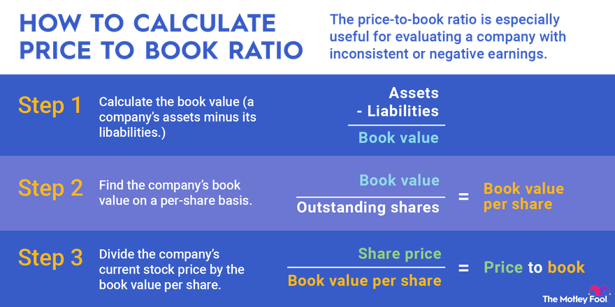

## Table of Contents

## What is the Price-To-Book Ratio (P/B Ratio)?

The Price-To-Book Ratio, often called the P/B Ratio, is a way to figure out if a company's stock is a good buy. It compares the market price of a company's stock to its book value. The book value is what the company would be worth if it sold all its assets and paid off all its debts. To find the P/B Ratio, you divide the stock's current market price by its book value per share. A lower P/B Ratio might mean the stock is undervalued, which could be a good investment opportunity.

However, the P/B Ratio isn't perfect and should be used with other financial measures. Different industries have different average P/B Ratios, so it's important to compare companies within the same industry. For example, tech companies might have higher P/B Ratios than manufacturing companies. Also, the P/B Ratio might not be very useful for companies with lots of intangible assets, like brand value or intellectual property, because these aren't always included in the book value. So, while the P/B Ratio can be a helpful tool, it's best used alongside other financial analysis methods.

## How is the P/B Ratio calculated?

The P/B Ratio is calculated by dividing the current market price of a company's stock by its book value per share. The market price is what you would pay to buy one share of the company's stock right now. The book value per share is found by taking the total book value of the company (which is the value of all its assets minus all its liabilities) and dividing it by the number of outstanding shares.

For example, if a company's stock is trading at $50 per share and its book value per share is $25, the P/B Ratio would be 2. This means the market price is twice the book value. The P/B Ratio helps investors see if a stock might be overvalued or undervalued. If the ratio is low, it might mean the stock is a good deal, but you should also look at other financial measures to make sure.

## Why is the P/B Ratio important in company evaluation?

The P/B Ratio is important in company evaluation because it helps investors understand if a stock is priced right compared to its actual worth. By comparing the market price of a stock to its book value, the P/B Ratio gives a quick snapshot of whether a company might be a good buy. A low P/B Ratio could mean the stock is undervalued, which might be a good investment opportunity. On the other hand, a high P/B Ratio might suggest the stock is overvalued, and investors might want to be cautious.

However, the P/B Ratio isn't perfect and should be used with other financial measures. It's especially useful when comparing companies within the same industry, as different industries have different average P/B Ratios. For example, tech companies often have higher P/B Ratios than manufacturing companies. Also, the P/B Ratio might not be very helpful for companies with lots of intangible assets, like brand value or intellectual property, because these aren't always included in the book value. So, while the P/B Ratio can be a helpful tool, it's best used alongside other financial analysis methods to get a full picture of a company's value.

## What does a high P/B Ratio indicate about a company?

A high P/B Ratio means that a company's stock price is high compared to its book value. This could mean that investors think the company will do really well in the future. They might believe the company will make more money or grow a lot, so they're willing to pay more for the stock now.

But a high P/B Ratio can also mean the stock is overvalued. It might be too expensive compared to what the company is really worth. If the company doesn't do as well as expected, the stock price could go down, and investors could lose money. So, a high P/B Ratio can be a warning sign to be careful and look at other things before deciding to buy the stock.

## What does a low P/B Ratio suggest about a company's valuation?

A low P/B Ratio means that a company's stock price is low compared to its book value. This could mean that the stock is undervalued, which is good news for investors. It might be a good time to buy the stock because it's cheaper than what the company is actually worth. Investors might see this as a chance to buy a good company at a lower price and make money later when the stock price goes up.

However, a low P/B Ratio doesn't always mean the stock is a great buy. It could also mean that the company is having problems. Maybe it's not making enough money, or it has a lot of debt. Investors need to look at other things like the company's earnings, how much debt it has, and what's happening in the industry before deciding to buy the stock. A low P/B Ratio is just one piece of the puzzle, and it's important to look at the whole picture.

## How does the P/B Ratio differ from other valuation metrics like P/E Ratio?

The P/B Ratio and the P/E Ratio are both used to see if a company's stock is a good buy, but they look at different things. The P/B Ratio compares the stock's market price to its book value, which is what the company would be worth if it sold everything and paid off all its debts. A low P/B Ratio might mean the stock is undervalued and could be a good investment. On the other hand, the P/E Ratio compares the stock's market price to its earnings per share. It shows how much investors are willing to pay for each dollar the company earns. A low P/E Ratio can also mean the stock is undervalued, but it focuses more on the company's profits.

These two ratios can give different views of a company's value. The P/B Ratio is really useful for companies with lots of tangible assets like buildings or machines because it looks at the company's net worth. It's not as helpful for companies with lots of intangible assets like brand value or patents because those aren't always included in the book value. The P/E Ratio, however, is good for comparing companies in the same industry and seeing how their earnings stack up. It can show if a company is expected to grow a lot in the future. Both ratios are important, but they tell different stories about a company's value, so it's good to use them together with other financial measures to get a full picture.

## Can the P/B Ratio be used effectively for all types of industries?

The P/B Ratio can be useful for some industries but not for all. It works well for industries where companies have lots of tangible assets like buildings, machines, or land. For example, in real estate or manufacturing, the P/B Ratio can help show if a company's stock is a good buy compared to its actual worth. Investors can use it to see if the stock is undervalued or overvalued based on the company's assets.

However, the P/B Ratio isn't as helpful for industries with lots of intangible assets like brand value, patents, or software. Companies in tech or pharmaceuticals might have high value in things you can't touch, which aren't always included in the book value. So, using the P/B Ratio alone for these industries might not give a clear picture of the company's true value. It's important to look at other financial measures too, to get a full understanding of a company's worth across different industries.

## What are the limitations of using the P/B Ratio for company valuation?

The P/B Ratio has some problems when you use it to figure out if a company is a good investment. One big problem is that it doesn't work well for companies that have lots of things you can't touch, like brand names or special ideas. These things aren't counted in the book value, so the P/B Ratio might make the company look less valuable than it really is. Also, the P/B Ratio can be tricky because it depends on how the company decides to value its stuff. If they use different ways to figure out what their stuff is worth, the P/B Ratio might not be fair to compare between companies.

Another issue with the P/B Ratio is that it doesn't tell you about how well the company is doing right now or how it might do in the future. It only looks at what the company would be worth if it sold everything today, not how much money it's making or losing. So, a company might have a low P/B Ratio, but if it's not making money or has a lot of debt, it might not be a good investment. That's why you should always use the P/B Ratio with other ways to check a company's value, like looking at its earnings or how much cash it has.

## How can the P/B Ratio be used in conjunction with other financial ratios for a more comprehensive analysis?

The P/B Ratio can be used with other financial ratios to get a fuller picture of a company's value. For example, you can use the P/B Ratio with the P/E Ratio, which looks at a company's earnings. The P/E Ratio tells you how much investors are willing to pay for each dollar the company earns. By comparing these two ratios, you can see if a company is undervalued or overvalued based on both its assets and its earnings. If a company has a low P/B Ratio and a low P/E Ratio, it might be a good investment because it's cheap compared to what it's worth and what it earns.

Another useful ratio to use with the P/B Ratio is the Debt-to-Equity Ratio, which shows how much debt a company has compared to its equity. A high Debt-to-Equity Ratio might mean the company has a lot of debt, which could be risky. If a company has a low P/B Ratio but a high Debt-to-Equity Ratio, it might not be as good an investment as it looks because the company might be in financial trouble. By looking at these ratios together, you can get a better idea of whether a company is a good buy or not. It's always important to use several different measures to make sure you're making a smart investment decision.

## What historical P/B Ratio trends should investors be aware of when evaluating a company?

When investors look at a company's P/B Ratio over time, they can see if it's going up or down. If the P/B Ratio is usually low but suddenly goes up a lot, it might mean people think the company will do better in the future. But if the P/B Ratio keeps going down, it could mean the company is having problems, or people don't think it will do well. It's good to compare a company's P/B Ratio now with what it was in the past to see if it's a good time to buy the stock.

Also, investors should look at how the P/B Ratio changes compared to other companies in the same industry. If a company's P/B Ratio is lower than others in its industry, it might be a good deal. But if it's higher, it could be overvalued. By checking the P/B Ratio over time and against other companies, investors can make better choices about when to buy or sell a stock.

## How do accounting practices affect the P/B Ratio, and what adjustments might be necessary?

Accounting practices can change the P/B Ratio because they decide how a company's assets and debts are counted. Different ways of counting things like how much stuff is worth or how long it will last can make the book value different. If a company uses a way that makes its assets worth less, the P/B Ratio might look higher than it should be. On the other hand, if the company uses a way that makes its assets worth more, the P/B Ratio might look lower. So, the P/B Ratio can be different depending on the accounting rules the company follows.

To fix this, investors might need to make some changes to the numbers. They can look at the company's financial reports and see if there are any big differences in how things are counted. For example, if a company uses a different way to count its buildings or machines, investors might want to change those numbers to match what other companies do. This can help make the P/B Ratio more fair to compare between companies. By making these changes, investors can get a better idea of if a company's stock is a good buy or not.

## What advanced techniques can be used to interpret the P/B Ratio in the context of market cycles and economic conditions?

When looking at the P/B Ratio, it's important to think about where we are in the market cycle and what's going on with the economy. During a bull market, when stock prices are going up, the P/B Ratio might be higher because investors are more excited about future growth. They're willing to pay more for stocks, so even if a company's book value stays the same, its market price might go up, making the P/B Ratio higher. On the other hand, in a bear market, when stock prices are falling, the P/B Ratio might be lower because people are more worried and less willing to pay high prices for stocks. So, understanding the market cycle can help you see if a high or low P/B Ratio is normal or if it's a sign of something else.

Economic conditions also play a big role in how you should look at the P/B Ratio. During good economic times, when companies are making more money and growing, a higher P/B Ratio might be okay because it shows that investors expect the company to keep doing well. But during tough economic times, like a recession, a lower P/B Ratio might be more common because companies are struggling, and investors are more cautious. By thinking about the economy, you can better understand if a company's P/B Ratio is a good sign or a warning sign. It's all about looking at the bigger picture and not just the numbers.

## What is the Price-To-Book (P/B) Ratio and how can it be understood?

The Price-To-Book (P/B) ratio is a key metric in financial analysis used to compare a company's market value to its book value. It provides insight into how much investors are willing to pay for each dollar of a company's net assets. This ratio is calculated by dividing the market price per share by the book value per share:

$$
\text{P/B Ratio} = \frac{\text{Market Price per Share}}{\text{Book Value per Share}}
$$

A P/B ratio of less than one may indicate that a stock is undervalued, suggesting it is priced lower than the company's inherent value. Conversely, a P/B ratio greater than one might be interpreted as the stock being potentially overvalued, implying the market price exceeds the value recorded on the company's balance sheet.

Despite its utility, the P/B ratio has limitations, particularly concerning companies with significant intangible assets. Intangible assets, such as patents, trademarks, and goodwill, are not adequately reflected in the book value, potentially leading to skewed P/B ratios. This is especially pertinent for technology and service-oriented companies, where intangible assets form a considerable portion of their overall value. Consequently, while the P/B ratio is a useful tool in financial analysis, it should be employed alongside other metrics to provide a comprehensive view of a company's valuation.

## How can the P/B Ratio be integrated into financial analysis?

The Price-To-Book (P/B) ratio is a critical component for investors assessing the valuation of a company, especially when attempting to identify potential investment opportunities among industry peers. A primary function of the P/B ratio is to provide a snapshot of a company's financial health and how the market perceives its value. By comparing a company's current market price to its book value, investors can determine if the stock is undervalued or overvalued in relation to its peers. 

Mathematically, the P/B ratio is calculated as follows:

$$
\text{P/B Ratio} = \frac{\text{Market Price per Share}}{\text{Book Value per Share}}
$$

This ratio allows investors to ascertain the degree to which the market is valuing the company against its net assets. A lower P/B ratio relative to industry averages might indicate that a company is undervalued, suggesting a potentially attractive investment opportunity. Conversely, a higher P/B ratio could imply overvaluation, which may necessitate caution or further investigation.

However, it is important to contextualize the P/B ratio with industry-specific insights. Each industry has different benchmarks that indicate standard valuation metrics. Comparing a company's P/B ratio to these industry averages provides a more grounded view of its valuation status. Furthermore, integrating the P/B ratio with other financial metrics, such as the Price-to-Earnings (P/E) ratio or Return on Equity (ROE), can reveal deeper insights into the company's overall financial health.

Over time, fluctuations in the P/B ratio can indicate changes in a company's financial health or shifts in market sentiment. For instance, a declining P/B ratio may suggest deteriorating asset value or growing market skepticism, whereas an increasing ratio might reflect asset appreciation or heightened market confidence. By monitoring these changes, investors can better gauge the trajectory of a company’s financial standing and adjust their investment strategies accordingly.

Therefore, while the P/B ratio is a powerful tool, it is most effective when used in conjunction with other financial indicators and industry context, ensuring a comprehensive and nuanced approach to financial analysis and investment decision-making.

## References & Further Reading

[1]: Bergstra, J., Bardenet, R., Bengio, Y., & Kégl, B. (2011). ["Algorithms for Hyper-Parameter Optimization."](https://dl.acm.org/doi/10.5555/2986459.2986743) Advances in Neural Information Processing Systems 24.

[2]: ["Advances in Financial Machine Learning"](https://www.amazon.com/Advances-Financial-Machine-Learning-Marcos/dp/1119482089) by Marcos Lopez de Prado

[3]: ["Evidence-Based Technical Analysis: Applying the Scientific Method and Statistical Inference to Trading Signals"](https://www.amazon.com/Evidence-Based-Technical-Analysis-Scientific-Statistical/dp/0470008741) by David Aronson

[4]: ["Machine Learning for Algorithmic Trading"](https://github.com/stefan-jansen/machine-learning-for-trading) by Stefan Jansen

[5]: ["Quantitative Trading: How to Build Your Own Algorithmic Trading Business"](https://www.amazon.com/Quantitative-Trading-Build-Algorithmic-Business/dp/1119800064) by Ernest P. Chan