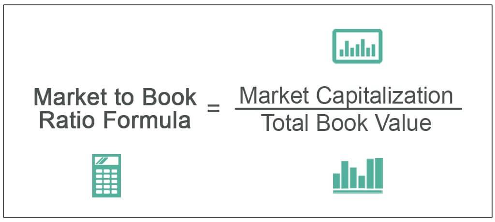

Understanding company valuation and financial analysis is crucial for investors aiming to optimize their investment strategies. Among the various tools available, the Price-To-Book (P/B) ratio stands out for its ability to evaluate a company's market value relative to its book value. This metric offers a window into how much investors are willing to pay for each dollar of a company's net assets, thereby helping in assessing whether a stock is undervalued or overvalued.

Algorithmic trading has emerged as a modern approach that leverages automated systems to execute trades based on predefined strategies and criteria. These systems enable the integration of financial analysis metrics, such as the P/B ratio, into trading algorithms. By grounding trading decisions in quantitative data, they enhance decision-making processes, making them more efficient and effective.



The combination of P/B ratio financial analysis with algorithmic trading techniques holds the promise of smarter and more efficient trading strategies. This article will explore this integration, providing insights into how investors can leverage these tools for improved investment outcomes. By understanding and utilizing the P/B ratio within algorithmic trading frameworks, investors can better navigate the complexities of the financial markets and enhance their competitive edge.

## Table of Contents

## Understanding the Price-To-Book (P/B) Ratio

The Price-To-Book (P/B) ratio is a key metric in financial analysis used to compare a company's market value to its book value. It provides insight into how much investors are willing to pay for each dollar of a company's net assets. This ratio is calculated by dividing the market price per share by the book value per share:

$$
\text{P/B Ratio} = \frac{\text{Market Price per Share}}{\text{Book Value per Share}}
$$

A P/B ratio of less than one may indicate that a stock is undervalued, suggesting it is priced lower than the company's inherent value. Conversely, a P/B ratio greater than one might be interpreted as the stock being potentially overvalued, implying the market price exceeds the value recorded on the company's balance sheet.

Despite its utility, the P/B ratio has limitations, particularly concerning companies with significant intangible assets. Intangible assets, such as patents, trademarks, and goodwill, are not adequately reflected in the book value, potentially leading to skewed P/B ratios. This is especially pertinent for technology and service-oriented companies, where intangible assets form a considerable portion of their overall value. Consequently, while the P/B ratio is a useful tool in financial analysis, it should be employed alongside other metrics to provide a comprehensive view of a company's valuation.

## Integrating the P/B Ratio into Financial Analysis

The Price-To-Book (P/B) ratio is a critical component for investors assessing the valuation of a company, especially when attempting to identify potential investment opportunities among industry peers. A primary function of the P/B ratio is to provide a snapshot of a company's financial health and how the market perceives its value. By comparing a company's current market price to its book value, investors can determine if the stock is undervalued or overvalued in relation to its peers. 

Mathematically, the P/B ratio is calculated as follows:

$$
\text{P/B Ratio} = \frac{\text{Market Price per Share}}{\text{Book Value per Share}}
$$

This ratio allows investors to ascertain the degree to which the market is valuing the company against its net assets. A lower P/B ratio relative to industry averages might indicate that a company is undervalued, suggesting a potentially attractive investment opportunity. Conversely, a higher P/B ratio could imply overvaluation, which may necessitate caution or further investigation.

However, it is important to contextualize the P/B ratio with industry-specific insights. Each industry has different benchmarks that indicate standard valuation metrics. Comparing a company's P/B ratio to these industry averages provides a more grounded view of its valuation status. Furthermore, integrating the P/B ratio with other financial metrics, such as the Price-to-Earnings (P/E) ratio or Return on Equity (ROE), can reveal deeper insights into the company's overall financial health.

Over time, fluctuations in the P/B ratio can indicate changes in a company's financial health or shifts in market sentiment. For instance, a declining P/B ratio may suggest deteriorating asset value or growing market skepticism, whereas an increasing ratio might reflect asset appreciation or heightened market confidence. By monitoring these changes, investors can better gauge the trajectory of a company’s financial standing and adjust their investment strategies accordingly.

Therefore, while the P/B ratio is a powerful tool, it is most effective when used in conjunction with other financial indicators and industry context, ensuring a comprehensive and nuanced approach to financial analysis and investment decision-making.

## Algorithmic Trading: A Modern Investment Approach

Algorithmic trading leverages computerized systems and advanced algorithms to execute trades automatically based on predefined criteria, offering a contemporary and efficient approach to market participation. This modern method is characterized by its ability to process extensive datasets and execute trades at speeds that far surpass human capabilities. By integrating financial ratios, such as the Price-To-Book (P/B) ratio, into these algorithms, traders can improve decision-making processes by anchoring their trades in quantitative data.

The essence of [algorithmic trading](/wiki/algorithmic-trading) lies within its automated structure, allowing traders to set specific rules for both trade entries and exits. These criteria can encompass a variety of data points, including financial metrics, historical price patterns, and market signals. Once the conditions are met, trades are executed without the need for manual intervention, ensuring quick responses to market changes and reducing the likelihood of emotional biases influencing decisions.

Integrating financial ratios like the P/B ratio into algorithmic trading systems enables these systems to make more informed trading decisions. The P/B ratio aids in assessing the valuation of a company by comparing its market price to its book value. Incorporating such a ratio ensures that trades are not only based on market technicalities but also on underlying financial grounds. This can potentially enhance the reliability and profitability of trading strategies.

One of the significant advantages of algorithmic trading is its ability to analyze voluminous datasets with great efficiency. These systems can evaluate financial data across a spectrum of industries, scrutinizing aspects like market trends, company valuations, and trading volumes instantaneously. By leveraging these capabilities, algorithmic systems can swiftly identify trading opportunities that align with the predefined criteria, giving traders a competitive edge in rapidly changing markets.

For example, a simple Python snippet to illustrate integrating P/B ratio in an algorithmic strategy might look like the following:

```python
def evaluate_trades(data, pb_threshold=1.0):
    trades = []
    for company in data:
        if company['market_price'] / company['book_value'] < pb_threshold:
            trades.append({'Company': company['name'], 'Action': 'Buy'})
        else:
            trades.append({'Company': company['name'], 'Action': 'Hold/Sell'})
    return trades
```

This piece of code evaluates a list of companies, recommending a 'Buy' action for those with a P/B ratio below a specified threshold, which could indicate undervaluation. It exemplifies how algorithmic systems can use quantitative metrics as a foundation for trade execution decisions.

In conclusion, algorithmic trading, augmented with metrics like the P/B ratio, represents a potent tool for modern investors. By harnessing the power of automated systems, traders can achieve heightened efficiency, faster decision-making, and a robust framework for navigating the complexities of financial markets.

## Strategies for Algorithmic Trading Using P/B Ratio Analysis

Algorithmic trading strategies that incorporate the Price-To-Book (P/B) ratio are designed to automate trading decisions by leveraging quantitative analysis. A foundational approach within such strategies often involves setting a buying threshold, where stocks with a P/B ratio below a predetermined level are considered for purchase. This threshold indicates potential undervaluation, presenting an opportunity for investors to acquire assets potentially trading below their intrinsic value. Conversely, an algorithm may establish sell conditions for stocks exhibiting a high P/B ratio. A high P/B ratio suggests that the market could be overvaluing these stocks, and selling them can potentially maximize profits or minimize losses.

To further enhance the effectiveness and robustness of these strategies, the P/B ratio analysis can be augmented with technical indicators, such as moving averages. Moving averages help in smoothing out price data, providing a clearer picture of price trends over time. For instance, a crossover strategy might be employed, where a short-term moving average crosses above a longer-term moving average, signaling a potential buy, particularly if the P/B ratio also indicates undervaluation.

The integration of P/B ratio analysis with moving averages in a Python-based algorithmic trading system might look as follows:

```python
def calculate_moving_average(prices, window_size):
    return prices.rolling(window=window_size).mean()

def trading_strategy(stock_data):
    buy_signals = []
    sell_signals = []
    short_ma = calculate_moving_average(stock_data['Close'], 20)
    long_ma = calculate_moving_average(stock_data['Close'], 50)

    for i in range(len(stock_data)):
        if stock_data['P/B'][i] < 1 and short_ma[i] > long_ma[i]:
            buy_signals.append(i)
        elif stock_data['P/B'][i] > 3 and short_ma[i] < long_ma[i]:
            sell_signals.append(i)

    return buy_signals, sell_signals
```

This strategy defines buy signals when a stock's P/B ratio is below 1 and the short-term moving average surpasses the long-term moving average, suggesting an upward trend. Sell signals are generated when a stock's P/B ratio exceeds 3 and the short-term moving average is below the long-term one, indicating a likely downward trend.

An essential aspect of developing reliable algorithmic trading systems is [backtesting](/wiki/backtesting). This process involves running the strategy against historical data to assess its effectiveness and adaptiveness to past market conditions. Backtesting allows traders to refine their strategies by understanding how they would have performed in different market scenarios, thereby improving their likelihood of success in live trading environments. It is crucial to ensure that the algorithm is robust and not overfitted to past data, which could lead to suboptimal performance in the future. By regularly backtesting and adjusting the parameters based on evolving market conditions, investors can optimize their algorithmic trading strategies to maintain competitiveness and efficiency in the financial markets.

## Challenges and Considerations

The Price-To-Book (P/B) ratio is a widely used financial metric, but it is important to recognize its limitations, particularly in its treatment of intangible assets. Unlike tangible assets, intangible assets, such as intellectual property, brand recognition, and goodwill, do not always have a precise book value recorded on the balance sheet. This can lead to an undervaluation or misrepresentation of a company's true economic worth when relying solely on the P/B ratio. For instance, tech companies often possess substantial intangible assets that can significantly skew P/B ratios if not properly accounted for, potentially leading to incorrect assessments of value.

Another challenge in using the P/B ratio is its susceptibility to distortion due to market anomalies and trends. Rapid shifts in market sentiment, such as during speculative bubbles or crises, can cause significant discrepancies between market prices and intrinsic values, leading the P/B ratio to provide misleading signals. These anomalies emphasize the importance of contextual analysis when interpreting P/B ratios. Market conditions, economic outlook, and industry-specific factors should all be considered to accurately assess the appropriateness of the P/B ratio for investment decisions.

Investors aiming to make well-rounded decisions must integrate the P/B ratio with a broader array of financial insights. This includes combining it with other financial ratios, such as the Price-to-Earnings (P/E) ratio and Return on Equity (ROE), to paint a comprehensive picture of a company's financial health. Additionally, qualitative factors such as management quality, market conditions, and industry dynamics should be part of the analysis, providing a well-rounded approach to investment decision-making. 

In conclusion, while the P/B ratio offers valuable insights, its limitations necessitate a nuanced approach, blending quantitative metrics with qualitative analysis for more accurate market evaluations.

## Conclusion

The Price-To-Book (P/B) ratio is a valuable metric in financial analysis, offering insights into a company's valuation by comparing its market price to its book value. This ratio becomes particularly powerful when integrated into algorithmic trading systems, where it can guide informed investment decisions. By incorporating the P/B ratio into trading algorithms, investors can systematically identify undervalued stocks for potential acquisition or highlight overvalued ones for selling.

Despite its utility, the P/B ratio has inherent limitations, mainly due to its inability to account for intangible assets such as brand reputation or intellectual property. This highlights the importance of using the P/B ratio in conjunction with other financial ratios and metrics. For instance, combining it with the Price-to-Earnings (P/E) ratio or Return on Equity (ROE) provides a more comprehensive view of a company's financial health and market position. Such multi-faceted analysis enhances the development of investment strategies by providing a robust framework for evaluating potential investments.

As algorithmic trading continues to evolve, the integration of advanced financial metrics within these systems will become increasingly sophisticated. The future of trading is likely to witness a greater emphasis on data-driven decision-making, leveraging complex algorithms capable of processing vast amounts of financial data in real-time. This trend underscores the necessity for investors and traders to effectively harness these tools, ensuring they remain competitive within fast-paced financial markets. By embracing these advancements, market participants can better navigate the complexities of modern investing, ultimately achieving more strategic and successful outcomes.

## References & Further Reading

[1]: Bergstra, J., Bardenet, R., Bengio, Y., & Kégl, B. (2011). ["Algorithms for Hyper-Parameter Optimization."](https://dl.acm.org/doi/10.5555/2986459.2986743) Advances in Neural Information Processing Systems 24.

[2]: ["Advances in Financial Machine Learning"](https://www.amazon.com/Advances-Financial-Machine-Learning-Marcos/dp/1119482089) by Marcos Lopez de Prado

[3]: ["Evidence-Based Technical Analysis: Applying the Scientific Method and Statistical Inference to Trading Signals"](https://www.amazon.com/Evidence-Based-Technical-Analysis-Scientific-Statistical/dp/0470008741) by David Aronson

[4]: ["Machine Learning for Algorithmic Trading"](https://github.com/stefan-jansen/machine-learning-for-trading) by Stefan Jansen

[5]: ["Quantitative Trading: How to Build Your Own Algorithmic Trading Business"](https://www.amazon.com/Quantitative-Trading-Build-Algorithmic-Business/dp/1119800064) by Ernest P. Chan