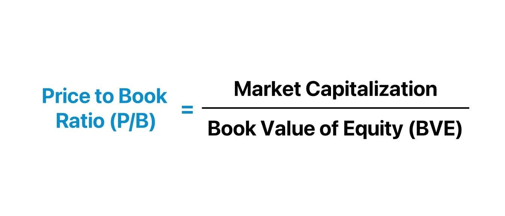

## Table of Contents

## What is the Price-to-Book Ratio?

The Price-to-Book Ratio, often called P/B ratio, is a financial metric that investors use to see if a stock is a good buy. It compares the market price of a company's stock to its book value. The book value is what the company would be worth if it sold all its assets and paid off all its debts. To find the P/B ratio, you divide the stock's current market price by its book value per share. A lower P/B ratio might mean the stock is undervalued, while a higher ratio could suggest it's overvalued.

This ratio is especially useful for looking at companies in industries like banking or insurance, where the value of assets is a big part of their worth. However, the P/B ratio isn't perfect. It doesn't tell the whole story because it doesn't account for things like the company's future growth potential or intangible assets like brand value. So, while it's a helpful tool, investors should use it along with other financial metrics to get a fuller picture of a company's value.

## How is the Price-to-Book Ratio calculated?

The Price-to-Book Ratio, or P/B ratio, is calculated by dividing a company's stock price by its book value per share. The stock price is what you would pay to buy one share of the company on the stock market. The book value per share is found by taking the company's total book value and dividing it by the number of shares outstanding. The total book value is what the company would be worth if it sold all its assets and paid off all its debts.

To make it easier to understand, imagine a company has a stock price of $50 and a book value per share of $25. To find the P/B ratio, you would divide $50 by $25, which gives you a P/B ratio of 2. This means the market price of the stock is twice the company's book value per share. The P/B ratio helps investors see if a stock might be a good deal by comparing what they pay for it to what the company is actually worth on paper.

## Why is the Price-to-Book Ratio important for investors?

The Price-to-Book Ratio is important for investors because it helps them figure out if a stock is priced right. It compares what the stock costs on the market to what the company would be worth if it sold everything and paid off all its debts. If the ratio is low, it might mean the stock is a good deal because you're paying less than the company's book value. If it's high, the stock might be too expensive compared to what the company is actually worth.

This ratio is especially useful for looking at companies in industries like banking or insurance, where the value of their assets is a big part of their worth. But, it's not perfect. The Price-to-Book Ratio doesn't tell you everything about a company. It doesn't consider things like how fast the company might grow in the future or the value of things you can't touch, like a strong brand name. So, while it's a helpful tool, investors should use it along with other ways to check a company's value to get the full picture.

## What does a high Price-to-Book Ratio indicate?

A high Price-to-Book Ratio means that the stock's market price is much higher than what the company would be worth if it sold all its stuff and paid off its debts. This can happen when people think the company will do really well in the future, so they're willing to pay more for the stock now. It's like betting on a horse that everyone thinks will win the race.

But, a high Price-to-Book Ratio can also be a warning sign. It might mean the stock is too expensive compared to what the company is actually worth right now. If the company doesn't live up to the high hopes, the stock price could drop, and investors could lose money. So, it's important to look at other things about the company, not just this one number.

## What does a low Price-to-Book Ratio suggest?

A low Price-to-Book Ratio means the stock's market price is less than what the company would be worth if it sold everything and paid off its debts. This can suggest that the stock might be a good deal. It's like finding a nice shirt at a yard sale for a lot less than you'd pay at a store. Investors might see a low P/B ratio and think the stock is undervalued, meaning it's priced lower than it should be.

However, a low P/B ratio isn't always a sign to buy. Sometimes, a company might have a low ratio because people think it's not doing well or won't do well in the future. It's like a car that looks cheap but might need a lot of repairs. So, investors need to look at other things about the company too, not just the P/B ratio, to decide if it's really a good buy.

## How does the Price-to-Book Ratio differ across industries?

The Price-to-Book Ratio can be different for companies in different industries. For example, in industries like banking and insurance, the P/B ratio is often used a lot. This is because these companies have a lot of assets like buildings, loans, and investments, which are important for figuring out their book value. So, a bank might have a P/B ratio of around 1 or less because people look at their assets to see if they're a good buy. But, if the ratio is much higher, it might mean people think the bank will do really well in the future.

On the other hand, industries like technology or healthcare might have higher P/B ratios. This is because these companies often have a lot of value in things you can't touch, like new ideas, patents, or a strong brand name. These things don't show up in the book value, so the P/B ratio might be higher even if the company is doing well. For example, a tech company might have a P/B ratio of 5 or more because people are willing to pay a lot for their future growth and innovation, even if their current assets don't seem that valuable.

So, when looking at the P/B ratio, it's important to think about the industry the company is in. What might be a high or low ratio in one industry could be normal in another. This helps investors understand if a stock is a good buy or not, by comparing it to other companies in the same industry.

## Can the Price-to-Book Ratio be used to compare companies in different sectors?

The Price-to-Book Ratio can be used to compare companies, but it's not always the best way to compare companies in different sectors. Different industries have different kinds of businesses, and what's normal for one industry might not be normal for another. For example, a bank might have a P/B ratio of around 1 because its value comes from things like buildings and loans. But a tech company might have a P/B ratio of 5 or more because its value comes from things you can't touch, like new ideas and patents. So, comparing a bank's P/B ratio to a tech company's P/B ratio might not tell you much because they're in different kinds of businesses.

To get a better idea of whether a company is a good buy, it's usually better to compare it to other companies in the same sector. This way, you're looking at businesses that are more alike. For example, if you're looking at a tech company, you'd want to see how its P/B ratio compares to other tech companies. If it's lower than most, it might be a good deal. But if you compare it to a bank, the numbers might not make sense because the businesses are too different. So, while the P/B ratio can be useful, it's important to use it in the right way by comparing similar companies.

## What are the limitations of using the Price-to-Book Ratio as an investment metric?

The Price-to-Book Ratio has some problems when you use it to decide if a stock is a good buy. One big problem is that it doesn't think about things you can't touch, like a company's brand name or new ideas. These things can be really important for some businesses, especially in industries like tech or healthcare, but they don't show up in the book value. So, if you only look at the P/B ratio, you might think a company is too expensive when it's actually worth a lot because of its brand or new ideas.

Another problem is that the P/B ratio doesn't tell you about a company's future. It only looks at what the company is worth right now, based on its stuff and debts. But what really matters to investors is how much money the company will make in the future. If a company has a high P/B ratio but people think it will grow a lot, the stock might still be a good buy. So, you need to look at other things too, like how fast the company is growing and what people think about its future, to get a full picture of whether the stock is a good deal.

## How does the Price-to-Book Ratio relate to other financial ratios like P/E ratio?

The Price-to-Book Ratio (P/B ratio) and the Price-to-Earnings Ratio (P/E ratio) are both used by investors to see if a stock is priced right, but they look at different things. The P/B ratio compares the stock's market price to what the company would be worth if it sold all its stuff and paid off its debts. It's like looking at the price tag of a house compared to how much it would cost to build it from scratch. On the other hand, the P/E ratio compares the stock's market price to how much money the company makes in a year. It's like looking at how much you pay for a fruit tree compared to how many fruits it gives you each year.

While the P/B ratio is good for looking at companies with a lot of physical stuff, like banks or factories, the P/E ratio is better for understanding how profitable a company is. A company might have a low P/B ratio, which could mean it's a good deal if you just look at its stuff, but if its P/E ratio is high, it might not be making much money, so it might not be such a good buy after all. Using both ratios together can give investors a fuller picture of a company's value, helping them decide if the stock is worth buying.

## What historical trends can be observed in the Price-to-Book Ratios of major stock indices?

Over time, the Price-to-Book Ratios of major stock indices like the S&P 500 have shown some interesting patterns. In the past, especially in the 1970s and 1980s, the P/B ratios of these indices were usually lower. This means that back then, stocks were often priced closer to what the companies were actually worth on paper. But as time went on, and especially in the 1990s and 2000s, the P/B ratios started to go up. This happened because more companies, especially in tech and other new industries, became valuable for their ideas and future growth, not just their physical stuff.

These days, the P/B ratios of major stock indices are often higher than they used to be. This is because a lot of big companies now have a lot of value in things you can't touch, like brand names and new technology. But the P/B ratio can still go up and down depending on what's happening in the economy and how people feel about the future. For example, during times when people are worried about the economy, like during a recession, the P/B ratios might go down as people want to buy stocks that are closer to their book value. But when people are feeling good about the future, the P/B ratios might go up as they're willing to pay more for stocks they think will grow a lot.

## How do intangible assets affect the Price-to-Book Ratio, and how should investors account for them?

Intangible assets, like a company's brand name, patents, or new ideas, can make the Price-to-Book Ratio (P/B ratio) look higher than it really should be. This is because these things don't show up in the book value, which is what the company would be worth if it sold all its stuff and paid off its debts. So, if a company has a lot of value in things you can't touch, its P/B ratio might be high even if it's doing well. For example, a tech company with a lot of patents might have a high P/B ratio because those patents don't show up in the book value, but they make the company worth a lot.

Investors need to think about intangible assets when they look at the P/B ratio. Just seeing a high P/B ratio might make it seem like the stock is too expensive, but if the company has a lot of value in things like a strong brand or new ideas, it might still be a good buy. To get a better idea, investors should look at other things too, like how much money the company makes and what people think about its future. This way, they can see if the high P/B ratio is because the company is worth a lot more than its book value suggests.

## What advanced techniques can be used to adjust the Price-to-Book Ratio for more accurate company valuation?

To get a better idea of a company's value using the Price-to-Book Ratio, investors can use some advanced techniques to adjust it. One way is to add the value of intangible assets to the book value. Since things like brand names and patents don't show up in the book value, you can estimate how much they're worth and add that to the book value. This makes the P/B ratio more accurate because it includes all the things that make the company valuable, not just the stuff you can touch. Another technique is to use industry-specific adjustments. Different industries have different kinds of businesses, so what's normal for one industry might not be normal for another. By comparing a company's P/B ratio to other companies in the same industry, you can see if it's a good deal or not.

Another advanced technique is to look at the company's future growth and earnings. The P/B ratio only looks at what the company is worth right now, but investors care a lot about how much money the company will make in the future. By using other financial metrics like the Price-to-Earnings Ratio or discounted cash flow analysis, you can get a better idea of the company's future value. This helps you see if the high P/B ratio is because the company is expected to grow a lot, or if it's just overpriced. By combining these techniques, investors can get a fuller picture of a company's value and make better decisions about whether to buy its stock.

## What is the P/B Ratio and how can it be understood?

The Price-to-Book (P/B) Ratio is an essential metric in financial analysis, offering insights into how a firm's market capitalization compares with its book value. This ratio is calculated by dividing the company's current stock price by its book value per share. The formula is expressed as:

$$
\text{P/B Ratio} = \frac{\text{Market Price per Share}}{\text{Book Value per Share}}
$$

Where:
- **Market Price per Share** is the current trading price of a company's stock in the market.
- **Book Value per Share** is determined by taking the company's total assets, subtracting intangible assets and total liabilities, and then dividing the result by the number of outstanding shares.

The P/B Ratio serves as an effective indicator for identifying potentially undervalued businesses. A P/B ratio of less than 1.0 suggests that the market may value the company at less than its book value, which might indicate a potential investment opportunity. This lower valuation can reflect the market's pessimism about a company's future prospects, or it can preemptively highlight undervaluation due to other market inefficiencies. 

However, the significance of the P/B Ratio can vary extensively across different industries. For asset-heavy sectors such as manufacturing or financial services, a lower P/B ratio might be seen as a favorable indicator of value. In contrast, industries that heavily rely on intangible assets, like technology or pharmaceuticals, might naturally exhibit higher P/B ratios, as their book values do not fully capture the worth of intellectual property, brand recognition, or human capital.

Due to these industry-specific variations, it is critical to apply a comprehensive understanding when using the P/B Ratio for valuation assessments. Comparing P/B ratios within the same industry can provide more meaningful insights rather than contrasting them across various sectors.

For value investors seeking undervalued stocks, a P/B ratio under 1.0 is often considered a potential buy signal. By identifying companies that are trading below their book value, investors may discover opportunities to purchase undervalued equities with the expectation that the market will eventually adjust to reflect the company's intrinsic value, thus providing returns. These insights make the P/B Ratio a staple in the toolkit of value investors seeking compelling opportunities in equity markets.

## How do you calculate the P/B Ratio?

The Price-to-Book (P/B) Ratio is a pivotal valuation metric that aids investors in comparing a company's market value with its book value. This ratio is calculated using a straightforward formula:

$$
\text{P/B Ratio} = \frac{\text{Market Price per Share}}{\text{Book Value per Share}}
$$

**Market Price per Share** is typically sourced from public stock market data. It represents the current trading price of a company's stock, readily available through financial news outlets, stock exchange websites, or financial data platforms.

**Book Value per Share** requires a bit more calculation and is derived from a company's balance sheet. It reflects the net value of a company's assets as distributed among its outstanding shares. The formula to calculate Book Value per Share is:

$$
\text{Book Value per Share} = \frac{\text{Total Assets} - \text{Intangible Assets} - \text{Total Liabilities}}{\text{Number of Outstanding Shares}}
$$

Total Assets include everything the company owns that can be converted into cash, while intangible assets are non-physical items such as goodwill, patents, or trademarks that should be subtracted as they do not hold a liquid market value. Total Liabilities encompass financial obligations such as debt and other monetary duties. The Number of Outstanding Shares refers to the total shares currently held by all shareholders.

A clear understanding of these figures is crucial for investors aiming to accurately gauge the P/B Ratio. This evaluation serves as a fundamental tool, especially for those employing value-investing strategies, enabling them to uncover potentially undervalued companies in the stock market. It is important to ensure that the data used in these calculations is up-to-date and accurately reflects the company's financial situation to enhance investment decision-making.

## References & Further Reading

[1]: ["The Little Book That Still Beats the Market"](https://www.amazon.com/Little-Book-Still-Beats-Market/dp/0470624159) by Joel Greenblatt

[2]: ["Value Investing: From Graham to Buffett and Beyond"](https://www.amazon.com/Value-Investing-Second-Graham-Buffett/dp/B08PMKNPBC) by Bruce C. N. Greenwald

[3]: Benoit, D. F. & Pirotte, H. (2010). ["Risk Disclosure, Price Informativeness, and Performance: Does Risk Disclosure Affect Price Informativeness?"](https://livrepository.liverpool.ac.uk/view/doctype/article/2011.html) SSRN Electronic Journal.

[4]: ["Financial Modeling"](https://www.investopedia.com/terms/f/financialmodeling.asp) by Simon Benninga

[5]: ["Valuing a Business, 5th Edition: The Analysis and Appraisal of Closely Held Companies"](https://www.amazon.com/Valuing-Business-5th-McGraw-Hill-Investment/dp/0071441808) by Shannon P. Pratt