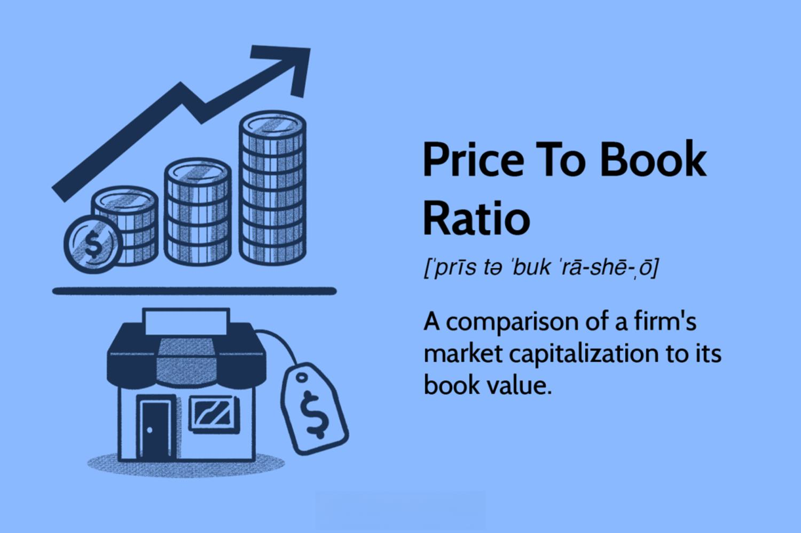

The world of financial metrics encompasses a variety of tools and methods essential for evaluating company performance and making informed investment decisions. Among these tools, the Price-to-Book (P/B) Ratio stands out as a fundamental valuation metric. It is pivotal for assessing a company's market value relative to its book value, offering insights into whether a company might be undervalued or overvalued. In the context of algorithmic trading, SEO (Search Engine Optimization) is vital in ensuring that investors and stakeholders easily access financial metrics such as the P/B Ratio. As financial markets increasingly adopt algorithmic trading strategies, being able to retrieve and utilize these metrics effectively becomes crucial.

This article aims to explore the intricacies of the P/B Ratio, its calculation, and its application in financial assessments. By understanding how this metric is applied within algorithmic trading, investors can gain additional insights into making effective investment choices. The growing interest in algorithmic trading necessitates a comprehensive understanding of such metrics, which are integral to both fundamental analysis and automated trading systems. Through this exploration, the article seeks to provide a clear understanding of the role and importance of the P/B Ratio in modern finance, particularly in the development of intelligent and responsive trading algorithms.



## Table of Contents

## Understanding the P/B Ratio

The Price-to-Book (P/B) Ratio is an essential metric in financial analysis, offering insights into how a firm's market capitalization compares with its book value. This ratio is calculated by dividing the company's current stock price by its book value per share. The formula is expressed as:

$$
\text{P/B Ratio} = \frac{\text{Market Price per Share}}{\text{Book Value per Share}}
$$

Where:
- **Market Price per Share** is the current trading price of a company's stock in the market.
- **Book Value per Share** is determined by taking the company's total assets, subtracting intangible assets and total liabilities, and then dividing the result by the number of outstanding shares.

The P/B Ratio serves as an effective indicator for identifying potentially undervalued businesses. A P/B ratio of less than 1.0 suggests that the market may value the company at less than its book value, which might indicate a potential investment opportunity. This lower valuation can reflect the market's pessimism about a company's future prospects, or it can preemptively highlight undervaluation due to other market inefficiencies. 

However, the significance of the P/B Ratio can vary extensively across different industries. For asset-heavy sectors such as manufacturing or financial services, a lower P/B ratio might be seen as a favorable indicator of value. In contrast, industries that heavily rely on intangible assets, like technology or pharmaceuticals, might naturally exhibit higher P/B ratios, as their book values do not fully capture the worth of intellectual property, brand recognition, or human capital.

Due to these industry-specific variations, it is critical to apply a comprehensive understanding when using the P/B Ratio for valuation assessments. Comparing P/B ratios within the same industry can provide more meaningful insights rather than contrasting them across various sectors.

For value investors seeking undervalued stocks, a P/B ratio under 1.0 is often considered a potential buy signal. By identifying companies that are trading below their book value, investors may discover opportunities to purchase undervalued equities with the expectation that the market will eventually adjust to reflect the company's intrinsic value, thus providing returns. These insights make the P/B Ratio a staple in the toolkit of value investors seeking compelling opportunities in equity markets.

## Calculating the P/B Ratio

The Price-to-Book (P/B) Ratio is a pivotal valuation metric that aids investors in comparing a company's market value with its book value. This ratio is calculated using a straightforward formula:

$$
\text{P/B Ratio} = \frac{\text{Market Price per Share}}{\text{Book Value per Share}}
$$

**Market Price per Share** is typically sourced from public stock market data. It represents the current trading price of a company's stock, readily available through financial news outlets, stock exchange websites, or financial data platforms.

**Book Value per Share** requires a bit more calculation and is derived from a company's balance sheet. It reflects the net value of a company's assets as distributed among its outstanding shares. The formula to calculate Book Value per Share is:

$$
\text{Book Value per Share} = \frac{\text{Total Assets} - \text{Intangible Assets} - \text{Total Liabilities}}{\text{Number of Outstanding Shares}}
$$

Total Assets include everything the company owns that can be converted into cash, while intangible assets are non-physical items such as goodwill, patents, or trademarks that should be subtracted as they do not hold a liquid market value. Total Liabilities encompass financial obligations such as debt and other monetary duties. The Number of Outstanding Shares refers to the total shares currently held by all shareholders.

A clear understanding of these figures is crucial for investors aiming to accurately gauge the P/B Ratio. This evaluation serves as a fundamental tool, especially for those employing value-investing strategies, enabling them to uncover potentially undervalued companies in the stock market. It is important to ensure that the data used in these calculations is up-to-date and accurately reflects the company's financial situation to enhance investment decision-making.

## Interpreting P/B Ratios

The Price-to-Book (P/B) ratio serves as a crucial indicator in financial analysis, providing insights into how the market perceives a company's intrinsic worth relative to its equity. A firm understanding of the implications of different P/B ratios can aid investors in making informed decisions.

A lower P/B ratio can indicate that a company is potentially undervalued. This scenario suggests that the market value of the company is less than its book value, highlighting a potential investment bargain for value investors. Such companies may be overlooked because of temporary setbacks, and their true financial potential remains unrecognized by broader market participants.

Conversely, a high P/B ratio may suggest that a stock is overvalued. In this context, the market is placing a premium on the company's equity, possibly due to anticipated growth prospects, competitive advantages, or favorable market positions. However, this perceived overvaluation demands careful scrutiny as it might not accurately reflect the company's actual financial health or growth potential. 

Another layer of insight can be added by comparing a company's P/B ratio with its Return on Equity (ROE). Discrepancies between the two can signal potential growth opportunities or highlight imbalances. For instance, a company with a high ROE and a low P/B ratio might be undervalued, as its efficient use of equity is not reflected in its market valuation. Conversely, a high P/B ratio paired with a low ROE might indicate overvaluation, suggesting that the stock's market price could be inflated relative to the actual returns generated on equity.

Through careful interpretation, the P/B ratio offers a lens through which investors can assess whether a company's market valuation aligns with its financial fundamentals. By correlating with other key financial indicators, such as ROE, the P/B ratio contributes to a more nuanced understanding of a company's value proposition.

## Limitations of the P/B Ratio

The Price-to-Book (P/B) ratio is a fundamental financial metric offering insights into the valuation of companies. However, it comes with inherent limitations, particularly for firms with substantial intangible assets, such as technology companies. These intangible assets, which may include intellectual property, patents, and brand recognition, often do not appear on the balance sheet or are undervalued, leading to discrepancies in the P/B ratio. Consequently, the book value may fail to accurately reflect the true market value of the company. This discrepancy is partly attributed to variations in accounting standards and practices, which can impact how assets and liabilities are recorded.

Market dynamics and rapid industry transformations can also undermine the P/B ratio's relevance when used in isolation. For instance, during volatile market conditions, the book value may not swiftly adjust to reflect the current financial standing or future potential of a company. This can result in misleading interpretations if the P/B ratio is the sole metric considered.

Therefore, using the P/B ratio in conjunction with other financial valuation measures is crucial. Complementary metrics such as the Price-to-Earnings (P/E) ratio, Return on Equity (ROE), and various cash flow indicators can provide a more comprehensive assessment of a company's value and financial health. By integrating multiple metrics, investors can construct a more nuanced understanding, leading to more informed investment decisions.

## P/B Ratio in Algorithmic Trading

Algorithmic trading utilizes sophisticated computer algorithms to execute trading strategies at high speeds, making decisions based on historical and real-time data analysis. One fundamental metric employed in these strategies is the Price-to-Book (P/B) Ratio. By comparing a company’s market price to its book value, the P/B Ratio aids algorithms in identifying potential investment opportunities. 

Algorithms can incorporate the P/B Ratio alongside various other metrics to filter and select stocks, determining buy or sell actions based on pre-set criteria. For example, a strategy might focus on stocks with low P/B Ratios, indicating undervaluation, as potential buy candidates. Conversely, stocks with high P/B Ratios may be flagged for selling or shorting, assuming they may be overvalued.

In Python, an example algorithm to filter stocks based on the P/B Ratio might look like this:

```python
import pandas as pd

# Sample stock data
data = {
    'Stock': ['AAPL', 'MSFT', 'GOOG', 'AMZN'],
    'Market Price': [150, 250, 2700, 3400],  # in USD
    'Book Value': [134, 210, 1970, 2500]  # in USD
}

df = pd.DataFrame(data)
df['P/B Ratio'] = df['Market Price'] / df['Book Value']

# Define buy criteria: P/B Ratio < 1.5
buy_criteria = df['P/B Ratio'] < 1.5
potential_buys = df[buy_criteria]

print("Stocks to consider buying based on P/B Ratio:")
print(potential_buys[['Stock', 'P/B Ratio']])
```

With the continuous evolution of financial technology, the application of the P/B Ratio within algorithmic frameworks has become increasingly advanced. Algorithms can adapt to rapidly changing market conditions, using [machine learning](/wiki/machine-learning) and data-driven insights to refine strategies regularly. This enhances their ability to exploit market inefficiencies, ensuring strategies remain agile and adaptive.

Moreover, integration of machine learning and big data analytics further enriches the utility of the P/B Ratio in automated trading. By analyzing vast datasets, algorithms can discern patterns that traditional human analysis might miss, providing a competitive edge in executing profitable trades. As financial technology progresses, the sophistication of these algorithms continues to evolve, enabling more precise and effective integration of metrics like the P/B Ratio into investment strategies.

## Conclusion

The Price-to-Book (P/B) Ratio is a fundamental component in financial analysis, offering a critical lens through which the intrinsic value of a company can be evaluated. This ratio is not only foundational but also versatile, applicable in assessing companies across diverse industries. By examining a company's market capitalization relative to its book value, the P/B Ratio provides a snapshot of market perception against the accounting valuation.

When combined with other financial indicators, such as the Earnings Per Share (EPS), Return on Equity (ROE), or Debt-to-Equity (D/E) ratio, the P/B Ratio can yield deeper insights. This multidimensional approach allows both traditional and algorithmic traders to craft more refined strategies, balancing the quantitative rigor with qualitative assessments.

In practice, however, investors must remain cognizant of the P/B Ratio's limitations. For businesses with substantial intangible assets, the ratio may not fully capture intrinsic value, necessitating a nuanced interpretation. Variability in accounting standards and external market fluctuations further complicate the picture, urging investors to employ the P/B Ratio alongside complementary measures for a comprehensive evaluation.

With advancing financial technologies, [algorithmic trading](/wiki/algorithmic-trading) systems increasingly integrate the P/B Ratio to sift through vast datasets, identifying promising investments automatically. These systems can discern patterns and anomalies that might escape traditional analysis. As the field progresses, continued exploration and enhancement of these metrics within algorithmic contexts will likely unveil novel opportunities, driving more informed and effective investment decisions.

## References & Further Reading

[1]: ["The Little Book That Still Beats the Market"](https://www.amazon.com/Little-Book-Still-Beats-Market/dp/0470624159) by Joel Greenblatt

[2]: ["Value Investing: From Graham to Buffett and Beyond"](https://www.amazon.com/Value-Investing-Second-Graham-Buffett/dp/B08PMKNPBC) by Bruce C. N. Greenwald

[3]: Benoit, D. F. & Pirotte, H. (2010). ["Risk Disclosure, Price Informativeness, and Performance: Does Risk Disclosure Affect Price Informativeness?"](https://livrepository.liverpool.ac.uk/view/doctype/article/2011.html) SSRN Electronic Journal.

[4]: ["Financial Modeling"](https://www.investopedia.com/terms/f/financialmodeling.asp) by Simon Benninga

[5]: ["Valuing a Business, 5th Edition: The Analysis and Appraisal of Closely Held Companies"](https://www.amazon.com/Valuing-Business-5th-McGraw-Hill-Investment/dp/0071441808) by Shannon P. Pratt