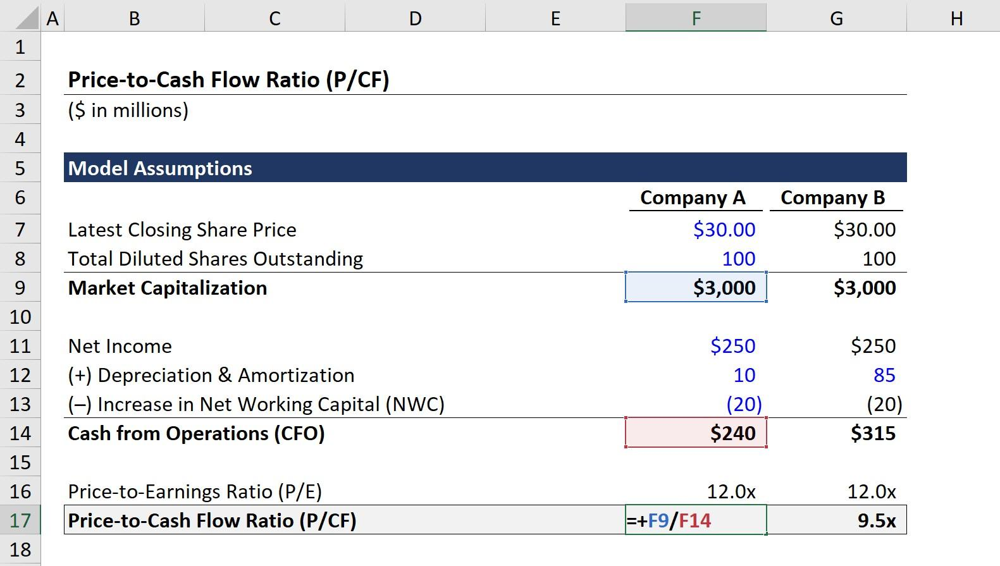

## Table of Contents

## What is the Price-to-Cash-Flow (P/CF) ratio?

The Price-to-Cash-Flow (P/CF) ratio is a financial metric used to evaluate the value of a company's stock. It is calculated by dividing the company's market capitalization by its operating cash flow. This ratio helps investors understand how much they are paying for each dollar of cash flow the company generates. A lower P/CF ratio might suggest that the stock is undervalued, while a higher ratio could indicate that it is overvalued.

The P/CF ratio is particularly useful because it focuses on cash flow, which is harder to manipulate than earnings. Cash flow represents the actual money coming in and going out of a business, providing a clearer picture of its financial health. Investors often use this ratio alongside other valuation metrics like the Price-to-Earnings (P/E) ratio to get a more comprehensive view of a company's value. By comparing the P/CF ratios of different companies within the same industry, investors can make more informed decisions about where to invest their money.

## How is the P/CF ratio calculated?

The P/CF ratio is calculated by dividing a company's market value by its cash flow from operations. The market value is found by multiplying the current stock price by the total number of shares outstanding. This gives you the market capitalization. The cash flow from operations is the amount of cash a company generates from its regular business activities. You can find this number on the company's cash flow statement.

To get the P/CF ratio, you take the market capitalization and divide it by the cash flow from operations. For example, if a company has a market capitalization of $100 million and its cash flow from operations is $10 million, the P/CF ratio would be 10 ($100 million divided by $10 million). This ratio tells investors how much they are paying for each dollar of cash flow the company produces. A lower ratio might mean the stock is a good value, while a higher ratio could suggest it's expensive.

## Why is the P/CF ratio important in financial analysis?

The P/CF ratio is important in financial analysis because it helps investors figure out if a company's stock is a good buy. It shows how much investors are paying for the cash that a company makes from its regular business. This is useful because cash is real money that comes in and goes out, and it's harder for companies to fake their cash numbers than their earnings. So, the P/CF ratio gives a clear picture of how much cash a company is making and whether its stock price is reasonable.

Investors use the P/CF ratio along with other numbers like the P/E ratio to get a full view of a company's value. By comparing the P/CF ratios of different companies in the same industry, investors can see which ones might be a better deal. A lower P/CF ratio might mean the stock is undervalued, which could be a good time to buy. A higher ratio might mean the stock is overvalued, so investors might want to wait for a better price. This helps investors make smarter choices about where to put their money.

## How does the P/CF ratio differ from other valuation metrics like P/E and P/B ratios?

The P/CF ratio, P/E ratio, and P/B ratio are all used to figure out if a company's stock is a good buy, but they look at different things. The P/CF ratio tells you how much you're paying for the cash a company makes from its regular business. Cash is important because it's real money that comes in and goes out, and it's hard for companies to fake their cash numbers. The P/E ratio, on the other hand, looks at how much you're paying for the company's earnings. Earnings can be more easily manipulated by accounting tricks, so some investors trust cash flow more. The P/B ratio compares the market value of a company to its book value, which is what's left if the company sold everything and paid off all its debts. This ratio is useful for companies with lots of physical stuff like factories or machines.

Each of these ratios helps investors see different parts of a company's value. The P/CF ratio is good for understanding the real money a company is making, which is why it's useful for figuring out if a stock is a good deal. The P/E ratio is great for comparing how much investors are willing to pay for a company's profits, which can tell you about growth expectations. The P/B ratio is helpful for looking at companies that have a lot of physical assets, like banks or manufacturing companies. By using all three ratios together, investors can get a full picture of a company's value and make better decisions about buying or selling its stock.

## What does a high P/CF ratio indicate about a company?

A high P/CF ratio means that investors are paying a lot for each dollar of cash flow the company makes. This could mean that the stock is overvalued, which is like paying too much for something. If the P/CF ratio is higher than other companies in the same industry, it might suggest that the market has high expectations for the company's future growth. But it could also mean that the stock is just too expensive compared to how much cash the company is actually bringing in.

On the other hand, a high P/CF ratio isn't always bad. It might show that investors believe in the company's future and are willing to pay more for its stock because they think it will do well. This can happen with new or growing companies that might not have a lot of cash flow right now but are expected to make more money in the future. So, while a high P/CF ratio can be a warning sign, it's important to look at the whole picture, including other financial numbers and what's happening in the industry, before deciding if the stock is a good buy or not.

## What does a low P/CF ratio suggest about a company's financial health?

A low P/CF ratio means that investors are paying less for each dollar of cash flow the company makes. This could mean the stock is undervalued, which is like getting a good deal. It might suggest that the company is in good financial health because it's generating a lot of cash from its business compared to its stock price. Investors might see a low P/CF ratio as a sign that the stock is a good buy, especially if the company is doing well in other ways too.

However, a low P/CF ratio isn't always a good thing. It could also mean that the market doesn't believe the company will grow much in the future, so they're not willing to pay a lot for its stock. Sometimes, a low P/CF ratio can be a warning sign that something might be wrong with the company, like it's losing customers or facing other problems. So, while a low P/CF ratio can be a good sign, it's important to look at the whole picture, including other financial numbers and what's happening in the industry, before deciding if the stock is a good buy or not.

## How can the P/CF ratio be used to compare companies within the same industry?

The P/CF ratio can help you compare companies in the same industry by showing how much investors are paying for the cash each company makes. If one company has a lower P/CF ratio than another, it might mean that the first company's stock is a better deal. You're getting more cash flow for your money. This can be useful when you're trying to decide which company's stock to buy because it gives you a way to see which one might be undervalued compared to others in the same industry.

However, it's important to look at more than just the P/CF ratio. Other things like the company's size, how fast it's growing, and what's happening in the industry can affect the P/CF ratio. Sometimes, a company with a higher P/CF ratio might be a better investment if it's growing quickly and has a bright future. So, while the P/CF ratio is a good starting point for comparing companies, you should also consider other financial numbers and industry trends to get the full picture.

## What are the limitations of using the P/CF ratio for investment decisions?

The P/CF ratio can be a helpful tool for figuring out if a company's stock is a good buy, but it has some limitations. One big problem is that it doesn't tell you everything about a company's financial health. For example, it doesn't show how much debt the company has or how well it's managing its money. If a company has a lot of debt, it might have a good P/CF ratio but still be in trouble because it has to pay back the debt. Also, the P/CF ratio can be affected by one-time events, like selling off a big piece of property, which can make the cash flow look better than it really is.

Another limitation is that the P/CF ratio can be hard to compare across different industries. What's considered a good P/CF ratio in one industry might not be good in another. For example, tech companies often have higher P/CF ratios because people expect them to grow a lot, while companies in more stable industries might have lower ratios. This makes it tricky to use the P/CF ratio to compare companies that are in different lines of business. So, while the P/CF ratio can give you a quick look at how much you're paying for a company's cash flow, it's important to use it along with other financial numbers to get a full picture of the company's value.

## How does the P/CF ratio help in identifying undervalued stocks?

The P/CF ratio helps in identifying undervalued stocks by showing how much investors are paying for each dollar of cash a company makes from its regular business. If a company has a low P/CF ratio compared to other companies in the same industry, it might mean that the stock is a good deal. You're getting more cash flow for your money, which can be a sign that the stock is undervalued. Investors look for these low P/CF ratios because it suggests they can buy the stock at a lower price than what the company's cash flow might be worth.

However, it's important to remember that a low P/CF ratio alone isn't enough to say a stock is undervalued. Other things like the company's debt, how fast it's growing, and what's happening in the industry can also affect the P/CF ratio. Sometimes, a low P/CF ratio might mean that the market doesn't believe the company will grow much in the future. So, while the P/CF ratio can be a good starting point for finding undervalued stocks, you should also look at other financial numbers and industry trends to make sure you're getting the full picture.

## Can the P/CF ratio be effectively used for all types of industries?

The P/CF ratio can be used for many types of industries, but it works better for some than others. It's really helpful for industries where cash flow is a big deal, like manufacturing or energy companies. These businesses often have a lot of money coming in and going out, so the P/CF ratio can show if they're making good use of their cash. Investors like to use this ratio to compare companies in the same industry to see which ones might be a better buy.

However, the P/CF ratio isn't as useful for all industries. For example, it can be tricky to use for tech companies or startups, where the focus is more on growth and future earnings than current cash flow. These companies might have high P/CF ratios because investors expect them to make more money down the road. So, while the P/CF ratio can give you a quick look at how much you're paying for a company's cash flow, it's important to use it along with other financial numbers and understand the industry you're looking at.

## How do changes in a company's cash flow impact its P/CF ratio over time?

Changes in a company's cash flow can make its P/CF ratio go up or down over time. If a company starts making more cash from its regular business, its cash flow goes up. If the stock price stays the same, the P/CF ratio will go down because you're paying less for each dollar of cash the company makes. This can make the stock look like a better deal. On the other hand, if the company's cash flow goes down, the P/CF ratio will go up if the stock price stays the same. This can make the stock look more expensive.

It's also important to think about what's happening with the stock price. If the stock price goes up faster than the cash flow, the P/CF ratio will go up even if the cash flow is increasing. This can happen if investors think the company will do well in the future. If the stock price goes down and the cash flow stays the same, the P/CF ratio will go down, making the stock look cheaper. So, changes in cash flow and stock price both affect the P/CF ratio, and it's important to look at both when figuring out if a stock is a good buy.

## What advanced techniques can be applied to enhance the analysis using the P/CF ratio?

To enhance the analysis using the P/CF ratio, one advanced technique is to look at the trend of the P/CF ratio over time. Instead of just taking a snapshot of the current ratio, you can see how it has changed over the past few years. This helps you understand if the company's cash flow is getting better or worse. If the P/CF ratio is going down over time, it might mean the company is becoming more valuable because it's making more cash. On the other hand, if the ratio is going up, it could be a sign that the company's cash flow is shrinking, making the stock less attractive.

Another technique is to compare the P/CF ratio with other financial ratios like the P/E ratio and the P/B ratio. By looking at these ratios together, you get a fuller picture of the company's value. For example, if a company has a low P/CF ratio but a high P/E ratio, it might mean the company is good at making cash but not so good at turning that cash into profits. This can help you see if the low P/CF ratio is a real sign of an undervalued stock or if there are other problems you should be worried about.

Lastly, using industry-specific benchmarks can make your analysis even better. Different industries have different normal P/CF ratios, so comparing a company's ratio to the average for its industry can show if it's doing better or worse than its competitors. You can also look at what analysts are saying about the industry and the company's future growth to see if the P/CF ratio makes sense in that context. This way, you're not just looking at numbers but also understanding the bigger picture.

## What is the Price-to-Cash-Flow Ratio and how can it be understood?

The price-to-cash-flow (P/CF) ratio is an essential financial metric that compares a company's stock price to its cash flow per share. This ratio provides investors with crucial insights into a company's ability to generate cash, which is a more reliable measure of financial health compared to earnings. Earnings can be subject to various accounting treatments and adjustments, making them susceptible to manipulation. In contrast, cash flow is less prone to such manipulation, thus offering a clearer picture of a company's operational efficiency and sustainability.

To calculate the P/CF ratio, the formula is as follows:

$$
\text{P/CF Ratio} = \frac{\text{Market Price per Share}}{\text{Cash Flow per Share}}
$$

Here, "Market Price per Share" refers to the current trading price of the company's stock, and "Cash Flow per Share" is calculated by dividing the total cash flow from operations by the number of outstanding shares. This calculation provides a direct relationship between the stock market valuation and the company's ability to generate cash.

The significance of the P/CF ratio lies in its ability to provide a more intrinsic valuation of a company's stock. Since cash flow reflects a company's real money-generating potential, the P/CF ratio serves as an indicator of whether a stock is priced appropriately relative to its cash-generating capabilities. This makes it a valuable tool for investors focused on long-term value, as it highlights stocks that might be underpriced or overpriced based on their capacity to produce cash flow.

Understanding the price-to-cash-flow ratio enables investors to make more informed decisions by focusing on a company's core financials, free from the noise of accrual accounting methods. Thus, it remains an indispensable component in the toolkit of financial analysts seeking to assess a company's true value effectively.

## How do you calculate the Price-to-Cash-Flow Ratio?

To calculate the price-to-cash-flow (P/CF) ratio, you need to understand the two key components involved: the market price per share and cash flow from operations per share. The formula for the P/CF ratio is given by:

$$
\text{P/CF Ratio} = \frac{\text{Market Price per Share}}{\text{Cash Flow per Share}}
$$

1. **Market Price per Share**: This is the current trading price of a single share of the company’s stock. It reflects what investors are willing to pay for a slice of the company's ownership at any given time.

2. **Cash Flow from Operations per Share**: This is determined by first calculating the total cash flow from operations and then dividing it by the number of outstanding shares. The cash flow from operations is a measure of the amount of cash a company generates through its regular business activities, excluding any external financing or investing activities. The formula to find cash flow per share is:

$$
\text{Cash Flow per Share} = \frac{\text{Total Cash Flow from Operations}}{\text{Number of Outstanding Shares}}
$$

A consistent approach to calculation is essential, especially when comparing the P/CF ratio across different companies or industries. Variations in accounting practices and the choice of cash flow metrics can lead to discrepancies, so a standardized method allows for more accurate comparison and benchmarking. By ensuring that both the market price and the cash flow metrics are consistently applied, investors can derive meaningful insights into the stock's valuation relative to its cash-generating capabilities.

## What are the different types of Cash Flow?

Cash flow is a critical measure in financial analysis and is calculated in several distinct ways, offering varying insights into a company’s financial operations. The primary cash flow types include operating cash flow, free cash flow, and total cash flow. Each of these metrics serves a specific purpose and has unique components which need to be understood to accurately interpret the price-to-cash-flow (P/CF) ratio.

**1. Operating Cash Flow (OCF):** This represents the cash generated from a company’s core business operations. It excludes cash flows related to investment activities and financing, focusing solely on the cash inflows and outflows directly tied to daily operational activities. Operating cash flow is significant because it indicates whether a company can generate sufficient cash to sustain and expand its operations without needing external financing. The formula for calculating OCF typically is:

$$
\text{Operating Cash Flow} = \text{Net Income} + \text{Non-Cash Expenses} - \text{Increase in Working Capital}
$$

**2. Free Cash Flow (FCF):** Free cash flow is considered one of the most comprehensive measures of financial performance as it accounts for cash a company can generate after spending the money required to maintain or expand its asset base. It is often favored for calculating the P/CF ratio because it provides a clear view of the cash available to investors after the company’s capital expenditures. Free cash flow is particularly useful in assessing the company's value and financial flexibility. It is calculated as:

$$
\text{Free Cash Flow} = \text{Operating Cash Flow} - \text{Capital Expenditures}
$$

Free cash flow is complex because it involves multiple components and adjustments to remove the effects of non-cash items, sometimes making it challenging to calculate consistently across different companies and industries.

**3. Total Cash Flow:** This includes all sources of cash inflow and outflow divided into three main parts: cash flow from operations, cash flow from investing, and cash flow from financing activities. While total cash flow provides an aggregate view of all cash movement, it may not be as informative for evaluating specific operational liquidity or value, making it less popular for P/CF ratio usage.

The choice of which cash flow metric to use significantly impacts the P/CF ratio. As such, consistency is crucial for comparative analysis across different companies or sectors. Utilizing free cash flow is often recommended for P/CF calculations to ensure a comprehensive assessment of a firm's ability to generate adequate cash after accounting for necessary investments. However, analysts should always consider the context of the industry and the specific financial situation of the company when selecting the appropriate cash flow measure.

## What is Relative Value Analysis?

The price-to-cash-flow (P/CF) ratio is a key component in relative value analysis, as it offers crucial insights into a company's valuation relative to its peers. To accurately assess a company's value, the P/CF ratio should be analyzed in conjunction with industry benchmarks. This contextual analysis is essential because companies typically operate under different market conditions and financial standards, which can significantly affect their cash flow metrics.

When comparing the P/CF ratios of similar companies within the same industry, investors can identify whether a particular stock is overvalued or undervalued. For instance, a company with a P/CF ratio significantly higher than its peers may be overvalued, suggesting that the market price does not adequately reflect its cash-generating ability. Conversely, a lower P/CF ratio compared to industry norms could indicate an undervalued stock, potentially presenting a lucrative investment opportunity.

The methodology for conducting a relative value analysis involves calculating the P/CF ratio for each company of interest using the formula:

$$
\text{P/CF Ratio} = \frac{\text{Market Price per Share}}{\text{Cash Flow per Share}}
$$

By maintaining a consistent calculation approach, investors can effectively compare companies across the same industry, ensuring that differences in valuation are due to operational efficiencies rather than calculation inconsistencies.

Through such comparative analysis, investors can identify discrepancies in market valuation and pinpoint potential investment opportunities. For example, if a company's P/CF ratio falls below the industry average, it may warrant further investigation to understand whether market conditions, management strategy, or other factors contribute to this valuation metric and whether it indeed represents an investment opportunity.

Ultimately, the relative value analysis of the P/CF ratio plays a vital role in informed trading decisions, enabling investors to strategically assess and select stocks that demonstrate strong cash-generating capabilities relative to their market price.

## References & Further Reading

[1]: Ball, R., & Brown, P. (1968). ["An Empirical Evaluation of Accounting Income Numbers."](https://www.jstor.org/stable/2490232) Journal of Accounting Research, 6, 159-178.

[2]: Penman, S. H., & Yehuda, N. (2009). ["The Pricing of Earnings and Cash Flows and an Affirmation of Accrual Accounting."](https://link.springer.com/content/pdf/10.1007/s11142-009-9109-4.pdf) Review of Accounting Studies, 14(4), 453-479.

[3]: Damodaran, A. (2012). ["Investment Valuation: Tools and Techniques for Determining the Value of Any Asset,"](https://books.google.com/books/about/Investment_Valuation.html?id=5SRHAAAAQBAJ) 3rd Edition, Wiley Finance.

[4]: ["The Intelligent Investor: The Definitive Book on Value Investing"](https://www.amazon.com/Intelligent-Investor-Third-Definitive-Investing/dp/0063423537) by Benjamin Graham

[5]: Fabozzi, F. J., & Markowitz, H. M. (Eds.). (2002). ["The Theory and Practice of Investment Management."](https://onlinelibrary.wiley.com/doi/book/10.1002/9781118267028) Wiley.

[6]: Elder, A. (2014). ["The New Trading for a Living: Psychology, Discipline, Trading Tools and Systems, Risk Control, Trade Management."](https://www.amazon.com/New-Trading-Living-Psychology-Discipline/dp/1118443926) Wiley Trading.

[7]: ["Financial Statement Analysis and Security Valuation"](https://archive.org/details/financialstateme0000penm_r9u4) by Stephen H. Penman

[8]: ["Security Analysis: Sixth Edition, Foreword by Warren Buffett"](https://www.amazon.com/Security-Analysis-Foreword-Buffett-Editions/dp/0071592539) by Benjamin Graham and David Dodd