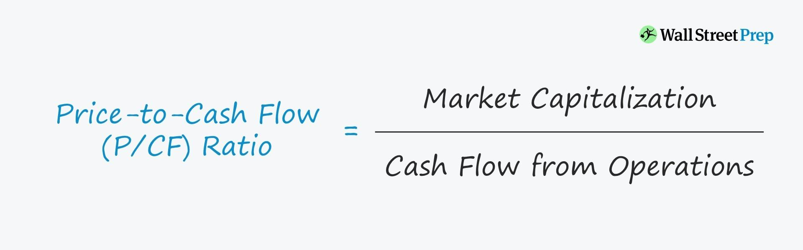

Understanding financial ratios is critical for investors, analysts, and financial experts when evaluating a company's financial health. These ratios provide insights into various aspects of a company’s performance, helping stakeholders make informed decisions. Among the myriad of financial ratios available, the Price-to-Cash Flow (P/CF) ratio stands out as an essential tool for assessing a company's value based on its cash flow, offering a more tangible measure of financial health that is less susceptible to accounting manipulation than earnings-based metrics.

The P/CF ratio focuses on the cash generated by a company from its core operations, offering a transparent view of its ability to generate cash flow. Unlike earnings, which can be affected by non-cash items such as depreciation and amortization, cash flow reflects real cash that is available to fund operations, pay dividends, or invest in growth opportunities. This makes the P/CF ratio particularly useful for evaluating companies with significant non-cash expenses or those operating in industries where accounting earnings might not accurately reflect the true economic reality.



This article explores the P/CF ratio in detail, highlights its significance in valuation, particularly within the context of algorithmic trading, and discusses how it can be used effectively to assess a company’s financial health and investment potential. The aim is to provide a comprehensive understanding of how the P/CF ratio can enhance investment strategies, offering a more realistic measure of a company’s value compared to other popular metrics like the price-to-earnings (P/E) ratio. Through this exploration, readers will gain insight into incorporating the P/CF ratio into investment evaluations for more informed decision-making and resilient investment strategies.

## Table of Contents

## What is the Price-to-Cash Flow (P/CF) Ratio?

The Price-to-Cash Flow (P/CF) ratio is a crucial valuation metric for investors and analysts who seek to measure a company's value by evaluating its cash flow capabilities, rather than its earnings alone. At its core, the P/CF ratio compares the market price of a company's stock to its operating cash flow per share, offering a perspective that is less susceptible to variations in accounting practices and potential earnings manipulation.

The primary distinction between the P/CF ratio and the Price-to-Earnings (P/E) ratio lies in the elements they consider. While the P/E ratio utilizes net income, which can be affected by numerous non-cash items such as depreciation, amortization, and other potential accounting adjustments, the P/CF ratio emphasizes cash flows. Cash flow is generally perceived as a clearer reflection of a company's operational efficiency because it represents the actual cash generated by the company’s core business operations.

To compute the P/CF ratio, the following formula is applied:

$$
\text{P/CF Ratio} = \frac{\text{Share Price}}{\text{Operating Cash Flow per Share}}
$$

Here's a simple example of how you can calculate this using Python:

```python
def calculate_pcf_ratio(share_price, operating_cash_flow, total_shares):
    """Calculate the Price-to-Cash Flow ratio."""
    operating_cash_flow_per_share = operating_cash_flow / total_shares
    pcf_ratio = share_price / operating_cash_flow_per_share
    return pcf_ratio

# Example values
share_price = 50  # Share price in dollars
operating_cash_flow = 1000000  # Operating cash flow in dollars
total_shares = 50000  # Total number of shares

# Calculate P/CF ratio
pcf_ratio = calculate_pcf_ratio(share_price, operating_cash_flow, total_shares)
print(f"The P/CF Ratio is: {pcf_ratio}")
```

This Python function calculates the P/CF ratio by dividing the given share price by the operating cash flow per share. The higher the operating cash flow per share relative to the share price, the lower the P/CF ratio, which could indicate undervaluation. Conversely, a higher P/CF ratio might reflect potential overvaluation or anticipated future growth.

In summary, the P/CF ratio is a vital tool for those seeking to analyze a company's value and financial health by assessing its ability to generate cash from its primary operations. It provides an alternative view that often aligns more closely with the underlying economic reality of a business compared to net income-based metrics.

## Importance of the P/CF Ratio

The Price-to-Cash Flow (P/CF) ratio is a key metric that emphasizes a company's ability to generate cash from its operations, providing a straightforward glimpse into its financial health. This focus on cash flow distinguishes the P/CF ratio from other financial metrics, such as the Price-to-Earnings (P/E) ratio, which relies on net income. Net income can often be clouded by non-cash items like depreciation and amortization, which do not affect the actual cash movement of a company.

For instance, consider a company with substantial depreciation expenses. These non-cash expenses reduce net income, making the company potentially appear less profitable when using P/E as a measure. In contrast, the P/CF ratio, by considering only operating cash flows, avoids these distortions and provides a more transparent view of the company’s profitability.

The equation for the P/CF ratio is straightforward:

$$
\text{P/CF Ratio} = \frac{\text{Share Price}}{\text{Operating Cash Flow per Share}}
$$

Many investors and analysts favor the P/CF ratio over the P/E ratio because cash flows present a less manipulated and more realistic assessment of a firm’s valuation. Cash flows are less prone to accounting changes and offer a dependable indicator of a company's ability to sustain operations, invest in growth opportunities, and distribute profits to shareholders through dividends. For businesses with high non-cash expenses, the P/CF ratio offers an unfiltered view of economic reality, reflecting the practical financial scenarios rather than the accounting outcomes.

In conclusion, the P/CF ratio provides critical insights into a firm's cash-generating capabilities, emphasizing operational success. This unadulterated focus on cash flows enhances the accuracy of financial valuations and supports better investment decisions, especially when companies have substantial non-cash accounting items that might obscure their true economic status.

## P/CF Ratio vs. Other Financial Ratios

The Price-to-Cash Flow (P/CF) ratio offers investors a valuable alternative to the traditional Price-to-Earnings (P/E) ratio, particularly for companies with significant non-cash charges like depreciation and amortization. These non-cash expenses can distort net income, making the P/E ratio less reliable for evaluating true financial performance. The P/CF ratio addresses this issue by focusing solely on cash generated from operations, offering a clearer and often more accurate view of a company's financial health.

For companies with substantial capital expenditures, the Free Cash Flow (FCF) ratio may offer an even more rigorous analysis. Unlike the P/CF ratio, which considers cash flow from operations, the FCF ratio further accounts for capital expenditures, which are subtracted from operating cash flow to determine what remains available for distribution to shareholders, debt repayment, or reinvestment. The formula for FCF is:

$$
\text{Free Cash Flow} = \text{Operating Cash Flow} - \text{Capital Expenditures}
$$

This approach allows investors to assess a company's ability to generate sufficient cash to maintain and expand its asset base, which is crucial for growth.

In capital-intensive industries such as manufacturing or utilities, where significant investment in fixed assets is required, the P/CF ratio may be advantageous. These industries often report high depreciation and amortization expenses, which can lower net income without affecting actual cash flow. Consequently, using the P/CF ratio allows for a more precise evaluation of a company's valuation by concentrating on cash flows rather than accounting profits.

Overall, while the P/E ratio remains a popular choice for many investors, the P/CF ratio can provide a more reliable indicator of financial performance for specific sectors and companies. Additionally, for those looking for an even deeper analysis, particularly in assessing the sustainability of cash generation post-capital investments, the FCF ratio serves as a crucial metric for determining a company’s financial viability and growth potential.

## Implications of Using P/CF Ratio

A low Price-to-Cash Flow (P/CF) ratio may suggest that a stock is undervalued, indicating that the market price is low relative to the company's cash flow generation. Conversely, a high P/CF ratio could imply potential overvaluation or reflect high growth expectations. It is crucial to interpret the P/CF ratio in context by comparing it to sector averages and historical trends, as these benchmarks provide a frame of reference for understanding whether a company's stock is appropriately valued.

For instance, sector-specific characteristics greatly influence the ideal P/CF range, as industries with stable, predictable cash flows might naturally exhibit lower average P/CF ratios compared to sectors characterized by rapid growth and higher risk. Historical analysis of a company's P/CF ratio over time can also reveal trends in cash flow efficiency and stock valuation, allowing investors to detect deviations that may signal investment opportunities or risks.

Understanding these metrics is essential for accurately assessing the stock's true value relative to its capacity to generate cash flows. Investors can gain insights into the quality of a company's earnings by observing how much of its revenue is manifested in actual cash flow, thereby enabling a more grounded evaluation of future financial performance. Consequently, incorporating the P/CF ratio into investment strategies enhances the robustness of decision-making processes and mitigates the risks associated with over-reliance on earnings-based metrics.

## P/CF in Algorithmic Trading

Algorithmic trading utilizes advanced mathematical models and complex algorithms to execute trades at speeds and frequencies that are otherwise impossible for human traders. The incorporation of financial ratios, such as the Price-to-Cash Flow (P/CF) ratio, into these algorithms provides crucial insights into a stock's potential performance. 

The P/CF ratio is particularly valuable in [algorithmic trading](/wiki/algorithmic-trading) due to its ability to reflect a company's cash generation capabilities, a more stable indicator of a company's financial strength compared to earnings. This attribute helps algorithms detect and predict stock price movements more accurately. Algorithms can use the P/CF ratio as part of multi-[factor](/wiki/factor-investing) models, which include other financial metrics and external market data, to build robust predictive models. For instance, an algorithm may weigh the P/CF ratio against other indicators such as the Price-to-Earnings (P/E) ratio or Free Cash Flow (FCF) metrics to balance predictions of growth and stability.

Python is a preferred language for algorithmic trading due to its robust libraries like NumPy, pandas, and Scikit-learn, which facilitate mathematical operations and [machine learning](/wiki/machine-learning). The use of Python allows traders to construct models that can automatically adjust trading strategies based on market conditions reflected by ratios like the P/CF. Below is a simple Python snippet showcasing how one might fetch and calculate the P/CF ratio using financial data:

```python
import yfinance as yf  # For more datasets, visit: https://paperswithbacktest.com/datasets

# Fetch company financial data
ticker = 'AAPL'
stock = yf.Ticker(ticker)
cash_flow = stock.cashflow.iloc[0, 0]  # Latest operating cash flow
shares_outstanding = stock.info['sharesOutstanding']
market_price = stock.history(period='1d')['Close'][0]

# Calculate P/CF ratio
pcf_ratio = market_price / (cash_flow / shares_outstanding)

print(f"The P/CF ratio of {ticker} is {pcf_ratio:.2f}")
```

Incorporating the P/CF ratio into algorithmic trading strategies can also lead to improved risk management. The ability to analyze and interpret the P/CF ratio helps algorithms in identifying potential overvaluation bubbles or uncovering undervalued stocks that may present lucrative investment opportunities. These strategies can preemptively adjust risk parameters based on the valuation insights provided by the P/CF metric, thus safeguarding against market [volatility](/wiki/volatility-trading-strategies).

Overall, the inclusion of the P/CF ratio in algorithmic trading enhances decision-making by providing a more refined view of a company's cash flow strength, facilitating the construction of sophisticated, data-driven trading strategies.

## Conclusion

The Price-to-Cash Flow (P/CF) ratio serves as a significant metric in evaluating a company’s financial valuation by emphasizing the cash flow generated rather than earnings, which can be significantly influenced by accounting policies and practices. This focus on cash flow provides a more transparent view of a company's operational efficiency and financial health. One of the strengths of the P/CF ratio is that it mitigates some of the limitations associated with earnings-based metrics that may be subject to creative accounting tactics.

Despite its advantages, the P/CF ratio does not come without limitations. It does not directly allow for consideration of capital expenditures, which can be a critical factor for businesses requiring significant ongoing investment for maintenance or expansion. Additionally, the P/CF ratio doesn't account for financial liabilities, which can impact a company's overall financial stability. This necessitates a comprehensive analysis, often involving supplementary financial metrics, to gain a holistic view of an enterprise’s worth.

In the dynamic field of financial analysis, both fundamental and algorithmic approaches often capitalize on the insights offered by the P/CF ratio. It is particularly valuable in algorithmic trading models where it can enhance decision-making by identifying undervalued or overvalued securities based on cash flow metrics. When integrated into investment evaluations, the P/CF ratio can facilitate informed decision-making, allowing investors and analysts to develop robust and resilient investment strategies. By focusing on the cash generating capabilities of a business, investors are better equipped to forecast long-term sustainability and value creation, thereby aligning their strategies to achieve more consistent and reliable returns.

## References & Further Reading

[1]: Penman, S. H. (2012). ["Financial Statement Analysis and Security Valuation."](https://archive.org/details/financialstateme0000penm_r9u4) McGraw Hill.

[2]: Damodaran, A. (2012). ["Investment Valuation: Tools and Techniques for Determining the Value of Any Asset."](https://books.google.com/books/about/Investment_Valuation.html?id=5SRHAAAAQBAJ) John Wiley & Sons.

[3]: Pojarliev, M., & Levich, R. M. (2011). ["A New Look at Currency Investing."](https://rpc.cfainstitute.org/-/media/documents/book/rf-publication/2012/rf-v2012-n4-1-pdf.pdf) CFA Institute.

[4]: Graham, B., & Dodd, D. (2008). ["Security Analysis: Sixth Edition."](https://www.amazon.com/Security-Analysis-Foreword-Buffett-Editions/dp/0071592539) McGraw Hill.

[5]: Fabozzi, F. J. (2013). ["Handbook of Global Fixed Income Calculations."](https://www.academia.edu/25711432/The_Handbook_of_Global_Fixed_Income_Calculations_Frank_J_Fabozzi_Series) John Wiley & Sons.