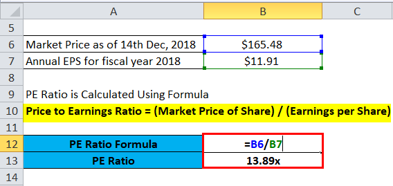

## Table of Contents

## What is the Price-To-Earnings (P/E) ratio?

The Price-To-Earnings (P/E) ratio is a way to figure out how much investors are willing to pay for a company's earnings. It's calculated by dividing the current market price of a stock by the company's earnings per share (EPS). For example, if a company's stock is trading at $50 and its EPS is $5, the P/E ratio would be 10. This means investors are willing to pay $10 for every dollar of earnings the company makes.

The P/E ratio is useful because it helps investors see if a stock is expensive or a good deal compared to other stocks or the market as a whole. A high P/E ratio might mean that investors expect the company to grow a lot in the future, so they're willing to pay more for its stock. On the other hand, a low P/E ratio could mean the stock is undervalued or that the company is not expected to grow much. However, it's important to use the P/E ratio along with other information because it doesn't tell the whole story about a company's value.

## Why is the P/E ratio important for investors?

The P/E ratio is important for investors because it helps them understand how much they are paying for a company's earnings. Imagine you're buying a company's future profits. The P/E ratio tells you how many dollars you have to spend to get one dollar of those profits. If the P/E ratio is low, it might mean the stock is a good deal, like getting a discount. If it's high, it might mean the stock is expensive, like paying a premium.

Investors use the P/E ratio to compare different companies or to see if a stock is priced fairly compared to the overall market. For example, if one company has a P/E ratio of 15 and another has a P/E ratio of 30, the first company might seem cheaper. But it's not just about the numbers. A high P/E ratio might mean that investors expect the company to grow a lot in the future, so they're willing to pay more. A low P/E ratio might mean the opposite. That's why it's smart to look at the P/E ratio along with other information to make better investment choices.

## How do you calculate the P/E ratio manually?

To calculate the P/E ratio manually, you need two pieces of information: the current market price of the stock and the company's earnings per share (EPS). The market price is how much the stock is selling for right now. You can find this on any financial website or stock market app. The EPS is the company's total earnings divided by the number of shares they have. This number is usually reported quarterly or annually by the company. Once you have these two numbers, you divide the market price by the EPS. For example, if a stock is trading at $50 and the EPS is $5, you divide $50 by $5 to get a P/E ratio of 10.

The P/E ratio helps you understand how much investors are willing to pay for the company's earnings. If the P/E ratio is high, it means investors are expecting the company to do well in the future, so they're willing to pay more for each dollar of earnings. If the P/E ratio is low, it might mean the stock is a good deal or that the company isn't expected to grow much. But remember, the P/E ratio is just one tool. It's important to look at other information too, like the company's financial health and industry trends, to make smart investment choices.

## What are the basic steps to calculate the P/E ratio in Excel?

To calculate the P/E ratio in Excel, first you need to have the current market price of the stock and the company's earnings per share (EPS). You can enter these numbers into two separate cells in your Excel spreadsheet. For example, put the market price in cell A1 and the EPS in cell B1. The market price is how much the stock is selling for right now, and you can find this on financial websites or stock market apps. The EPS is the company's total earnings divided by the number of shares they have, and this is usually reported by the company.

Next, you need to use a simple formula to calculate the P/E ratio. In another cell, like C1, you can type in the formula `=A1/B1`. This formula tells Excel to divide the number in cell A1 (the market price) by the number in cell B1 (the EPS). When you press enter, Excel will show you the P/E ratio in cell C1. For example, if the market price is $50 and the EPS is $5, the P/E ratio will be 10. This number helps you understand how much investors are willing to pay for the company's earnings.

## What data do you need to calculate the P/E ratio in Excel?

To calculate the P/E ratio in Excel, you need two pieces of information: the current market price of the stock and the company's earnings per share (EPS). The market price is how much the stock is selling for right now. You can find this on financial websites or stock market apps. The EPS is the company's total earnings divided by the number of shares they have. This number is usually reported by the company in their financial statements.

Once you have these two numbers, you can enter them into Excel. Put the market price in one cell, like A1, and the EPS in another cell, like B1. Then, use a simple formula to calculate the P/E ratio. In another cell, like C1, type `=A1/B1`. This tells Excel to divide the market price by the EPS. When you press enter, Excel will show you the P/E ratio. This number helps you understand how much investors are willing to pay for the company's earnings.

## How do you input stock price data into Excel?

To input stock price data into Excel, you first need to find the current market price of the stock. You can get this information from financial websites like Yahoo Finance or Google Finance, or from stock market apps. Once you have the price, open your Excel spreadsheet and click on the cell where you want to put the stock price. Type the price into the cell and press Enter. For example, if the stock price is $50, you would type "50" into the cell.

After you've entered the stock price, you can use Excel to do calculations with it. For instance, if you also have the company's earnings per share (EPS), you can calculate the Price-To-Earnings (P/E) ratio. To do this, enter the EPS into another cell. Then, in a third cell, type a formula to divide the stock price by the EPS. If the stock price is in cell A1 and the EPS is in cell B1, you would type "=A1/B1" into the third cell. Press Enter, and Excel will show you the P/E ratio.

## How do you input earnings per share data into Excel?

To input earnings per share (EPS) data into Excel, you first need to find the EPS number. You can find this on financial websites like Yahoo Finance or Google Finance, or in the company's financial statements. Once you have the EPS, open your Excel spreadsheet and click on the cell where you want to put the number. Type the EPS into the cell and press Enter. For example, if the EPS is $5, you would type "5" into the cell.

After you've entered the EPS, you can use it to do calculations in Excel. For instance, if you also have the stock's market price, you can calculate the Price-To-Earnings (P/E) ratio. To do this, enter the market price into another cell. Then, in a third cell, type a formula to divide the market price by the EPS. If the market price is in cell A1 and the EPS is in cell B1, you would type "=A1/B1" into the third cell. Press Enter, and Excel will show you the P/E ratio.

## What Excel formula should be used to calculate the P/E ratio?

To calculate the P/E ratio in Excel, you need the stock's market price and the company's earnings per share (EPS). Put the market price in one cell, like A1, and the EPS in another cell, like B1. Then, in a third cell, like C1, you can type the formula "=A1/B1". This formula tells Excel to divide the number in cell A1 by the number in cell B1. When you press Enter, Excel will show you the P/E ratio.

The P/E ratio helps you understand how much investors are willing to pay for the company's earnings. If the P/E ratio is high, it means investors expect the company to do well in the future. If it's low, it might mean the stock is a good deal or that the company isn't expected to grow much. Remember, the P/E ratio is just one tool, so it's important to look at other information too when making investment decisions.

## How can you format the P/E ratio result in Excel for better readability?

To make the P/E ratio result easier to read in Excel, you can use formatting options. First, you can change the number of decimal places shown. To do this, click on the cell with the P/E ratio, then go to the 'Home' tab and find the 'Number' section. Click on the button that increases or decreases the decimal places until you see the number of decimal places you want. This helps make the number look cleaner and easier to understand.

You can also add a label to the cell to make it clear what the number means. Just click on the cell next to the P/E ratio and type "P/E Ratio:". This way, anyone looking at your spreadsheet will know exactly what the number represents. Using these simple formatting steps can make your P/E ratio result much clearer and easier to read.

## What are common errors to avoid when calculating the P/E ratio in Excel?

When calculating the P/E ratio in Excel, one common mistake is using the wrong numbers. You need to make sure you're using the current market price of the stock and the company's earnings per share (EPS) for the same time period. If you mix up numbers from different times, your P/E ratio will be wrong. Also, be careful with how you enter the numbers. For example, if the stock price is $50, make sure you type "50" and not "5000" by accident.

Another mistake to watch out for is not formatting the result properly. If the P/E ratio shows too many decimal places, it can be hard to read and understand. Always check the number of decimal places and adjust them to make the result clearer. Also, make sure to label the cell with "P/E Ratio:" so everyone knows what the number means. By avoiding these errors, you can make sure your P/E ratio calculation in Excel is accurate and easy to understand.

## How can you use conditional formatting in Excel to highlight high or low P/E ratios?

To use conditional formatting in Excel to highlight high or low P/E ratios, first select the cell with the P/E ratio. Then, go to the 'Home' tab and click on 'Conditional Formatting'. Choose 'Highlight Cells Rules' and then 'Greater Than' to highlight high P/E ratios. Enter a number, like 20, to highlight any P/E ratio above that. If you want to highlight low P/E ratios, choose 'Less Than' instead and enter a number, like 10, to highlight any P/E ratio below that.

This way, you can easily see which P/E ratios are high or low at a glance. High P/E ratios might mean investors expect the company to grow a lot in the future, while low P/E ratios could mean the stock is a good deal or that the company isn't expected to grow much. Using conditional formatting helps you quickly understand the data and make better investment decisions.

## How can you automate the P/E ratio calculation in Excel using macros or scripts?

To automate the P/E ratio calculation in Excel using macros or scripts, you first need to know a bit about how to use Excel's built-in tools. A macro is like a set of instructions that you can record and run to do tasks automatically. To create a macro for calculating the P/E ratio, open the 'Developer' tab in Excel. If you don't see it, you can add it from the Excel options. Click on 'Record Macro', give it a name like "CalculatePERatio", and then click 'OK'. Now, do the steps you normally do to calculate the P/E ratio: enter the stock price in one cell, the EPS in another, and then type the formula "=A1/B1" in a third cell. After you've done this, stop recording the macro. Now, whenever you run the macro, it will do these steps for you automatically.

If you want to use a script instead, you can use Visual Basic for Applications (VBA), which is Excel's programming language. To write a script, go to the 'Developer' tab, click on 'Visual Basic', and then insert a new module. In the module, you can write a simple script like this: `Sub CalculatePERatio() Range("C1").Formula = "=A1/B1" End Sub`. This script tells Excel to put the formula "=A1/B1" in cell C1, which calculates the P/E ratio. Save the script and then you can run it by pressing a button or using a keyboard shortcut. This way, you can quickly calculate the P/E ratio without having to type the formula every time.

## What is the Price-to-Earnings Ratio and how do we understand it?

The Price-to-Earnings (P/E) ratio is an essential financial metric used in fundamental analysis to evaluate the relative market value of a stock compared to the company's earnings. The formula for the P/E ratio is:

$$
\text{P/E Ratio} = \frac{\text{Market Price per Share}}{\text{Earnings per Share (EPS)}}
$$

This ratio allows investors to determine how much they are willing to pay for a dollar of earnings, serving as a crucial indicator of market sentiment and valuation. A higher P/E ratio might indicate that a stock is over-valued, assuming the underlying earnings do not justify the market price. Conversely, a lower P/E ratio may suggest that the stock is undervalued relative to its earnings potential.

The P/E ratio also offers insights into future growth expectations and potential investment returns. Companies with high P/E ratios are often perceived to have strong growth prospects, as investors expect higher future earnings. However, this optimism must be tempered with caution, as high P/E ratios can also reflect market exuberance which may not materialize into actual earnings growth.

Moreover, the P/E ratio provides a means to compare companies within the same industry, facilitating an assessment of a company's financial health relative to its peers. For example, if a company's P/E ratio is drastically higher than its industry average, it could indicate either a premium for expected superior growth or a warning signal of overvaluation.

In conclusion, the P/E ratio is a versatile tool in investment analysis, assisting in determining stock valuation, growth potential, and comparative standing within an industry. Its proper application requires a balance of quantitative analysis and qualitative judgment, ensuring investors make informed decisions by considering broader market conditions and company-specific factors.

## How do you calculate the P/E Ratio in Excel?

To calculate the Price-to-Earnings (P/E) ratio in Excel using company data, begin by organizing the necessary data in a structured manner. This process involves entering the company names, their market prices, and earnings data into a spreadsheet. Here's a step-by-step guide:

1. **Data Entry**:
   - Create a new Excel workbook.
   - Label the first column as "Company Name," the second column as "Market Price," and the third column as "Earnings per Share (EPS)."
   - Enter the company names in the first column, their respective market prices in the second column, and the earnings per share data in the third column. Ensure that all data is entered correctly for accurate calculations.

2. **Formula Application for P/E Ratio**:
   - In Excel, the P/E ratio is calculated using the formula: 
$$
     \text{P/E Ratio} = \frac{\text{Market Price}}{\text{Earnings per Share (EPS)}}

$$
   - To implement this, add a fourth column and label it "P/E Ratio."
   - In the first row under the "P/E Ratio" column (assuming the data starts from row 2), enter the formula: 
     ```excel
     =B2/C2
     ```
   - This formula divides the market price by the earnings per share for the first company. Drag this formula down to apply it to the other rows in your dataset to calculate the P/E ratios for all the companies listed.

3. **Systematic Comparison**:
   - Once the P/E ratios are computed, you can sort or filter the companies based on their P/E ratios to compare their valuations. For example, you might sort the column in ascending or descending order to find which companies are undervalued or overvalued relative to each other.

4. **Visual Representation (Optional)**:
   - To enhance data analysis, consider using Excel’s chart features to create a bar or line chart that visually represents the P/E ratios of the listed companies. This visual approach can make it easier to identify trends or outliers.

By following these steps, Excel offers an efficient and systematic method to calculate and analyze the P/E ratio, facilitating effective financial comparison and decision-making in trading strategies.

## References & Further Reading

[1]: Gitman, L. J., & Zutter, C. J. (2012). ["Principles of Managerial Finance."](https://archive.org/details/principlesofmana13edgitm_l9n6) Pearson Education, 13th Edition.

[2]: Peirson, G., Brown, R., Easton, S., Howard, P., & Pinder, S. (2015). ["Business Finance."](https://books.google.com/books/about/Business_Finance.html?id=6MmuoAEACAAJ) McGraw-Hill Education, 12th Edition.

[3]: Bodie, Z., Kane, A., & Marcus, A. J. (2014). ["Investments."](https://books.google.com/books/about/EBOOK_Investments_Global_edition.html?id=BMsvEAAAQBAJ) McGraw-Hill Education, 10th Edition.

[4]: Damodaran, A. (2002). ["Investment Valuation: Tools and Techniques for Determining the Value of Any Asset."](https://archive.org/details/investmentvaluat0000damo_n6k9) John Wiley & Sons.

[5]: Koller, T., Goedhart, M., & Wessels, D. (2010). ["Valuation: Measuring and Managing the Value of Companies."](https://books.google.com/books/about/Valuation.html?id=7-u-eC3j0eEC) McKinsey & Company, 5th Edition.