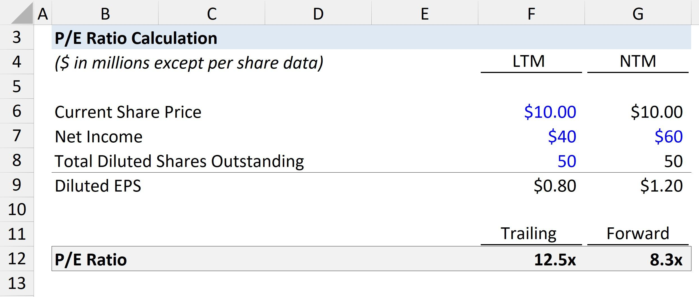

## Table of Contents

## What is the Price-to-Earnings (P/E) ratio?

The Price-to-Earnings (P/E) ratio is a way to figure out how much investors are willing to pay for a company's earnings. It's calculated by taking the current stock price of a company and dividing it by the company's earnings per share (EPS). The P/E ratio helps investors see if a stock is a good value or if it's too expensive compared to how much money the company is making.

A high P/E ratio might mean that investors expect the company to grow a lot in the future, so they're willing to pay more for its stock. On the other hand, a low P/E ratio could mean that the company is not expected to grow much, or it might be seen as a bargain if the company is doing well but the stock price is low. It's important to compare the P/E ratio of a company with others in the same industry to get a better idea of its value.

## How is the P/E ratio calculated?

The P/E ratio is calculated by dividing a company's stock price by its earnings per share (EPS). The stock price is how much one share of the company costs on the stock market. Earnings per share is the company's total earnings divided by the number of shares it has. So, if a company's stock is selling for $50 and its earnings per share is $5, the P/E ratio would be $50 divided by $5, which equals 10.

This simple calculation gives investors a quick way to see if a stock might be a good buy. A lower P/E ratio can mean the stock is cheaper compared to its earnings, which might make it a good value. A higher P/E ratio can mean the stock is more expensive, but it might also mean investors think the company will grow a lot in the future. It's helpful to compare the P/E ratio of a company with other companies in the same industry to see if it's a good deal or not.

## Why is the P/E ratio important for investors?

The P/E ratio is important for investors because it helps them figure out if a stock is a good deal or if it's too expensive. It's like a quick way to see how much you're paying for a company's earnings. If a stock has a low P/E ratio, it might mean the stock is cheaper compared to how much money the company is making. This could be a sign that the stock is a good value. On the other hand, if a stock has a high P/E ratio, it might mean the stock is more expensive, but it could also mean that investors think the company will grow a lot in the future.

Comparing the P/E ratios of different companies in the same industry can give investors a better idea of which stocks might be a better buy. For example, if one company in the tech industry has a P/E ratio of 20 and another has a P/E ratio of 30, the first one might look like a better value. But it's not just about the numbers; investors also need to think about other things like how fast the company is growing, how much debt it has, and what's happening in the market. The P/E ratio is just one tool that helps investors make smart choices about where to put their money.

## What does a high P/E ratio indicate about a company?

A high P/E ratio means that investors are willing to pay a lot for the company's earnings. It can show that people think the company will grow a lot in the future. When a company has a high P/E ratio, it means the stock price is high compared to how much money the company is making right now. This can be a sign that investors are excited about the company and expect its earnings to go up a lot.

But a high P/E ratio can also mean the stock is too expensive. If the company doesn't grow as fast as people expect, the stock price might go down. So, a high P/E ratio can be a good thing if the company does well, but it can also be risky. It's important for investors to look at other things too, like how the company is doing compared to others in the same industry, to decide if the high P/E ratio is worth it.

## What does a low P/E ratio suggest about a company?

A low P/E ratio suggests that a company's stock is cheap compared to how much money it's making. This can mean the stock might be a good value. Investors might think the company is not growing much or that it's not as exciting as other companies. But it can also mean the stock is a bargain, especially if the company is doing well but the stock price is low.

When a company has a low P/E ratio, it could be because people are not as excited about it. Maybe they think the company won't grow much in the future, or maybe there are worries about the company's business. But if the company is doing okay and the P/E ratio is low, it might be a good time to buy the stock because it could go up in value later. It's important to look at other things too, like how the company is doing compared to others in the same industry, to see if the low P/E ratio is a good sign.

## How can the P/E ratio be used to compare companies within the same industry?

The P/E ratio can help investors compare companies within the same industry to see which ones might be a better deal. If two companies in the same industry have different P/E ratios, it can show which one is cheaper compared to its earnings. For example, if one tech company has a P/E ratio of 15 and another has a P/E ratio of 25, the first one might look like a better value because you're paying less for each dollar of earnings.

But it's not just about the numbers. Investors should also think about other things like how fast each company is growing, how much debt they have, and what's happening in the market. A company with a lower P/E ratio might not be growing as fast or might have other problems. So, while the P/E ratio is a helpful tool, it's important to look at the whole picture before deciding which company is a better investment.

## What are the limitations of using the P/E ratio as a valuation tool?

The P/E ratio is a useful tool for investors, but it has some limitations. One big problem is that it doesn't tell the whole story about a company. The P/E ratio only looks at the company's earnings and stock price, but it doesn't consider other important things like how much debt the company has, how fast it's growing, or what's happening in the market. If a company has a lot of debt, it might be riskier even if its P/E ratio looks good. And if a company is growing really fast, a high P/E ratio might actually be a good sign, not a bad one.

Another limitation is that the P/E ratio can be affected by accounting choices. Companies can use different ways to report their earnings, which can make the P/E ratio less accurate. For example, if a company uses certain accounting tricks to make its earnings look better, the P/E ratio might be lower than it should be. This can fool investors into thinking the company is a better value than it really is. So, while the P/E ratio is helpful, investors need to look at other things too to get a full picture of a company's value.

## How does the P/E ratio differ between growth and value stocks?

The P/E ratio can be very different for growth stocks and value stocks. Growth stocks are companies that are expected to grow a lot in the future. Because of this, investors are often willing to pay more for these stocks, which means they usually have higher P/E ratios. For example, a tech company that's growing quickly might have a P/E ratio of 30 or even higher. Investors are okay with paying more because they think the company's earnings will go up a lot in the future.

On the other hand, value stocks are companies that might not be growing as fast, but they are seen as good deals. These companies often have lower P/E ratios because their stock prices are low compared to their earnings. For instance, a company in a slow-growing industry might have a P/E ratio of 10 or 15. Investors like value stocks because they think the stock is cheap and might go up in value over time. So, the P/E ratio can help show if a stock is more of a growth stock or a value stock.

## What is the difference between trailing P/E and forward P/E ratios?

The trailing P/E ratio is based on a company's past earnings. It uses the earnings per share (EPS) from the last 12 months to figure out the P/E ratio. This means it looks at what the company has already made. It's a good way to see how the company has been doing, but it doesn't tell you anything about the future. If a company had a good year last year, its trailing P/E ratio might look really good, even if people think next year won't be as good.

The forward P/E ratio, on the other hand, uses the company's expected future earnings to calculate the P/E ratio. It looks at what analysts think the company's EPS will be over the next 12 months. This can be a better way to see if a stock is a good deal because it takes into account what might happen in the future. But, it can also be less accurate because no one knows for sure what will happen. If the company does better than expected, the forward P/E ratio might look too high, but if it does worse, it might look too low.

## How can macroeconomic factors influence the P/E ratio of a market or sector?

Macroeconomic factors can really change the P/E ratio of a whole market or a specific sector. Things like interest rates, inflation, and how the economy is doing can make investors feel more or less excited about stocks. If interest rates go up, it can make borrowing more expensive for companies, which might make their earnings go down. This could make investors less willing to pay a lot for stocks, so P/E ratios might go down. On the other hand, if the economy is doing really well, people might think companies will make more money in the future, so they might be willing to pay more for stocks, pushing P/E ratios up.

Different sectors can also be affected differently by these macroeconomic factors. For example, if there's a lot of inflation, sectors like consumer goods might see their costs go up, which could lower their earnings and P/E ratios. But sectors like energy might do better if prices for oil and gas go up with inflation. Also, if there's a big change in the economy, like a recession, some sectors might see their P/E ratios drop a lot because people think they won't make as much money. So, understanding these big economic changes can help investors figure out why P/E ratios are going up or down in different markets or sectors.

## What other financial ratios should be considered alongside the P/E ratio for a comprehensive analysis?

When looking at a company's value, it's smart to use other financial ratios along with the P/E ratio to get a full picture. One important ratio is the Price-to-Book (P/B) ratio, which compares a company's market value to its book value. This can show if a company is a good deal compared to what it owns. Another useful ratio is the Debt-to-Equity (D/E) ratio, which tells you how much debt a company has compared to its equity. A high D/E ratio might mean the company is risky because it has a lot of debt. The Return on Equity (ROE) ratio is also helpful because it shows how well a company is using its money to make profits. A high ROE can mean the company is doing a good job.

Another ratio to consider is the Price-to-Sales (P/S) ratio, which compares a company's stock price to its revenue. This can be useful for companies that aren't making profits yet but are growing quickly. The Dividend Yield is also important if you're interested in getting money back from your investment. It shows how much a company pays out in dividends compared to its stock price. Lastly, the Earnings Growth Rate can give you an idea of how fast a company's earnings are growing. By looking at all these ratios together, you can get a better understanding of a company's health and value, not just from the P/E ratio alone.

## How can historical P/E ratio trends be used to predict future stock performance?

Looking at how the P/E ratio of a company has changed over time can help investors guess what might happen to the stock in the future. If a company's P/E ratio has been going up for a while, it might mean that investors are getting more excited about the company. They think it will keep growing and making more money, so they're willing to pay more for its stock. But if the P/E ratio is a lot higher than it used to be, it could also mean the stock is too expensive and might go down if the company doesn't meet expectations.

On the other hand, if a company's P/E ratio has been going down, it might mean that investors are less excited about the company. They might think the company won't grow as much in the future, so they're not willing to pay as much for its stock. But if the P/E ratio is a lot lower than it used to be, it could also mean the stock is a good deal. If the company starts doing better than people expect, the stock price could go up. So, by looking at the past trends of the P/E ratio, investors can make better guesses about what might happen next, but it's not a sure thing because lots of other things can change too.

## What is the Price-to-Earnings Ratio and how can it be understood?

The Price-to-Earnings (P/E) ratio is a key financial metric used to evaluate the valuation of a company's stock in relation to its earnings. It is calculated by dividing the market price per share by the earnings per share (EPS), expressed as:

$$
\text{P/E Ratio} = \frac{\text{Market Price per Share}}{\text{Earnings per Share (EPS)}}
$$

This ratio provides investors with a rough indication of how much they are paying for one dollar of the company's earnings. The P/E ratio is widely regarded among investors due to its simplicity and effectiveness as a tool for comparing relative values of companies, especially within the same industry.

The popularity of the P/E ratio stems from its ability to reflect the market's expectations of a company's future growth. A high P/E ratio typically suggests that investors are anticipating higher growth prospects and are thus willing to pay a premium for the stock. Conversely, a lower P/E might indicate that a company is undervalued or that there are concerns about its future performance.

Investor sentiment plays a crucial role in influencing stock prices, which in turn affects the P/E ratio. Positive news and developments about a company can lead to increased investor confidence and demand for its shares, driving up the market price and subsequently the P/E ratio. Conversely, negative sentiment or market conditions can suppress stock prices, leading to a lower P/E ratio.

The P/E ratio is a reflection of not only the company's current earnings but also the market's expectations for its future potential. It serves as both a measure of the company's historical performance and a gauge of its probable trajectory, making it an indispensable tool for investors in their decision-making process.

## What are the types of P/E ratios and their significance?

**Types of P/E Ratios and Their Significance**

The Price-to-Earnings (P/E) ratio is a crucial metric in financial analysis, offering insights into a company's valuation by comparing its current share price to its earnings per share (EPS). There are several variations of the P/E ratio, each serving different analytical purposes: the Trailing P/E, Forward P/E, and the Cyclically Adjusted Price-to-Earnings (CAPE) ratio.

**Trailing P/E Ratio**  
The Trailing P/E ratio is calculated using the earnings of a company from the past 12 months. It is computed as:

$$
\text{Trailing P/E} = \frac{\text{Current Market Price}}{\text{Earnings per Share (EPS) over the last 12 months}}
$$

**Advantages:**  
- Reflects the actual earnings that have been reported, offering a reliable historical perspective.
- Beneficial for comparing a company's historical performance with its current price.

**Limitations:**  
- Does not account for future earnings potential, which might be significantly different due to changes in the business environment or company operations.
- Can be skewed in cases where the earnings of the past year are not reflective of typical business performance due to extraordinary income or expenses.

**Example:**  
Investors often use the Trailing P/E ratio for well-established companies where earnings are relatively stable, serving as a benchmark for comparative analysis with industry peers.

**Forward P/E Ratio**  
The Forward P/E ratio uses projected earnings for the next 12 months. The formula is:

$$
\text{Forward P/E} = \frac{\text{Current Market Price}}{\text{Expected EPS for the next 12 months}}
$$

**Advantages:**  
- Incorporates market expectations and company guidance, providing a forward-looking perspective.
- Useful for evaluating growth stocks where future potential is a significant consideration.

**Limitations:**  
- Relies on earnings forecasts, which can be overly optimistic or pessimistic, leading to inaccuracies.
- Volatility in estimates due to changes in economic conditions or competitive dynamics can affect its reliability.

**Example:**  
Technology companies often exhibit high Forward P/E ratios due to anticipated growth, reflecting investor optimism about future earnings enhancement.

**Cyclically Adjusted Price-to-Earnings (CAPE) Ratio**  
The CAPE ratio, also known as the Shiller P/E ratio, is calculated by dividing the price by the average of ten years of earnings, adjusted for inflation. It is expressed as:

$$
\text{CAPE} = \frac{\text{Current Market Price}}{\text{Average Inflated-Adjusted EPS over 10 years}}
$$

**Advantages:**  
- Mitigates the effects of short-term volatility and economic cycles, providing a long-term assessment.
- Smooths out fluctuations in earnings, making it effective for assessing companies in cyclical industries.

**Limitations:**  
- Historical earnings might not account for dramatic changes in a company's business model or competitive landscape.
- Not suitable for rapidly growing industries where historical earnings are not indicative of future performance.

**Example:**  
Used extensively in economic cycles analysis, the CAPE ratio offers valuable insights into valuation levels across economic fluctuations, such as in companies related to commodities and basic materials.

In conclusion, understanding the different types of P/E ratios and their applications is essential for investors aiming to make informed decisions. Each variant carries its own set of strengths and weaknesses, and selecting the appropriate one depends on the specific attributes of the company being analyzed and the investor's broader financial strategies.

## What is the Role of P/E Ratios in Stock Valuation?

The Price-to-Earnings (P/E) ratio is a critical tool for investors when evaluating and comparing companies within the same industry. By dividing a company's current stock price by its earnings per share (EPS), investors can gauge the relative valuation of a company. Mathematically, the P/E ratio is expressed as:

$$
\text{P/E Ratio} = \frac{\text{Market Price per Share}}{\text{Earnings per Share (EPS)}}
$$

Investors often use the P/E ratio to compare companies within an industry, as it provides a quick snapshot of how the market values a company's earnings relative to its peers. A lower P/E may suggest that a company is undervalued or that its earnings are expected to decline, while a higher P/E may indicate overvaluation or strong future growth expectations.

P/E ratio ranges can vary significantly across different industries due to inherent business models, growth rates, and risk profiles. For instance, companies in high-growth sectors, such as technology or biotechnology, often exhibit higher P/E ratios. This reflects investor optimism about future earnings potential and the industry's robust growth prospects. In contrast, industries like utilities or manufacturing may exhibit lower P/E ratios, reflecting their more stable, predictable earnings and slower growth rates.

For example, a tech company developing innovative software solutions might have a P/E ratio of 40, indicating that the market expects rapid earnings growth. In contrast, a utility company with a consistent but modest growth rate may have a P/E ratio of 15, reflecting its steady earnings and lower growth expectations.

The P/E ratio serves as a valuable benchmark for investors, helping to inform decisions by comparing a company's valuation to industry norms and peer performance. However, investors should be cautious, as a P/E ratio in isolation does not capture the full picture of a company’s financial health or market position. It is crucial to consider other factors and complementary metrics in the valuation process for a more thorough analysis.

## How can P/E Ratios be used in an Algorithmic Trading Strategy: A Case Study?

This case study explores a hypothetical algorithmic trading strategy that utilizes the Price-to-Earnings (P/E) ratio as a primary metric for stock selection and trading execution. The strategy aims to exploit differences in P/E ratios to identify undervalued or overvalued stocks within a specific sector. Here, we outline the process of data collection, screening, and execution, followed by an analysis of the strategy's performance.

### Data Collection

The initial step involves gathering a comprehensive dataset of company financials, including stock prices, earnings reports, and sector classifications. Historical data, preferably spanning at least five years, can be sourced from financial databases such as Bloomberg, Yahoo Finance, or Alpha Vantage. Important data points include:

- **Stock Prices (P):** The closing prices of the stocks.
- **Earnings Per Share (EPS):** Net earnings divided by the total outstanding shares.
- **Sector Information:** Classification of companies within industry sectors.

### Data Screening

Once the data is collected, a screening process is implemented to filter stocks based on specific P/E ratio criteria. This involves calculating the P/E ratio using the formula:

$$
\text{P/E Ratio} = \frac{\text{Market Price per Share}}{\text{Earnings Per Share (EPS)}}
$$

The strategy focuses on selecting stocks with a P/E ratio below the sector average, indicating potential undervaluation. Conversely, stocks with P/E ratios significantly above the average are considered overvalued and could be short-selling candidates.

### Execution Process

For execution, the algorithm employs a Python-based trading model. The primary components include:

1. **P/E Ratio Calculation:** Implementing a script to compute the P/E ratios of stocks and compare them to sector averages.

   ```python
   def calculate_pe_ratio(price, eps):
       return price / eps if eps != 0 else None
   ```

2. **Stock Selection:** Filtering stocks based on defined P/E ratio criteria, e.g., selecting stocks with a P/E ratio below a threshold.

3. **Trade Execution:** Utilizing trading APIs (such as Alpaca or Interactive Brokers) to execute trades programmatically based on the selections.

### Performance Analysis

The strategy's performance is evaluated over a defined historical period, benchmarking against market indices or sector averages. Key performance indicators include:

- **Return on Investment (ROI):** The overall profitability of the strategy.
- **Volatility:** The degree of variation in stock returns.
- **Drawdown:** The peak-to-trough decline during the strategy period.

### Strengths and Pitfalls

**Strengths:**
- **Objective Decision-Making:** The use of P/E ratios allows for quantitative, objective stock selection.
- **Sector-Specific Insights:** By comparing P/E ratios within industry sectors, the strategy leverages insights specific to each sector's valuation norms.

**Potential Pitfalls:**
- **Market Volatility:** P/E ratios might not reflect real-time market conditions or macroeconomic factors.
- **Overreliance on a Single Metric:** Relying solely on P/E ratios may result in ignoring other critical financial metrics, leading to suboptimal investment decisions.

In conclusion, while using the P/E ratio in algorithmic trading can be effective to identify valuation discrepancies, diversification and the incorporation of multiple financial indicators can enhance strategy robustness. This example serves as a foundational model, encouraging the development and exploration of more complex, multifactor strategies.

## What are the pros and cons of relying on the P/E ratio alone?

The Price-to-Earnings (P/E) ratio is a widely recognized valuation metric, appreciated for its simplicity and straightforwardness. It is calculated by dividing a company's market value per share by its earnings per share (EPS). Formulaically, this is represented as:

$$
\text{P/E Ratio} = \frac{\text{Market Value per Share}}{\text{Earnings per Share (EPS)}}
$$

Its popularity stems from the ease with which it provides a snapshot of how much investors are willing to pay per dollar of earnings, thus making it a go-to metric for quick comparative analysis among companies.

Despite its advantages, relying solely on the P/E ratio has significant limitations. One major shortcoming is its lack of consideration for sectoral differences. Different industries often exhibit varying average P/E ratios due to disparate growth prospects and risk levels. For instance, technology companies typically trade at higher P/E ratios compared to utility companies, reflecting their higher growth potential and risk exposure. Consequently, using the P/E ratio in isolation may lead to misleading conclusions if sector-specific benchmarks are not considered.

Moreover, the P/E ratio does not account for future growth prospects. Two companies with identical P/E ratios may have vastly different future growth trajectories, which can render the metric less insightful for long-term investment decisions. Additionally, it can be distorted during periods when earnings are temporarily inflated or depressed, leading to inaccurate reflections of a company’s true valuation.

To mitigate these limitations, investors and analysts often pair the P/E ratio with complementary financial metrics. For example, the Price-to-Earnings-to-Growth (PEG) ratio, which incorporates projected earnings growth, provides a more comprehensive view of valuation relative to growth. Calculated by dividing the P/E ratio by the annual EPS growth rate, the PEG ratio helps identify companies that might be undervalued even if they appear expensive based on the P/E ratio alone.

Net Profit Margin and Return on Equity (ROE) are other metrics that provide insight into a company's profitability and financial efficiency. By using these alongside the P/E ratio, analysts can acquire a holistic understanding of a company's performance and valuation.

In summary, while the P/E ratio is an indispensable tool for investors, its solitary use is insufficient for making informed investment decisions. A balanced approach that incorporates multiple metrics can lead to more robust and telling financial analysis.

## References & Further Reading

1. **Books**:
   - *Security Analysis* by Benjamin Graham and David Dodd: A seminal work in fundamental analysis, this book provides detailed insights into valuing company stocks, including the application of the Price-to-Earnings (P/E) ratio.
   - *The Intelligent Investor* by Benjamin Graham: This classic text is essential for understanding value investing and the role of investment metrics like P/E ratios in making sound investment decisions.
   - *Algorithmic Trading and DMA: An Introduction to Direct Access Trading Strategies* by Barry Johnson: A comprehensive guide to algorithmic trading, covering strategies that incorporate various financial metrics, including P/E ratios.

2. **Articles**:
   - "The P/E Ratio: A User's Manual" by Aswath Damodaran: Available on Aswath Damodaran's website, this article provides an in-depth analysis of the P/E ratio, its calculation, significance, and application in various market conditions.
   - "Understanding the P/E Ratio" by Morningstar Investor Research Center: An article that explains how the P/E ratio serves as a valuable tool for assessing a company's valuation, discussing its advantages and limitations.

3. **Online Resources**:
   - Investopedia (www.investopedia.com): A reliable source for investors to learn about financial metrics, including detailed articles and tutorials on P/E ratios and their role in stock evaluation.
   - CFA Institute (www.cfainstitute.org): Offers resources and publications on financial analysis, including detailed discussions on valuation ratios and their applications in modern finance.

4. **Key Authors and Experts**:
   - Aswath Damodaran: Renowned for his work in valuation, particularly the application of financial metrics such as the P/E ratio in determining company value.
   - James Montier: An expert in behavioral finance and investment strategies, Montier provides valuable insights into how investment metrics should be approached analytically.
   - Eugene Fama and Kenneth French: Known for their work on market efficiency and asset pricing, their research informs the use of various financial metrics in evaluating investment opportunities. 

These resources offer rich insights into both traditional and contemporary approaches to stock valuation and trading strategies, making them valuable for anyone looking to deepen their understanding of these fields.

