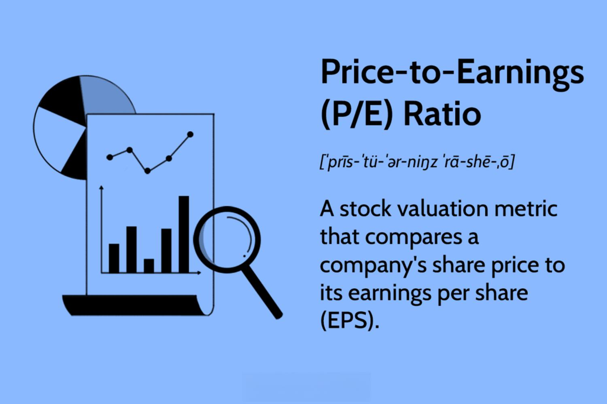

Investment metrics play a crucial role in stock trading, offering quantitative assessments that guide investors in their decision-making processes. Among these metrics, the Price-to-Earnings (P/E) ratio stands out as a cornerstone for evaluating company stocks. The P/E ratio is essentially a reflection of how much investors are willing to pay today for a dollar of earnings in the future. This ratio serves as a barometer for assessing whether a stock is overvalued or undervalued relative to its earnings potential. It is calculated using the formula:

$$
\text{P/E Ratio} = \frac{\text{Market Value per Share}}{\text{Earnings per Share (EPS)}}
$$



The significance of the P/E ratio can be attributed to its straightforwardness and widespread acceptance among analysts and investors. It facilitates a comparative analysis of companies within the same industry, offering insights into market sentiments and expectations. High P/E ratios might indicate expected growth or, alternatively, overvaluation in the eyes of investors.

With the advent of technology, stock trading has undergone a significant transformation marked by the rise of algorithmic trading. This approach leverages computer algorithms to execute trades at speeds and frequencies unimaginable to human traders. Algorithms rely heavily on financial metrics, including the P/E ratio, to make informed decisions rapidly. The integration of these metrics into trading models enhances the potential for gains by refining the process of stock selection through precise and rapid analysis.

In recent years, the reliance on investment metrics has grown, with algorithmic trading accounting for a substantial portion of market activity. The precision and speed afforded by algorithms enable traders to exploit small pricing inefficiencies across markets. By incorporating critical metrics like the P/E ratio into these trading algorithms, traders can craft strategies that are both robust and responsive to ever-changing market conditions. 

As financial markets continue to evolve, the combination of fundamental investment metrics and advanced algorithmic systems promises to refine stock analysis and trading strategies, offering investors a means to navigate the complexities of market dynamics with enhanced efficiency and insight.

## Table of Contents

## Understanding the Price-to-Earnings Ratio

The Price-to-Earnings (P/E) ratio is a key financial metric used to evaluate the valuation of a company's stock in relation to its earnings. It is calculated by dividing the market price per share by the earnings per share (EPS), expressed as:

$$
\text{P/E Ratio} = \frac{\text{Market Price per Share}}{\text{Earnings per Share (EPS)}}
$$

This ratio provides investors with a rough indication of how much they are paying for one dollar of the company's earnings. The P/E ratio is widely regarded among investors due to its simplicity and effectiveness as a tool for comparing relative values of companies, especially within the same industry.

The popularity of the P/E ratio stems from its ability to reflect the market's expectations of a company's future growth. A high P/E ratio typically suggests that investors are anticipating higher growth prospects and are thus willing to pay a premium for the stock. Conversely, a lower P/E might indicate that a company is undervalued or that there are concerns about its future performance.

Investor sentiment plays a crucial role in influencing stock prices, which in turn affects the P/E ratio. Positive news and developments about a company can lead to increased investor confidence and demand for its shares, driving up the market price and subsequently the P/E ratio. Conversely, negative sentiment or market conditions can suppress stock prices, leading to a lower P/E ratio.

The P/E ratio is a reflection of not only the company's current earnings but also the market's expectations for its future potential. It serves as both a measure of the company's historical performance and a gauge of its probable trajectory, making it an indispensable tool for investors in their decision-making process.

## Types of P/E Ratios and Their Significance

**Types of P/E Ratios and Their Significance**

The Price-to-Earnings (P/E) ratio is a crucial metric in financial analysis, offering insights into a company's valuation by comparing its current share price to its earnings per share (EPS). There are several variations of the P/E ratio, each serving different analytical purposes: the Trailing P/E, Forward P/E, and the Cyclically Adjusted Price-to-Earnings (CAPE) ratio.

**Trailing P/E Ratio**  
The Trailing P/E ratio is calculated using the earnings of a company from the past 12 months. It is computed as:

$$
\text{Trailing P/E} = \frac{\text{Current Market Price}}{\text{Earnings per Share (EPS) over the last 12 months}}
$$

**Advantages:**  
- Reflects the actual earnings that have been reported, offering a reliable historical perspective.
- Beneficial for comparing a company's historical performance with its current price.

**Limitations:**  
- Does not account for future earnings potential, which might be significantly different due to changes in the business environment or company operations.
- Can be skewed in cases where the earnings of the past year are not reflective of typical business performance due to extraordinary income or expenses.

**Example:**  
Investors often use the Trailing P/E ratio for well-established companies where earnings are relatively stable, serving as a benchmark for comparative analysis with industry peers.

**Forward P/E Ratio**  
The Forward P/E ratio uses projected earnings for the next 12 months. The formula is:

$$
\text{Forward P/E} = \frac{\text{Current Market Price}}{\text{Expected EPS for the next 12 months}}
$$

**Advantages:**  
- Incorporates market expectations and company guidance, providing a forward-looking perspective.
- Useful for evaluating growth stocks where future potential is a significant consideration.

**Limitations:**  
- Relies on earnings forecasts, which can be overly optimistic or pessimistic, leading to inaccuracies.
- Volatility in estimates due to changes in economic conditions or competitive dynamics can affect its reliability.

**Example:**  
Technology companies often exhibit high Forward P/E ratios due to anticipated growth, reflecting investor optimism about future earnings enhancement.

**Cyclically Adjusted Price-to-Earnings (CAPE) Ratio**  
The CAPE ratio, also known as the Shiller P/E ratio, is calculated by dividing the price by the average of ten years of earnings, adjusted for inflation. It is expressed as:

$$
\text{CAPE} = \frac{\text{Current Market Price}}{\text{Average Inflated-Adjusted EPS over 10 years}}
$$

**Advantages:**  
- Mitigates the effects of short-term volatility and economic cycles, providing a long-term assessment.
- Smooths out fluctuations in earnings, making it effective for assessing companies in cyclical industries.

**Limitations:**  
- Historical earnings might not account for dramatic changes in a company's business model or competitive landscape.
- Not suitable for rapidly growing industries where historical earnings are not indicative of future performance.

**Example:**  
Used extensively in economic cycles analysis, the CAPE ratio offers valuable insights into valuation levels across economic fluctuations, such as in companies related to commodities and basic materials.

In conclusion, understanding the different types of P/E ratios and their applications is essential for investors aiming to make informed decisions. Each variant carries its own set of strengths and weaknesses, and selecting the appropriate one depends on the specific attributes of the company being analyzed and the investor's broader financial strategies.

## The Role of P/E Ratios in Stock Valuation

The Price-to-Earnings (P/E) ratio is a critical tool for investors when evaluating and comparing companies within the same industry. By dividing a company's current stock price by its earnings per share (EPS), investors can gauge the relative valuation of a company. Mathematically, the P/E ratio is expressed as:

$$
\text{P/E Ratio} = \frac{\text{Market Price per Share}}{\text{Earnings per Share (EPS)}}
$$

Investors often use the P/E ratio to compare companies within an industry, as it provides a quick snapshot of how the market values a company's earnings relative to its peers. A lower P/E may suggest that a company is undervalued or that its earnings are expected to decline, while a higher P/E may indicate overvaluation or strong future growth expectations.

P/E ratio ranges can vary significantly across different industries due to inherent business models, growth rates, and risk profiles. For instance, companies in high-growth sectors, such as technology or biotechnology, often exhibit higher P/E ratios. This reflects investor optimism about future earnings potential and the industry's robust growth prospects. In contrast, industries like utilities or manufacturing may exhibit lower P/E ratios, reflecting their more stable, predictable earnings and slower growth rates.

For example, a tech company developing innovative software solutions might have a P/E ratio of 40, indicating that the market expects rapid earnings growth. In contrast, a utility company with a consistent but modest growth rate may have a P/E ratio of 15, reflecting its steady earnings and lower growth expectations.

The P/E ratio serves as a valuable benchmark for investors, helping to inform decisions by comparing a company's valuation to industry norms and peer performance. However, investors should be cautious, as a P/E ratio in isolation does not capture the full picture of a company’s financial health or market position. It is crucial to consider other factors and complementary metrics in the valuation process for a more thorough analysis.

## Incorporating P/E Ratios into Algorithmic Trading

Algorithmic trading, a method that utilizes computer programs to execute trades at high speeds and volumes, relies heavily on financial metrics like the Price-to-Earnings (P/E) ratio to make informed decisions. The P/E ratio, a measure that helps gauge a company's valuation relative to its earnings, provides a fundamental pillar for many trading strategies. By using algorithms, traders can rapidly analyze vast amounts of data, allowing for swift and precise execution of trades based on predetermined criteria such as the P/E ratio.

The integration of the P/E ratio into [algorithmic trading](/wiki/algorithmic-trading) models begins with data acquisition and analysis. Algorithms parse historical and real-time financial data to calculate the P/E ratio for various stocks. This ratio is then utilized to identify undervalued or overvalued stocks based on historical averages or industry benchmarks. The advantage of leveraging algorithms lies in their ability to process this information quickly and accurately, enabling traders to gain a competitive edge in the market.

For algorithm-based stock selection, speed and accuracy are paramount. Algorithms can swiftly adjust to market conditions and update their selection criteria as new data becomes available, thus ensuring that trading decisions are based on the most relevant information. This capacity to adapt not only increases the efficiency of the trading process but also enhances potential profitability by minimizing reaction times and capitalizing on fleeting market opportunities.

Here is a basic example of a P/E ratio-based algorithmic trading strategy using Python:

```python
import yfinance as yf
import pandas as pd

def fetch_stock_data(ticker):
    # Fetch historical market data
    stock = yf.Ticker(ticker)
    hist = stock.history(period="5y")
    return hist

def calculate_pe_ratio(price, earnings):
    # Calculate P/E ratio
    if earnings > 0:
        return price / earnings
    else:
        return None

def pe_strategy(ticker):
    # Strategy implementation
    data = fetch_stock_data(ticker)

    # Assume earnings per share (EPS) is available
    eps = 5  # Example EPS value, usually fetched from annual reports
    current_price = data['Close'][-1]

    pe_ratio = calculate_pe_ratio(current_price, eps)

    if pe_ratio and pe_ratio < 15:  # Example threshold
        print(f"{ticker}: Consider buying, P/E is low at {pe_ratio}")
    elif pe_ratio:
        print(f"{ticker}: P/E is {pe_ratio}, evaluate further.")
    else:
        print(f"{ticker}: P/E could not be calculated.")

pe_strategy("AAPL")
```

This script demonstrates a simplified method for integrating P/E ratio assessment into a decision-making process. By utilizing predefined criteria—here, a P/E ratio below 15 as a potential buy signal—traders can systematically execute trades based on objective, data-driven insights. Such scripting capacity illustrates the synergy between technical prowess and financial acumen that underpins algorithmic trading strategies.

Overall, the incorporation of P/E ratios into algorithmic models empowers traders with rapid, informed decision-making capabilities. While P/E-based strategies can provide valuable pointers, they should be complemented with other metrics to paint a fuller picture of market realities.

## Case Study: Using P/E Ratios in an Algorithmic Trading Strategy

This case study explores a hypothetical algorithmic trading strategy that utilizes the Price-to-Earnings (P/E) ratio as a primary metric for stock selection and trading execution. The strategy aims to exploit differences in P/E ratios to identify undervalued or overvalued stocks within a specific sector. Here, we outline the process of data collection, screening, and execution, followed by an analysis of the strategy's performance.

### Data Collection

The initial step involves gathering a comprehensive dataset of company financials, including stock prices, earnings reports, and sector classifications. Historical data, preferably spanning at least five years, can be sourced from financial databases such as Bloomberg, Yahoo Finance, or Alpha Vantage. Important data points include:

- **Stock Prices (P):** The closing prices of the stocks.
- **Earnings Per Share (EPS):** Net earnings divided by the total outstanding shares.
- **Sector Information:** Classification of companies within industry sectors.

### Data Screening

Once the data is collected, a screening process is implemented to filter stocks based on specific P/E ratio criteria. This involves calculating the P/E ratio using the formula:

$$
\text{P/E Ratio} = \frac{\text{Market Price per Share}}{\text{Earnings Per Share (EPS)}}
$$

The strategy focuses on selecting stocks with a P/E ratio below the sector average, indicating potential undervaluation. Conversely, stocks with P/E ratios significantly above the average are considered overvalued and could be short-selling candidates.

### Execution Process

For execution, the algorithm employs a Python-based trading model. The primary components include:

1. **P/E Ratio Calculation:** Implementing a script to compute the P/E ratios of stocks and compare them to sector averages.

   ```python
   def calculate_pe_ratio(price, eps):
       return price / eps if eps != 0 else None
   ```

2. **Stock Selection:** Filtering stocks based on defined P/E ratio criteria, e.g., selecting stocks with a P/E ratio below a threshold.

3. **Trade Execution:** Utilizing trading APIs (such as Alpaca or Interactive Brokers) to execute trades programmatically based on the selections.

### Performance Analysis

The strategy's performance is evaluated over a defined historical period, benchmarking against market indices or sector averages. Key performance indicators include:

- **Return on Investment (ROI):** The overall profitability of the strategy.
- **Volatility:** The degree of variation in stock returns.
- **Drawdown:** The peak-to-trough decline during the strategy period.

### Strengths and Pitfalls

**Strengths:**
- **Objective Decision-Making:** The use of P/E ratios allows for quantitative, objective stock selection.
- **Sector-Specific Insights:** By comparing P/E ratios within industry sectors, the strategy leverages insights specific to each sector's valuation norms.

**Potential Pitfalls:**
- **Market Volatility:** P/E ratios might not reflect real-time market conditions or macroeconomic factors.
- **Overreliance on a Single Metric:** Relying solely on P/E ratios may result in ignoring other critical financial metrics, leading to suboptimal investment decisions.

In conclusion, while using the P/E ratio in algorithmic trading can be effective to identify valuation discrepancies, diversification and the incorporation of multiple financial indicators can enhance strategy robustness. This example serves as a foundational model, encouraging the development and exploration of more complex, multifactor strategies.

## Pros and Cons of Relying on the P/E Ratio Alone

The Price-to-Earnings (P/E) ratio is a widely recognized valuation metric, appreciated for its simplicity and straightforwardness. It is calculated by dividing a company's market value per share by its earnings per share (EPS). Formulaically, this is represented as:

$$
\text{P/E Ratio} = \frac{\text{Market Value per Share}}{\text{Earnings per Share (EPS)}}
$$

Its popularity stems from the ease with which it provides a snapshot of how much investors are willing to pay per dollar of earnings, thus making it a go-to metric for quick comparative analysis among companies.

Despite its advantages, relying solely on the P/E ratio has significant limitations. One major shortcoming is its lack of consideration for sectoral differences. Different industries often exhibit varying average P/E ratios due to disparate growth prospects and risk levels. For instance, technology companies typically trade at higher P/E ratios compared to utility companies, reflecting their higher growth potential and risk exposure. Consequently, using the P/E ratio in isolation may lead to misleading conclusions if sector-specific benchmarks are not considered.

Moreover, the P/E ratio does not account for future growth prospects. Two companies with identical P/E ratios may have vastly different future growth trajectories, which can render the metric less insightful for long-term investment decisions. Additionally, it can be distorted during periods when earnings are temporarily inflated or depressed, leading to inaccurate reflections of a company’s true valuation.

To mitigate these limitations, investors and analysts often pair the P/E ratio with complementary financial metrics. For example, the Price-to-Earnings-to-Growth (PEG) ratio, which incorporates projected earnings growth, provides a more comprehensive view of valuation relative to growth. Calculated by dividing the P/E ratio by the annual EPS growth rate, the PEG ratio helps identify companies that might be undervalued even if they appear expensive based on the P/E ratio alone.

Net Profit Margin and Return on Equity (ROE) are other metrics that provide insight into a company's profitability and financial efficiency. By using these alongside the P/E ratio, analysts can acquire a holistic understanding of a company's performance and valuation.

In summary, while the P/E ratio is an indispensable tool for investors, its solitary use is insufficient for making informed investment decisions. A balanced approach that incorporates multiple metrics can lead to more robust and telling financial analysis.

## Conclusion

The Price-to-Earnings (P/E) ratio remains a cornerstone in stock analysis and algorithmic trading, underscoring its pivotal role in helping investors gauge the relative value of a company. Its significance lies in providing a straightforward way to compare earnings potential by dividing the market value per share by the earnings per share (EPS). This metric offers a swift snapshot of market expectations and investor sentiment, making it indispensable for traditional and algorithm-based assessments.

However, relying solely on the P/E ratio can be misleading due to its inherent limitations, such as not accounting for growth prospects, debt levels, and differences in accounting practices across sectors. Therefore, a balanced analytical approach that incorporates multiple financial metrics beyond the P/E ratio is essential for a comprehensive evaluation. Other metrics like Price-to-Book (P/B) ratio, Return on Equity (ROE), or EBITDA can provide additional insights into a company’s financial health and growth potential, allowing for a more nuanced investment strategy.

Incorporating various financial metrics into algorithmic trading strategies enhances accuracy and robustness, as algorithms equipped with diverse datasets can adapt to fluctuating market conditions more effectively. Investors and developers are encouraged to explore further strategies that integrate a broad spectrum of financial indicators. This exploration can lead to innovative trading models that better capture the multifaceted nature of market dynamics, ensuring more informed and potentially profitable investment decisions. Continued education in financial analysis, along with an open-minded approach to emerging technologies and methods, will enable investors to harness the full potential of algorithmic trading.

## References & Further Reading

1. **Books**:
   - *Security Analysis* by Benjamin Graham and David Dodd: A seminal work in fundamental analysis, this book provides detailed insights into valuing company stocks, including the application of the Price-to-Earnings (P/E) ratio.
   - *The Intelligent Investor* by Benjamin Graham: This classic text is essential for understanding value investing and the role of investment metrics like P/E ratios in making sound investment decisions.
   - *Algorithmic Trading and DMA: An Introduction to Direct Access Trading Strategies* by Barry Johnson: A comprehensive guide to algorithmic trading, covering strategies that incorporate various financial metrics, including P/E ratios.

2. **Articles**:
   - "The P/E Ratio: A User's Manual" by Aswath Damodaran: Available on Aswath Damodaran's website, this article provides an in-depth analysis of the P/E ratio, its calculation, significance, and application in various market conditions.
   - "Understanding the P/E Ratio" by Morningstar Investor Research Center: An article that explains how the P/E ratio serves as a valuable tool for assessing a company's valuation, discussing its advantages and limitations.

3. **Online Resources**:
   - Investopedia (www.investopedia.com): A reliable source for investors to learn about financial metrics, including detailed articles and tutorials on P/E ratios and their role in stock evaluation.
   - CFA Institute (www.cfainstitute.org): Offers resources and publications on financial analysis, including detailed discussions on valuation ratios and their applications in modern finance.

4. **Key Authors and Experts**:
   - Aswath Damodaran: Renowned for his work in valuation, particularly the application of financial metrics such as the P/E ratio in determining company value.
   - James Montier: An expert in behavioral finance and investment strategies, Montier provides valuable insights into how investment metrics should be approached analytically.
   - Eugene Fama and Kenneth French: Known for their work on market efficiency and asset pricing, their research informs the use of various financial metrics in evaluating investment opportunities. 

These resources offer rich insights into both traditional and contemporary approaches to stock valuation and trading strategies, making them valuable for anyone looking to deepen their understanding of these fields.

