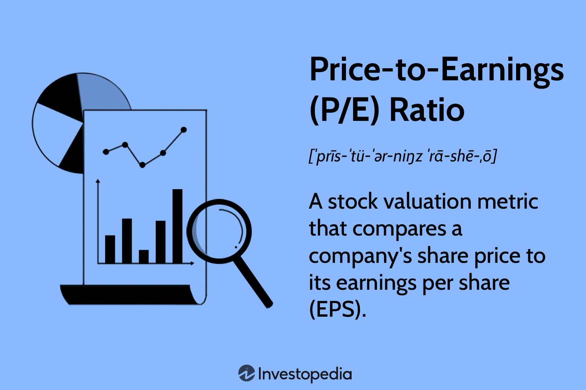

## Table of Contents

## What is the Price-to-Earnings (P/E) ratio?

The Price-to-Earnings (P/E) ratio is a way to figure out how much people are willing to pay for a company's earnings. It's calculated by taking the price of a company's stock and dividing it by the company's earnings per share (EPS). The P/E ratio helps investors see if a stock is a good buy. A high P/E might mean that people expect the company to grow a lot in the future. A low P/E might mean the company is not expected to grow much, or it could be a good deal if the company is doing well.

The P/E ratio can be used to compare companies in the same industry. If one company has a much higher P/E than another, it might be because investors think it will do better in the future. But, it's important to remember that the P/E ratio is just one tool. It doesn't tell the whole story about a company. Other things like the company's debt, how fast it's growing, and what's happening in the economy can also affect whether a stock is a good investment.

## How is the P/E ratio calculated?

The P/E ratio is calculated by dividing the price of a company's stock by its earnings per share (EPS). The stock price is how much one share of the company costs on the stock market. Earnings per share is the company's total earnings divided by the number of shares. So, if a stock costs $50 and the earnings per share is $5, the P/E ratio would be $50 divided by $5, which equals 10.

There are two types of P/E ratios: trailing P/E and forward P/E. The trailing P/E uses the earnings from the last 12 months, which are already known. The forward P/E uses the earnings that are expected for the next 12 months, which are just predictions. Both types can be useful, but the forward P/E can be less accurate because it's based on guesses about the future.

## Why is the P/E ratio important for investors?

The P/E ratio is important for investors because it helps them see if a stock's price is a good deal compared to how much money the company makes. If the P/E ratio is low, it might mean the stock is a bargain, and if it's high, it might mean the stock is expensive. Investors use the P/E ratio to compare different companies and decide which ones might be good investments.

But the P/E ratio is not perfect. It's just one piece of the puzzle. Sometimes a company with a high P/E ratio is actually a good investment if people expect it to grow a lot in the future. And a company with a low P/E ratio might not be a good deal if it's having problems. So, investors need to look at other things too, like the company's debt, how fast it's growing, and what's happening in the economy.

## What is considered a good P/E ratio in the oil and gas drilling industry?

In the oil and gas drilling industry, a good P/E ratio can be different depending on what's happening in the market and how well the companies are doing. Usually, a P/E ratio between 5 and 15 is seen as good in this industry. This is lower than what you might see in other industries because oil and gas drilling can be risky and the earnings can go up and down a lot.

But, it's important to look at more than just the P/E ratio. Sometimes, a company with a higher P/E ratio might still be a good investment if people think it will do well in the future. And a company with a low P/E ratio might not be a good deal if it's having problems. So, investors need to think about other things like how much debt the company has, how fast it's growing, and what's happening with oil prices.

## How does the P/E ratio of the oil and gas drilling industry compare to other industries?

The P/E ratio in the oil and gas drilling industry is usually lower than in many other industries. A good P/E ratio in this industry is often between 5 and 15. This is because the oil and gas business can be risky, and the earnings can change a lot. In contrast, industries like technology or consumer goods might have higher P/E ratios, sometimes even over 20 or 30, because they are seen as more stable or have more potential for growth.

But, it's not just about the numbers. The P/E ratio can be different depending on what's happening in the economy and how well the companies are doing. For example, if oil prices are high, the P/E ratios in the oil and gas industry might go up because people expect the companies to make more money. On the other hand, if oil prices are low, the P/E ratios might go down because people worry about the companies' earnings. So, it's important to look at the bigger picture and not just focus on the P/E ratio alone.

## What factors influence the P/E ratio in the oil and gas drilling sector?

The P/E ratio in the oil and gas drilling sector can change a lot because of different things. One big thing is the price of oil. When oil prices are high, companies in this sector can make more money, so their P/E ratios might go up because people think they will keep making good money. But if oil prices go down, the P/E ratios can drop because people worry the companies won't make as much money. Another thing that can change the P/E ratio is how much debt a company has. If a company has a lot of debt, its P/E ratio might be lower because people think it's riskier.

Also, the overall health of the economy can affect the P/E ratio in the oil and gas drilling sector. When the economy is doing well, people might be more willing to invest in this sector, pushing up the P/E ratios. But if the economy is not doing well, the P/E ratios might go down because people are more cautious. Lastly, what people expect for the future can also change the P/E ratio. If investors think a company will grow a lot, they might be willing to pay more for its stock, leading to a higher P/E ratio. But if they think the company won't grow much, the P/E ratio might be lower.

## How do fluctuations in oil prices affect the P/E ratio of drilling companies?

Fluctuations in oil prices can have a big impact on the P/E ratio of drilling companies. When oil prices go up, these companies can make more money. This means their earnings per share (EPS) can go up too. If the stock price stays the same or goes up a little, the P/E ratio will go down because the EPS is higher. But if investors think the higher oil prices will last, they might be willing to pay more for the stock, which can make the P/E ratio go up. So, it's not just about the current oil prices, but also what people think will happen in the future.

When oil prices go down, drilling companies might make less money. This can lower their EPS, and if the stock price stays the same or goes down a little, the P/E ratio will go up because the EPS is lower. But if investors think the lower oil prices will keep going, they might not want to pay as much for the stock, which can make the P/E ratio go down. So, the P/E ratio can change a lot because of oil prices, but it also depends on what people expect will happen with oil prices in the future.

## Can the P/E ratio predict the future performance of oil and gas drilling companies?

The P/E ratio can give us some ideas about how oil and gas drilling companies might do in the future, but it can't tell us everything. If a company has a low P/E ratio, it might mean that people think the company won't grow much or that it's having problems. But if the company has a high P/E ratio, it might mean that people expect it to do well in the future. So, the P/E ratio can help us guess what might happen, but it's not a perfect way to predict the future.

Other things like oil prices, how much debt a company has, and what's happening in the economy can also affect how well a company does. The P/E ratio is just one piece of the puzzle. If we want to know how a company will do in the future, we need to look at all these things together, not just the P/E ratio. So, while the P/E ratio can be a helpful tool, it's important to use it along with other information to make good guesses about the future.

## How do different accounting practices within the industry impact the P/E ratio?

Different accounting practices within the oil and gas drilling industry can change how a company's earnings are reported, which in turn can affect the P/E ratio. For example, some companies might use different methods to figure out how much their oil and gas reserves are worth. If one company uses a method that makes their earnings look higher, their P/E ratio might be lower than a company that uses a method that makes their earnings look lower. This can make it hard to compare P/E ratios between companies because their earnings numbers might not be calculated the same way.

Also, some companies might use different ways to account for costs like drilling and exploration. If one company decides to spread these costs over time, it might show higher earnings in the short term, leading to a lower P/E ratio. But if another company decides to report these costs all at once, its earnings might look lower, which could make its P/E ratio higher. So, when looking at P/E ratios in the oil and gas drilling industry, it's important to understand that different accounting practices can make the numbers look different, even if the companies are doing similar things.

## What are the limitations of using the P/E ratio to evaluate oil and gas drilling companies?

Using the P/E ratio to evaluate oil and gas drilling companies has some big problems. One problem is that the P/E ratio doesn't take into account how much debt a company has. If a company has a lot of debt, it might be riskier, but the P/E ratio won't show that. Also, the P/E ratio can be affected by different ways companies do their accounting. Some companies might make their earnings look higher or lower depending on how they count their costs and reserves. This can make it hard to compare P/E ratios between companies because the numbers might not be calculated the same way.

Another problem is that the P/E ratio doesn't tell us everything about what might happen in the future. It's based on past earnings or guesses about future earnings, but things like oil prices and the economy can change a lot. If oil prices go up or down, it can change how much money a company makes, which can make the P/E ratio go up or down too. So, while the P/E ratio can give us some ideas, it's not a perfect way to predict how well a company will do in the future. We need to look at other things too, like the company's growth and what's happening in the world, to get a better picture.

## How can investors use the P/E ratio in conjunction with other financial metrics to make informed decisions in the oil and gas drilling industry?

Investors can use the P/E ratio along with other financial metrics to get a better idea of how oil and gas drilling companies are doing. One important metric to look at is the debt-to-equity ratio, which shows how much debt a company has compared to its equity. If a company has a lot of debt, it might be riskier, even if its P/E ratio looks good. Another useful metric is the return on equity (ROE), which tells us how well a company is using its money to make profits. A high ROE can mean the company is doing well, but if it's low, it might be a sign of problems, even if the P/E ratio is low.

Also, investors should look at the price-to-book (P/B) ratio, which compares the market value of a company to its book value. This can help show if a company's stock is a good deal. In the oil and gas drilling industry, where earnings can go up and down a lot, the P/B ratio can be a good way to see if a company is undervalued. By looking at all these metrics together, investors can get a fuller picture of a company's health and make smarter choices. For example, a company with a low P/E ratio, a low debt-to-equity ratio, a high ROE, and a low P/B ratio might be a good investment, but it's important to consider everything together, not just one metric alone.

## What advanced techniques can be used to analyze the P/E ratio trends in the oil and gas drilling sector over time?

To analyze the P/E ratio trends in the oil and gas drilling sector over time, investors can use a technique called time series analysis. This means looking at how the P/E ratio changes from one period to another, like from one month to the next or from one year to the next. By doing this, investors can see if the P/E ratio is going up, going down, or staying the same. They can also use charts and graphs to make it easier to see these trends. This can help them understand if the sector is becoming more or less expensive compared to its earnings, and how that might be related to things like oil prices or the economy.

Another advanced technique is regression analysis, which helps investors see how different things affect the P/E ratio. For example, they can look at how changes in oil prices, interest rates, or the overall economy might change the P/E ratio. By using regression analysis, investors can make models that predict how the P/E ratio might change in the future based on what's happening now. This can give them a better idea of what to expect and help them make smarter investment choices.

## What is the Price-to-Earnings Ratio and how do we understand it?

The price-to-earnings (P/E) ratio is a fundamental financial metric that serves as a barometer for assessing a company's market value relative to its earnings. Commonly used by investors and analysts, the P/E ratio offers insight into how much investors are willing to pay for each unit of net income generated by the company. Mathematically, the P/E ratio is expressed as:

$$
\text{P/E Ratio} = \frac{\text{Current Share Price}}{\text{Earnings Per Share (EPS)}}
$$

This formula underscores the straightforward calculation involved in determining the P/E ratio. The numerator, current share price, represents the market value at which a company's shares are trading. Meanwhile, the denominator, earnings per share (EPS), is a measure of the company's profitability over a specified period.

A higher P/E ratio generally signals that investors anticipate future growth and are thus willing to pay a premium for the company's shares. This high expectation might be due to projections of increased revenues, expanded market presence, or successful product innovations. Conversely, a lower P/E ratio could imply that a stock is undervalued or that the company faces potential risks, such as declining earnings, competitive pressures, or broader economic challenges.

In industries like oil and gas, where earnings can be highly volatile due to fluctuations in commodity prices, the P/E ratio becomes particularly useful. The sector's earnings are heavily influenced by external factors, such as geopolitical events, regulatory changes, and shifts in global energy demand. As a result, the P/E ratio provides a quick snapshot of investor sentiment, reflecting how current and anticipated external factors impact the valuation of these companies.

By understanding these dynamics, investors can utilize the P/E ratio to make informed decisions regarding potential investment opportunities, assess market expectations, and strategize accordingly in a sector characterized by its unpredictability.

## References & Further Reading

[1]: ["Global Oil and Gas Tax Guide"](https://assets.ey.com/content/dam/ey-sites/ey-com/en_gl/topics/tax/hc-alert/ey-global-oil-and-gas-tax-guide-2019.pdf) by Ernst & Young (EY)

[2]: Donaldson, G. (2016). ["Oil and Gas: The Business and Politics of Energy"](https://www.amazon.com/Oil-Gas-Business-Politics-Energy/dp/1137349689) Morgan & Claypool Publishers.

[3]: Bühler, W., & Köppen, C. (2006). ["Price/Earnings Ratios and Future Growth as Determinants of Value Investing in the Oil Sector"](https://www.researchgate.net/publication/291791256_Value_Investing_Bridging_Theory_and_Practice). Schmalenbach Business Review.

[4]: ["Algorithmic Trading: Winning Strategies and Their Rationale"](https://www.amazon.com/Algorithmic-Trading-Winning-Strategies-Rationale-ebook/dp/B00CY5HC0U) by Ernest P. Chan

[5]: Hull, J. C. (2020). ["Options, Futures, and Other Derivatives, 11th Edition"](https://www.pearson.com/en-us/subject-catalog/p/options-futures-and-other-derivatives/P200000005938/9780136939917) Pearson.

[6]: ["Structural Change and Energy Security"](https://link.springer.com/chapter/10.1007/978-1-4471-5286-6_4) by Francisco J. Lozano and Francisco J. Fernández de Miguel

[7]: Narang, R. K. (2009). ["Inside the Black Box: A Simple Guide to Quantitative and High Frequency Trading"](https://onlinelibrary.wiley.com/doi/book/10.1002/9781118267738) Wiley Finance.