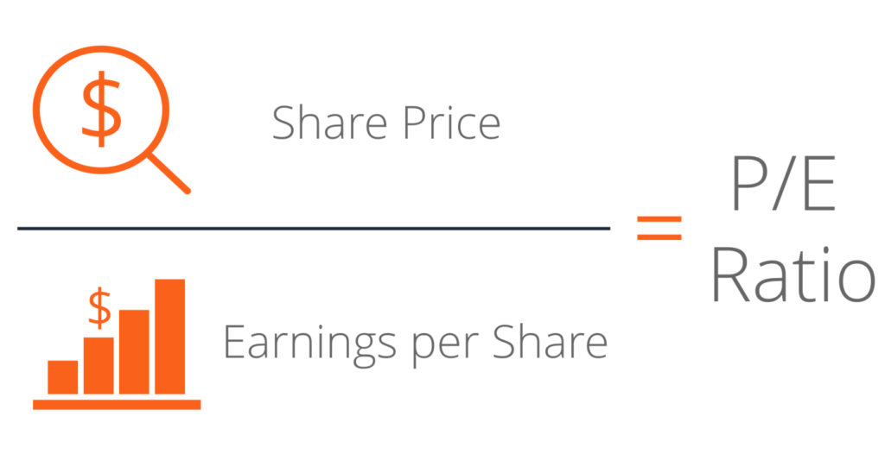

The Price-to-Earnings (P/E) ratio is a pivotal metric in stock valuation, serving as a cornerstone for both traditional and algorithmic trading strategies. This ratio is used by investors to assess a stock's market value relative to its earnings, offering insights into how a company is valued by the market based on its earning potential. By examining the P/E ratio, investors can determine whether a stock is overvalued, undervalued, or fairly valued, guiding their investment decisions accordingly.

The formula for the P/E ratio is straightforward:



$$
\text{P/E Ratio} = \frac{\text{Market Value per Share}}{\text{Earnings per Share (EPS)}}
$$

This formula reflects what investors are willing to pay today for a dollar of future earnings. Understanding this ratio is crucial, as high P/E ratios might suggest that a stock is overvalued or that investors are expecting high growth rates in the future. Conversely, a low P/E might indicate that the stock is undervalued or that the company is experiencing difficulties.

Integrating the P/E ratio into algorithmic trading platforms allows for the automation of stock selection. Algorithms can analyze extensive datasets quickly, comparing P/E ratios across a broad spectrum of stocks and industries to identify trading opportunities. This method not only enhances the speed and accuracy of stock evaluations but also allows for the execution of complex trading strategies that can adapt to varying market conditions.

In summary, the P/E ratio is an essential tool for investors seeking to make informed decisions amid the complexities of stock market analysis. Its integration into algorithmic trading systems further enhances its utility, allowing for more efficient and strategic investment processes.

## Table of Contents

## Understanding the Price-to-Earnings Ratio

The Price-to-Earnings (P/E) ratio is a key financial metric used to gauge the market value of a company relative to its earnings. It is calculated by dividing the market value per share by the earnings per share (EPS). In mathematical terms, the P/E ratio is represented as:

$$

\text{P/E Ratio} = \frac{\text{Market Value per Share}}{\text{Earnings per Share (EPS)}} 
$$

This ratio is instrumental for investors as it provides a snapshot of what the market is willing to pay today for a stock based on its past or projected earnings. It serves as an indicator of investor sentiment and expectations around a company's future earnings potential. A high P/E ratio may suggest that investors expect high growth rates in the company's future earnings, whereas a low P/E might indicate lower expectations or that the stock is undervalued relative to its earnings.

Investor expectations often drive stock prices; thus, changes in these expectations can have significant impacts on the stock's P/E ratio. For instance, if a company shows promising growth prospects or innovative capabilities, investors might anticipate higher future earnings, leading to an increase in the stock's P/E ratio. Conversely, if a company's growth outlook dims due to market challenges or increased competition, the P/E ratio may decrease as investors adjust their earnings expectations downward. Understanding these dynamics enables investors to make more informed decisions about the potential risks and returns associated with investing in particular stocks.

## Types of P/E Ratios and Their Significance

## Types of P/E Ratios and Their Significance

There are several variations of the Price-to-Earnings (P/E) ratio, each offering different insights into a company's financial standing and future potential. The primary variations include the Trailing P/E, Forward P/E, and CAPE (Cyclically Adjusted Price-to-Earnings) Ratio.

### Trailing P/E

The Trailing P/E ratio is calculated using the earnings per share (EPS) from the past 12 months. This backward-looking measure reflects the company's historical performance, providing investors with a tangible basis for comparison. The formula for the Trailing P/E ratio is:

$$
\text{Trailing P/E} = \frac{\text{Market Value per Share}}{\text{EPS of the past 12 months}}
$$

**Insights and Applications:** Trailing P/E is beneficial for judging how a company has performed against its peers in the past. It is commonly used in industries where earnings are stable, as it allows for consistent comparison across different times or companies.

**Benefits and Limitations:** The primary advantage of the Trailing P/E ratio is its reliance on actual, reported earnings, making it a stable and reliable measure of past performance. However, it does not account for future growth potential, and past earnings might not be a good predictor in rapidly transforming industries.

### Forward P/E

The Forward P/E ratio, also known as the estimated P/E, uses forecasted EPS to provide an outlook of a company's future financial performance. This anticipatory P/E ratio is calculated as:

$$
\text{Forward P/E} = \frac{\text{Market Value per Share}}{\text{Expected EPS over the next 12 months}}
$$

**Insights and Applications:** Investors utilize the Forward P/E to gauge whether the stock is anticipated to become more profitable. It is primarily used for companies with dynamic growth trajectories where future earnings are likely to impact stock prices significantly.

**Benefits and Limitations:** The main advantage of the Forward P/E is its capacity to provide insights into presumed future performance, aiding in gauging company growth prospects. However, this measure is based on analyst projections, which can be inaccurate due to unforeseen economic conditions or company performance shifts.

### CAPE Ratio

The Cyclically Adjusted Price-to-Earnings (CAPE) ratio, popularized by economist Robert Shiller, averages earnings over a 10-year period, adjusting for inflation. This results in a more tempered view of a company's earnings performance over varying economic cycles.

**Insights and Applications:** The CAPE ratio is particularly insightful for assessing long-term investment opportunities by smoothing out economic fluctuations. It is extensively applied in macroeconomic analysis and long-duration investment strategies to identify whether markets are generally over or undervalued.

**Benefits and Limitations:** CAPE's primary benefit is its ability to mitigate the impact of short-term volatility, offering a more balanced long-term view. Yet, it can be less reactive to recent changes and might miss short-term shifts in a company's or market's performance due to its emphasis on long-term averaging. 

Overall, each type of P/E ratio offers unique insights suitable for different investment strategies, and understanding their strengths and limitations is crucial for applying the most relevant measure to a given financial context. Using these ratios in conjunction provides a comprehensive analysis of stock valuations under varied market conditions.

## The Role of P/E Ratios in Stock Valuation

The Price-to-Earnings (P/E) ratio serves as a pivotal tool in stock valuation, enabling investors to assess both individual stocks and broader sectors or markets. This ratio, calculated as the market value per share divided by the earnings per share (EPS), helps investors gauge whether a stock is overvalued or undervalued, offering insights into what the market expects from a company’s future earnings growth.

Investors use P/E ratios to compare stocks within the same industry, as these comparisons can reveal variations in the market's valuation of similar companies. For instance, a company with a high P/E ratio compared to its peers may be perceived as having higher growth prospects, whereas a low P/E ratio might suggest concerns about future earnings potential or that the company is undervalued.

Different industries tend to have varying average P/E ranges, which reflect their respective growth rates and risk profiles. For example, technology companies often exhibit higher P/E ratios due to strong growth expectations and innovation-driven revenue increases. In contrast, utility companies, which typically have steady but slower growth, tend to have lower P/E ratios. A high P/E ratio in an industry accustomed to high growth could suggest reasonable investor enthusiasm, whereas the same P/E ratio might signal overvaluation in a more stable industry.

To illustrate, consider technology giants such as Tesla or Amazon. These companies often exhibit high P/E ratios due to their perceived growth potential and innovative market positioning. At the same time, well-established consumer goods companies like Procter & Gamble or Coca-Cola might display lower P/E ratios, reflecting more stable earnings with less ambitious growth expectations.

When interpreting P/E ratios, it's crucial to look beyond the numbers. A high P/E ratio may imply that a stock is overvalued and may decrease in price if those growth expectations are unmet. Conversely, a low P/E ratio can indicate an undervalued stock, presenting potential investment opportunities if the company’s performance improves.

Investors often use P/E ratio analysis in conjunction with other metrics to ensure a comprehensive evaluation, recognizing that the ratio alone does not account for factors such as debt levels, market conditions, or qualitative aspects of a company’s operations. Thus, while vital for stock valuation, the P/E ratio should form part of a broader analytical toolkit for informed investment decision-making.

## Incorporating P/E Ratios into Algorithmic Trading

Incorporating Price-to-Earnings (P/E) ratios into [algorithmic trading](/wiki/algorithmic-trading) models serves as an efficient method for automated stock selection. The integration involves leveraging quantitative strategies to analyze and select stocks based on their P/E ratios, thus enabling traders to exploit potential mispricings in the market. Algorithmic trading, which employs computer algorithms to execute trades at high speeds, can significantly enhance the analysis of P/E ratios by capitalizing on its computational capabilities.

Algorithms can process large datasets rapidly, comparing P/E ratios across thousands of stocks and multiple sectors. This process involves filtering stocks that meet certain P/E ratio criteria, enabling traders to identify undervalued or overvalued stocks based on historical averages or sector benchmarks. The computational efficiency of algorithmic systems allows for the continuous monitoring of market data, adjusting to real-time changes, which is crucial in dynamic market environments.

One of the primary advantages of utilizing algorithmic trading is its speed. Algorithms can execute trades much faster than any human, responding to market opportunities as they arise. Additionally, the accuracy of algorithms in performing calculations and executing trades minimizes errors that could occur in manual trading. This precision ensures that the selected stocks based on the P/E criteria are promptly and accurately traded.

Moreover, algorithmic trading systems can handle large datasets, a task that is cumbersome for human traders. This capacity is essential in analyzing the extensive market data needed for comprehensive P/E ratio assessments. The ability to simultaneously analyze vast amounts of historical and real-time data allows for a multi-dimensional evaluation that considers other influential variables alongside P/E ratios, leading to more informed trading decisions.

To implement a basic P/E ratio-based algorithmic trading strategy using Python, one could utilize libraries like Pandas for data manipulation and NumPy for numerical computations. For example:

```python
import pandas as pd

# Example dataset
data = pd.DataFrame({
    'Stock': ['A', 'B', 'C', 'D'],
    'Market Value per Share': [100, 150, 80, 200],
    'Earnings per Share': [5, 8, 2, 10]
})

# Calculate the P/E Ratio
data['P/E Ratio'] = data['Market Value per Share'] / data['Earnings per Share']

# Filter stocks with a P/E Ratio below a certain threshold
filtered_stocks = data[data['P/E Ratio'] < 15]

print(filtered_stocks)
```

This basic code snippet demonstrates an elementary approach to selecting stocks with P/E ratios below a specified threshold, which could indicate potential undervaluation. By expanding on this example, traders can incorporate additional data sources and complex algorithms for a refined trading strategy.

In conclusion, incorporating P/E ratios into algorithmic trading models offers a strategic advantage by enabling rapid and accurate analysis of large datasets, ultimately facilitating more effective automated stock selection.

## Case Study: Using P/E Ratios in an Algorithmic Trading Strategy

A hypothetical example of an algorithmic trading strategy utilizing the Price-to-Earnings (P/E) ratio can serve as a practical illustration of how this metric plays a role in automated financial decision-making. Let's consider a strategy designed to exploit stocks perceived as undervalued based on their P/E ratios.

**Setup:**

In this example, we develop a Python-based algorithmic trading strategy. The strategy selects and trades stocks from a predefined universe, such as those in the S&P 500 index. The primary criterion for selection is a relatively low P/E ratio compared to the industry average, signaling potential undervaluation.

1. **Data Collection:** 
   - Gather historical market data, including stock prices and earnings per share (EPS), for firms in the target universe.
   - Calculate P/E ratios using the formula: 
$$
     \text{P/E Ratio} = \frac{\text{Market Value per Share}}{\text{Earnings per Share (EPS)}}

$$

2. **Screening:** 
   - Compare each stock's P/E ratio to the industry average.
   - Select stocks with a P/E ratio below a certain threshold, e.g., 20% lower than the industry average.

3. **Execution:**
   - Implement a trading rule: buy selected stocks to hold for a predefined time, such as one fiscal quarter.
   - Set stop-loss and take-profit directives to mitigate risks and secure gains.

4. **Backtesting:**
   - Assess the strategy against historical data to gauge performance across varied market conditions, including bullish, bearish, and sideways market phases.

**Results:**

During the [backtesting](/wiki/backtesting) phase, the strategy might perform well in bearish market conditions by identifying undervalued stocks likely to appreciate as markets recover. In contrast, performance could be less optimal in bull markets where high P/E [growth stocks](/wiki/growth-stocks) outperform.

**Analysis:**

**Strengths:**
- **Simplicity and Focus:** The strategy's reliance on the P/E ratio simplifies the decision-making process and focuses on clear value indicators.
- **Systematic Investment Process:** Automating the trading process ensures consistency and removes emotional bias.

**Potential Pitfalls:**
- **Sensitivity to Market Sentiment:** The strategy may underperform if investor sentiment shifts abruptly, impacting market valuations regardless of fundamentals.
- **Sector Variability:** Different industries exhibit distinct P/E baselines, which might not reflect undervaluation or overvaluation uniformly. Adjustments for sector-specific norms may be necessary.
- **Dependence on Accurate EPS Data:** Variations in accounting practices might lead to inflated or deflated EPS figures, skewing the P/E ratio.

In conclusion, while incorporating P/E ratios into an algorithmic trading strategy offers distinct advantages in terms of speed and consistency, investors should also integrate additional financial metrics and qualitative factors to evaluate and mitigate risks effectively. This multifaceted approach ensures a robust trading strategy capable of adapting to a dynamic market environment.

## Pros and Cons of Relying on the P/E Ratio Alone

The Price-to-Earnings (P/E) ratio serves as a popular valuation metric mainly due to its simplicity and efficiency in providing a quick snapshot of a stock's relative value. One of its primary advantages is the ease with which investors can calculate and interpret it, making it an essential tool for initial assessments of company value and investor sentiment. The P/E ratio, calculated as the market value per share divided by the earnings per share (EPS), offers an immediate measure of how much investors are willing to pay per dollar of earnings.

However, the use of the P/E ratio alone comes with several limitations. A significant concern is the variation in accounting practices, which can lead to discrepancies in reported earnings and consequently affect the P/E calculation. For instance, companies using aggressive accounting techniques might present an inflated EPS, leading to a lower P/E and potentially misleading investors about the stock's actual value.

Sectoral differences also pose challenges when relying solely on the P/E ratio. Different industries typically operate under varied growth expectations and profit margins, resulting in diverse P/E ranges. For instance, technology companies often display higher P/E ratios due to expected rapid growth, whereas utility companies might have lower P/Es due to stable but slower growth expectations. Consequently, comparing P/E ratios across different sectors may not provide an accurate picture of relative stock valuation.

Given these limitations, it is crucial to complement P/E analysis with other financial metrics and a broader understanding of market conditions. For example, metrics such as the Price-to-Book (P/B) ratio, Return on Equity (ROE), and debt-to-equity ratio can offer additional insights into a company's financial health and value. Additionally, considering macroeconomic factors and sector-specific trends can help investors make more informed decisions, ensuring that they do not rely entirely on the P/E ratio. Integrating various analytical tools and perspectives can lead to a more comprehensive evaluation of investment opportunities, enhancing the robustness of investment decisions.

## Conclusion

The Price-to-Earnings (P/E) ratio remains a pivotal tool in stock valuation and algorithmic trading, offering investors a fundamental metric to assess a company’s market value relative to its earnings. As we have explored, the P/E ratio, calculated using the formula $\text{P/E Ratio} = \frac{\text{Market Value per Share}}{\text{Earnings per Share (EPS)}}$, assists investors in gauging whether a stock is overvalued, undervalued, or fairly valued. It provides insight into market expectations about a company's future earnings growth.

Algorithmic trading systems leverage the speed and precision of technology to process vast amounts of data, making the integration of the P/E ratio particularly beneficial in handling dynamic market conditions. By incorporating P/E ratios into algorithms, traders can automate decisions based on stock valuations, allowing rapid filtering of opportunities across various sectors. This automation not only enhances the efficiency of the trading process but also reduces human error.

However, relying on the P/E ratio alone can be misleading due to its inherent limitations. Variations in accounting practices and sector-specific differences can distort comparisons. It is crucial, therefore, for investors to employ a balanced approach to stock analysis. The P/E ratio should be one of multiple metrics used in conjunction with others such as the PEG ratio, return on equity (ROE), and debt-to-equity ratio. This holistic approach ensures a more comprehensive evaluation, minimizing the risks associated with stock selection and investment strategies.

In conclusion, while the P/E ratio is an essential component of financial analysis, its effectiveness is maximized when used as part of a broader toolkit. Investors who integrate the P/E ratio with supplementary analyses are better positioned to make informed decisions, navigating the complexities of stock markets to achieve strategic investment objectives.

## References & Further Reading

[1]: Damodaran, A. (2012). ["Investment Valuation: Tools and Techniques for Determining the Value of Any Asset"](https://www.wiley.com/en-us/Investment+Valuation%3A+Tools+and+Techniques+for+Determining+the+Value+of+Any+Asset%2C+3rd+Edition-p-9781118011522) (3rd ed.). Wiley.

[2]: Graham, B., & Dodd, D. (2009). ["Security Analysis: Sixth Edition, Foreword by Warren Buffett"](https://www.amazon.com/Security-Analysis-Foreword-Buffett-Editions/dp/0071592539). McGraw-Hill Education.

[3]: Penman, S. H. (2013). ["Financial Statement Analysis and Security Valuation"](https://www.mheducation.com/highered/product/financial-statement-analysis-security-valuation-penman/M9780078025310.html) (5th ed.). McGraw-Hill Education.

[4]: "The P/E Ratio: A User's Manual" by John Y. Campbell and Robert J. Shiller, ["Journal of Portfolio Management"](https://en.wikipedia.org/wiki/Allan_Weiss) (2005).

[5]: Lopez de Prado, M. (2018). ["Advances in Financial Machine Learning"](https://www.amazon.com/Advances-Financial-Machine-Learning-Marcos/dp/1119482089). Wiley.

[6]: Fabozzi, F. J., & Frank, J. (2015). ["Handbook of High-Frequency Trading and Modeling in Finance"](https://books.google.com/books/about/Bond_Markets_Analysis_and_Strategies_ten.html?id=bQpNEAAAQBAJ). Wiley.

[7]: Shiller, R. J. (2015). ["Irrational Exuberance"](https://www.jstor.org/stable/j.ctt1287kz5) (3rd ed.). Princeton University Press.