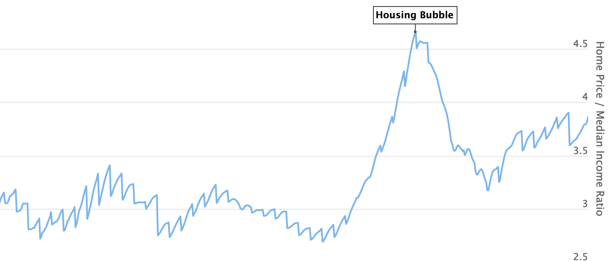

## Table of Contents

## What is a Price-to-Earnings (P/E) ratio?

The Price-to-Earnings (P/E) ratio is a way to figure out how much investors are willing to pay for each dollar of a company's earnings. It's calculated by dividing the current stock price by the company's earnings per share (EPS). For example, if a company's stock is trading at $50 and its EPS is $5, the P/E ratio would be 10. This means investors are willing to pay $10 for every $1 of earnings the company makes.

The P/E ratio can help investors decide if a stock is a good buy. A high P/E ratio might mean that investors expect the company to grow a lot in the future, so they're willing to pay more for its stock. On the other hand, a low P/E ratio could mean that the company isn't expected to grow much, or it might be undervalued. However, the P/E ratio should not be the only thing investors look at. It's important to compare the P/E ratio with other companies in the same industry and consider other factors like the company's financial health and future growth prospects.

## How is the P/E ratio calculated in real estate?

In real estate, the P/E ratio is used a bit differently than in the stock market. Instead of looking at stock prices and earnings per share, we use the price of the property and its net operating income (NOI). The P/E ratio in real estate is often called the "price-to-rent ratio" or "price-to-income ratio." To calculate it, you divide the property's price by its annual NOI. For example, if a property costs $300,000 and its NOI is $30,000 per year, the P/E ratio would be 10. This means you're paying 10 times the annual income the property generates.

This ratio helps investors understand if a property is a good deal. A lower P/E ratio might mean the property is a good investment because you're paying less for each dollar of income it produces. A higher ratio could mean the property is overpriced, or that it's in a high-demand area where people are willing to pay more. Just like with stocks, it's important to compare the P/E ratio of a property with similar properties in the same area to get a better idea of its value.

## Why is the P/E ratio important in real estate investing?

The P/E ratio is important in real estate investing because it helps investors figure out if a property is a good deal. By dividing the price of the property by its annual net operating income, investors can see how much they're paying for each dollar the property earns. A lower P/E ratio means you're paying less for the income the property generates, which could mean it's a good investment. On the other hand, a higher P/E ratio might mean the property is overpriced, or it could be in a popular area where people are willing to pay more.

Comparing the P/E ratio of a property with similar properties in the same area is a smart move. This helps investors understand if the property's price is fair compared to others. It's not the only thing to look at, but the P/E ratio gives a quick and easy way to see if a property might be a good investment. By using this ratio, investors can make better decisions about where to put their money in real estate.

## What does a high P/E ratio indicate about a real estate investment?

A high P/E ratio in real estate means you're paying a lot for each dollar the property earns. This could mean the property is overpriced, and you might not get a good return on your investment. For example, if a property has a P/E ratio of 20, you're paying 20 times the annual income it makes, which is a lot more than if the ratio was lower.

But a high P/E ratio isn't always bad. It might mean the property is in a popular area where people are willing to pay more. If the neighborhood is growing and property values are going up, a high P/E ratio might still be a good investment. So, it's important to look at other things too, like how the area is doing and what similar properties are selling for.

## What does a low P/E ratio suggest about a real estate investment?

A low P/E ratio in real estate means you're paying less for each dollar the property earns. This could mean the property is a good deal because you're getting more income for your money. For example, if a property has a P/E ratio of 5, you're only paying 5 times the annual income it makes, which is a lot less than if the ratio was higher.

But a low P/E ratio doesn't always mean it's a great investment. It might mean the property is in an area that's not doing well, or it might need a lot of repairs. So, it's important to look at other things too, like how the neighborhood is doing and what similar properties are selling for.

## How do P/E ratios differ between residential and commercial real estate?

P/E ratios can be used for both residential and commercial real estate, but they work a bit differently. For residential properties, the P/E ratio is often called the price-to-rent ratio. You take the price of the home and divide it by the annual rent you could get if you rented it out. A lower ratio might mean the home is a good deal, but you also need to think about things like how nice the neighborhood is and if the home needs repairs.

For commercial real estate, the P/E ratio is usually called the price-to-income ratio. You take the price of the building and divide it by its net operating income, which is the money the building makes after expenses. A lower ratio can mean the building is a good investment, but you need to look at other things too, like how stable the tenants are and if the area is growing. Both types of real estate use the P/E ratio to help figure out if a property is a good buy, but the details and what you need to think about can be different.

## Can P/E ratios be used to compare real estate investments across different markets?

Yes, P/E ratios can be used to compare real estate investments across different markets. By looking at the P/E ratio, you can see how much you're paying for the income a property makes, no matter where it is. For example, if a property in one city has a P/E ratio of 10 and a similar property in another city has a P/E ratio of 15, you might think the first property is a better deal because you're paying less for each dollar of income.

But, it's important to be careful when comparing P/E ratios across different markets. Things like the local economy, how popular the area is, and how much properties usually cost can make a big difference. A higher P/E ratio in one market might be normal because it's a hot area where people are willing to pay more. So, while P/E ratios can give you a quick way to compare, you should also look at other things to make sure you're getting a good deal.

## What are the limitations of using P/E ratios in real estate analysis?

Using P/E ratios in real estate analysis can be helpful, but it has some limitations. One big problem is that P/E ratios don't tell you everything about a property. They don't consider things like how much it will cost to fix up the property, how good the neighborhood is, or if the local economy is doing well. If you only look at the P/E ratio, you might miss important details that could affect how good an investment the property is.

Another limitation is that P/E ratios can be different in different places. What's a good P/E ratio in one city might be a bad one in another. This makes it hard to compare properties in different markets just by looking at their P/E ratios. You need to know about the local real estate market and what's normal there to make a fair comparison. So, while P/E ratios can give you a quick idea of a property's value, they shouldn't be the only thing you use to decide if it's a good investment.

## How have historical P/E ratios influenced real estate investment strategies?

Historical P/E ratios have been a big help for real estate investors in figuring out if a property is a good buy. By looking at past P/E ratios, investors can see if the current price of a property is high or low compared to what it used to be. For example, if the P/E ratio for a certain type of property in a city has usually been around 10, but now it's 15, investors might think the property is overpriced. On the other hand, if the P/E ratio is lower than usual, it might be a good time to buy because the property could be undervalued.

But, using historical P/E ratios isn't perfect. Things like the economy, how much people want to live in an area, and changes in the real estate market can make the P/E ratio go up or down. So, even if the P/E ratio is lower than it used to be, it might not mean the property is a good deal if the neighborhood is getting worse or if there are fewer people who want to rent or buy there. That's why smart investors use historical P/E ratios as just one part of their strategy, along with other information to make the best choices.

## What other financial metrics should be considered alongside P/E ratios in real estate?

When looking at real estate investments, it's good to use other financial metrics along with the P/E ratio. One important metric is the capitalization rate, or "cap rate." This tells you how much money the property makes compared to how much it costs. You find the cap rate by dividing the property's net operating income by its price. A higher cap rate might mean the property is a good deal because it's making more money for what you paid.

Another metric to consider is the cash-on-cash return. This shows how much money you're making on the cash you put into the property. You calculate it by dividing the annual pre-tax cash flow by the total cash invested. This helps you see if the property is a good investment based on how much money you're actually putting in. Both the cap rate and cash-on-cash return give you a fuller picture of how the property will perform, helping you make a smarter investment decision.

## How can investors use P/E ratios to forecast future real estate market trends?

Investors can use P/E ratios to help guess where the real estate market might be heading. By looking at the P/E ratios of properties over time, investors can spot patterns. If P/E ratios are going up, it might mean that people are willing to pay more for properties, which could mean the market is getting hotter. On the other hand, if P/E ratios are going down, it might mean that people are not as excited about buying properties, and the market could be cooling off. By keeping an eye on these changes, investors can try to predict if property prices will go up or down in the future.

But, using P/E ratios to forecast market trends isn't perfect. A lot of other things can affect the real estate market, like the economy, interest rates, and how many people want to buy or rent. So, while P/E ratios can give you a hint about where the market might be going, they're just one piece of the puzzle. Smart investors use P/E ratios along with other information to make the best guesses about future trends.

## What advanced techniques can be applied to refine P/E ratio analysis in real estate?

To make P/E ratio analysis better in real estate, investors can use something called regression analysis. This fancy method helps you see how P/E ratios change over time and how they're affected by other things, like the economy or interest rates. By looking at this, investors can figure out if a high or low P/E ratio is normal for a certain area or if it means the property is a good or bad deal. This can help make better guesses about what the property might be worth in the future.

Another way to improve P/E ratio analysis is by using something called cohort analysis. This means grouping similar properties together and watching how their P/E ratios change over time. For example, you might look at all the apartments in a certain neighborhood. By doing this, you can see if the P/E ratios for these properties are going up or down and compare them to other areas. This can help you understand if a property's P/E ratio is good or bad compared to others like it.

## What are Price-to-Earnings Ratios and How Can They Be Understood?

The Price-to-Earnings (P/E) ratio serves as a fundamental metric in evaluating a company's valuation. It is calculated by dividing the current market price of a company's share by its earnings per share (EPS). Mathematically, the P/E ratio can be expressed as:

$$
\text{P/E Ratio} = \frac{\text{Market Price per Share}}{\text{Earnings per Share (EPS)}}
$$

This ratio provides investors with a quick snapshot of what the market is willing to pay today for a company's earnings. As a pivotal tool in [fundamental analysis](/wiki/fundamental-analysis), the P/E ratio assists investors in determining the relative value of a company's shares, facilitating comparisons with peers and market benchmarks.

Comparing trailing and forward P/E ratios is crucial for gaining insights into a company's financial health. The trailing P/E ratio uses earnings from the past 12 months, offering a historical perspective. In contrast, the forward P/E ratio is based on forecasted earnings for the next 12 months, reflecting the market's expectations of future growth. This distinction allows investors to assess whether a stock is overvalued or undervalued relative to its earnings potential.

Higher P/E ratios often suggest that investors anticipate significant growth in a company's earnings. These elevated ratios are usually associated with companies in burgeoning industries or those with substantial future growth prospects. However, a high P/E ratio might also indicate that a stock is overpriced, necessitating careful analysis.

It is important to note that different sectors, including real estate, adhere to unique industry standards when interpreting P/E ratios. Factors such as growth rates, capital structure, and revenue streams can significantly influence these evaluations. For instance, a high P/E ratio may be more acceptable in technology sectors than in traditional industries like manufacturing. Therefore, comparing P/E ratios within the context of specific industries is crucial for accurate investment assessments.

In summary, the P/E ratio remains an indispensable instrument for investors, enabling them to make informed decisions by evaluating potential investment opportunities against industry norms and market expectations.

## What are Price-to-Earnings Ratios in Real Estate?

Real estate companies, including Real Estate Investment Trusts (REITs), are often evaluated using price-to-earnings (P/E) ratios, a key indicator in assessing their financial performance and potential growth. The P/E ratio is calculated by dividing the market value per share by the earnings per share (EPS):

$$
\text{P/E ratio} = \frac{\text{Market Value per Share}}{\text{Earnings per Share (EPS)}}
$$

In the real estate industry, several factors uniquely influence the P/E ratio. One such [factor](/wiki/factor-investing) is property depreciation, which can significantly affect earnings calculations. Real estate assets are subject to depreciation over time, leading to a reduction in taxable income and influencing the reported earnings. This can create a divergence between accounting earnings and cash flow from operations, requiring investors to carefully interpret the P/E ratios of real estate entities.

For real estate companies, the P/E ratio serves as an essential tool to assess both profitability and growth potential. A higher P/E ratio might indicate that the market expects substantial growth in future earnings, although it is also crucial for investors to recognize that this could mean that the stock is overvalued. Conversely, a lower P/E may suggest either undervaluation or slower growth prospects. Therefore, investors often contextualize P/E ratios by comparing them to industry-specific norms and standards, rather than solely relying on broad market averages.

Furthermore, the real estate sector often demonstrates higher P/E ratios compared to other industries. This is largely due to its asset-heavy structure, which involves significant investment in properties. These substantial asset holdings can translate into higher value per share and potentially elevated market expectations for future earnings, despite the earnings themselves being affected by depreciation and other non-cash charges.

In summary, when evaluating real estate investments using P/E ratios, it is vital to consider these ratios within the framework of industry-specific standards and the distinctive characteristics of real estate accounting. This nuanced approach allows investors to better gauge the true investment potential of real estate companies, adjusting for factors like property depreciation that might skew traditional financial analysis.

## What are the different Price-to-Earnings models?

Different price-to-earnings (P/E) models provide essential insights for real estate investors by examining a company’s valuation relative to its earnings. Two principal models include the trailing P/E ratio and the forward P/E ratio. The trailing P/E ratio is calculated using earnings reported over the past 12 months. This backwards-looking measure offers a concrete view of how a company has historically performed. It is represented by the formula:

$$
\text{Trailing P/E Ratio} = \frac{\text{Current Share Price}}{\text{Earnings Per Share (EPS) from the last 12 months}}
$$

Conversely, the forward P/E ratio uses projected future earnings, offering investors a perspective on anticipated growth. This model is useful for assessing how current market sentiment and business forecasts expect the company to perform moving forward:

$$
\text{Forward P/E Ratio} = \frac{\text{Current Share Price}}{\text{Projected EPS for the next 12 months}}
$$

Both NYU Stern School and Finviz.com provide extensive data on P/E ratios across various real estate sectors. These resources are particularly valuable as they encompass industry-specific metrics, facilitating a tailored analysis for investors. Variations in industry-specific P/E ratios often arise due to differing capital structures, risk profiles, and growth prospects inherent in sectors such as residential, commercial, or industrial real estate.

Market conditions significantly influence P/E ratios, leading to wide discrepancies in valuations across sectors and timeframes. During economic upturns, higher P/E ratios may reflect optimism and growth expectations, while downturns typically result in compressed P/E ratios. A comparison with broader market indices, such as the S&P 500, can help to highlight these sector-based valuation disparities, providing context to whether a real estate investment is over or undervalued.

Understanding these P/E models is crucial for effective real estate investment strategies. They inform decisions by clarifying whether a particular asset or company offers good value relative to its earnings potential. Investors can leverage these insights to optimize portfolio construction and seize opportunities in various market conditions, ensuring an adaptive approach to the ever-changing real estate landscape.

## References & Further Reading

[1]: Damodaran, A. (2012). ["Investment Valuation: Tools and Techniques for Determining the Value of Any Asset"](https://books.google.com/books/about/Investment_Valuation.html?id=5SRHAAAAQBAJ). Wiley Finance.

[2]: Lopez de Prado, M. (2018). ["Advances in Financial Machine Learning"](https://www.amazon.com/Advances-Financial-Machine-Learning-Marcos/dp/1119482089). Wiley.

[3]: Chan, E. P. (2009). ["Quantitative Trading: How to Build Your Own Algorithmic Trading Business"](https://github.com/ftvision/quant_trading_echan_book). Wiley Trading.

[4]: Jansen, S. (2018). ["Machine Learning for Algorithmic Trading: Predictive models to extract signals from market and alternative data for systematic trading strategies with Python"](https://github.com/stefan-jansen/machine-learning-for-trading). Packt Publishing.

[5]: Fabozzi, F. J., Shiller, R. J., & Tunaru, R. S. (2012). ["The Theory and Practice of Investment Management"](http://aida.econ.yale.edu/~shiller/pubs/property-derivatives2010.pdf). Wiley Finance Series.