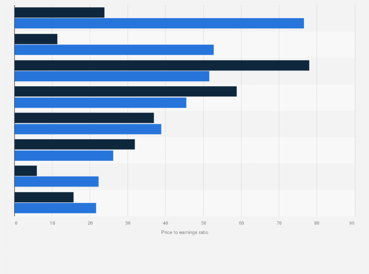

The financial landscape is continuously evolving, driven by the development of sophisticated trading strategies and analytical tools. In this article, we examine the Price-to-Earnings (P/E) ratio, a crucial financial metric, particularly in the telecommunications sector. This sector has witnessed significant growth due to technological advancements such as 5G and regulatory changes like deregulation, making it essential for investors to understand its financial dynamics.

The P/E ratio stands out as an indicator of a company's market value relative to its earnings. It is calculated using the formula:



$$
\text{P/E Ratio} = \frac{\text{Market Price per Share}}{\text{Earnings per Share (EPS)}}
$$

Investors utilize the P/E ratio to evaluate whether a stock is priced appropriately, often comparing it to industry standards to determine if it is overvalued or undervalued. In the telecommunications sector, the application of the P/E ratio becomes particularly important. This sector encompasses a wide range of services and technologies, from traditional telephony to advanced satellite communications and burgeoning technologies like 5G.

Algorithmic trading has further amplified the importance of the P/E ratio in investment strategies. This type of trading uses advanced computational methods to execute trades with speed and precision, analyzing historical data to anticipate future stock movements based on current valuations.

Understanding the P/E ratio is thus essential for evaluating telecommunications companies. As this sector continues to evolve, the ability to interpret P/E ratios effectively will be critical for making informed investment decisions.

## Table of Contents

## Understanding the Price-to-Earnings (P/E) Ratio

The Price-to-Earnings (P/E) ratio is an essential financial metric employed to establish the value of a stock relative to its earnings. It is a fundamental tool for investors seeking to determine the relative attractiveness of a company's shares. The P/E ratio is formulated by dividing the current market price per share by the earnings per share (EPS), as shown in the formula below:

$$
\text{P/E Ratio} = \frac{\text{Price per Share}}{\text{Earnings per Share (EPS)}}
$$

This ratio provides insight into what the market is willing to pay today for a stock based on its past or future earnings. A key aspect of the P/E ratio is its ability to indicate whether a stock is overvalued or undervalued by comparing it to industry benchmarks or historical data. When a company's P/E ratio is significantly higher than the industry average, it may suggest that investors expect higher future growth relative to similar companies. Conversely, a lower P/E might indicate that the stock is undervalued or that the company is experiencing difficulties.

The P/E ratio is a widely used measure due to its simplicity and effectiveness, allowing investors to make quick comparisons across companies and industries. It is crucial to consider that while P/E ratios are an informative measure, they are not standalone indicators of a company's financial health. Investors often integrate P/E analysis with other financial metrics to gain a comprehensive understanding of a company's performance and potential.

## Significance of P/E Ratio in the Telecommunications Sector

The telecommunications sector is a multifaceted industry, covering everything from conventional telephony services to advanced satellite communications. With its vast range of services and rapid growth trajectory, the industry presents unique challenges and opportunities for investors. A pivotal tool for assessing these opportunities is the Price-to-Earnings (P/E) ratio, a widespread valuation metric that offers insights into market expectations of a company's earnings potential.

The P/E ratio is calculated by dividing a company's current share price by its earnings per share (EPS):

$$
\text{P/E Ratio} = \frac{\text{Share Price}}{\text{Earnings Per Share (EPS)}}
$$

In the telecommunications sector, the P/E ratio serves as a barometer of investor sentiment and growth potential. As the industry experiences significant innovations, particularly with the advent of 5G technology, market expectations often shift. The launch of 5G networks is anticipated to revolutionize various applications ranging from mobile broadband to the Internet of Things (IoT), thereby increasing the sector's growth prospects. Consequently, understanding the P/E dynamics is crucial for investors aiming to capitalize on these opportunities.

The P/E ratio also aids in comparative analysis across the telecommunications industry, which is characterized by a wide range of business models. Companies within this sector can differ vastly, from those providing traditional voice services to firms focused on high-speed internet and satellite communications. These variances necessitate a thorough comparison of P/E ratios within the industry to identify which companies are potentially undervalued or overvalued based on their earnings potential relative to their peers.

For instance, a telecommunications company with a P/E ratio significantly higher than the industry average might suggest that investors expect higher growth potential, possibly due to the firm's strategic position in emerging technologies such as 5G or competitive advantages such as superior infrastructure. Conversely, a lower P/E ratio might indicate the company is undervalued or facing challenges — possibly regulatory, financial, or technological — that are perceived as liabilities by the market.

Furthermore, the analysis of P/E ratios over time can provide investors with insights into broader industry trends, investor confidence, and economic cycles. Variations in the ratios can signal changes in the regulatory environment, technological advancements, or shifts in market competition, each influencing the financial outlook for telecommunications companies.

In conclusion, P/E ratios remain a fundamental instrument in assessing the potential and risks associated with investments in the telecommunications sector. As the industry continues to grow and evolve, particularly with disruptive innovations, keeping abreast of P/E trends and the corresponding economic and technological contexts will be vital for informed investment decisions.

## Algo Trading and the P/E Ratio

Algorithmic trading, abbreviated as algo trading, employs advanced computing technology to perform trades at exceptional speed and efficiency. In modern finance, it has become a cornerstone for traders seeking to optimize their investment strategies and is pivotal in the telecommunications sector, where the application of the Price-to-Earnings (P/E) ratio has been notably transformed by these technologies.

Incorporating P/E ratios into [algorithmic trading](/wiki/algorithmic-trading) strategies allows algorithms to swiftly analyze historical and current data to forecast stock price movements. It involves employing quantitative models that utilize past P/E ratio trends to generate predictions about future market behavior. By capturing anomalous P/E values, algorithms can indicate potential market under- or overvaluation, thus suggesting opportunities for profitable trades. This process can be described as follows:

1. **Data Collection**: Gather historical stock price and earnings data for relevant telecommunications companies.

2. **Calculation of P/E Ratios**: Compute historical P/E ratios using the formula:
$$
   \text{P/E Ratio} = \frac{\text{Stock Price}}{\text{Earnings per Share (EPS)}}

$$

3. **Statistical Analysis**: Use statistical methods or machine learning algorithms to identify patterns and correlations within the P/E data that could predict future stock movements.

4. **Trade Execution**: The algorithm deploys these insights to make quick and informed trading decisions, executing trades based on predefined criteria.

One basic Python example of calculating a P/E ratio might look like this:

```python
def calculate_pe_ratio(stock_price, eps):
    return stock_price / eps if eps != 0 else float('inf')

# Example usage
stock_price = 100
eps = 5
pe_ratio = calculate_pe_ratio(stock_price, eps)
print(f'The P/E ratio is: {pe_ratio}')
```

The use of algorithmic trading enhances not only the speed but also the precision and effectiveness of investment decisions. By minimizing human error and emotional biases, automated systems can consistently apply complex strategies across large datasets, leading to more structured and regulated trading environments.

The rise of algo trading has changed how P/E ratios are used in telecommunications investing by greatly increasing the frequency and [volume](/wiki/volume-trading-strategy) of trades, contributing to market [liquidity](/wiki/liquidity-risk-premium), and enabling more sophisticated risk management strategies. By effectively incorporating P/E ratios into algorithmically-driven models, investors can optimize financial performance in the telecommunications market, securing a competitive edge in the fast-evolving financial landscape.

## Analyzing Current Telecommunications P/E Trends

The telecommunications sector displays a range of P/E ratios as a result of its diversity in services and technologies. These variations are influenced by several key factors.

Regulatory changes play a significant role in shaping the sector's P/E trends. For example, deregulation can lead to increased competition, potentially affecting profit margins and, consequently, P/E ratios. Companies in deregulated markets might exhibit varying P/E values as they navigate new market dynamics and competitive pressures.

Technological advancements, such as the implementation of 5G networks and satellite communications, considerably impact P/E ratios as well. Companies that effectively integrate these technologies can enhance their growth prospects, potentially leading to higher P/E ratios due to investor optimism about future earnings growth.

Market expansion is another crucial element that affects P/E trends in telecommunications. As companies extend their services to new regions, they may experience changes in revenue and profitability, influencing their valuation metrics. This expansion can either positively or negatively affect P/E ratios depending on how successfully these companies adapt to new market conditions.

To better understand these trends, comparing current P/E ratios with historical data can provide insights into market sentiment and investment opportunities. Analyzing historical P/E fluctuations alongside shifts in regulatory landscapes, technological innovation, and market reach helps investors discern patterns and predict potential changes in the future.

Sector-specific factors, such as varying business models and competitive environments, also contribute to the complexity of P/E evaluations within telecommunications. Recognizing these nuances is essential in predicting shifts in P/E ratios, thereby assisting investors in making informed investment decisions.

In conclusion, examining the current telecommunications P/E trends involves understanding the interplay between regulatory changes, technological advancements, and market expansions. This analysis helps uncover shifts in investor sentiment and potential opportunities within this dynamic sector.

## Conclusion

The Price-to-Earnings (P/E) ratio remains an indispensable tool for investors aiming to understand stock valuations within the telecommunications sector. This metric allows for a quantifiable measure of a company's market value relative to its earnings, thereby making it a cornerstone for financial analysis in assessing company performance and market perception.

Algorithmic trading has amplified the utility of the P/E ratio by enabling investors to make more informed and rapid investment decisions. Algorithms can process vast amounts of historical and real-time data, identifying patterns and discrepancies in P/E ratios that may indicate undervalued or overvalued stocks. This capability allows investors to capitalize on opportunities with a precision and speed that traditional trading methods cannot match.

Monitoring P/E trends and incorporating technology in analysis can unlock substantial opportunities in telecommunications. The sector's dynamic nature, shaped by technological advancements such as 5G and deregulation, results in fluctuating P/E ratios that require constant evaluation. By leveraging algorithmic tools, investors can maintain a competitive edge, adapting to shifts in market conditions and regulatory landscapes.

In conclusion, the evolving telecommunications landscape demands vigilance in analyzing P/E ratio fluctuations. As the sector grows, continual assessment of these metrics will foster smarter trading strategies, allowing investors to effectively navigate and exploit the complexities of telecom markets.

## References & Further Reading

[1]: Damodaran, A. (2012). ["Investment Valuation: Tools and Techniques for Determining the Value of Any Asset"](https://books.google.com/books/about/Investment_Valuation.html?id=5SRHAAAAQBAJ) (3rd ed.). Wiley.

[2]: DeFusco, R. A., McLeavey, D. W., Pinto, J. E., & Runkle, D. E. (2015). ["Quantitative Investment Analysis"](https://www.amazon.com/Quantitative-Investment-Analysis-Richard-DeFusco/dp/0470052201). Wiley.

[3]: Brealey, R. A., Myers, S. C., & Allen, F. (2020). ["Principles of Corporate Finance"](https://www.mheducation.com/highered/product/Principles-of-Corporate-Finance-Brealey.html). McGraw-Hill Education.

[4]: Fabozzi, F. J., Focardi, S. M., & Kolm, P. N. (2010). ["Quantitative Equity Investing: Techniques and Strategies"](https://www.semanticscholar.org/paper/Quantitative-Equity-Investing%3A-Techniques-and-Fabozzi-Focardi/1c49a2a53919f7e65cb96f16691b8ff726fd3cd7). Wiley.

[5]: Schwartz, R. A., & Francioni, R. (2004). ["Equity Markets in Action: The Fundamentals of Liquidity, Market Structure & Trading"](https://archive.org/details/equitymarketsina0000schw). Wiley.

[6]: Lo, A. W. (2012). ["Advances in Financial Machine Learning"](https://github.com/FIONA-Youkyung/Financial_Engineering/blob/master/Advances_in_Financial_Machine_Learning_Marcos_Lopez_de_Prado.pdf). Wiley.