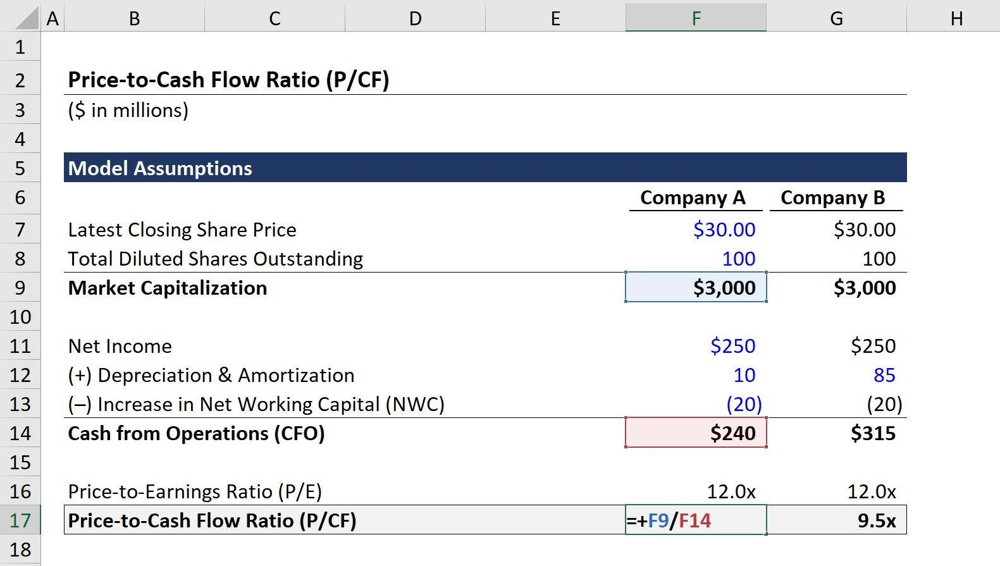

## Table of Contents

## What is the Price to Free Cash Flow (P/FCF) ratio?

The Price to Free Cash Flow (P/FCF) ratio is a financial metric that helps investors understand how much they are paying for a company's free cash flow. Free cash flow is the money a company has left after it pays for its operating expenses and capital expenditures. The P/FCF ratio is calculated by dividing the company's market value (or its stock price) by its free cash flow. A lower P/FCF ratio might suggest that the stock is undervalued, meaning it could be a good investment opportunity.

This ratio is useful because it shows how efficiently a company is generating cash and how that cash can be used for growth, dividends, or debt reduction. Investors often compare the P/FCF ratios of different companies within the same industry to see which ones are better value. However, like any financial ratio, it should not be used alone. It's important to consider other factors such as the company's growth prospects, industry conditions, and overall financial health before making investment decisions.

## Why is the P/FCF ratio important for investors?

The P/FCF ratio is important for investors because it helps them see if a company's stock is priced right compared to the cash it makes. Free cash flow is the money left after a company pays for everything it needs to run and grow. By looking at the P/FCF ratio, investors can figure out if they are paying a fair price for this cash. A lower ratio might mean the stock is a good deal, while a higher ratio could mean the stock is expensive.

Investors use the P/FCF ratio to compare different companies in the same industry. This helps them find the best value. But it's not the only thing they look at. They also think about how fast the company is growing, what's happening in the industry, and if the company is in good financial shape. Using the P/FCF ratio along with other information helps investors make smarter choices about where to put their money.

## How is the P/FCF ratio calculated?

The P/FCF ratio is calculated by dividing a company's market value by its free cash flow. The market value can be the total market value of the company or just the current stock price if you're looking at one share. Free cash flow is what's left after the company pays for its operating costs and the money it needs to spend on things like new equipment or buildings.

To find the free cash flow, you start with the company's operating cash flow, which you can find on the cash flow statement. Then, you subtract the capital expenditures, which are the costs of buying or upgrading long-term assets. Once you have the free cash flow, you divide the market value by this number to get the P/FCF ratio. This ratio tells investors how much they're paying for the cash the company generates, helping them decide if the stock is a good buy.

## What does a high P/FCF ratio indicate about a company?

A high P/FCF ratio means that investors are paying a lot for the company's free cash flow. It might mean that the stock is expensive compared to the cash it makes. If the ratio is high, it could be because people think the company will grow a lot in the future, so they are willing to pay more for it now.

But a high ratio can also be a warning sign. It might mean the stock is overvalued, and the price might be too high compared to what the company is really worth. Investors should look at other things too, like how the company is doing overall and what's happening in its industry, before deciding if a high P/FCF ratio is a good or bad thing.

## What does a low P/FCF ratio suggest about a company's valuation?

A low P/FCF ratio suggests that a company's stock might be undervalued. This means that investors can buy the company's free cash flow at a lower price. When the P/FCF ratio is low, it could mean that the stock is a good deal because you're paying less for the cash the company makes.

But a low P/FCF ratio doesn't always mean the stock is a great buy. Sometimes, a low ratio can be a sign that the company is not doing well or that people don't think it will grow much in the future. So, investors need to look at other things like the company's overall health and what's happening in its industry before deciding if a low P/FCF ratio makes the stock a good investment.

## How does the P/FCF ratio differ from the Price to Earnings (P/E) ratio?

The P/FCF ratio and the P/E ratio are both used by investors to see if a stock is a good buy, but they look at different things. The P/FCF ratio shows how much you're paying for the cash a company makes after it pays for all its costs and investments. This is important because cash can be used for things like growing the business, paying dividends, or paying off debts. The P/E ratio, on the other hand, shows how much you're paying for the company's earnings, or profits. Earnings are what's left after all expenses are paid, but before things like taxes and interest.

Both ratios help investors understand if a stock's price is too high or too low, but they give different views. The P/FCF ratio can be more useful when a company's earnings are not a good measure of its health, like if it has a lot of non-cash expenses. The P/E ratio is more common and easier to find, but it might not tell the whole story if the company's earnings are affected by things like accounting choices. So, investors often look at both ratios to get a better picture of a company's value.

## Can the P/FCF ratio be used to compare companies across different industries?

The P/FCF ratio can be used to compare companies across different industries, but it's important to be careful. Different industries have different ways of making money and spending it. For example, tech companies might spend a lot on research and development, which affects their free cash flow. So, a P/FCF ratio that looks good in one industry might not be as good in another.

Because of these differences, it's better to compare the P/FCF ratios of companies within the same industry. This gives a fairer picture of which companies are a better value. But if you still want to compare across industries, you should also look at other things like the company's growth, how much debt it has, and what's happening in its industry. This way, you get a fuller understanding of the company's value.

## What are the limitations of using the P/FCF ratio for investment decisions?

The P/FCF ratio can be a helpful tool for investors, but it has some limitations. One big problem is that it can be hard to compare companies in different industries. Each industry has its own way of making and spending money, so a good P/FCF ratio in one industry might not be good in another. Also, the P/FCF ratio only looks at one part of a company's financial health. It doesn't tell you about things like how much debt the company has or if it's growing fast.

Another limitation is that the P/FCF ratio can be affected by short-term changes in a company's cash flow. For example, if a company spends a lot of money on new equipment one year, its free cash flow might go down, making the P/FCF ratio look worse even if the company is doing well overall. Investors need to look at more than just the P/FCF ratio to make smart choices. They should also think about the company's future plans, how it's doing compared to other companies in its industry, and other financial measures.

## How can changes in a company's P/FCF ratio over time be interpreted?

Changes in a company's P/FCF ratio over time can tell investors a lot about how the company is doing. If the P/FCF ratio is going down, it might mean the stock is getting cheaper compared to the cash the company makes. This could be a good sign for investors, showing that the stock might be a better deal now. But it could also mean the company's free cash flow is growing faster than its stock price, which is also good news.

On the other hand, if the P/FCF ratio is going up, it might mean the stock is getting more expensive compared to the cash the company makes. This could be because people think the company will do really well in the future, so they're willing to pay more for it now. But it could also mean the stock is overvalued, and the price might be too high compared to what the company is really worth. Investors need to look at other things too, like how the company is doing overall and what's happening in its industry, to understand what the change in the P/FCF ratio really means.

## What other financial metrics should be considered alongside the P/FCF ratio?

When looking at a company's P/FCF ratio, it's smart to also check out other financial metrics to get a full picture. The Price to Earnings (P/E) ratio is a common one that shows how much you're paying for a company's profits. Another good one is the Debt to Equity ratio, which tells you how much the company is borrowing compared to what it owns. This can help you see if the company is taking on too much risk. The Return on Equity (ROE) is also useful because it shows how well the company is using the money shareholders have put in to make more money.

Along with these, the Price to Book (P/B) ratio can be helpful. It shows the value of the company's assets compared to its stock price. If you want to know about the company's growth, you can look at the Earnings Growth Rate. This tells you how fast the company's profits are growing. By looking at all these different numbers together, you can get a better idea of whether a company is a good investment or not.

## How do variations in accounting practices affect the P/FCF ratio?

Variations in accounting practices can change the P/FCF ratio by affecting how a company reports its free cash flow. For example, how a company decides to handle depreciation and amortization can make its free cash flow look different. If a company uses a method that shows higher depreciation, it might report lower free cash flow because these costs are subtracted from the operating cash flow. This would make the P/FCF ratio higher, suggesting the stock is more expensive relative to the cash it generates.

Also, the way a company accounts for capital expenditures can impact the P/FCF ratio. Some companies might classify certain expenses as operating costs instead of capital expenditures, which would increase the reported free cash flow. This makes the P/FCF ratio lower, making the stock seem like a better deal. Because accounting practices can vary so much, investors need to be careful and understand how these practices are affecting the numbers they see when they look at the P/FCF ratio.

## What advanced techniques can be used to refine the analysis of the P/FCF ratio?

To make the analysis of the P/FCF ratio better, investors can use a method called normalization. This means they look at the company's free cash flow over several years instead of just one year. By doing this, they can see if the free cash flow is going up or down over time and get a better idea of what the company usually makes. This helps them see if a high or low P/FCF ratio is just because of something that happened in one year or if it's a sign of how the company is doing over time.

Another way to refine the analysis is by using discounted cash flow (DCF) models. These models help investors guess what a company's future cash flows will be and then figure out what those cash flows are worth today. By using DCF models, investors can see if the current P/FCF ratio makes sense based on what they think the company will do in the future. This can give them a better idea of whether the stock is a good buy or not.

## What is the Understanding of Price to Free Cash Flow?

Price to Free Cash Flow (P/FCF) is a valuation metric used to assess a company's share price relative to its free cash flow. It is calculated by dividing the company's market capitalization by its free cash flow. The formula is expressed as:

$$
\text{P/FCF} = \frac{\text{Market Capitalization}}{\text{Free Cash Flow}}
$$

where Market Capitalization is the total market value of a company's outstanding shares, and Free Cash Flow (FCF) is the cash generated by the company after accounting for capital expenditures necessary to maintain or expand its asset base. FCF can be calculated as:

$$
\text{Free Cash Flow} = \text{Operating Cash Flow} - \text{Capital Expenditures}
$$

P/FCF is often compared to other valuation metrics like Price to Earnings (P/E) and Price to Cash Flow (P/CF). Unlike the P/E ratio, which uses net income, P/FCF focuses on the cash that a company can actually use, providing a better sense of its [liquidity](/wiki/liquidity-risk-premium). The Price to Cash Flow (P/CF) ratio, while also based on cash flow, does not account for the capital expenditure costs, making P/FCF potentially more accurate for assessing a firm's cash-generating efficiency.

Understanding Free Cash Flow is critical as it underscores a company’s profitability. Operating Cash Flow represents the cash generated from a company’s regular business operations, while Capital Expenditures are funds used to acquire, improve, or maintain physical assets. The balance between these components reflects the available cash a company can use for paying debts, dividends, or reinvesting.

The significance of the P/FCF ratio lies in its ability to evaluate a company’s financial health more accurately than earnings-based metrics. It assesses whether a company can generate sufficient cash to cover its operations, investments, and shareholder returns. By focusing on cash flow, it minimizes accounting distortions that affect profit figures.

Using P/FCF over earnings-related metrics has key advantages, offering investors a clearer picture of a company’s financial state. It helps filter out the noise created by non-cash accounting items, delivering a transparent view of a company’s actual liquidity. This makes P/FCF a valuable tool in investment analysis, particularly for identifying undervalued stocks and understanding the cash flow strength of a business.

## References & Further Reading

[1]: ["Valuation: Measuring and Managing the Value of Companies, 6th Edition"](https://www.amazon.com/Valuation-Measuring-Managing-Companies-Finance/dp/1119610885) by McKinsey & Company Inc.

[2]: ["Financial Statement Analysis and Security Valuation"](https://www.mheducation.com/highered/product/Financial-Statement-Analysis-and-Security-Valuation-Penman.html) by Stephen Penman

[3]: ["Free Cash Flow: Seeing Through the Accounting Fog Machine to Find Great Stocks"](https://www.amazon.com/Free-Cash-Flow-Through-Accounting/dp/0470391758) by George C. Christy

[4]: ["The Handbook of Equity Market Anomalies: Translating Market Inefficiencies into Effective Investment Strategies"](https://www.amazon.com/Handbook-Equity-Market-Anomalies-Inefficiencies/dp/0470905905) by Leonard Zacks

[5]: ["Algorithmic Trading: Winning Strategies and Their Rationale"](https://www.amazon.com/Algorithmic-Trading-Winning-Strategies-Rationale-ebook/dp/B00CY5HC0U) by Ernest P. Chan