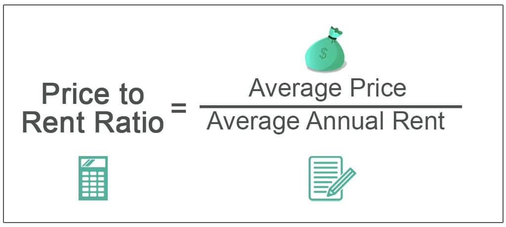

Understanding the housing market is critical for both renters and buyers, as it affects financial planning and lifestyle choices. One fundamental metric that aids in assessing the housing market is the Price-to-Rent Ratio. This ratio serves as an economic indicator to determine whether purchasing property or continuing to rent is more financially viable in a given area. It is calculated by dividing the median price of homes by the median annual rent. A lower Price-to-Rent Ratio suggests that buying a home might be more economical, whereas a higher ratio might indicate that renting is a more cost-effective option.

Moreover, as financial markets evolve, automation and technologies such as algorithmic trading have begun to impact various sectors, including real estate. Algorithmic trading uses sophisticated mathematical models and automated systems to execute trades at high speed based on predetermined criteria. This technological advancement influences the housing market by affecting investment flows, market liquidity, and ultimately, housing prices.



This article aims to provide insights into the intersections of these financial metrics and automated systems. It discusses how understanding the Price-to-Rent Ratio, coupled with the influence of algorithmic trading, can provide a more comprehensive view of the housing market. By evaluating these aspects, individuals can make informed decisions about buying or renting property, considering both current market conditions and personal financial goals.

## Table of Contents

## What is the Price-to-Rent Ratio?

The Price-to-Rent Ratio is a useful metric for gauging the financial viability of buying versus renting a property. It offers a straightforward method to compare the relative costs of these two housing options. The ratio is calculated by dividing the median home price by the median annual rent for a similar property within a specific geographic area:

$$
\text{Price-to-Rent Ratio} = \frac{\text{Median Home Price}}{\text{Median Annual Rent}}
$$

This ratio serves as an indicator of whether the housing market favors buying or renting. A lower Price-to-Rent Ratio suggests that buying a home could be more cost-effective in the long term, as the price of purchasing a property is relatively inexpensive compared to the rental cost. Conversely, a higher ratio indicates that renting may be the more sensible option, as the cost of buying is comparatively high.

For instance, if the median home price in a city is $300,000 and the median annual rent is $15,000, the Price-to-Rent Ratio would be calculated as follows:

$$
\text{Price-to-Rent Ratio} = \frac{300,000}{15,000} = 20
$$

In this example, a ratio of 20 suggests that the market leans towards favoring renting over buying, as the cost to purchase a home relative to annual rent is high. This metric is particularly useful in rapidly evolving housing markets where prices and rents can fluctuate significantly. By evaluating the Price-to-Rent Ratio alongside other factors, individuals can make informed decisions on whether to buy or rent, based on their financial situation and long-term housing goals.

## Factors Influencing Housing Affordability

Housing affordability is a complex issue heavily influenced by a variety of interconnected factors. Among the most significant are local economic conditions, supply and demand dynamics, interest rates, government policies, and market trends. Each of these elements plays a crucial role in shaping the real estate landscape, impacting both rental prices and property values.

**Local Economic Conditions**

The economic health of a city or region directly affects housing affordability. Strong economic growth tends to drive up housing prices as more individuals move to an area for employment opportunities. Conversely, in regions where the economy is stagnant or in decline, housing demand may decrease, potentially lowering property prices. Key economic indicators such as employment rates, average income levels, and business growth can provide insight into an area's economic conditions and, by extension, its housing market.

**Supply and Demand Dynamics**

Housing markets are also governed by basic principles of supply and demand. An increase in demand for housing in a particular area, paired with a limited supply of available properties, can lead to higher prices. This situation is often observed in urban centers where space is limited. Conversely, when there is an oversupply of housing, prices tend to stabilize or decrease. Developers and policymakers aim to balance supply with demand to maintain housing affordability.

**Interest Rates**

Interest rates are a crucial [factor](/wiki/factor-investing) in determining housing affordability, particularly for potential homebuyers. Lower interest rates reduce the cost of borrowing money, making mortgage payments more affordable and potentially increasing the demand for housing. Conversely, higher interest rates increase borrowing costs, which can dampen demand and put downward pressure on housing prices. Central banks often adjust interest rates to control inflation and stabilize the economy, indirectly influencing real estate markets.

**Government Policies**

Government interventions can significantly impact housing affordability. Policies such as tax incentives for homebuyers, rent control measures, and zoning regulations all play a role in shaping the housing market. For instance, tax breaks may encourage home purchases, while strict zoning laws might limit the availability of land for new development, affecting supply. Understanding these regulatory frameworks is essential for predicting market changes and making informed housing decisions.

**Market Trends**

Market trends, including shifts in demographics and consumer preferences, also influence housing affordability. For example, an increasing preference for urban living can drive up demand and prices in cities, whereas a growing remote work culture might enhance the appeal of suburban and rural areas, affecting their respective markets. Additionally, technological advancements in real estate, such as virtual home tours and online property transactions, are changing how people buy and rent properties.

By considering these factors, individuals can better understand the dynamics of housing affordability in different regions. While local economic conditions, supply and demand, interest rates, government policies, and market trends each have unique influences, their interplay determines the broader housing market landscape. This knowledge is invaluable for making strategic decisions about buying or renting a home.

## Algorithmic Trading and Real Estate

Algorithmic trading, a practice driven by computer algorithms to execute trades at high speed and frequency, has become an integral part of modern financial markets. These algorithms follow predefined criteria, such as timing, price, or quantity, to make trading decisions, thereby optimizing the efficiency and profitability of the trading process. While [algorithmic trading](/wiki/algorithmic-trading) is primarily associated with equities, currencies, and commodities, its influence extends to the real estate sector, impacting investment flows and market [liquidity](/wiki/liquidity-risk-premium).

The application of algorithmic trading in real estate primarily occurs through real estate investment trusts (REITs) and real estate-focused exchange-traded funds (ETFs). These financial instruments are traded on stock exchanges and can be subject to algorithmic trading strategies. The rapid buying and selling of REITs or real estate ETFs can lead to increased liquidity in the real estate market, making it easier for investors to enter or [exit](/wiki/exit-strategy) positions based on market dynamics.

Furthermore, algorithmic trading enhances the efficiency of real estate investment decisions by processing vast amounts of data to predict market trends and price movements. Algorithms can analyze economic indicators, real estate demand and supply metrics, and socio-political factors that influence property values. This data-driven approach allows traders to identify profitable investment opportunities and minimize risks associated with market [volatility](/wiki/volatility-trading-strategies).

Moreover, algorithmic trading can affect the valuation of properties indirectly by influencing investor sentiment. Quick fluctuations in the stock prices of REITs can lead to perceptions about the broader real estate market's health, potentially affecting property prices and rental rates. For instance, a sell-off in real estate-focused securities driven by algorithmic trading strategies might suggest a lack of confidence in the market, leading to downward pressure on property values.

As algorithmic trading continues to evolve, it is expected to incorporate more sophisticated techniques, such as [machine learning](/wiki/machine-learning) and [artificial intelligence](/wiki/ai-artificial-intelligence). These technologies aim to improve prediction accuracy and adapt to market changes more efficiently. For example, machine learning algorithms can be trained on historical real estate market data to identify patterns and forecast future trends, thereby aiding investment strategies.

Despite its advantages, algorithmic trading in real estate is not without challenges. The complexity and opacity of algorithms can lead to market disruptions if not properly managed. Flash crashes, where asset prices plummet within seconds only to recover shortly after, highlight the potential risks associated with high-frequency trading.

In conclusion, while algorithmic trading introduces greater efficiency and liquidity in the real estate investment landscape, it also necessitates careful consideration of its effects on market stability and property valuation. Investors and policymakers must balance leveraging technological advancements with ensuring market integrity and transparency.

## Analyzing the Price-to-Rent Ratio in Different Cities

Urban centers often experience higher Price-to-Rent Ratios due to factors such as increased demand for housing and limited availability of land for new development. These conditions can drive up property values while also raising rental rates. However, the exact magnitude of the Price-to-Rent Ratio can vary considerably from one city to another, influenced by local market conditions, economic factors, and population trends.

In cities like San Francisco and New York, for example, high ratios are commonly observed. This is attributable to the substantial demand for housing driven by factors such as employment opportunities, cultural attractions, and infrastructure, coupled with geographic and regulatory constraints that limit new construction. In these urban environments, purchasing property often entails a significant financial commitment, and the high ratio may suggest that renting could be a more viable short-term option for individuals not intending to reside long-term or who prefer liquidity over homeownership.

Conversely, in cities like Dallas or Atlanta, lower Price-to-Rent Ratios are often found. These cities typically have fewer geographic barriers to expansion and more flexible zoning laws, contributing to a more balanced housing market. Here, the opportunity to purchase property might be more favorable, particularly if market conditions indicate potential for value appreciation.

To analyze the Price-to-Rent Ratio in different cities, we can use the following formula:

$$
\text{Price-to-Rent Ratio} = \frac{\text{Median Home Price}}{\text{Median Annual Rent}}
$$

This formula provides a numerical metric that can be used to compare real estate markets. For instance, if a city has a median home price of $500,000 and a median annual rent of $25,000, the Price-to-Rent Ratio would be:

$$
\text{Price-to-Rent Ratio} = \frac{500,000}{25,000} = 20
$$

A higher ratio like 20 suggests that buying may be less economically viable compared to renting, especially if one's financial horizon is not long-term oriented.

In summary, by comparing Price-to-Rent Ratios across various cities, individuals can identify potential investment opportunities or make better-informed decisions about purchasing versus renting. Nevertheless, these ratios should be integrated with other factors such as job security, lifestyle preferences, and long-term financial plans to ensure well-rounded housing decisions.

## Interpreting the Price-to-Rent Ratio for Decision Making

When interpreting the Price-to-Rent Ratio for housing decisions, it's vital to integrate this metric with other important considerations to form a comprehensive understanding of one's financial position and lifestyle needs. The ratio, a comparative measure between property prices and annual rental costs, serves as an indicator rather than a sole determinant in making housing choices.

First, personal lifestyle choices and financial goals play a pivotal role in assessing the suitability of renting or buying. For example, individuals with a transient lifestyle or those frequently relocating for work may find renting more conducive, despite a favorable Price-to-Rent Ratio suggesting buying as economically viable. On the other hand, individuals seeking long-term stability might prioritize home ownership, even with a higher ratio indicating potential rental benefits.

Furthermore, market conditions must be evaluated in conjunction with the ratio. Areas experiencing significant economic growth may exhibit increasing real estate prices, affecting the ratio but also potentially offering high appreciation returns for homebuyers. Conversely, stable or declining markets might suggest a more nuanced analysis of investable opportunities, beyond what the ratio alone can reveal.

To effectively combine the Price-to-Rent Ratio with other factors in decision-making, potential buyers and renters can utilize a strategic approach:

1. **Lifestyle Assessment**: Consider factors such as job stability, family planning, and preferred living environment. This assessment will help weigh the personal benefits of ownership against the flexibility of renting.

2. **Financial Evaluation**: Analyze current income levels, savings, and potential for future earnings. Assessing personal financial health allows individuals to understand their capacity to manage a mortgage or sustain rental costs over time.

3. **Market Analysis**: By inspecting trends in local real estate and rental markets, individuals can anticipate future shifts that might impact both property values and rental costs. Factors like anticipated infrastructure projects or economic developments could influence market dynamics.

4. **Risk Management**: Incorporate risk assessment strategies by considering potential market downturns, interest rate fluctuations, or changes in personal circumstances. This includes evaluating the potential for property value appreciation vs. rental market stability.

5. **Comprehensive Modeling**: Leverage mathematical or computational models to simulate various scenarios. For instance, using Python, one can model potential cost trajectories based on different market conditions or financial milestones:

   ```python
   def cost_comparison(home_price, rent, appreciation_rate, years, interest_rate, rent_increase_rate):
       mortgage_payments = home_price * (interest_rate / (1 - (1 + interest_rate) ** -years))
       total_rent_paid = sum([rent * ((1 + rent_increase_rate) ** year) for year in range(years)])
       home_value = home_price * ((1 + appreciation_rate) ** years)
       return mortgage_payments * years - home_value, total_rent_paid

   purchase_advantage, rent_total = cost_comparison(300000, 15000, 0.03, 10, 0.04, 0.02)
   ```

By integrating these varied factors, individuals can make informed decisions that align with both their immediate needs and long-term goals, rather than relying solely on the Price-to-Rent Ratio. This multidimensional approach ensures that decisions are robust, adaptable to changing circumstances, and ultimately more balanced in the context of personal and market realities.

## Conclusion

The Price-to-Rent Ratio, calculated by dividing the median home price by the median annual rent, serves as an insightful tool for gauging the economic viability of buying versus renting property. It provides a snapshot of market trends, indicating whether it's financially beneficial to invest in home ownership or continue renting. However, this metric alone is insufficient for making comprehensive affordability assessments. Real estate decisions are influenced by various factors, including individual financial situations, local economic conditions, and long-term investment goals, necessitating a broader context for analysis.

Algorithmic trading, typically associated with financial markets, introduces another dimension to real estate investment considerations. This technology, which facilitates rapid trading decisions based on pre-set criteria, has begun to influence the housing market by redirecting capital flows and affecting liquidity levels. The impact of automated systems on real estate financing underscores the importance of understanding technological advancements that could alter investment landscapes.

Ultimately, making informed housing decisions requires a multidimensional approach. While the Price-to-Rent Ratio offers a foundational perspective, effective decision-making involves considering a spectrum of financial indicators, market trends, and personal circumstances. Balancing quantitative metrics with qualitative insights ensures a more comprehensive understanding of the housing market, empowering individuals to make choices aligned with their unique needs and long-term objectives.

## References & Further Reading

[1]: Glaeser, E. L., & Gyourko, J. (2009). ["Arbitrage in Housing Markets."](https://scholar.harvard.edu/files/glaeser/files/arbitrage_in_housing_markets.pdf) In: NBER Working Paper Series.

[2]: Himmelberg, C., Mayer, C., & Sinai, T. (2005). ["Assessing High House Prices: Bubbles, Fundamentals and Misperceptions."](https://www.aeaweb.org/articles?id=10.1257/089533005775196769) NBER Working Paper No. 11643.

[3]: Davis, M. A., & Heathcote, J. (2005). ["The Price and Quantity of Residential Land in the United States."](http://www.jonathanheathcote.com/land-final.pdf) Journal of Monetary Economics, 54(8), 2595-2620.

[4]: Shiller, R. J. (2005). ["Irrational Exuberance."](https://www.jstor.org/stable/j.ctt7st4s) Princeton University Press.

[5]: Lo, A. W. (2019). ["Adaptive Markets: Financial Evolution at the Speed of Thought."](https://www.jstor.org/stable/45200293) Princeton University Press.