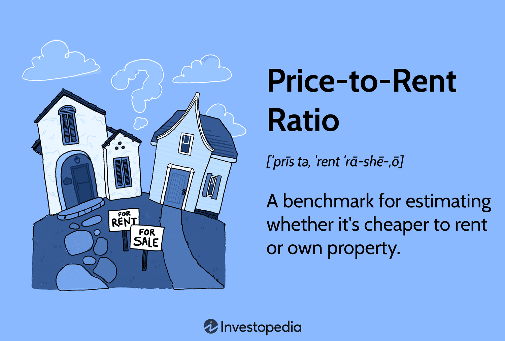

## Table of Contents

## What is the price-to-rent ratio and how is it calculated?

The price-to-rent ratio is a simple way to compare the cost of buying a home versus renting one in a specific area. It helps people decide if it's cheaper to buy or rent a home. To calculate the price-to-rent ratio, you take the average price of homes for sale in an area and divide it by the average yearly rent for similar homes in that same area.

For example, if the average home price in a neighborhood is $300,000 and the average yearly rent for a similar home is $15,000, the price-to-rent ratio would be 20. This means the home price is 20 times the annual rent. A lower ratio might mean it's a good time to buy, while a higher ratio might suggest it's better to rent. However, this is just one tool and other factors like interest rates and personal finances should also be considered.

## Why is the price-to-rent ratio important for someone deciding between buying and renting a home?

The price-to-rent ratio is important because it helps people figure out if buying a home is a better deal than renting one in their area. It's like a quick way to see if the cost of buying a home is too high compared to renting. If the ratio is low, it might mean that buying a home could save you money over time. But if the ratio is high, it might be cheaper to keep renting.

This ratio can help you make a smarter choice about where to live. It's not the only thing you should look at, but it gives you a good starting point. Things like how long you plan to stay in the home, the interest rates on loans, and your own money situation also matter. By looking at the price-to-rent ratio, you can get a clearer picture of whether buying or renting makes more sense for you.

## How can the price-to-rent ratio help in different housing markets?

The price-to-rent ratio can be a helpful tool in different housing markets because it shows if buying a home is cheaper than renting one in a specific area. In a market where homes are not too expensive compared to the rent, the ratio will be low. This means it might be a good time to buy a home because you could save money over time. For example, if the ratio is around 15 or lower, buying could be a smart choice.

In other markets, where homes are very expensive compared to the rent, the ratio will be high. A high ratio, like 25 or more, might mean it's better to keep renting because buying could cost you a lot more money. This can be really useful for someone moving to a new city or thinking about where to live, as it helps them see if the housing market in that area favors buying or renting.

Overall, the price-to-rent ratio gives people a quick way to compare the cost of buying versus renting in different places. It's not the only thing to think about, but it can help you make a better decision about where to live and whether to buy or rent, depending on the local housing market conditions.

## What is considered a good price-to-rent ratio for buying versus renting?

A good price-to-rent ratio for buying a home is usually around 15 or lower. This means that the cost of buying a home is not too high compared to renting one. If the ratio is this low, it might be a good time to buy because you could save money over time. For example, if the average home price is $300,000 and the average yearly rent is $20,000, the ratio is 15. This suggests that buying could be a smart choice.

On the other hand, a high price-to-rent ratio, like 25 or more, might mean it's better to keep renting. When the ratio is this high, buying a home could cost you a lot more money than renting. For instance, if the average home price is $500,000 and the average yearly rent is $20,000, the ratio is 25. In this case, it might be cheaper to rent until the market changes. Remember, the price-to-rent ratio is just one tool to help you decide, so consider other factors like how long you plan to stay in the home and your personal finances too.

## Can you explain the limitations of using the price-to-rent ratio for decision making?

The price-to-rent ratio is a helpful tool, but it has some limits. It doesn't take into account things like how long you plan to live in the home, the interest rates on loans, and other costs like taxes and maintenance. For example, if you're only going to stay in a place for a short time, buying might not be a good idea even if the ratio looks good. Also, if interest rates are high, the cost of buying a home could go up a lot, making renting a better choice.

Another thing to think about is that the price-to-rent ratio is based on averages. This means it might not be right for every home or every person. Your personal situation, like how much money you have saved up or how much you can afford to spend each month, can make a big difference. So while the ratio can give you a general idea, it's important to look at all the details of your own situation before making a decision.

## How does the price-to-rent ratio vary across different cities and regions?

The price-to-rent ratio can be very different from one city to another. In big cities where homes are expensive, like San Francisco or New York, the ratio is usually high. This means that buying a home might cost a lot more than renting one. On the other hand, in smaller cities or towns where homes are cheaper, the ratio can be lower. This could make buying a home a better deal than renting. The ratio can help you see if it's a good time to buy a home in a certain place.

The price-to-rent ratio also changes a lot between different regions of a country. For example, in the United States, the ratio might be low in the Midwest where homes are not as expensive as in the Northeast or on the West Coast. This means that in places like Ohio or Iowa, buying a home could be a smart choice because the cost of buying is not too high compared to renting. But in places like California or Massachusetts, the high ratio might mean it's better to rent until the market changes. So, the price-to-rent ratio can give you a quick idea of whether to buy or rent, but it depends a lot on where you are looking.

## What other factors should be considered alongside the price-to-rent ratio when making a buy vs. rent decision?

When deciding whether to buy or rent a home, it's important to look at more than just the price-to-rent ratio. One big thing to think about is how long you plan to stay in the home. If you're going to move soon, buying might not make sense even if the ratio looks good. Buying a home comes with extra costs like closing costs, taxes, and maintenance, which you don't have to pay if you're renting. These costs can add up and make buying more expensive than it seems at first.

Another thing to consider is the [interest rate](/wiki/interest-rate-trading-strategies) on home loans. If interest rates are high, the cost of buying a home goes up a lot, which might make renting a better choice. Also, think about your own money situation. How much you can afford to spend each month and how much you have saved up for a down payment can make a big difference. The price-to-rent ratio gives you a general idea, but looking at all these details will help you make a better decision about whether to buy or rent.

## How has the price-to-rent ratio changed over time, and what does this indicate about the housing market?

The price-to-rent ratio has changed a lot over time, and it can tell us a lot about the housing market. For example, if the ratio goes up over the years, it means that buying a home is getting more expensive compared to renting one. This could happen if home prices are going up faster than rent prices. On the other hand, if the ratio goes down, it means that buying a home is getting cheaper compared to renting. This might happen if home prices are going down or if rent prices are going up.

These changes in the price-to-rent ratio can show us what's happening in the housing market. If the ratio is high and keeps going up, it might mean that there's a lot of demand for homes and not enough homes for sale, making them more expensive. This can be a sign that it's a seller's market, where it's harder for people to buy homes. But if the ratio is low and keeps going down, it might mean there are a lot of homes for sale and not as many people wanting to buy them. This can be a sign of a buyer's market, where it's easier and cheaper to buy a home.

## How do interest rates and mortgage terms affect the interpretation of the price-to-rent ratio?

Interest rates and mortgage terms play a big role in how we should look at the price-to-rent ratio. When interest rates are high, the cost of borrowing money to buy a home goes up. This means that even if the price-to-rent ratio looks good, the actual cost of buying a home could be much higher than renting. For example, if you need to take out a big loan to buy a home and the interest rate is high, your monthly payments will be a lot more than what you would pay in rent. So, a high interest rate can make the price-to-rent ratio less useful because it doesn't show the full cost of buying.

The length of the mortgage term also matters. A longer mortgage term might lower your monthly payments, but you'll end up paying more in interest over time. This can change how the price-to-rent ratio looks when you think about the total cost of owning a home. If you can get a shorter mortgage term with lower interest rates, buying might still be a good choice even if the ratio is a bit high. But if you need a long-term loan with high interest rates, renting might be cheaper even if the ratio suggests buying. So, always think about interest rates and mortgage terms when you use the price-to-rent ratio to decide between buying and renting.

## What are some advanced strategies for using the price-to-rent ratio in real estate investment?

Real estate investors can use the price-to-rent ratio to find good places to buy homes that they can rent out. If the ratio is low in a certain area, it means that buying a home there is cheaper compared to renting. This can be a good sign for investors because they can buy a home at a lower price and then rent it out for more money each month. This can lead to higher profits over time. Investors can look at different neighborhoods or cities to find the ones with the best price-to-rent ratios and focus their investments there.

Another strategy is to watch how the price-to-rent ratio changes over time. If the ratio is going down in an area, it might mean that home prices are dropping or that rent prices are going up. This can be a good time for investors to buy because they can get a home at a lower price and still charge good rent. On the other hand, if the ratio is going up, it might be a sign that home prices are rising faster than rent prices. Investors might want to wait and see if the market changes before buying, or they might look for other areas where the ratio is more in their favor. By using the price-to-rent ratio smartly, investors can make better choices about where and when to invest in real estate.

## How can the price-to-rent ratio be used in conjunction with other financial metrics to optimize housing decisions?

The price-to-rent ratio is a useful tool, but it works even better when used with other financial metrics to make the best housing decisions. One important metric to consider is the affordability index, which looks at how much of your income you would need to spend on a home. If the price-to-rent ratio is low but the affordability index shows that you would need to spend too much of your income on a home, it might still be better to rent. Another metric is the capitalization rate, or cap rate, which tells investors how much return they can expect from renting out a property. If the price-to-rent ratio is low and the cap rate is high, it could be a great time to buy a home to rent out because the investment could be very profitable.

Combining the price-to-rent ratio with these other metrics can give a fuller picture of the housing market and help you make a smarter choice. For example, if you're thinking about buying a home to live in, you should also look at the interest rates on loans and the length of the mortgage term. High interest rates can make buying more expensive than the price-to-rent ratio suggests, so you need to think about how these rates will affect your monthly payments. If you're an investor, looking at the price-to-rent ratio alongside the cap rate and other local market trends can help you find the best places to invest your money. By using all these metrics together, you can make better decisions about whether to buy or rent and where to put your money in real estate.

## What are the future trends and predictions for price-to-rent ratios in major housing markets?

In the future, price-to-rent ratios in major housing markets are expected to keep changing based on things like how many people want to buy homes, how many homes are for sale, and what's happening with the economy. In cities where a lot of people want to live, like New York or San Francisco, the price-to-rent ratio might stay high or even go up more. This is because there are a lot of people trying to buy homes but not enough homes for sale, which makes buying more expensive than renting. On the other hand, in places where homes are cheaper, like some cities in the Midwest, the ratio might stay low or get even lower, making it a good time to buy a home.

Another thing that can change the price-to-rent ratio is interest rates. If interest rates go up, it will cost more to borrow money to buy a home, which can make the ratio go up too. But if interest rates go down, buying a home might get cheaper, and the ratio could go down. Also, if more people start working from home and moving to smaller cities or suburbs, this could change the demand for homes in different areas. This might make the price-to-rent ratio go down in big cities and go up in smaller places. So, keeping an eye on these trends can help people decide if it's a good time to buy or rent a home in different markets.

## What is the Price-to-Rent Ratio?

The Price-to-Rent Ratio is a useful metric for gauging the financial viability of buying versus renting a property. It offers a straightforward method to compare the relative costs of these two housing options. The ratio is calculated by dividing the median home price by the median annual rent for a similar property within a specific geographic area:

$$
\text{Price-to-Rent Ratio} = \frac{\text{Median Home Price}}{\text{Median Annual Rent}}
$$

This ratio serves as an indicator of whether the housing market favors buying or renting. A lower Price-to-Rent Ratio suggests that buying a home could be more cost-effective in the long term, as the price of purchasing a property is relatively inexpensive compared to the rental cost. Conversely, a higher ratio indicates that renting may be the more sensible option, as the cost of buying is comparatively high.

For instance, if the median home price in a city is $300,000 and the median annual rent is $15,000, the Price-to-Rent Ratio would be calculated as follows:

$$
\text{Price-to-Rent Ratio} = \frac{300,000}{15,000} = 20
$$

In this example, a ratio of 20 suggests that the market leans towards favoring renting over buying, as the cost to purchase a home relative to annual rent is high. This metric is particularly useful in rapidly evolving housing markets where prices and rents can fluctuate significantly. By evaluating the Price-to-Rent Ratio alongside other factors, individuals can make informed decisions on whether to buy or rent, based on their financial situation and long-term housing goals.

## What is the analysis of the Price-to-Rent Ratio in Different Cities?

Urban centers often experience higher Price-to-Rent Ratios due to factors such as increased demand for housing and limited availability of land for new development. These conditions can drive up property values while also raising rental rates. However, the exact magnitude of the Price-to-Rent Ratio can vary considerably from one city to another, influenced by local market conditions, economic factors, and population trends.

In cities like San Francisco and New York, for example, high ratios are commonly observed. This is attributable to the substantial demand for housing driven by factors such as employment opportunities, cultural attractions, and infrastructure, coupled with geographic and regulatory constraints that limit new construction. In these urban environments, purchasing property often entails a significant financial commitment, and the high ratio may suggest that renting could be a more viable short-term option for individuals not intending to reside long-term or who prefer [liquidity](/wiki/liquidity-risk-premium) over homeownership.

Conversely, in cities like Dallas or Atlanta, lower Price-to-Rent Ratios are often found. These cities typically have fewer geographic barriers to expansion and more flexible zoning laws, contributing to a more balanced housing market. Here, the opportunity to purchase property might be more favorable, particularly if market conditions indicate potential for value appreciation.

To analyze the Price-to-Rent Ratio in different cities, we can use the following formula:

$$
\text{Price-to-Rent Ratio} = \frac{\text{Median Home Price}}{\text{Median Annual Rent}}
$$

This formula provides a numerical metric that can be used to compare real estate markets. For instance, if a city has a median home price of $500,000 and a median annual rent of $25,000, the Price-to-Rent Ratio would be:

$$
\text{Price-to-Rent Ratio} = \frac{500,000}{25,000} = 20
$$

A higher ratio like 20 suggests that buying may be less economically viable compared to renting, especially if one's financial horizon is not long-term oriented.

In summary, by comparing Price-to-Rent Ratios across various cities, individuals can identify potential investment opportunities or make better-informed decisions about purchasing versus renting. Nevertheless, these ratios should be integrated with other factors such as job security, lifestyle preferences, and long-term financial plans to ensure well-rounded housing decisions.

## References & Further Reading

[1]: Glaeser, E. L., & Gyourko, J. (2009). ["Arbitrage in Housing Markets."](https://scholar.harvard.edu/files/glaeser/files/arbitrage_in_housing_markets.pdf) In: NBER Working Paper Series.

[2]: Himmelberg, C., Mayer, C., & Sinai, T. (2005). ["Assessing High House Prices: Bubbles, Fundamentals and Misperceptions."](https://www.aeaweb.org/articles?id=10.1257/089533005775196769) NBER Working Paper No. 11643.

[3]: Davis, M. A., & Heathcote, J. (2005). ["The Price and Quantity of Residential Land in the United States."](http://www.jonathanheathcote.com/land-final.pdf) Journal of Monetary Economics, 54(8), 2595-2620.

[4]: Shiller, R. J. (2005). ["Irrational Exuberance."](https://www.jstor.org/stable/j.ctt7st4s) Princeton University Press.

[5]: Lo, A. W. (2019). ["Adaptive Markets: Financial Evolution at the Speed of Thought."](https://www.jstor.org/stable/45200293) Princeton University Press.