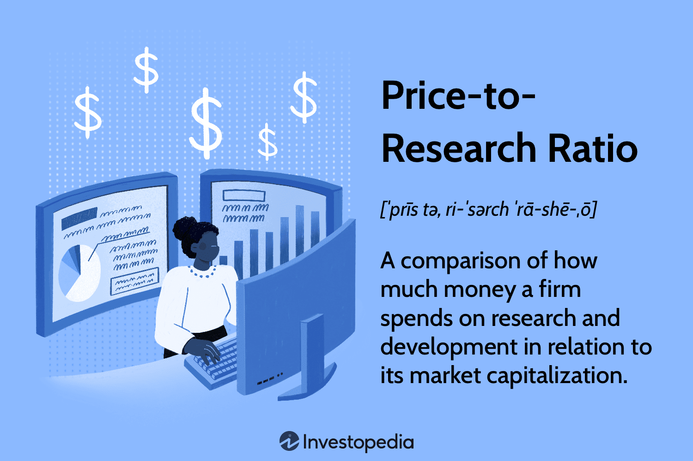

## Table of Contents

## What is the Price-to-Research Ratio (PRR)?

The Price-to-Research Ratio (PRR) is a financial metric that helps investors understand how much they are paying for a company's research and development (R&D) efforts. It is calculated by dividing the market capitalization of a company by its total R&D expenses over a certain period, usually a year. This ratio gives investors an idea of how the market values a company's efforts to innovate and develop new products or services.

A lower PRR might suggest that a company's stock is undervalued relative to its R&D spending, which could be attractive to investors looking for growth opportunities. On the other hand, a higher PRR might indicate that the market has high expectations for the company's future growth due to its R&D investments. By comparing the PRR of different companies within the same industry, investors can make more informed decisions about where to allocate their money based on the potential returns from research and development.

## How is the Price-to-Research Ratio calculated?

The Price-to-Research Ratio, or PRR, is a way to see how much a company's stock costs compared to how much it spends on research and development, or R&D. To find the PRR, you take the company's total market value, which is its market capitalization, and divide it by the total amount of money the company spent on R&D in a year. Market capitalization is just the total value of all the company's shares.

For example, if a company has a market capitalization of $10 billion and it spent $500 million on R&D in the last year, the PRR would be 20. This means investors are paying 20 times the amount the company spends on R&D for its stock. A lower PRR might mean the stock is a good deal because it's cheaper compared to the company's R&D spending. A higher PRR might mean the market thinks the company's R&D will lead to big growth in the future.

## Why is the PRR important for investors?

The Price-to-Research Ratio, or PRR, is important for investors because it helps them understand how much they are paying for a company's efforts to create new products or improve existing ones. By looking at the PRR, investors can see if a company's stock is priced high or low compared to how much it spends on research and development. If the PRR is low, it might mean the stock is a good deal because the price is low compared to the company's R&D spending.

On the other hand, a high PRR might mean that the market expects big things from the company's R&D efforts in the future. Investors can use the PRR to compare different companies and decide where to put their money. If they believe in the potential of a company's new ideas and inventions, a higher PRR might be worth it. But if they think the stock is too expensive for what the company is spending on R&D, they might look for other investment opportunities.

## Can you give an example of how to use the PRR in investment analysis?

Imagine you're looking at two tech companies, Company A and Company B. Company A has a market capitalization of $50 billion and spent $2 billion on R&D last year. This gives Company A a PRR of 25. On the other hand, Company B has a market capitalization of $30 billion and spent $1.5 billion on R&D, which gives it a PRR of 20. By comparing these PRRs, you can see that investors are paying less for Company B's stock relative to its R&D spending.

This information can help you decide where to invest. If you believe that both companies have similar growth potential from their R&D, Company B might be a better deal because its PRR is lower. However, if you think Company A's R&D projects are more likely to lead to big breakthroughs and future profits, you might be willing to pay the higher PRR for its stock. So, the PRR helps you weigh the cost of the stock against the company's investment in future growth.

## What industries typically have high PRR values?

Industries that often have high PRR values are those where research and development is really important for growth and staying ahead. For example, the tech industry, like companies that make computer software or new gadgets, usually have high PRRs. These companies spend a lot of money on R&D to come up with new ideas and products, and investors might be willing to pay more for their stocks because they believe in the potential of those new ideas.

Another industry with high PRRs is the pharmaceutical industry. These companies spend a lot on R&D to create new medicines and treatments. It can take years and a lot of money to get a new drug approved, but if it works, it can be very valuable. So, investors might see a high PRR as a good sign that the company is working on something big that could pay off in the future.

## How does the PRR differ from other valuation metrics like P/E ratio?

The Price-to-Research Ratio (PRR) and the Price-to-Earnings Ratio (P/E ratio) are both ways to figure out if a company's stock is a good deal, but they look at different things. The P/E ratio compares the price of a company's stock to how much money it makes. It tells you how many years it would take for the company's earnings to pay back the cost of the stock. If the P/E ratio is low, it might mean the stock is cheap compared to the company's profits. If it's high, the stock might be expensive, but the market might think the company will grow a lot in the future.

The PRR, on the other hand, compares the price of a company's stock to how much it spends on research and development (R&D). This ratio tells you how much investors are willing to pay for the company's efforts to create new things. A low PRR might mean the stock is a good deal because it's cheap compared to what the company is spending on new ideas. A high PRR might mean the market thinks the company's R&D will lead to big growth in the future. So, while the P/E ratio focuses on current profits, the PRR focuses on potential future growth from R&D.

## What are the limitations of using the PRR as a sole investment metric?

Using the PRR by itself to decide where to invest has some problems. One big issue is that it only looks at how much a company spends on research and development, but it doesn't tell you if that spending will actually lead to new products or profits. A company might spend a lot on R&D, but if those projects don't work out, the high PRR won't mean much. Also, the PRR doesn't consider other important things like how much money the company is making now, how much debt it has, or what's happening in the market overall.

Another limitation is that the PRR can be hard to compare across different industries. Some industries, like tech or pharmaceuticals, usually have high PRRs because they spend a lot on R&D. But in other industries, like retail, the PRR might be lower because they don't need to spend as much on new ideas. So, looking at the PRR alone might make you think a company is a bad investment when it's actually doing well in its own industry. That's why it's better to use the PRR along with other metrics to get a fuller picture of a company's value and potential.

## How can the PRR be misleading in certain market conditions?

The PRR can be misleading during times when the market is going through big changes. For example, if there's a lot of excitement about new technology or a new drug, the stock prices of companies in those industries might go up a lot. This can make the PRR look high, even if the company's R&D spending hasn't changed. Investors might think the stock is too expensive based on the PRR, but they might be missing out on a good opportunity because the market is just really excited about what the company is working on.

Also, during tough economic times, like a recession, companies might cut back on their R&D spending to save money. This can make the PRR look high because the denominator (R&D spending) is smaller, even if the stock price hasn't changed much. Investors might see a high PRR and think the stock is overpriced, but they might not realize that the company is just being careful with its money during a tough time. So, it's important to look at the bigger picture and not just rely on the PRR when making investment decisions.

## What adjustments should be made to the PRR for accurate comparisons across different sectors?

To make fair comparisons of PRR across different sectors, you need to think about how much each industry usually spends on R&D. Some industries, like tech or pharmaceuticals, always spend a lot on new ideas and inventions, so their PRRs are usually high. But in other industries, like retail or services, companies might not need to spend as much on R&D, so their PRRs are usually lower. When you're comparing PRRs, you should look at companies within the same industry first, because what's a high PRR in one sector might be normal in another.

Another thing to consider is the size of the companies you're comparing. Big companies might have higher market values and R&D budgets, which can affect their PRRs. So, it's a good idea to compare companies that are similar in size. Also, you should think about the stage of development of the companies' R&D projects. A company with a lot of projects close to being finished might have a different PRR than one that's just starting new research. By taking these things into account, you can get a better idea of what the PRR really means for each company.

## How does the PRR correlate with long-term stock performance?

The Price-to-Research Ratio (PRR) can give investors a hint about how a company's stock might do in the long run. If a company has a low PRR, it might mean that the stock is a good deal because it's cheap compared to what the company spends on new ideas. Investors might think that the company's R&D will lead to new products or services that will make the company more valuable in the future. So, a low PRR could be a sign that the stock might go up over time as the company's R&D pays off.

On the other hand, a high PRR might mean that investors are already expecting big things from the company's R&D. If those expectations are met, the stock could do well in the long run. But if the R&D doesn't lead to new products or profits, the stock might not do as well as people hoped. So, the PRR can be a useful tool for thinking about long-term stock performance, but it's important to look at other things too, like how much money the company is making now and what's happening in the market.

## What are some advanced techniques for refining the PRR analysis?

One way to make the PRR analysis better is to look at the quality of the R&D projects a company is working on. Not all R&D spending is the same. Some projects might be more likely to lead to new products or big profits than others. By looking at what the company is actually working on, you can get a better idea of if the high or low PRR is a good sign. You can do this by reading the company's reports or listening to what they say in meetings with investors. This can help you see if the company's R&D spending is likely to pay off in the future.

Another way to refine the PRR analysis is to compare it with other financial metrics. For example, you can look at the company's Price-to-Earnings (P/E) ratio to see how much the stock costs compared to the company's profits. You can also look at the company's debt and how much money it's making right now. By putting the PRR together with these other numbers, you can get a fuller picture of the company's value and potential. This can help you make smarter investment choices because you're not just looking at one thing, but at how everything fits together.

## How can the PRR be integrated into a comprehensive investment strategy?

The Price-to-Research Ratio (PRR) can be a helpful part of a bigger plan for investing. It tells you how much you're paying for a company's work on new ideas and inventions. If you find a company with a low PRR, it might be a good deal because the stock price is low compared to what the company spends on research and development. But you shouldn't just look at the PRR by itself. You should also think about how much money the company is making now, how much debt it has, and what's going on in the market. By putting the PRR together with these other things, you can get a better idea of if a company is a good investment.

Another way to use the PRR in your investment plan is to compare it with other companies in the same industry. Different industries spend different amounts on research and development, so what's a high PRR in one industry might be normal in another. By looking at companies that are similar in size and in the same industry, you can see if a company's PRR is really high or low. This can help you decide if the stock is priced right compared to other companies. So, the PRR can be a useful tool, but it works best when you use it as part of a bigger picture of the company's value and potential.

## What is the Price-to-Research Ratio (PRR) and how can it be understood?

The Price-to-Research Ratio (PRR) is a financial metric that measures the relationship between a company's market capitalization and its research and development (R&D) spending. This ratio provides significant insights into a company's investment in innovation relative to its market value, offering a perspective on its growth and profitability potential.

A lower PRR generally indicates that a company is investing heavily in R&D relative to its market cap, suggesting a focus on future growth and innovation. Such companies might be undervalued by the market, presenting opportunities for investors seeking long-term gains through innovations that could lead to increased profitability. Conversely, a higher PRR could imply that a company is overvalued, with insufficient R&D investment relative to its market size. This scenario might reflect a lack of commitment to innovation, potentially impacting the company's future competitive edge and profitability.

To calculate the PRR, divide the company's market capitalization by its total R&D expenditure:

$$
\text{PRR} = \frac{\text{Market Capitalization}}{\text{R&D Spending}}
$$

This formula is straightforward, making PRR an accessible and practical metric for various investors. By evaluating the PRR, investors gain valuable insights into a company's dedication to innovation. This information can be particularly useful for identifying companies with strong potential for sustainable growth and long-term profitability. Understanding PRR equips investors with a more nuanced perspective on a company's valuation, beyond conventional metrics.

## References & Further Reading

[1]: ["Advances in Financial Machine Learning"](https://www.amazon.com/Advances-Financial-Machine-Learning-Marcos/dp/1119482089) by Marcos Lopez de Prado

[2]: ["Evidence-Based Technical Analysis: Applying the Scientific Method and Statistical Inference to Trading Signals"](https://www.amazon.com/Evidence-Based-Technical-Analysis-Scientific-Statistical/dp/0470008741) by David Aronson

[3]: ["Machine Learning for Algorithmic Trading"](https://github.com/stefan-jansen/machine-learning-for-trading) by Stefan Jansen

[4]: ["Quantitative Trading: How to Build Your Own Algorithmic Trading Business"](https://www.amazon.com/Quantitative-Trading-Build-Algorithmic-Business/dp/1119800064) by Ernest P. Chan