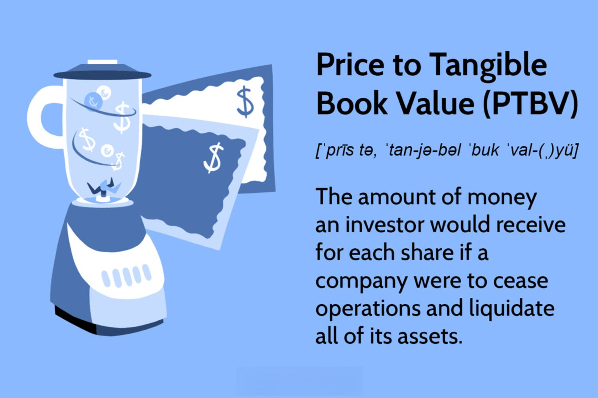

In the ever-evolving world of finance, valuation metrics and financial ratios serve as foundational tools for investors aiming to determine the intrinsic value of companies. Prominent among these is the Price to Tangible Book Value (PTBV) ratio, which is favored by those prioritizing a conservative evaluation of corporate worth. The PTBV ratio provides a quantitative measure by comparing a company's market price with its tangible book value, offering a robust benchmark for assessing a company's lower-bound value, particularly useful in liquidation scenarios.

This article explores the nuanced aspects of PTBV, underscoring its significance in financial assessments and its application in optimizing algorithmic trading strategies. Tangible book value, distinct from other valuation methods, offers investors a unique perspective by focusing exclusively on tangible assets such as real estate, machinery, and inventory, while excluding intangibles like patents and goodwill. The fundamental formula for PTBV is represented as:



$$
\text{PTBV} = \frac{\text{Market Price per Share}}{\text{Tangible Book Value per Share}}
$$

This metric holds particular relevance across various industries, especially those where tangible assets constitute a significant portion of the company's value, such as manufacturing and oil.

In addition to exploring tangible book value, the article will examine the role of financial ratios and valuation metrics in algorithmic trading. This domain represents a synergy of technology and finance, where complex algorithms analyze financial data to make informed trading decisions rapidly. By integrating PTBV within algorithmic frameworks, traders can effectively identify undervalued stocks and capitalize on market inefficiencies, enhancing investment strategy outcomes. This reflection on PTBV aims to provide a comprehensive understanding of its role and implications in the broader finance context.

## Table of Contents

## Understanding Valuation Metrics

Valuation metrics are indispensable for assessing a company's financial standing and estimating its future potential. These metrics provide an objective framework for evaluating a company's performance, comparing it with peers, and making informed investment decisions. Among the most commonly used valuation ratios are the price-to-earnings (P/E), price-to-sales (P/S), and price-to-book (P/B) ratios, each delivering unique insights into a company's market position and operational efficiency.

The price-to-earnings (P/E) ratio is perhaps the most recognized valuation metric. It is calculated by dividing a company's current share price by its earnings per share (EPS). This ratio gauges how much investors are willing to pay per dollar of earnings, thus serving as an indicator of market expectations regarding a company's future profitability. A high P/E ratio may suggest that investors expect significant growth, whereas a low P/E might indicate undervaluation or skepticism about future earnings.

Price-to-sales (P/S) ratio, calculated by dividing a company's market capitalization by its total sales over a specified period, highlights how much investors are willing to pay for each dollar of sales. It is particularly useful for evaluating companies with volatile or no earnings, such as startups or cyclical industries, where net income may not present an accurate picture.

The price-to-book (P/B) ratio compares a company's market value to its book value, calculated by dividing the market capitalization by the book value of equity. This ratio provides insight into how investors value a company's net assets. A P/B ratio below 1 suggests that the market may undervalue the company’s assets, or it might indicate underlying issues affecting its profitability.

These valuation metrics play a crucial role in investment analysis by allowing for a standardized comparison of companies within the same industry. They are vital tools in identifying over or undervalued stocks, assessing growth potential, and formulating investment strategies. Together, they form the foundation of a quantitative approach to investment evaluation, blending a company's financial health with market expectations.

## Exploring Financial Ratios: An Insight into PTBV

Price to Tangible Book Value (PTBV) is a crucial financial ratio for analyzing a company's financial health by focusing on tangible assets. These assets typically include property, machinery, and inventory, and specifically exclude intangible assets such as patents and goodwill. The PTBV ratio is calculated using the formula:

$$
\text{PTBV} = \frac{\text{Market Price per Share}}{\text{Tangible Book Value per Share}}
$$

This metric provides a conservative evaluation of a company's worth by focusing solely on tangible assets, which can be fundamentally significant, particularly in liquidation scenarios. In such cases, PTBV offers a lower-bound estimate of the company's value, as tangible assets have a more definitive resale value compared to intangibles.

For conservative investors, the PTBV ratio acts as a safeguard by emphasizing asset-based valuation, reducing the potential for overestimating a company’s worth due to uncertain intangible assets. By comparing the market price with the tangible book value, investors can assess whether a stock is undervalued or overvalued relative to its tangible assets. PTBV is particularly useful in industries where tangible assets form a significant part of a company's total assets, providing valuable insights into fundamental, asset-based valuations.

## When to Use PTBV

The Price to Tangible Book Value (PTBV) ratio is a financial metric that provides valuable insights into a company's valuation, especially in capital-intensive industries where tangible assets form a significant portion of the company's value. These industries often include sectors like manufacturing, oil, and real estate, where physical assets such as machinery, buildings, and inventory are prominent on the balance sheet. The PTBV ratio helps investors ascertain how much the market values these tangible assets relative to their net book value.

In contrast, PTBV is less effective in sectors that heavily rely on intangible assets. Industries dominated by technology and services often have substantial proportions of intangible assets such as software, intellectual property, and brand value. For these companies, the traditional PTBV ratio may undervalue the company’s true worth since it does not incorporate intangible assets. Thus, for firms in such sectors, using alternative valuation metrics that account for intangibles, like the price-to-book (P/B) ratio or the price-to-earnings (P/E) ratio, might be more appropriate.

Investors aiming for a comprehensive analysis should not rely solely on PTBV. Instead, it is advisable to integrate PTBV with other financial metrics to obtain a holistic understanding of a company's financial health. This approach allows investors to capture a broader perspective, considering various aspects influencing company valuation, such as growth potential, earnings stability, and market conditions. By combining PTBV with complementary ratios, investors can develop a more balanced view, enhancing the accuracy of their investment assessments.

## PTBV in Algo Trading

Algorithmic trading (algo trading) employs sophisticated algorithms and computing power to evaluate numerous financial metrics, including the Price to Tangible Book Value (PTBV) ratio, for making swift and data-driven trading decisions. This technological approach to trading allows market participants to identify stocks that are potentially undervalued by comparing market prices to tangible book values. 

By integrating PTBV into trading algorithms, traders can enhance their strategies by exploiting the market inefficiencies that arise from discrepancies between a company's market price and the value of its tangible assets. For instance, in industries where tangible assets represent substantial portions of company value, such as manufacturing and oil, PTBV can be a particularly useful indicator. These industries often see fluctuations in asset evaluations, and an algorithmic approach can capitalize on such variability by identifying stocks whose market prices fall below the value of their tangible assets, suggesting potential undervaluation.

Incorporating PTBV into an algorithm involves programming the system to monitor market data in real-time and compare PTBV ratios across different companies and industries. A basic approach in Python could involve fetching data from financial databases, calculating PTBV ratios, and flagging stocks that meet specific criteria for target PTBV levels, indicating potential mispricing. Here's a simple example of how this might be implemented:

```python
import yfinance as yf

def calculate_ptbv(ticker):
    stock = yf.Ticker(ticker)
    market_price = stock.history(period="1d")['Close'].iloc[-1]
    tangible_book_value = stock.balance_sheet.loc['Total Assets'] - stock.balance_sheet.loc['Intangible Assets']
    tangible_book_value_per_share = tangible_book_value / stock.info['sharesOutstanding']
    ptbv = market_price / tangible_book_value_per_share
    return ptbv

# Example usage
ticker = "XYZ"
ptbv_ratio = calculate_ptbv(ticker)

if ptbv_ratio < 1:
    print(f"{ticker} might be undervalued with a PTBV ratio of {ptbv_ratio}.")
```

The above script calculates the PTBV ratio for a given stock ticker by fetching the current market price and tangible book value from financial databases. Traders can then set algorithmic rules to flag securities with PTBV ratios below specified thresholds, indicating potential undervaluation.

Algo trading thus enhances the relevance of financial metrics like PTBV by employing data-driven strategies to capitalize on inefficiencies, providing a systematic mechanism to seek opportunities for profit in various market conditions. This convergence of finance and technology underscores the growing sophistication of modern trading strategies.

## Example of PTBV Calculation

Consider a hypothetical company with a market price per share of $50 and a tangible book value per share of $25. To calculate the Price to Tangible Book Value (PTBV) ratio, we use the formula: 

$$
\text{PTBV} = \frac{\text{Market Price per Share}}{\text{Tangible Book Value per Share}}
$$

Plugging in the numbers:

$$
\text{PTBV} = \frac{50}{25} = 2
$$

This result signifies that the market values the company's tangible assets at twice their recorded value on the balance sheet. A PTBV of 2 indicates that investors are willing to pay $2 for every $1 of the company's tangible assets. Such a ratio provides insights into how the market perceives the value of tangible assets relative to their book value. This can be particularly useful when comparing with industry norms to determine whether the company is overvalued or undervalued in terms of its tangible assets.

## Conclusion

Price to Tangible Book Value (PTBV) is a key valuation metric centered on tangible assets, delivering a conservative estimate of a company's intrinsic worth. This metric is particularly advantageous for investors who prioritize stable, asset-backed assessments over speculative evaluations based on future growth potential. By focusing on tangible assets—such as property, equipment, and inventory—PTBV allows investors to size up a company's liquidation value, offering a foundational perspective that can be particularly useful in times of market [volatility](/wiki/volatility-trading-strategies).

Although PTBV is invaluable on its own, its utility is significantly enhanced when used in conjunction with other financial ratios and metrics. By integrating PTBV into a broader set of valuation tools, investors can achieve a more comprehensive understanding of a company's financial health and market position. This balanced approach is especially important in the context of [algorithmic trading](/wiki/algorithmic-trading), where diversified input metrics enable algorithms to effectively capture nuanced market inefficiencies and identify undervalued stocks. A well-designed trading algorithm might, for example, weigh PTBV against growth ratios and profitability metrics to ensure alignment with its investment strategy.

Investors must also be mindful of industry-specific characteristics and broader economic conditions when interpreting these financial ratios. For instance, in capital-intensive industries where tangible assets are paramount, PTBV might provide a more accurate assessment of a company's value than in technology sectors dominated by intangible assets. Furthermore, macroeconomic trends can influence both the valuation of tangible assets and market perceptions, necessitating a dynamic and informed application of PTBV in the decision-making process.

Ultimately, PTBV is a robust tool in the investor’s toolkit—providing a conservative estimate of market valuation while highlighting opportunities for more informed and precision-driven investment strategies.

## FAQs

### FAQs

**What is the main advantage of using PTBV?**

The Price to Tangible Book Value (PTBV) ratio offers a conservative assessment of a company’s value by focusing solely on its tangible assets. This feature makes PTBV particularly valuable in determining a lower-bound estimate of a company’s worth, especially in liquidation scenarios. Such an approach reduces the risk of overvaluation linked to intangible assets like goodwill and patents, providing a protective margin for conservative investors.

**How does PTBV differ from other ratios like price-to-book?**

While both PTBV and the traditional Price-to-Book (P/B) ratios assess a company's value, they differ substantially in the components they consider. The P/B ratio includes both tangible and intangible assets in its book value calculation, whereas PTBV excludes intangible assets. This distinction means PTBV provides a more stringent measure, as it focuses on the tangible, physical components of a company's worth, which can have more stable and predictable values compared to intangibles.

**When is PTBV not the best metric to use?**

PTBV might not be suitable in industries where intangible assets form a dominant part of a company’s value, such as the technology or pharmaceutical sectors. In these industries, intellectual property, brand value, and other intangible assets play critical roles in deriving competitive advantages and driving future growth. Consequently, relying solely on PTBV may result in underestimating a company's real worth.

**How can PTBV be incorporated in algo trading?**

In algorithmic trading, PTBV can be integrated into algorithms to identify undervalued stocks within industries where tangible assets are significant. By using PTBV as a filter or parameter, programmers can design algorithms to target stocks trading below their tangible book value, signaling potential investment opportunities. Below is a simple Python example demonstrating how PTBV could be incorporated in a trading algorithm:

```python
# Sample Python code to filter undervalued stocks using PTBV
def filter_undervalued_stocks(stocks_data):
    """
    Filters stocks based on PTBV ratio.

    Parameters:
    stocks_data (list of dicts): Each dict contains 'market_price_per_share' and 'tangible_book_value_per_share'.

    Returns:
    List of stocks considered undervalued
    """
    undervalued_stocks = []
    for stock in stocks_data:
        market_price = stock['market_price_per_share']
        tangible_book_value = stock['tangible_book_value_per_share']
        ptbv = market_price / tangible_book_value

        # Assuming a threshold for identifying undervalued stocks
        if ptbv < 1.5:  # Stocks are considered undervalued if PTBV is less than 1.5
            undervalued_stocks.append(stock)

    return undervalued_stocks

# Example stock data
stocks_data = [
    {'name': 'Company A', 'market_price_per_share': 50, 'tangible_book_value_per_share': 40},
    {'name': 'Company B', 'market_price_per_share': 100, 'tangible_book_value_per_share': 120},
    {'name': 'Company C', 'market_price_per_share': 70, 'tangible_book_value_per_share': 50},
]

undervalued_stocks = filter_undervalued_stocks(stocks_data)
print("Undervalued stocks based on PTBV:", undervalued_stocks)
```

In this example, stocks with a PTBV ratio below a defined threshold are flagged as potential investment candidates. This approach helps traders exploit market inefficiencies through quantitative assessment.

## References & Further Reading

[1]: Damodaran, A. (2012). ["Investment Valuation: Tools and Techniques for Determining the Value of Any Asset."](https://books.google.com/books/about/Investment_Valuation.html?id=5SRHAAAAQBAJ) John Wiley & Sons.

[2]: Greenwald, B. C., Kahn, J., Sonkin, P. D., & van Biema, M. (2001). ["Value Investing: From Graham to Buffett and Beyond."](https://www.amazon.com/Value-Investing-Graham-Buffett-Beyond/dp/0471463396) John Wiley & Sons.

[3]: Penman, S. H. (2013). ["Financial Statement Analysis and Security Valuation."](https://www.mheducation.com/highered/product/financial-statement-analysis-security-valuation-penman/M9780078025310.html) McGraw-Hill Education.

[4]: Murphy, J. J. (1999). ["Technical Analysis of the Financial Markets: A Comprehensive Guide to Trading Methods and Applications."](https://archive.org/details/technicalanalysi0000murp) New York Institute of Finance.

[5]: O'Shaughnessy, J. P. (2005). ["What Works on Wall Street: A Guide to the Best-Performing Investment Strategies of All Time."](https://www.amazon.com/What-Works-Wall-Street-Fourth/dp/0071625763) McGraw-Hill Education.