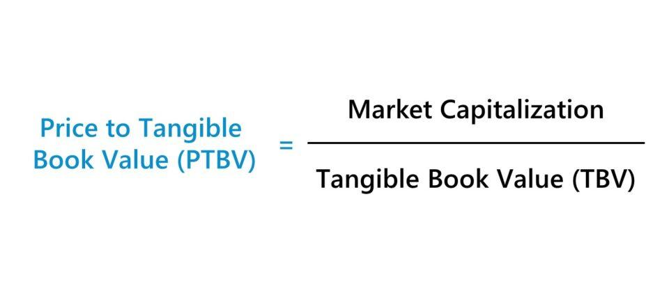

## Table of Contents

## What is the Price to Tangible Book Value Ratio?

The Price to Tangible Book Value Ratio is a financial metric that investors use to see if a company's stock is priced fairly. It compares the market price of a company's stock to its tangible book value per share. Tangible book value is what would be left if a company sold all its assets and paid off all its debts, but it only counts physical things like buildings and equipment, not intangible things like brand value or patents.

This ratio helps investors understand if they are paying a fair price for the company's hard assets. A lower ratio might mean the stock is undervalued, which could be a good buying opportunity. A higher ratio might suggest the stock is overvalued, meaning investors might be paying too much for what the company physically owns. However, this ratio should not be the only tool used to make investment decisions, as it doesn't account for the company's future growth potential or other financial health indicators.

## How is the Price to Tangible Book Value Ratio calculated?

The Price to Tangible Book Value Ratio is calculated by dividing the current market price of a company's stock by its tangible book value per share. To find the tangible book value per share, you start with the company's total book value, which is the value of all its assets minus all its liabilities. Then, you subtract the value of any intangible assets, like patents or trademarks, because these are not physical items. After you have the tangible book value, you divide it by the total number of outstanding shares to get the tangible book value per share.

Once you have the tangible book value per share, you can calculate the ratio by taking the current market price of one share of the company's stock and dividing it by the tangible book value per share. This gives you a number that shows how many times the market price is compared to the tangible assets backing each share. If the ratio is low, it might mean the stock is a good deal because the market price is low compared to what the company physically owns. If the ratio is high, it might mean the stock is expensive because the market price is high compared to the tangible assets.

## Why is the Price to Tangible Book Value Ratio important for investors?

The Price to Tangible Book Value Ratio is important for investors because it helps them see if a stock is priced fairly compared to what the company actually owns. This ratio looks at the company's hard, physical assets, like buildings and machines, and compares their value to the stock's current market price. If the ratio is low, it might mean the stock is a good deal because you're paying less for what the company physically has. If the ratio is high, it might mean the stock is expensive because you're paying a lot more than what the company's tangible assets are worth.

This ratio can be especially useful for investors looking at companies in industries where physical assets are a big part of their value, like manufacturing or real estate. It gives investors a way to check if they are getting a good deal on the stock based on what the company owns. However, it's important to remember that this ratio doesn't tell the whole story. It doesn't look at things like the company's future growth or how well it's doing financially overall. So, while it's a helpful tool, investors should use it along with other information to make smart choices about buying or selling stocks.

## How does the Price to Tangible Book Value Ratio differ from the Price to Book Value Ratio?

The Price to Tangible Book Value Ratio and the Price to Book Value Ratio both help investors see if a stock's price is fair, but they look at different things. The Price to Book Value Ratio compares the stock's price to the company's total book value, which is all its assets minus all its liabilities. This includes both tangible assets like buildings and intangible assets like patents. On the other hand, the Price to Tangible Book Value Ratio only looks at the tangible assets. It leaves out the intangible assets, so it shows what the company would be worth if it sold all its physical stuff and paid off its debts.

This difference matters because some investors might want to know just how much the company's physical things are worth. If a company has a lot of patents or brand value but not many buildings or machines, the Price to Book Value Ratio might make it look more valuable than it really is when you only consider the physical stuff. The Price to Tangible Book Value Ratio gives a clearer picture of what the company's hard assets are worth compared to its stock price. Both ratios are useful, but they give different views on the company's value, and investors might choose one over the other depending on what they're looking for.

## What does a high Price to Tangible Book Value Ratio indicate about a company?

A high Price to Tangible Book Value Ratio means that the price of the company's stock is much higher than the value of its tangible assets. Tangible assets are things you can touch, like buildings and machines. When this ratio is high, it suggests that investors are willing to pay a lot more for the stock than what the company's physical stuff is worth. This might happen if people think the company will grow a lot in the future or if it has strong intangible assets, like a famous brand or important patents.

However, a high ratio can also be a warning sign. It might mean the stock is overpriced, and investors could be paying too much for what the company actually owns. If the company's future doesn't turn out as expected, the stock price could drop, and investors might lose money. So, a high Price to Tangible Book Value Ratio can show that people have high hopes for the company, but it also means there's a risk that the stock might be too expensive.

## What does a low Price to Tangible Book Value Ratio suggest about a company's valuation?

A low Price to Tangible Book Value Ratio means that the price of the company's stock is not much higher than the value of its tangible assets. Tangible assets are things you can touch, like buildings and machines. When this ratio is low, it suggests that the stock might be a good deal. Investors might see it as a chance to buy the stock for less than what the company's physical stuff is worth.

However, a low ratio doesn't always mean the stock is a great buy. It could also mean that people don't think the company will do well in the future. If the company's business isn't strong or if it's in a tough industry, the low ratio might be a sign that the stock is cheap for a reason. So, a low Price to Tangible Book Value Ratio can show that the stock might be undervalued, but investors need to look at other things too before deciding to buy.

## How can the Price to Tangible Book Value Ratio be used to compare companies within the same industry?

The Price to Tangible Book Value Ratio is a good way to compare companies in the same industry because it looks at the value of their physical stuff. When you compare the ratios of different companies, you can see which ones might be a better deal. If one company has a lower ratio than another, it might mean that company's stock is cheaper compared to what it owns. This can be helpful for investors who want to find good deals on stocks in industries where physical assets are important, like manufacturing or real estate.

However, it's important to remember that this ratio doesn't tell the whole story. It only looks at tangible assets and doesn't consider things like how well the company is doing or what it might do in the future. So, while the Price to Tangible Book Value Ratio can give you a quick way to compare companies, you should also look at other information before making a decision. This way, you get a fuller picture of which company might be a better investment.

## What are the limitations of using the Price to Tangible Book Value Ratio as a valuation metric?

The Price to Tangible Book Value Ratio has some problems that investors need to know about. It only looks at the things a company can touch, like buildings and machines. It doesn't count things you can't touch, like a company's brand or patents. This can make the ratio less useful for companies where those things are important. Also, the ratio doesn't think about how the company is doing right now or how it might do in the future. A company could have a low ratio because it's doing badly, not because it's a good deal.

Another issue is that the ratio can be different depending on the industry. Some industries need a lot of physical stuff, so their ratios might be higher or lower than others. This makes it hard to compare companies from different industries using just this ratio. Also, the value of the tangible assets can change over time. If a company's machines get old and are worth less, the ratio might not show the real value anymore. So, while the Price to Tangible Book Value Ratio can be a helpful tool, it's not perfect and should be used with other information to make good investment choices.

## Can the Price to Tangible Book Value Ratio be negative, and what does that signify?

Yes, the Price to Tangible Book Value Ratio can be negative. This happens when a company's tangible book value is negative. That means the company's debts are more than the value of its physical stuff like buildings and machines. When this happens, the ratio shows a negative number because you are dividing the stock price by a negative tangible book value per share.

A negative Price to Tangible Book Value Ratio usually means the company is in big financial trouble. It shows that the company owes more money than what its physical assets are worth. This can be a warning sign for investors because it suggests the company might not be able to pay back its debts. However, investors should look at other information too, because sometimes a negative ratio might be because of how the company is accounting for things, not because it's in real trouble.

## How does the Price to Tangible Book Value Ratio relate to a company's financial health and performance?

The Price to Tangible Book Value Ratio can give investors a quick look at a company's financial health by comparing the stock price to the value of its physical stuff. If the ratio is low, it might mean the company's stock is a good deal because you're paying less for what the company owns. But if the ratio is high, it could mean the stock is expensive compared to the company's tangible assets. This ratio is helpful for seeing if a company's stock is priced fairly based on what it physically has, but it doesn't tell the whole story about the company's financial health.

This ratio doesn't consider how well the company is doing right now or how it might do in the future. A company might have a low ratio because it's not doing well, not because it's a good buy. Also, the ratio doesn't count things you can't touch, like the company's brand or patents, which can be really important. So, while the Price to Tangible Book Value Ratio can give you a snapshot of the company's financial health based on its physical assets, investors need to look at other things too to get a full picture of the company's performance and health.

## What other financial ratios should be considered alongside the Price to Tangible Book Value Ratio for a comprehensive analysis?

When looking at a company's financial health, the Price to Tangible Book Value Ratio is just one piece of the puzzle. Another important ratio to consider is the Price to Earnings (P/E) Ratio, which shows how much investors are willing to pay for each dollar of the company's earnings. A low P/E Ratio might mean the stock is undervalued, while a high one could mean it's overvalued. The Debt to Equity Ratio is also crucial because it shows how much the company is relying on borrowed money. A high Debt to Equity Ratio might mean the company is taking on too much risk, which could be a warning sign for investors.

In addition to these, the Return on Equity (ROE) Ratio tells you how well the company is using the money shareholders have invested to make a profit. A high ROE is usually a good sign that the company is managing its money well. The Current Ratio is another important one because it shows if the company can pay its short-term bills. A Current Ratio above 1 means the company has more than enough to cover its short-term debts, which is a good sign of financial stability. By looking at all these ratios together, investors can get a better understanding of a company's overall financial health and performance.

## How has the relevance of the Price to Tangible Book Value Ratio evolved with changes in the economic environment and accounting standards?

The Price to Tangible Book Value Ratio has become less important over time because of changes in the economy and how companies keep their books. In the past, when companies mostly had things you could touch, like factories and machines, this ratio was really useful. But now, a lot of companies make money from things you can't touch, like technology or a famous brand. These things aren't counted in the tangible book value, so the ratio doesn't show the full value of modern companies. Also, new ways of keeping books, like how companies now have to show more about their intangible stuff, make the ratio less useful for understanding a company's worth.

Even though the Price to Tangible Book Value Ratio is not as important as it used to be, it can still be helpful in certain situations. For example, it's still good for looking at companies in industries where physical stuff is still the main thing, like real estate or heavy industry. But for most companies, especially in tech or services, investors need to look at other numbers too. Things like how much money the company makes or how well it's growing are now more important for figuring out if a stock is a good buy. So, while the ratio can still be part of the picture, it's just one piece of a much bigger puzzle.

## What insights can we gain from exploring financial ratios, specifically the PTBV?

Price to Tangible Book Value (PTBV) is a crucial financial ratio for analyzing a company's financial health by focusing on tangible assets. These assets typically include property, machinery, and inventory, and specifically exclude intangible assets such as patents and goodwill. The PTBV ratio is calculated using the formula:

$$
\text{PTBV} = \frac{\text{Market Price per Share}}{\text{Tangible Book Value per Share}}
$$

This metric provides a conservative evaluation of a company's worth by focusing solely on tangible assets, which can be fundamentally significant, particularly in liquidation scenarios. In such cases, PTBV offers a lower-bound estimate of the company's value, as tangible assets have a more definitive resale value compared to intangibles.

For conservative investors, the PTBV ratio acts as a safeguard by emphasizing asset-based valuation, reducing the potential for overestimating a company’s worth due to uncertain intangible assets. By comparing the market price with the tangible book value, investors can assess whether a stock is undervalued or overvalued relative to its tangible assets. PTBV is particularly useful in industries where tangible assets form a significant part of a company's total assets, providing valuable insights into fundamental, asset-based valuations.

## What is an example of PTBV calculation?

Consider a hypothetical company with a market price per share of $50 and a tangible book value per share of $25. To calculate the Price to Tangible Book Value (PTBV) ratio, we use the formula: 

$$
\text{PTBV} = \frac{\text{Market Price per Share}}{\text{Tangible Book Value per Share}}
$$

Plugging in the numbers:

$$
\text{PTBV} = \frac{50}{25} = 2
$$

This result signifies that the market values the company's tangible assets at twice their recorded value on the balance sheet. A PTBV of 2 indicates that investors are willing to pay $2 for every $1 of the company's tangible assets. Such a ratio provides insights into how the market perceives the value of tangible assets relative to their book value. This can be particularly useful when comparing with industry norms to determine whether the company is overvalued or undervalued in terms of its tangible assets.

## References & Further Reading

[1]: Damodaran, A. (2012). ["Investment Valuation: Tools and Techniques for Determining the Value of Any Asset."](https://books.google.com/books/about/Investment_Valuation.html?id=5SRHAAAAQBAJ) John Wiley & Sons.

[2]: Greenwald, B. C., Kahn, J., Sonkin, P. D., & van Biema, M. (2001). ["Value Investing: From Graham to Buffett and Beyond."](https://www.amazon.com/Value-Investing-Graham-Buffett-Beyond/dp/0471463396) John Wiley & Sons.

[3]: Penman, S. H. (2013). ["Financial Statement Analysis and Security Valuation."](https://www.mheducation.com/highered/product/financial-statement-analysis-security-valuation-penman/M9780078025310.html) McGraw-Hill Education.

[4]: Murphy, J. J. (1999). ["Technical Analysis of the Financial Markets: A Comprehensive Guide to Trading Methods and Applications."](https://archive.org/details/technicalanalysi0000murp) New York Institute of Finance.

[5]: O'Shaughnessy, J. P. (2005). ["What Works on Wall Street: A Guide to the Best-Performing Investment Strategies of All Time."](https://www.amazon.com/What-Works-Wall-Street-Fourth/dp/0071625763) McGraw-Hill Education.