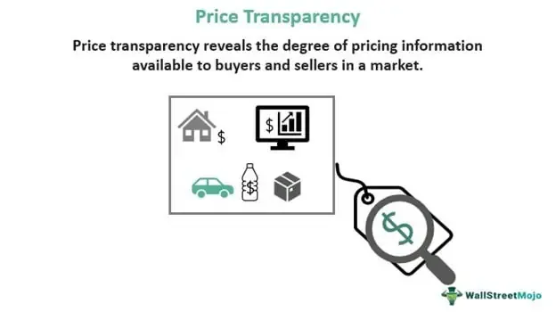

Transparency in financial markets is a cornerstone of efficient and fair exchanges, serving as a critical component in fostering trust among market participants. At the heart of market transparency lies the disclosure of information that participants need to make sound financial decisions. This includes price transparency, cost transparency, and the increasingly prevalent role of algorithmic trading.

Price transparency refers to the extent to which pricing information—such as bid and ask prices—is readily available to all market participants. It serves as a foundation for market efficiency, ensuring that buyers and sellers can make informed decisions and that securities are priced accurately. Without price transparency, markets can become opaque, leading to inefficiencies and potential exploitation.

Cost transparency is equally important as it involves the clear communication of all costs associated with financial transactions. By understanding these costs, consumers can make more informed financial choices, and market competition is enhanced as firms strive to offer the best value to consumers. However, achieving full cost transparency poses significant challenges across various industries, often due to complex pricing structures and hidden fees.

Algorithmic trading, which uses computer algorithms to execute trading orders, has dramatically transformed financial markets in recent years. It can enhance market efficiency by executing orders at optimal prices and speeds. However, the opaque nature of some algorithmic strategies can pose threats to transparency, as the underlying logic of these algorithms is rarely disclosed to the public. This raises potential concerns about biases and ethical practices within algorithmic trading systems.

The benefits of enhancing transparency in financial markets are numerous. A transparent market fosters a level playing field, reducing information asymmetry between different market participants. It increases market liquidity and can lead to lower transaction costs, as there is less room for hidden fees and unfair pricing practices. Moreover, transparency is linked to investor confidence, as investors are more likely to participate in markets where they trust that they have access to the same information as others.

Despite these benefits, significant challenges remain. The complexity of financial instruments and markets can make transparency difficult to achieve. Moreover, there are often conflicts between transparency and privacy, particularly when it comes to algorithmic trading where proprietary strategies are used. Balancing the costs associated with increased transparency against the benefits remains an ongoing challenge for regulators and industry stakeholders.

In conclusion, transparency in financial markets is of paramount importance. Whether it involves price, cost, or the nuances of algorithmic trading, enhancing transparency can significantly improve market fairness and efficiency. As financial markets continue to evolve, improving transparency is not merely a regulatory challenge but an opportunity to build more resilient and trustworthy financial systems.

## Table of Contents

## What is Price Transparency?

Price transparency in the context of trading and financial markets refers to the degree to which information about buying and selling prices and the quantities of financial assets is available and accessible to all market participants. It is a crucial component of a fair and efficient market, as it ensures that all parties have equal access to essential market data, thus facilitating informed decision-making.

Price transparency is characterized by several key elements:

1. **Bid Prices**: The prices at which buyers are willing to purchase an asset. These are crucial for sellers to determine the demand for the asset and for assessing the overall market sentiment.

2. **Ask Prices**: The prices at which sellers are prepared to sell an asset. These allow buyers to evaluate the current supply and understand the lowest price at which they can acquire the asset.

3. **Trading Quantities**: Information about the volume or size of trades at various price levels provides insight into the liquidity of the market, indicating how easily assets can be bought or sold without significantly affecting the asset's price.

The significance of price transparency lies in its ability to enhance market efficiency and build trust among market participants. When price information is widely available and reliable, it minimizes information asymmetry, where one party has more or better information than the other, potentially leading to fairer prices and reducing opportunities for [arbitrage](/wiki/arbitrage) or manipulation.

Moreover, price transparency facilitates better [liquidity](/wiki/liquidity-risk-premium) in markets by enabling quicker price discovery—the process through which the market determines the fair value of an asset. It also helps in narrowing bid-ask spreads, which are the differences between the prices quoted for the immediate purchase and sale of an asset. A narrower spread typically indicates a more efficient market with lower transaction costs for investors.

In sum, price transparency plays a pivotal role in ensuring that financial markets operate smoothly, fostering trust among participants and promoting a competitive and efficient trading environment.

## Understanding Cost Transparency

Cost transparency in financial transactions refers to the clarity and openness regarding the costs associated with trading, purchasing, or investing in financial products and services. It involves the disclosure of all fees, charges, and financial obligations involved in a transaction, enabling individuals and institutions to make informed decisions. A high level of cost transparency can demystify complex fee structures and promote trust between market participants.

Cost transparency significantly impacts consumer behavior. When consumers are aware of the costs associated with financial products, they are more likely to compare options and make choices that offer the best value. This informed decision-making process encourages competitiveness among providers, as they strive to offer better terms to attract and retain customers. Transparent cost structures enable consumers to understand the true price of a service, reducing the risk of misleading pricing strategies and fostering healthy market competition.

However, achieving cost transparency poses several challenges across different industries. One major hurdle is the complexity of financial products, which often include layered fees, commissions, and other charges that can be difficult to decipher. For example, mutual funds may have management fees, performance fees, and transaction costs. Disentangling these costs to provide clear information to consumers requires standardized reporting and consistent terminology.

Additionally, financial institutions may have little incentive to fully disclose costs. Hidden fees can be a source of significant revenue for some companies, creating a reluctance to voluntarily increase transparency. Regulatory intervention often becomes necessary to mandate clear cost disclosures. For instance, the European Union's Markets in Financial Instruments Directive II (MiFID II) requires detailed cost disclosure to enhance investor protection and transparency.

Different industries face unique challenges regarding cost transparency. In the healthcare sector, for instance, the pricing of services and insurance products can be notoriously opaque, leaving consumers unable to predict their financial responsibilities accurately. In the energy market, bundled pricing and fluctuating delivery charges can obscure the true costs of energy consumption.

To overcome these challenges, leveraging technology is crucial. Digital platforms can aggregate and present cost information in user-friendly formats, employing tools like [machine learning](/wiki/machine-learning) to further enhance clarity and personalization. Moreover, promoting transparency in financial technology through innovative solutions such as blockchain could offer tamper-proof audit trails of transactions, ensuring cost integrity. 

Ultimately, the benefits of achieving cost transparency extend beyond consumer empowerment. They lead to more competitive markets and foster trust between financial institutions and clients, laying the foundation for sustainable economic growth.

## Algorithmic Trading and Transparency

Algorithmic trading refers to the use of computerized systems to execute trading decisions in financial markets at speeds and frequencies that are beyond human capability. These systems operate using algorithms—predefined sets of rules or instructions— designed to identify and exploit trading opportunities. The primary advantage of [algorithmic trading](/wiki/algorithmic-trading) lies in its ability to process vast amounts of market data rapidly and execute trades at optimal prices with minimal human intervention. This technological innovation has significantly transformed the landscape of financial markets by enhancing liquidity, reducing transaction costs, and enabling traders to respond swiftly to market events.

Transparency in algorithmic trading systems is a critical [factor](/wiki/factor-investing) for fostering trust among market participants and ensuring market integrity. It involves the clear disclosure of the logic and rules underlying trading algorithms, as well as the processes used for risk management and regulatory compliance. Greater transparency allows regulators to monitor trading activities more effectively and identify potential market abuses, such as spoofing or layering, which could otherwise distort market prices and harm investors.

Despite the benefits, algorithmic trading raises several potential biases and ethical considerations. One primary concern is the risk of amplifying systemic biases present in financial data. Algorithms trained on historical data may inadvertently perpetuate existing market inequalities or exhibit biased behavior, such as favoring certain asset classes or trading strategies over others. Additionally, high-frequency trading algorithms can lead to market fragmentation and increase [volatility](/wiki/volatility-trading-strategies), thereby posing risks to market stability.

Ethical considerations also arise from the lack of human oversight in algorithmic trading. The autonomous nature of these systems can result in unforeseen market outcomes, necessitating robust mechanisms for monitoring and controlling algorithmic activities. To address these concerns, financial institutions and regulatory bodies must collaborate to establish ethical guidelines and ensure that algorithmic trading practices align with broader market objectives, such as fairness and transparency.

In conclusion, enhancing transparency in algorithmic trading is pivotal to harnessing its full potential while mitigating associated risks. By promoting greater oversight and accountability, stakeholders in the financial industry can work towards a more equitable and efficient market environment.

## Improving Transparency in Trading

Technological advancements have played a pivotal role in enhancing transparency in trading, fundamentally transforming how financial markets operate. One of the most significant developments in this area is the rise of electronic trading platforms, which have revolutionized the way transactions are conducted and information is disseminated.

Electronic trading platforms facilitate the real-time exchange of information, providing traders with immediate access to price quotes, market depth, and trade execution data. This immediacy eliminates the opacity often associated with traditional trading methods, where information asymmetry between market participants could lead to inefficiencies and potentially unfair trading practices. By aggregating data from multiple sources, these platforms offer a holistic view of the market, enabling traders to make more informed decisions based on accurate and up-to-date information. 

Real-time data analytics is another cornerstone of improved transparency. Advanced analytics tools process vast amounts of data to identify patterns, trends, and anomalies that may impact market dynamics. These insights help traders and investors understand the underlying factors driving price movements, contributing to more efficient markets. The ability to analyze data in real time means that market participants can react more swiftly to changing conditions, reducing the lag between information dissemination and decision-making.

The impact of enhanced transparency on market dynamics and efficiency is profound. Greater transparency reduces information asymmetry, a phenomenon where one party to a transaction has more or better information than the other. When all participants have access to the same information, the market becomes more competitive, potentially leading to tighter spreads, lower volatility, and improved liquidity. Furthermore, transparent markets increase participant trust as they are perceived as fairer and more equitable, encouraging broader participation and fostering economic growth.

In summary, technological advancements such as electronic trading platforms and real-time data analytics significantly enhance market and pricing transparency. These tools provide more reliable and immediate information, contributing to more competitive and efficient markets, and building trust among market participants. As technology continues to evolve, the potential for further transparency improvements in trading will likely expand, offering new opportunities for market innovation and economic development.

## Challenges and Opportunities in Enhancing Transparency

Achieving full transparency in pricing and costs within financial markets encounters several significant barriers. One of the foremost challenges is the complexity of financial products and transactions. Financial instruments, especially derivatives and structured products, often have intricate pricing models that are difficult to break down and understand. This complexity can obscure true pricing and cost structures from market participants.

Another barrier is the resistance from incumbents who benefit from opacities, such as institutional investors and financial institutions that maintain competitive advantages through information asymmetry. Such stakeholders may lobby against transparency-enhancing regulations or technologies that threaten their market position.

Furthermore, regulatory challenges exist due to domestic and international policy differences. Disparate regulatory frameworks can hinder the establishment of uniform transparency standards, creating a fragmented market environment where transparency is inconsistent across jurisdictions.

Despite these challenges, emerging technologies and regulatory developments offer opportunities to enhance transparency. Blockchain technology, for example, provides the potential for almost immutable record-keeping and traceable transactions, which can significantly improve transparency in financial markets by ensuring that all market participants have access to the same information. Smart contracts, powered by blockchain, can automate the disclosure of transaction details, thereby reducing the possibility of information hiding.

Machine learning and big data analytics also offer opportunities to analyze and interpret vast amounts of trading data, making it feasible to identify anomalous patterns that could indicate a lack of transparency. By leveraging these technologies, market actors can enhance visibility into pricing structures and transaction costs, thereby promoting a more transparent marketplace.

Regulatory reforms aimed at enhancing transparency are being enacted in various jurisdictions, providing further opportunities. The European Union’s Markets in Financial Instruments Directive II (MiFID II), for instance, mandates more rigorous reporting requirements and transparency in trading practices, significantly impacting cost and price transparency in financial markets. 

Industries such as healthcare and consumer finance provide case studies of enhanced transparency. In healthcare, initiatives aiming for greater price transparency in services and medications have emerged, although challenges persist. Websites offering price comparison services have empowered consumers to make more informed decisions, pressuring providers to reduce costs.

In the consumer finance industry, fintech innovations have improved transparency by offering platforms where consumers can easily compare financial products, like mortgages and loans, based on pricing and cost structures. This increased transparency encourages competition and benefits consumers through better pricing options.

In conclusion, while achieving full transparency in pricing and costs is fraught with challenges, technological advancements and progressive regulations present tangible opportunities. Examples from healthcare and consumer finance demonstrate that enhanced transparency is achievable and beneficial. Through continued innovation and regulatory support, financial markets can similarly advance towards greater transparency, fostering a fairer and more efficient trading environment.

## Regulatory Frameworks Supporting Transparency

Regulatory oversight plays a crucial role in ensuring market transparency by establishing rules and guidelines that promote fair and efficient trading practices. This oversight helps maintain trust among market participants by ensuring that markets operate in a transparent and consistent manner. Regulatory agencies such as the Securities and Exchange Commission (SEC) in the United States, the European Securities and Markets Authority (ESMA), and the Financial Conduct Authority (FCA) in the United Kingdom are responsible for setting and enforcing standards that promote transparency.

Regulatory measures that enhance fairness and transparency include mandatory disclosure requirements, which compel companies to provide detailed financial information to investors and the public. Such disclosure allows investors to make informed decisions based on the company's financial health and performance. Additionally, regulations against insider trading and market manipulation protect investors from unfair practices that can distort market prices.

To facilitate transparency, many regulatory bodies also require the use of standardized reporting formats and the periodic auditing of financial statements. This standardization ensures that financial information is presented consistently, enabling easier comparison across different companies and industries. Furthermore, the introduction of MiFID II (Markets in Financial Instruments Directive) in Europe has reinforced transparency by enhancing the visibility of trading activities and improving the quality of market data.

Global regulatory cooperation is equally important for enhancing transparency across borders, as financial markets are interconnected and transactions often occur in multiple jurisdictions. Collaboration among international regulatory bodies is necessary to address cross-border challenges and harmonize regulatory standards. Organizations such as the International Organization of Securities Commissions (IOSCO) work to promote global securities regulation and facilitate cooperation among member countries. These initiatives help reinforce a cohesive and transparent global financial system, reducing the risk of regulatory arbitrage and ensuring that market participants adhere to consistent and fair practices worldwide.

In summary, regulatory frameworks are essential for supporting transparency in financial markets. Through oversight, enforcement of disclosure requirements, and global cooperation, regulators help ensure that markets operate transparently, thus fostering trust and stability in the financial system.

## Conclusion

Improving transparency in pricing, costs, and algorithmic trading is crucial for fostering a more equitable and efficient financial market. Transparency ensures that market participants have access to accurate, timely, and comprehensive information. This empowerment leads to informed decision-making, which, in turn, enhances market efficiency and reinforces trust among stakeholders.

The benefits of transparency are widespread. In pricing, transparency leads to fairer trading conditions by enabling market participants to view bid, ask, and transaction prices. This openness reduces information asymmetry, preventing market manipulation and fostering a competitive environment that encourages fair pricing mechanisms. Similarly, cost transparency eliminates hidden charges, enabling participants to understand the total cost of transactions and adjust their strategies accordingly.

Algorithmic trading, representing a significant portion of modern market activity, also benefits from transparency. Clear visibility into algorithmic operations and decision criteria can prevent biases and unethical practices. While algorithms increase market liquidity and reduce transaction costs, their complexity necessitates transparency to ensure ethical use and mitigate systemic risks.

Looking ahead, the future of financial market transparency is promising, driven by rapid technological advancements. Blockchain technology, for instance, offers the potential for immutable and transparent transaction records, while AI and machine learning can enhance real-time data analytics, offering greater visibility into market operations. Further, the proliferation of electronic trading platforms brings about unprecedented accessibility and transparency in financial markets.

To fully realize these benefits, stakeholders in the financial industry must prioritize transparency improvements. Regulatory bodies need to implement measures that encourage openness, such as mandating comprehensive disclosures and promoting standards for algorithmic trading. Financial institutions are encouraged to adopt technologies that enhance transparency, not only as a compliance measure but also as a competitive advantage.

In conclusion, transparency in pricing, costs, and algorithmic trading not only improves market efficiency and participant trust but also contributes to the overall stability of financial markets. Embracing and advancing transparency should be a collective effort from all stakeholders to foster a future where financial markets are accessible, fair, and robust.

## References & Further Reading

[1]: O'Hara, M. (1995). ["Market Microstructure Theory."](https://books.google.com/books/about/Market_Microstructure_Theory.html?id=D-PGBwAAQBAJ) Blackwell Publishers.

[2]: Harris, L. (2003). ["Trading and Exchanges: Market Microstructure for Practitioners."](https://www.amazon.com/Trading-Exchanges-Market-Microstructure-Practitioners/dp/0195144708) Oxford University Press.

[3]: Madhavan, A. (2000). ["Market Microstructure: A Practitioner’s Guide."](https://www.jstor.org/stable/4480415) Financial Management.

[4]: Hasbrouck, J. (2007). ["Empirical Market Microstructure: The Institutions, Economics, and Econometrics of Securities Trading."](https://academic.oup.com/book/52241) Oxford University Press.

[5]: Hull, J. C. (2017). ["Options, Futures, and Other Derivatives."](https://www.semanticscholar.org/paper/Options%2C-Futures%2C-and-Other-Derivatives-Hull/89bdee500c8623864fc9eb7a471546aa713acc44) Pearson.