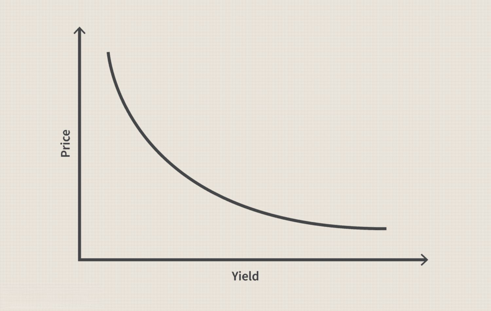

## Table of Contents

## What is a basis point and why is it important in finance?

A basis point is a unit of measure used in finance to describe the percentage change in a financial instrument. One basis point is equal to 1/100th of a percent, or 0.01%. This small unit is used because many financial changes are very small, and using basis points makes it easier to understand and communicate these changes accurately.

Basis points are important in finance because they help people talk about small changes in interest rates, bond yields, and other financial rates without getting confused. For example, if an interest rate goes up from 5% to 5.25%, you can say it went up by 25 basis points. This makes it clear and simple. Using basis points also helps avoid mistakes that can happen when dealing with percentages, especially when the changes are tiny.

## How is the price value of a basis point (PVBP) calculated?

The price value of a basis point, or PVBP, is a way to measure how much the price of a bond changes when the interest rate moves by one basis point. To calculate PVBP, you first need to know the bond's current price and its yield. Then, you increase the yield by one basis point (0.01%) and find out what the new price of the bond would be. After that, you decrease the yield by one basis point and find the new price again. The PVBP is the difference between these two new prices divided by two.

This calculation helps investors understand how sensitive a bond's price is to changes in interest rates. For example, if a bond's price goes up by $10 when the yield drops by one basis point and goes down by $10 when the yield rises by one basis point, the PVBP would be $10. This means that for every basis point change in the yield, the bond's price changes by $10. Knowing the PVBP is important for managing risk and making smart investment decisions.

## Can you explain the difference between PVBP and duration?

PVBP, or Price Value of a Basis Point, and duration are both used to measure how sensitive a bond's price is to changes in interest rates, but they do it in different ways. PVBP tells you how much the price of a bond will change if the interest rate goes up or down by one basis point, which is 0.01%. It's like a small snapshot of how the bond will react to a tiny change in rates. For example, if a bond's PVBP is $10, it means the bond's price will go up by $10 if the interest rate drops by one basis point, and it will go down by $10 if the rate goes up by one basis point.

Duration, on the other hand, gives you a bigger picture of how the bond's price will change with interest rates. It's usually measured in years and tells you the average time it takes to get back the bond's price through its cash flows. Duration is a more general measure of interest rate risk because it shows how the bond's price will change for bigger moves in interest rates, not just tiny ones like PVBP. If a bond has a duration of 5 years, it means that for every 1% change in interest rates, the bond's price will change by about 5%. So, while PVBP focuses on small, precise changes, duration looks at the overall sensitivity to interest rate movements.

## What role does PVBP play in bond pricing?

PVBP, or Price Value of a Basis Point, helps people understand how much a bond's price will change if interest rates move a tiny bit. Imagine you have a bond and the interest rate goes up or down by just 0.01%. PVBP tells you exactly how much more or less you'll get for that bond because of that small change. This is really useful for people who buy and sell bonds because they need to know how sensitive their investments are to even the smallest changes in interest rates.

Knowing the PVBP is important for managing risk. If you're an investor, you want to know how much your bond's price might go up or down with tiny interest rate changes. This helps you decide if a bond is a good buy or if it's too risky. For example, if a bond's PVBP is high, it means the bond's price will change a lot with small interest rate movements, which might be too risky for some investors. So, PVBP is a key tool for making smart choices about buying and selling bonds.

## How can PVBP be used to assess interest rate risk?

PVBP, or Price Value of a Basis Point, helps people figure out how much a bond's price will change if interest rates move just a tiny bit. It's like a tool that shows you how sensitive your bond is to even the smallest changes in interest rates. If you know the PVBP, you can see how much more or less you might get for your bond if rates go up or down by 0.01%. This is really helpful for anyone who buys and sells bonds because they need to understand how their investments might change with these tiny shifts in rates.

Using PVBP to assess interest rate risk means you can make smarter choices about your investments. If a bond has a high PVBP, it means its price will change a lot with small interest rate movements, which might be too risky for some people. On the other hand, a bond with a low PVBP won't change much, which might be safer. By knowing the PVBP, investors can decide if they want to take on more risk for possibly higher rewards or if they want to play it safe with bonds that won't swing as much with interest rate changes.

## What are the practical applications of PVBP for traders and portfolio managers?

Traders and portfolio managers use PVBP to manage their risks better. They look at PVBP to see how much a bond's price will change if interest rates go up or down just a little bit. This helps them decide if they should buy or sell a bond. If a bond has a high PVBP, it means its price will change a lot with small interest rate movements. Traders might decide to sell these bonds if they think interest rates will go up, because the bond's price will drop a lot. On the other hand, if they think rates will go down, they might buy these bonds to make a bigger profit when the price goes up.

Portfolio managers also use PVBP to keep their portfolios balanced. They want to make sure that their investments won't lose too much value if interest rates change. By knowing the PVBP of the bonds in their portfolio, they can adjust their holdings to control how much the whole portfolio's value might change with interest rates. If they have too many bonds with high PVBP, they might sell some and buy bonds with lower PVBP to reduce the risk. This way, they can protect their investments and make sure they're not too sensitive to small changes in interest rates.

## How does PVBP relate to yield curve analysis?

PVBP, or Price Value of a Basis Point, is really helpful when people want to understand the yield curve, which is like a chart showing how interest rates change for bonds that take different amounts of time to pay back. The yield curve tells you if short-term bonds have higher or lower interest rates than long-term bonds. When traders and investors look at the yield curve, they use PVBP to see how much the price of a bond will change if interest rates move a tiny bit. This helps them figure out how sensitive their bonds are to these small changes across the whole curve.

For example, if the yield curve is steep, meaning long-term rates are much higher than short-term rates, bonds with longer times to pay back might have a higher PVBP. This means their prices will change a lot with small interest rate movements. Traders can use this information to decide if they want to buy or sell these bonds based on what they think will happen to interest rates. By knowing the PVBP at different points on the yield curve, traders can manage their risks better and make smarter choices about which bonds to hold or trade.

## Can PVBP be applied to other financial instruments besides bonds?

Yes, PVBP can be used with other financial instruments, not just bonds. For example, it can be helpful when looking at interest rate swaps, which are agreements between two parties to exchange interest payments. Just like with bonds, PVBP helps traders and investors understand how much the value of an interest rate swap will change if interest rates go up or down a tiny bit. This is important for managing risk and making smart decisions about whether to enter into or get out of these swaps.

PVBP can also be used with mortgage-backed securities, which are investments backed by home loans. These securities can be sensitive to changes in interest rates, and PVBP helps people see how much their value might change with small rate movements. By using PVBP, investors can better manage their portfolios and decide if they want to buy or sell these securities based on their expectations of future interest rate changes.

## What are the limitations of using PVBP in financial analysis?

Using PVBP, or Price Value of a Basis Point, in financial analysis has some limitations. One big problem is that PVBP only looks at how a bond's price changes with a tiny move in interest rates, like 0.01%. It doesn't tell you what happens if interest rates change a lot more. So, if you're expecting big changes in rates, PVBP might not give you the whole picture of how your bond's price could move.

Another limitation is that PVBP doesn't take into account other things that can affect a bond's price, like changes in the bond's credit rating or big shifts in the economy. These factors can make a bond's price go up or down in ways that PVBP can't predict. So, while PVBP is useful for understanding small interest rate changes, it's not the only tool you should use when trying to figure out how a bond's price might change in the future.

## How does PVBP impact hedging strategies?

PVBP, or Price Value of a Basis Point, helps people create better hedging strategies. Hedging is like a safety net that investors use to protect their money from big changes in interest rates. By knowing the PVBP of a bond, investors can figure out how much the bond's price will change if rates move just a tiny bit. This helps them choose the right tools, like interest rate swaps or other bonds, to balance out their risks. If a bond has a high PVBP, it means its price will change a lot with small rate movements, so investors might use other financial instruments with a similar PVBP to hedge against these changes.

For example, if an investor owns a bond with a high PVBP and they think interest rates will go up, they might use an interest rate swap to protect themselves. The swap could have a PVBP that's close to the bond's PVBP, so any losses from the bond when rates go up could be balanced out by gains from the swap. This way, PVBP helps investors match their hedges to their investments, making their portfolios safer from interest rate changes.

## What advanced techniques can enhance the accuracy of PVBP calculations?

To make PVBP calculations more accurate, people can use something called a binomial model. This model breaks down the bond's life into small pieces and looks at how interest rates might change over time. Instead of just looking at one small change in rates, the binomial model considers lots of possible changes, which makes the PVBP calculation more detailed and closer to what might really happen in the market. This is really helpful for bonds that can be paid back early or have other special features that make their prices more complicated.

Another way to improve PVBP calculations is by using a Monte Carlo simulation. This technique runs lots of different scenarios to see how a bond's price might change with different interest rate movements. It's like playing out many possible futures to get a better idea of how sensitive the bond is to rate changes. By using Monte Carlo simulations, investors can get a more complete picture of the risks and make their PVBP calculations more accurate and useful for making smart investment choices.

## How can machine learning and AI be used to optimize PVBP-based strategies?

Machine learning and AI can help make PVBP-based strategies better by looking at a lot of data and finding patterns that people might miss. These smart systems can learn from past interest rate changes and bond price movements to predict how PVBP might change in the future. For example, AI can use historical data to figure out how different economic conditions affect PVBP, helping investors make better guesses about what might happen next. By using machine learning, investors can adjust their strategies to be more accurate and reduce their risks, making their investments safer and possibly more profitable.

AI can also help by running lots of different scenarios quickly, something that would take people a long time to do. This means investors can see how their PVBP-based strategies might work under many different conditions without waiting. For instance, AI can simulate how a bond's PVBP might change if interest rates go up or down in different ways, helping investors choose the best hedging tools or decide when to buy or sell bonds. By using AI to optimize PVBP strategies, investors can make smarter decisions and manage their portfolios more effectively.

## How do you calculate PVBP?

Calculating the Price Value of a Basis Point (PVBP) is essential for understanding the sensitivity of a bond's price to shifts in interest rates. The process begins by determining the bond price at different yield levels, specifically when the yield changes by one basis point. This calculation helps assess the potential price variation of a bond due to minute changes in yield, thus enabling more precise risk evaluation and interest rate management.

The formula for PVBP is given by:

$$
\text{PVBP} = \frac{P(-) - P(+)}{2}
$$

where $P(-)$ is the bond price when the yield is decreased by one basis point, and $P(+)$ is the bond price when the yield is increased by one basis point. This simple formula provides a linear approximation of the bond's price change in response to a tiny shift in yield.

Several factors influence the PVBP calculation:

1. **Yield**: The current yield of the bond significantly influences its price sensitivity. Changes in yield directly impact the bond's market price due to the inverse relationship between them.

2. **Bond Maturity**: Longer maturity bonds tend to exhibit greater sensitivity to interest rate changes, affecting the PVBP calculation. The longer the time to maturity, the more pronounced the impact of yield changes on bond pricing.

3. **Coupon Rate**: The bond’s coupon rate, or the interest payments made to bondholders, also affects its sensitivity to interest rate changes. Higher coupon rates generally lead to reduced sensitivity, as a significant portion of the bond's value is returned to the investor earlier in the form of interest payments.

To automate the calculation of PVBP, Python can be employed. Here's a code snippet illustrating how one might perform this calculation programmatically:

```python
def price_bond(par, coupon_rate, yield_rate, periods):
    """Calculates the price of a bond given par value, coupon rate, current yield, and number of periods."""
    coupon = par * coupon_rate
    price = sum([coupon / (1 + yield_rate) ** t for t in range(1, periods + 1)])
    price += par / (1 + yield_rate) ** periods
    return price

def calculate_pvbp(par, coupon_rate, yield_rate, periods):
    """Calculates the PVBP of a bond."""
    yield_basis_point_change = 0.0001
    p_plus = price_bond(par, coupon_rate, yield_rate + yield_basis_point_change, periods)
    p_minus = price_bond(par, coupon_rate, yield_rate - yield_basis_point_change, periods)
    pvbp = (p_minus - p_plus) / 2
    return pvbp

# Example usage
par_value = 1000  # Par value of the bond
coupon_rate = 0.05  # 5% coupon rate
current_yield = 0.04  # 4% current yield
years_to_maturity = 10  # 10 years to maturity

pvbp = calculate_pvbp(par_value, coupon_rate, current_yield, years_to_maturity)
print(f"The PVBP is: {pvbp}")
```

This script calculates the bond price at altered yields, providing an easy way to derive the PVBP. By understanding and applying the PVBP calculation, financial analysts can better manage interest rate risks and enhance portfolio strategies.

## What are the advanced concepts and limitations?

Price Value of a Basis Point (PVBP) is a linear approximation used in assessing the sensitivity of bond prices to changes in interest rates. While PVBP provides valuable insights, it comes with certain limitations due to its inherent assumptions and simplified nature.

PVBP assumes a linear relationship between bond prices and yield changes. This assumption simplifies calculations but can lead to inaccurate assessments, particularly when dealing with substantial yield fluctuations. In such scenarios, the bond price-yield relationship may become nonlinear, rendering PVBP less effective. Therefore, it is beneficial to use PVBP in conjunction with other measures like duration and convexity. Duration accounts for the linear approximation of interest rate sensitivity, while convexity provides insights into the curvature of the price-yield relationship, offering a more comprehensive view.

Duration, often defined as the weighted average time to receive the bond's cash flows, helps estimate the price change resulting from a change in yield. Concretely, it quantifies the rate of change of price with respect to yield:

$$
\text{Modified Duration} = \frac{\text{Duration}}{1 + \frac{YTM}{n}}
$$

where YTM is the yield to maturity, and $n$ is the number of compounding periods per year.

Convexity, on the other hand, accounts for the rate of change of duration as yield changes. It adjusts the linear approximation provided by duration to account for the curvature:

$$
\text{Convexity} = \frac{1}{P} \sum \left( \frac{C \times t(t+1)}{(1 + YTM/n)^{t+2}} \right)
$$

where $P$ is the bond price, $C$ is the cash flow at time $t$, and $n$ is the number of compounding periods per year.

By employing these additional measures, analysts can overcome some limitations of PVBP, particularly for scenarios involving significant yield changes. This integrated approach enhances accuracy in evaluating the interest rate risk and potential [volatility](/wiki/volatility-trading-strategies) in bond prices.

Despite these limitations, PVBP remains a vital tool in fixed-income analysis and trading. Its simplicity and ease of calculation make it indispensable for quick assessments and comparisons across bond portfolios. Utilizing PVBP's limitations effectively within a comprehensive analytical framework empowers financial analysts to make more nuanced evaluations and strategic decisions.

## References & Further Reading

[1]: Fabozzi, F. J. (2007). ["Fixed Income Analysis (CFA Institute Investment Series)."](https://www.amazon.com/Fixed-Income-Analysis-Frank-Fabozzi/dp/047005221X) John Wiley & Sons.

[2]: Hull, J. C. (2012). ["Options, Futures, and Other Derivatives."](https://www.semanticscholar.org/paper/Options%2C-Futures%2C-and-Other-Derivatives-Hull/89bdee500c8623864fc9eb7a471546aa713acc44) Pearson Education.

[3]: Tuckman, B. (2011). ["Fixed Income Securities: Tools for Today's Markets."](https://www.amazon.com/Fixed-Income-Securities-Todays-Markets/dp/0470891696) Wiley.

[4]: Fleming, M. J., & Remolona, E. M. (1999). ["Price Formation and Liquidity in the U.S. Treasury Market: The Response to Public Information."](https://www.semanticscholar.org/paper/Price-Formation-and-Liquidity-in-the-U.S.-Treasury-Fleming-Remolona/ae96ce1d01df587da9c95ec54bb25e8dd02c8f60) The Journal of Finance, 54(5), 1901-1915.

[5]: ["Algorithmic and High-Frequency Trading"](https://assets.cambridge.org/97811070/91146/frontmatter/9781107091146_frontmatter.pdf) by Álvaro Cartea, Sebastian Jaimungal, and José Penalva

[6]: ["The Fundamentals of Risk Measurement"](https://www.amazon.com/Fundamentals-Risk-Measurement-Christopher-Marrison/dp/0071386270) by Christopher Marrison