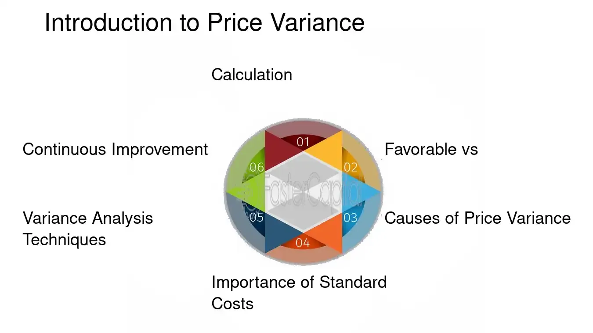

## Table of Contents

## What is price variance?

Price variance is a term used in business and accounting to describe the difference between the expected cost of something and what it actually costs. For example, if a company expects to pay $100 for a certain material but ends up paying $110, the price variance is $10. This concept is important because it helps businesses understand how well they are managing their costs and whether they are getting the prices they expected.

Companies use price variance to make better decisions about buying things. If they see that the price variance is often higher than expected, they might look for new suppliers or negotiate better deals. This helps them save money and plan their budgets more accurately. Understanding price variance can also help a company figure out if changes in the market are affecting their costs, allowing them to adjust their strategies accordingly.

## Why is price variance important in business?

Price variance is important in business because it helps companies see if they are spending more or less than they planned. When a business knows the difference between what they expected to pay and what they actually paid, they can make better decisions. For example, if a company always pays more for materials than they thought, they might need to find new suppliers or negotiate better prices. This helps the company save money and keep their budget on track.

Understanding price variance also helps businesses react to changes in the market. If prices for certain things go up or down, a company can see this in their price variance numbers. This information lets them change their plans quickly. They might buy more of something when prices are low or find cheaper alternatives when prices are high. By keeping an eye on price variance, businesses can stay flexible and make smart choices about spending.

## What are the different types of price variance?

There are two main types of price variance that businesses look at: purchase price variance and sales price variance. Purchase price variance is the difference between how much a company thought it would pay for something and how much it actually paid. For example, if a company expected to pay $50 for a part but ended up paying $55, the purchase price variance is $5. This helps businesses see if they are getting the deals they expected and if their costs are going up or down.

Sales price variance is different. It looks at the difference between the price a company planned to sell something for and the price they actually sold it for. If a business thought they could sell a product for $100 but only got $90, the sales price variance is $10. This type of variance helps companies understand if they are pricing their products right and if they need to change their sales strategies.

Both types of price variance are important because they help businesses see where they might be losing or saving money. By keeping track of purchase price variance, a company can work on getting better deals from suppliers. By watching sales price variance, they can adjust their prices to make sure they are making as much money as possible. Knowing these variances helps businesses make smarter decisions about buying and selling.

## How does price variance affect a company's financial statements?

Price variance can have a big impact on a company's financial statements. When a company pays more for materials than they expected, this shows up as a higher cost of goods sold on their income statement. This can make their profits look smaller because their expenses are higher than planned. On the balance sheet, if the price variance is big, it might mean the company has to spend more cash than they thought, which can lower their cash reserves. This can make the company look less financially stable to investors and lenders.

On the other hand, if a company pays less for materials than they expected, this can make their profits look bigger on the income statement because their costs are lower. This can make the company look more profitable and financially healthy. On the balance sheet, having lower costs can mean more cash on hand, which can make the company look stronger to people who might want to invest in it or lend it money. Keeping track of price variance helps a company understand how their costs are affecting their financial health and plan better for the future.

## What is the basic formula for calculating price variance?

The basic formula for calculating price variance is pretty simple. You take the difference between the actual price you paid for something and the price you expected to pay. Then you multiply that difference by the number of units you bought. For example, if you thought you would pay $10 per unit but ended up paying $12, and you bought 100 units, your price variance would be (12 - 10) * 100, which equals $200.

This formula helps businesses see how much more or less they are spending than they planned. If the price variance is positive, it means they spent more than expected. If it's negative, they spent less. Knowing this helps companies figure out if they need to change how they buy things or if they are doing a good job sticking to their budget.

## Can you explain the mechanism behind price variance?

Price variance happens when the price a company actually pays for something is different from what they thought they would pay. This can happen for many reasons, like changes in the market, new deals with suppliers, or even mistakes in planning. When a company buys materials or goods, they usually have a budget that says how much they expect to spend. If the actual price turns out to be different, that difference is the price variance.

Understanding price variance helps a company see where they might be spending more or less than they planned. If they are spending more, they might need to find cheaper suppliers or buy things in a different way. If they are spending less, it could mean they are getting good deals or that prices have gone down. By looking at price variance, a company can make better choices about how they spend their money and keep their budget on track.

## What are the common causes of price variance?

Price variance can happen for many reasons. One big reason is changes in the market. If the price of materials goes up because there's not enough of them, or if something like oil gets more expensive, companies might have to pay more than they planned. Another reason is new deals with suppliers. Sometimes a company might get a better price because they buy a lot of something, but other times they might have to pay more if the supplier raises their prices. Mistakes in planning can also cause price variance. If a company guesses wrong about how much something will cost, they'll see a difference when they actually buy it.

Another cause of price variance is changes in the economy. If there's inflation, the cost of everything can go up, which means companies might pay more than they expected. Currency exchange rates can also affect price variance, especially for companies that buy things from other countries. If the value of one currency goes down compared to another, it can make imports more expensive. Finally, unexpected events like natural disasters or strikes can mess up supply chains, making things cost more than planned. Keeping an eye on these causes helps companies understand why their costs are changing and how they can handle it better.

## How can a business manage and control price variance?

A business can manage and control price variance by keeping a close eye on the prices they pay for things. They can do this by checking prices from different suppliers and choosing the one that offers the best deal. It's also important for a business to talk to their suppliers and negotiate better prices. If they buy a lot of something, they might be able to get a discount. By making sure they always know what they are paying and why, a business can keep price variance under control.

Another way to manage price variance is by planning carefully. A business should always try to guess the right price for things, but they also need to be ready for prices to change. They can do this by setting aside some extra money in their budget for unexpected costs. Keeping track of price variance over time can also help a business see patterns and make better guesses about future prices. By being ready and planning ahead, a business can handle price changes and keep their costs in line with what they expected.

## What are the advanced methods for analyzing price variance?

One advanced method for analyzing price variance is using data analytics. Companies can use special software to look at a lot of data about prices and see patterns that they might miss otherwise. This software can help them understand why prices are changing and predict what might happen next. For example, if a company sees that the price of a certain material goes up every time there's a big event in another country, they can plan for that and maybe buy the material earlier to save money. By using data analytics, businesses can make smarter decisions about when and how much to buy.

Another advanced method is using regression analysis. This is a way to see how different things affect the price of something. For example, a company might use regression analysis to see how the price of oil affects the cost of their products. They can look at a lot of data over time and see if there's a pattern. If they find that the price of oil always makes their costs go up, they can plan for that and maybe find ways to use less oil or find cheaper alternatives. Regression analysis helps businesses understand the big picture and make better plans for the future.

## How does price variance relate to other variances like quantity variance?

Price variance and quantity variance are both important for businesses to keep track of, but they look at different things. Price variance is all about the difference between what a company thought they would pay for something and what they actually paid. It helps them see if they are getting good deals or if they need to find cheaper suppliers. On the other hand, quantity variance looks at the difference between how much of something a company thought they would use and how much they actually used. If a company uses more than they planned, their costs might go up, even if the price stays the same.

Both price variance and quantity variance affect a company's total costs, but they do it in different ways. If a company pays more for materials than they expected, that's price variance. If they use more materials than they planned, that's quantity variance. By looking at both types of variance, a business can get a full picture of why their costs might be higher or lower than expected. This helps them make better decisions about buying things and using them wisely.

## What role does price variance play in budgeting and forecasting?

Price variance plays a big role in budgeting and forecasting because it helps a company see if they are spending more or less than they planned. When a company makes a budget, they guess how much they will have to pay for things like materials and supplies. If the actual prices turn out to be different, that difference is the price variance. By keeping track of price variance, a business can see if their budget needs to change. For example, if they keep paying more for materials than they thought, they might need to set aside more money in their budget for next time or find cheaper suppliers.

Price variance also helps with forecasting, which is when a company tries to guess what will happen in the future. If a company knows that prices for certain things often go up or down, they can use that information to make better guesses about future costs. For example, if they see that the price of oil always goes up in the winter, they can plan for that and maybe buy more oil when it's cheaper. By understanding price variance, a company can make their forecasts more accurate and plan better for the future.

## How can statistical tools be used to predict and analyze price variance?

Statistical tools can help businesses predict and analyze price variance by looking at a lot of data over time. For example, a company might use something called time series analysis to see how prices have changed in the past and guess what might happen in the future. By looking at patterns and trends, they can predict if prices will go up or down. This helps them plan better and maybe buy things when prices are low. Using these tools, a business can see if there are certain times of the year when prices change a lot, or if big events like holidays affect prices.

Another way to use statistical tools is by doing something called regression analysis. This helps a company see how different things affect the price of what they buy. For example, they might look at how the price of oil affects the cost of their products. By looking at a lot of data, they can see if there's a pattern and how strong it is. If they find that the price of oil always makes their costs go up, they can plan for that and maybe find ways to use less oil or find cheaper alternatives. Using regression analysis, a business can understand what causes price variance and make better decisions about buying things.

## What is Understanding Variance in Trading?

Variance is a fundamental statistical measure used to quantify the degree of variation or [dispersion](/wiki/dispersion-trading) within a dataset. In the context of trading, variance is crucial for evaluating the risk and volatility associated with an asset. It provides insight into how much the price of an asset fluctuates over a specified period, thereby influencing trading strategies and decisions.

In mathematical terms, variance ($\sigma^2$) is calculated as the average of the squared differences from the mean. For a dataset consisting of n values, $X_1, X_2, ..., X_n$, with a mean $\mu$, the variance $\sigma^2$ is computed as:

$$
\sigma^2 = \frac{1}{n}\sum_{i=1}^{n}(X_i - \mu)^2
$$

This formula captures the average of the squared deviations from the mean, offering a measure of how much the individual data points differ from the average value.

In trading, high variance indicates that the price of an asset is highly volatile and demonstrates significant fluctuations. This can imply a higher risk, as the asset's price is more unpredictable. Conversely, low variance suggests that the asset's price is stable and deviates less from the mean, indicating lower [volatility](/wiki/volatility-trading-strategies) and potentially lower risk.

For algorithm designers, incorporating variance into their models is essential for predicting market behavior accurately. By analyzing variance, traders and algorithm developers can better understand the potential risk associated with different trading strategies, thus helping in fine-tuning their algorithms to optimize performance. For instance, in high-variance markets, it might be more profitable to employ strategies that take advantage of rapid price movements, such as [momentum](/wiki/momentum) trading. On the other hand, in low-variance conditions, mean-reversion strategies might be more suitable.

Understanding the implications of variance also assists traders in aligning their strategies with their risk tolerance levels. Traders with a higher risk appetite might prefer trading in assets or employing strategies with higher variance to capitalize on significant price movements. In contrast, risk-averse traders may focus on assets and strategies characterized by lower variance to avoid excessive risk.

In summary, variance plays a critical role in assessing asset risk and volatility, shaping the design of [algorithmic trading](/wiki/algorithmic-trading) models. By calculating and interpreting variance, traders can develop strategies that align with the predicted market behavior and their risk preferences.

## What is the Price Variance in Algo Trading?

Price variance in algorithmic trading refers to the discrepancy between anticipated and actual asset prices. This variance is crucial for developing strategies that are both resilient and adaptable to market fluctuations. By comprehending price variances, traders can refine their algorithmic models to enhance performance and profitability.

Understanding price variance allows algorithm designers to forecast trading performance more accurately. A critical aspect of this is recognizing that variance quantifies the difference between expected market conditions and actual outcomes. High price variance can indicate market volatility, while low variance might suggest stability. Consequently, algorithms can be designed to adjust trading strategies based on these insights, improving decision-making and risk management.

To identify and mitigate price variance, traders employ several methods. Statistical measures like the standard deviation and variance itself are fundamental tools for assessing price variability. In algorithmic terms, the variance ($\sigma^2$) of an asset's price can be calculated using the formula:

$$
\sigma^2 = \frac{1}{N} \sum_{i=1}^{N} (x_i - \mu)^2
$$

where $N$ is the number of data points, $x_i$ represents each individual price, and $\mu$ is the mean price over the data set. This calculation helps in understanding the extent of deviations from the expected price.

Algorithmic strategies can be fine-tuned by continuously monitoring price variance and adapting trading rules accordingly. Machine learning techniques, including regression models and neural networks, are often employed to predict price movements and adjust trading algorithms dynamically. For example, a [machine learning](/wiki/machine-learning) model might be trained on historical price data to recognize patterns and anticipate future variances, allowing for timely strategy adjustments.

Successful algo traders implement robust monitoring systems to track price variance. They utilize automated alerts to notify them of significant deviations, enabling swift responses. Moreover, advanced algorithms may incorporate real-time data processing to automatically recalibrate strategies when certain price variance thresholds are met. This capability is vital for maintaining competitiveness in fast-moving markets.

For instance, quant traders might deploy a mean-reversion strategy that buys assets when prices deviate below expected values and sells them when they rise above. This strategy assumes that prices will revert to their mean over time, capitalizing on temporary price anomalies. Through continuous analysis of price variance, traders can optimize such strategies, adjusting parameters in real time to account for changing market conditions.

In summary, handling price variance effectively is pivotal in crafting superior algorithmic trading strategies. By utilizing statistical tools and advanced algorithmic techniques, traders can mitigate risks and capitalize on market opportunities, ultimately enhancing their trading performance.

## References & Further Reading

[1]: Bergstra, J., Bardenet, R., Bengio, Y., & Kégl, B. (2011). ["Algorithms for Hyper-Parameter Optimization."](https://papers.nips.cc/paper/4443-algorithms-for-hyper-parameter-optimization) Advances in Neural Information Processing Systems 24.

[2]: ["Advances in Financial Machine Learning"](https://www.amazon.com/Advances-Financial-Machine-Learning-Marcos/dp/1119482089) by Marcos Lopez de Prado

[3]: ["Evidence-Based Technical Analysis: Applying the Scientific Method and Statistical Inference to Trading Signals"](https://www.amazon.com/Evidence-Based-Technical-Analysis-Scientific-Statistical/dp/0470008741) by David Aronson

[4]: ["Machine Learning for Algorithmic Trading"](https://github.com/stefan-jansen/machine-learning-for-trading) by Stefan Jansen

[5]: ["Quantitative Trading: How to Build Your Own Algorithmic Trading Business"](https://www.amazon.com/Quantitative-Trading-Build-Algorithmic-Business/dp/1119800064) by Ernest P. Chan