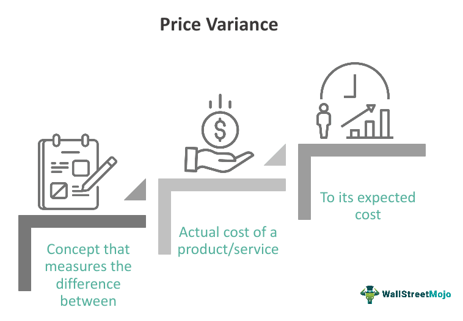

Algorithmic trading has fundamentally transformed the trading landscape. It offers investors the ability to automate trading decisions, thereby enhancing efficiency and precision. One of the most critical components in this domain is understanding and managing variances. Variance, a statistical measure that indicates the degree of variation or dispersion in a set of values, plays a significant role in assessing the risks and potential rewards associated with different trading strategies.

This article aims to provide a comprehensive exploration of cost analysis and price variance within algorithmic trading. By analyzing these components, traders can enhance their understanding of how they influence trading decisions and overall performance. Cost analysis is crucial as it involves evaluating the expenses related to executing trades, such as commission fees and slippage, which can significantly impact profitability.



Understanding and calculating variance can help in optimizing trading algorithms, which is vital for creating robust trading strategies. These calculations allow traders to anticipate potential market behavior, minimize risks, and align their strategies with their risk tolerance and investment goals. This is particularly useful for both new and seasoned traders looking to improve their strategies and investment outcomes.

Our goal is to provide insights that will guide traders at all experience levels. By focusing on variance and cost analysis, this article will highlight essential aspects that contribute to refining algorithmic trading strategies, ensuring traders can maintain a competitive advantage in the ever-evolving market landscape.

## Table of Contents

## Understanding Variance in Trading

Variance is a fundamental statistical measure used to quantify the degree of variation or dispersion within a dataset. In the context of trading, variance is crucial for evaluating the risk and volatility associated with an asset. It provides insight into how much the price of an asset fluctuates over a specified period, thereby influencing trading strategies and decisions.

In mathematical terms, variance ($\sigma^2$) is calculated as the average of the squared differences from the mean. For a dataset consisting of n values, $X_1, X_2, ..., X_n$, with a mean $\mu$, the variance $\sigma^2$ is computed as:

$$
\sigma^2 = \frac{1}{n}\sum_{i=1}^{n}(X_i - \mu)^2
$$

This formula captures the average of the squared deviations from the mean, offering a measure of how much the individual data points differ from the average value.

In trading, high variance indicates that the price of an asset is highly volatile and demonstrates significant fluctuations. This can imply a higher risk, as the asset's price is more unpredictable. Conversely, low variance suggests that the asset's price is stable and deviates less from the mean, indicating lower [volatility](/wiki/volatility-trading-strategies) and potentially lower risk.

For algorithm designers, incorporating variance into their models is essential for predicting market behavior accurately. By analyzing variance, traders and algorithm developers can better understand the potential risk associated with different trading strategies, thus helping in fine-tuning their algorithms to optimize performance. For instance, in high-variance markets, it might be more profitable to employ strategies that take advantage of rapid price movements, such as [momentum](/wiki/momentum) trading. On the other hand, in low-variance conditions, mean-reversion strategies might be more suitable.

Understanding the implications of variance also assists traders in aligning their strategies with their risk tolerance levels. Traders with a higher risk appetite might prefer trading in assets or employing strategies with higher variance to capitalize on significant price movements. In contrast, risk-averse traders may focus on assets and strategies characterized by lower variance to avoid excessive risk.

In summary, variance plays a critical role in assessing asset risk and volatility, shaping the design of [algorithmic trading](/wiki/algorithmic-trading) models. By calculating and interpreting variance, traders can develop strategies that align with the predicted market behavior and their risk preferences.

## Cost Analysis in Algo Trading

Cost analysis in algorithmic trading involves a thorough evaluation of the expenses incurred during trade execution. Understanding these costs is imperative, as they directly influence the profitability of trading strategies. The three primary cost components in algorithmic trading are commission fees, slippage, and market impact costs.

Commission fees are charges levied by brokers for executing trades. These fees can vary significantly depending on the broker and the [volume](/wiki/volume-trading-strategy) of trades conducted. While traditionally a significant expense, advancements in technology and increased competition among online brokerage firms have led to a reduction in commission fees, resulting in lower overall transaction costs for traders. For algorithmic traders, selecting a broker with competitive commission structures is essential to optimize trading costs.

Slippage refers to the difference between the expected price of a trade and the actual execution price. Slippage occurs when there is insufficient [liquidity](/wiki/liquidity-risk-premium) at the expected price level, causing the trade to be executed at a less favorable price. Minimizing slippage involves selecting the most appropriate trading time and employing algorithms designed to execute trades with minimal market impact. Advanced algorithms utilize sophisticated order routing mechanisms and market data analysis to predict and react to market movements, thereby reducing slippage.

Market impact cost is the adverse effect on the price of an asset resulting from the trade itself. Large trades can cause significant price movements, impacting the overall execution price. Algorithmic trading strategies that break down large orders into smaller, more manageable trades help mitigate this impact. This technique, often referred to as "order slicing," allows for gradual entry or [exit](/wiki/exit-strategy) in the market, reducing the risk of significant price deviations.

Technological advancements have significantly contributed to reducing these trading costs. High-frequency trading platforms and sophisticated order management systems enable traders to execute large volumes of trades quickly and efficiently. The integration of [artificial intelligence](/wiki/ai-artificial-intelligence) and [machine learning](/wiki/machine-learning) has further enhanced cost efficiency by improving trade prediction accuracy and execution speed. These technologies streamline the trading process, ultimately minimizing transaction costs and maximizing profitability.

Variance plays a critical role in determining the cost-effectiveness of trading strategies. In trading, variance reflects the degree of uncertainty or variation in asset prices. High variance can lead to increased costs due to unpredictable market movements, which can increase slippage and market impact. Therefore, understanding and managing variance is essential for developing cost-effective algorithmic trading strategies. Traders can employ volatility adjustments in their algorithms to anticipate and adapt to changing market conditions, thereby maintaining low transaction costs.

In conclusion, cost analysis in algorithmic trading encompasses an array of expenses that influence strategy profitability. By leveraging technological advancements and understanding the implications of variance, traders can minimize costs associated with commission fees, slippage, and market impact, thereby optimizing their trading strategies for maximum returns.

## Price Variance in Algo Trading

Price variance in algorithmic trading refers to the discrepancy between anticipated and actual asset prices. This variance is crucial for developing strategies that are both resilient and adaptable to market fluctuations. By comprehending price variances, traders can refine their algorithmic models to enhance performance and profitability.

Understanding price variance allows algorithm designers to forecast trading performance more accurately. A critical aspect of this is recognizing that variance quantifies the difference between expected market conditions and actual outcomes. High price variance can indicate market volatility, while low variance might suggest stability. Consequently, algorithms can be designed to adjust trading strategies based on these insights, improving decision-making and risk management.

To identify and mitigate price variance, traders employ several methods. Statistical measures like the standard deviation and variance itself are fundamental tools for assessing price variability. In algorithmic terms, the variance ($\sigma^2$) of an asset's price can be calculated using the formula:

$$
\sigma^2 = \frac{1}{N} \sum_{i=1}^{N} (x_i - \mu)^2
$$

where $N$ is the number of data points, $x_i$ represents each individual price, and $\mu$ is the mean price over the data set. This calculation helps in understanding the extent of deviations from the expected price.

Algorithmic strategies can be fine-tuned by continuously monitoring price variance and adapting trading rules accordingly. Machine learning techniques, including regression models and neural networks, are often employed to predict price movements and adjust trading algorithms dynamically. For example, a machine learning model might be trained on historical price data to recognize patterns and anticipate future variances, allowing for timely strategy adjustments.

Successful algo traders implement robust monitoring systems to track price variance. They utilize automated alerts to notify them of significant deviations, enabling swift responses. Moreover, advanced algorithms may incorporate real-time data processing to automatically recalibrate strategies when certain price variance thresholds are met. This capability is vital for maintaining competitiveness in fast-moving markets.

For instance, quant traders might deploy a mean-reversion strategy that buys assets when prices deviate below expected values and sells them when they rise above. This strategy assumes that prices will revert to their mean over time, capitalizing on temporary price anomalies. Through continuous analysis of price variance, traders can optimize such strategies, adjusting parameters in real time to account for changing market conditions.

In summary, handling price variance effectively is pivotal in crafting superior algorithmic trading strategies. By utilizing statistical tools and advanced algorithmic techniques, traders can mitigate risks and capitalize on market opportunities, ultimately enhancing their trading performance.

## Algorithmic Trading Strategies Incorporating Variance Analysis

Algorithmic trading strategies that incorporate variance analysis are pivotal for developing robust and adaptable trading models. Variance is a critical [factor](/wiki/factor-investing) in assessing the risk and potential profitability of these strategies, particularly when employing momentum, mean-reversion, and [arbitrage](/wiki/arbitrage) techniques.

Momentum strategies capitalize on the continuation of existing market trends. The basic premise involves buying assets that have shown upward price movement and selling those with declining prices. Variance analysis plays a crucial role here, as it helps in determining the strength and sustainability of the momentum. A high variance might indicate unpredictability in price movements, suggesting a cautious approach due to potential risk. Conversely, a modest variance can be interpreted as a favorable condition for momentum trading. An example Python snippet for a simple momentum strategy might look like this:

```python
import numpy as np

def calculate_momentum_variance(prices, window):
    returns = np.diff(prices)/prices[:-1]
    rolling_variance = np.var([returns[i:i+window] for i in range(len(returns) - window)], axis=1)
    return rolling_variance

prices = [100, 102, 105, 107, 110, 120, 125]
window = 3
momentum_variance = calculate_momentum_variance(prices, window)
```

Mean-reversion strategies, in contrast, assume that prices will revert to their historical mean over time. Here, variance analysis assists in identifying deviations from that mean and the likelihood of reversion. A high variance could be an indicator of substantial deviations, presenting lucrative opportunities for mean-reversion strategies once the asset's price starts returning to its average. 

Arbitrage strategies exploit price discrepancies across different markets or instruments. Variance analysis aids in detecting these discrepancies and assessing the risk associated with arbitrage opportunities. In markets where variance is high, price discrepancies might reflect broader market instability, necessitating careful analysis to avoid undue risk.

Backtesting is essential for any algorithmic strategy to account for variance effectively. By simulating the strategy's performance using historical data, traders can evaluate potential risks and returns under varying market conditions, which is critical for achieving stable and consistent results.

Adapting strategies to dynamic market conditions can be accomplished through continuous variance analysis. Traders must remain vigilant in monitoring changes in variance as market conditions evolve, adjusting strategies accordingly to mitigate risk and enhance performance. This adaptability ensures strategies remain effective even when market volatilities shift.

To illustrate practical applications, case studies of traders who have successfully integrated variance considerations demonstrate real-world utility. For example, a trader utilizing a variance-based momentum strategy might have capitalized on the consistent upward trends in tech stocks during a booming market phase, carefully adjusting positions as variance signal potential reversals.

In conclusion, incorporating variance analysis within algorithmic trading strategies enables traders to navigate market complexities more adeptly. By leveraging variance in momentum, mean-reversion, and arbitrage strategies, and emphasizing rigorous [backtesting](/wiki/backtesting) and adaptability, traders can enhance their decision-making frameworks, minimize risks, and uncover lucrative opportunities.

## Future Trends in Variance and Cost Analysis for Algo Trading

As technology advances, the landscape of variance and cost analysis in algorithmic trading continues to transform, driven by innovations in machine learning, artificial intelligence (AI), predictive analytics, and big data. These advancements promise to enhance the precision and efficiency of trading strategies, offering unprecedented opportunities for optimization.

Machine learning and AI are poised to significantly influence variance calculation and cost reduction in algorithmic trading. These technologies enable the development of sophisticated models that can analyze vast datasets to identify patterns and correlations that may not be immediately apparent to human analysts. By integrating machine learning algorithms, traders can enhance the accuracy of variance forecasts. For instance, machine learning models can be employed to dynamically adjust variance estimates based on real-time market data, providing more responsive and adaptive trading strategies. Moreover, AI-driven tools can optimize execution costs by predicting and minimizing slippage and other transaction fees, thereby boosting the net returns of trading portfolios.

Predictive analytics further refines trading strategies by leveraging historical data and statistical algorithms to forecast future market movements. This approach allows traders to anticipate volatility and price swings more effectively, thereby enabling the development of strategies that can adapt to market changes before they fully materialize. Predictive models can be incorporated into algorithmic frameworks to continuously monitor and adjust trading parameters, ensuring that strategies remain aligned with current market conditions and reducing the likelihood of adverse variance impacts on trading portfolios.

Big data plays a pivotal role in improving the accuracy of variance and cost analysis in algorithmic trading. The sheer volume and velocity of data generated in financial markets necessitate the use of advanced analytics technologies to process and interpret information in real-time. By harnessing big data technologies, traders can gain deeper insights into market behaviors and trends, allowing for a more comprehensive understanding of variance dynamics. Additionally, the integration of big data analytics facilitates enhanced risk management by providing a more granular view of potential market disruptions and their implications for trading strategies.

In conclusion, the integration of machine learning, AI, predictive analytics, and big data into variance and cost analysis is reshaping algorithmic trading. These technologies provide traders with sophisticated tools to enhance strategy precision, manage risks, and optimize costs, ensuring that they remain competitive in an increasingly complex trading environment. As these innovations continue to evolve, the potential for more intuitive and adaptive trading models that respond to real-time market changes becomes increasingly attainable, promising a future where algorithmic trading is both more efficient and more robust.

## Conclusion

Variance calculation and cost analysis are essential components in refining algorithmic trading strategies, acting as critical tools for enhancing both decision-making and investment outcomes. Through a comprehensive exploration of these concepts, their practical applications in the trading landscape become evident. By incorporating variance analysis, traders can achieve a nuanced understanding of market volatility and price fluctuations, thereby facilitating more informed and strategic decisions.

As this article has outlined, understanding and implementing variance analysis allows traders to better predict and respond to market conditions, minimizing risks and maximizing potential returns. The integration of cost analysis further supports this by helping traders identify and reduce unnecessary expenses, such as transaction fees and slippage, which can erode profits.

Traders are encouraged to continually adapt and integrate advanced variance analysis methods into their strategies. This could involve utilizing sophisticated statistical techniques or programming algorithms that can dynamically adjust to market conditions. For instance, leveraging Python for developing algorithms that consider variance adjustments can aid in optimizing strategy performance.

By staying informed about ongoing advancements in variance and cost analysis technologies, and by applying these insights to their trading practices, traders can maintain a competitive edge in the fast-evolving landscape of algorithmic trading. Embracing a proactive approach to learning and innovation will ensure that traders not only survive but thrive in this dynamic environment.

## References & Further Reading

[1]: Bergstra, J., Bardenet, R., Bengio, Y., & Kégl, B. (2011). ["Algorithms for Hyper-Parameter Optimization."](https://papers.nips.cc/paper/4443-algorithms-for-hyper-parameter-optimization) Advances in Neural Information Processing Systems 24.

[2]: ["Advances in Financial Machine Learning"](https://www.amazon.com/Advances-Financial-Machine-Learning-Marcos/dp/1119482089) by Marcos Lopez de Prado

[3]: ["Evidence-Based Technical Analysis: Applying the Scientific Method and Statistical Inference to Trading Signals"](https://www.amazon.com/Evidence-Based-Technical-Analysis-Scientific-Statistical/dp/0470008741) by David Aronson

[4]: ["Machine Learning for Algorithmic Trading"](https://github.com/stefan-jansen/machine-learning-for-trading) by Stefan Jansen

[5]: ["Quantitative Trading: How to Build Your Own Algorithmic Trading Business"](https://www.amazon.com/Quantitative-Trading-Build-Algorithmic-Business/dp/1119800064) by Ernest P. Chan