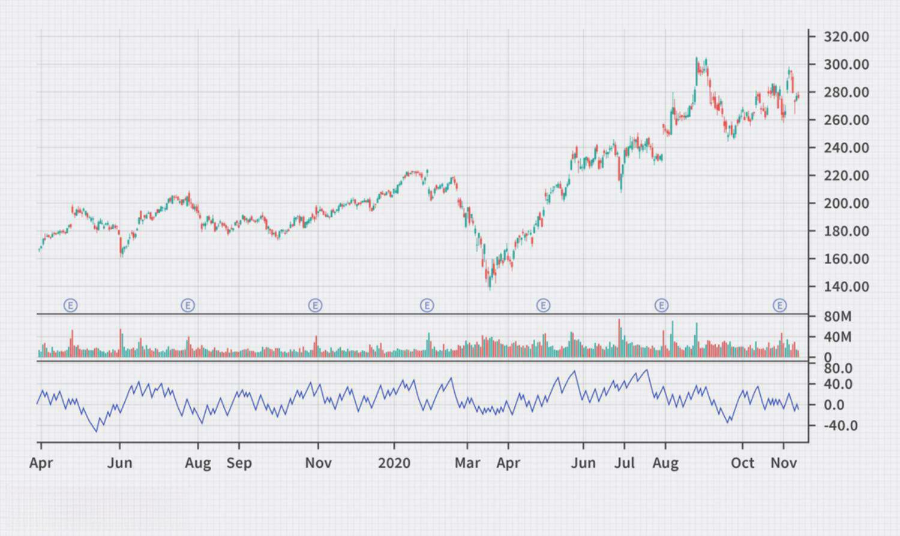

Trading indicators are essential tools in technical analysis, enabling traders to make informed decisions by interpreting market data. One such tool is the Price Zone Oscillator (PZO), which is particularly recognized for its effectiveness in identifying overbought or oversold conditions in the market. This article will provide a detailed examination of the Price Zone Oscillator and its relevance in algorithmic trading, discussing its formula, the insights it offers, and its limitations. Additionally, we will compare the PZO with other technical indicators to offer a broader perspective on its utility.

## Table of Contents



## Understanding the Price Zone Oscillator

The Price Zone Oscillator (PZO) is a technical indicator designed to assess the relationship between the current market price and its averaged historical prices. It plays a crucial role in helping traders identify potential buying or selling opportunities by highlighting overbought and oversold levels. The PZO operates on the principle that prices move in zones, and by analyzing these zones, traders can make informed trading decisions.

Traders utilize specific key levels within the PZO to gauge market conditions. For instance, levels such as 15, 40, and 60 are critical and commonly observed for potential buying signals. Conversely, levels like -5, -40, and -60 indicate potential selling signals. The significance of these levels lies in their ability to represent shifts in market momentum; when the PZO crosses these thresholds, it suggests a change in the current trend, prompting traders to consider entering or exiting positions.

A distinctive feature of the PZO is its integration with the Average Directional Index (ADX), which is used to assess the strength of a given price trend. By combining the PZO with the ADX, traders can not only determine the trend direction but also evaluate its magnitude and longevity. This combination allows for more precise timing of trades, as the PZO identifies points of possible market reversal while the ADX confirms the robustness of the trend.

Overall, the Price Zone Oscillator serves as a versatile tool for traders who seek to understand market dynamics through historical price comparisons. It provides actionable insights by revealing crucial levels where price movements might encounter resistance or support, aiding traders in optimizing their strategic approaches.

## Calculating the Price Zone Oscillator

The calculation of the Price Zone Oscillator (PZO) is a systematic process starting with the determination of the sign of price movement and followed by the computation of exponential moving averages (EMAs). This section outlines the key steps involved in calculating the PZO to assist traders in applying this indicator effectively.

To calculate the PZO, the following steps are typically undertaken:

1. **Determine the Sign of Price Movement**: Begin by assessing the direction of price changes. This could involve calculating the difference between consecutive closing prices to understand if the market is moving upwards or downwards.

2. **Calculate Exponential Moving Averages (EMAs)**:
   - Calculate the EMA of closing positions (CP). The closing position is the outcome of multiplying each closing price by the sign of its movement (positive for an increase, negative for a decrease).
   - Calculate the EMA of the total closes (TC) over the same period. The total closes simply refer to the summation of closing prices over the window period.

3. **Formulate the Price Zone Oscillator**: Once the EMAs are computed, the PZO can be defined using the formula:
$$
   \text{Price Zone Oscillator (PZO)} = 100 \times \left(\frac{\text{EMA of Closing Positions (CP)}}{\text{EMA of Total Closes (TC)}}\right)

$$
   The multiplication by 100 scales the oscillator, facilitating easier interpretation of the resulting values.

4. **Manual Calculation Example**:
   To manually calculate the EMA, it can be helpful to apply the following formula:
$$
   \text{EMA}_t = \alpha \times \text{Price}_t + (1 - \alpha) \times \text{EMA}_{t-1}

$$
   where $\alpha = \frac{2}{n+1}$ and $n$ is the number of periods. The initial EMA value can be the simple moving average of the first few periods.

   Applying these formulas, you can manually calculate the PZO over any dataset of historical prices by appropriately substituting the closing positions and total closes.

By following these steps, traders can compute the PZO to employ in their trading strategies. This indicator provides insights into market [momentum](/wiki/momentum) and potential buying or selling opportunities based on historical price data analyzed through EMAs.

## How the Price Zone Oscillator Informs Trading Decisions

The Price Zone Oscillator (PZO) serves as a significant tool for traders, offering valuable insights into potential market reversals and highlighting overbought or oversold conditions. The core functionality of the PZO revolves around its ability to signal trades by analyzing critical levels typically set between 100 and -100. When using PZO, traders focus on these levels to interpret buy or sell signals, which can drive informed trading decisions.

PZO utilizes exponential moving averages (EMAs) to smooth out price data, thereby minimizing the noise and making the signal indications more apparent. This smoothing effect is crucial because it helps in the identification of genuine momentum changes within the market, which might be obscured by the day-to-day [volatility](/wiki/volatility-trading-strategies) present in raw price data. By applying EMAs, the PZO ensures that the trends detected reflect more sustainable market movements rather than temporary fluctuations.

To capitalize on the insights provided by PZO, traders often combine it with complementary indicators such as the Average Directional Index (ADX). The ADX measures the strength of a prevailing trend, which allows traders to evaluate whether a detected momentum shift from the PZO is occurring within a strong trend. This combination can lead to more robust trading strategies by confirming the viability of a potential trade signaled by the PZO.

For example, if the PZO crosses above the -100 level while the ADX indicates a strong upward trend, a trader might consider this a signal to buy. Conversely, a PZO crossing below the 100 level in conjunction with a weak trend signal from the ADX might suggest an impending market reversal, prompting a sell decision. The distinction between confirmation and contradiction between PZO and ADX signals can enhance the accuracy of trade entries and exits, reducing the likelihood of premature or false trades.

The calculated integration of PZO with other indicators not only enhances trading strategy effectiveness but also quantifies trading decisions. Utilizing tools like PZO in this methodical way allows traders to harness their full potential, aligning trading decisions with statistical evidence and informed by market context. As such, PZO is a formidable asset in a trader’s toolkit, helping delineate the nuanced signals necessary for successful trading.

## Integrating PZO with Algorithmic Trading

Algorithmic trading, also known as algo trading, relies heavily on the ability to execute trades based on quantitative data and predefined rules. The Price Zone Oscillator (PZO) fits well within this framework by providing essential quantitative signals that inform trading decisions. The PZO's ability to generate automated buy or sell signals based on overbought or oversold conditions makes it a significant asset for algorithmic traders.

The core of integrating PZO into [algorithmic trading](/wiki/algorithmic-trading) lies in converting its signals into executable trading actions. This process involves setting up trading algorithms that monitor the PZO's critical levels and use these as triggers for buying or selling assets. The PZO typically oscillates between levels of 100 and -100, with key thresholds such as 15, 40, 60, -5, -40, and -60 offering potential buy or sell signals depending on the direction of the crossing. 

To incorporate PZO into a trading algorithm, traders could implement a Python script using popular libraries like Pandas and Numpy for data analysis, and a trading platform's API for trade execution. For example, a basic implementation might monitor PZO values and execute trades when certain conditions are met:

```python
import pandas as pd
import numpy as np

def calculate_pzo(prices):
    # Implement the PZO calculation here
    return pzo_values

def trading_strategy(prices):
    pzo_values = calculate_pzo(prices)
    buy_signals = pzo_values[(pzo_values < -40) | (pzo_values < -60)]
    sell_signals = pzo_values[(pzo_values > 40) | (pzo_values > 60)]

    # Example logic: Buy when the PZO crosses critical thresholds downwards,
    # Sell when it crosses upwards
    for i in range(1, len(pzo_values)):
        if pzo_values[i-1] <= -40 and pzo_values[i] > -40:
            print("Buy signal at index", i)
        elif pzo_values[i-1] >= 40 and pzo_values[i] < 40:
            print("Sell signal at index", i)

# Example usage with historical price data
prices = pd.Series([...])
trading_strategy(prices)
```

The integration of PZO with algorithmic trading also extends to combining it with other indicators to create more refined strategies. For instance, pairing PZO with the Average Directional Index (ADX) can enhance the strength validation of trends, thereby improving the robustness of the trading strategy by filtering out weaker signals.

By incorporating PZO into algorithmic frameworks, traders benefit from the automation of signal processing and the speed of trade execution. This allows for the elimination of emotional bias, consistency in trading decisions, and the ability to handle large volumes of trades efficiently. However, it is crucial to consistently monitor and optimize these algorithms for changing market conditions to maintain their effectiveness. Overall, with careful integration, PZO serves as a valuable tool in the toolbox of algorithmic traders, enhancing their strategies and contributing to more informed trading decisions.

## Comparing Price Zone Oscillator with Other Indicators

The Price Zone Oscillator (PZO) and the Relative Strength Index (RSI) are both popular momentum indicators utilized by traders to assess market conditions, but they employ different calculations and perspectives. Understanding these differences is crucial for traders who wish to optimize their technical analysis.

The PZO is computed by comparing the exponential moving averages of closing positions (CP) and total closes (TC). It captures price movements over different timeframes, providing insights into buying or selling pressure in the market. A typical formula is:

$$
\text{PZO} = 100 \times \frac{\text{EMA of CP}}{\text{EMA of TC}}
$$

In contrast, the RSI is designed to evaluate the speed and change of price movements. It measures the strength of recent gains against the strength of recent losses over a specified period, often 14 days, providing a value between 0 and 100. The RSI formula is:

$$
\text{RSI} = 100 - \left(\frac{100}{1 + \frac{\text{Average Gain}}{\text{Average Loss}}} \right)
$$

Distinctively, RSI is known for its ability to identify overbought or oversold conditions with fixed thresholds, typically around 70 and 30, respectively. On the other hand, the PZO lacks fixed thresholds and is more interpretable through crossing of specific levels like 15, 40, 60, -5, -40, and -60.

When using these indicators together, traders can exploit their complementary nature. While the RSI provides a more straightforward approach to identifying momentum extremes, the PZO can offer a nuanced view of price movements relative to historical averages. Combining these tools enables traders to leverage the immediate momentum insights from RSI with the broader trend perspective afforded by PZO, balancing the strengths of both methods to achieve comprehensive market analysis.

In applying both PZO and RSI in trading strategies, traders are equipped to filter false signals from each indicator, benefiting from a more robust assessment of trading conditions. This synergy can help predict potential price reversals more accurately and define optimal entry and [exit](/wiki/exit-strategy) points in trades.

## Limitations of the Price Zone Oscillator

While the Price Zone Oscillator (PZO) is a valuable instrument in the trader's toolkit, providing insights into market momentum and potential reversal points, it has several inherent limitations that traders need to consider for effective use.

Firstly, the PZO tends to generate significant activity around the zero line. This can lead to frequent signals that might not always correspond to meaningful market movements. The high sensitivity near the zero line can sometimes result in whipsaws, where the indicator frequently crosses above and below the line without providing clear trading signals. Such false signals can lead to indecisive trading decisions unless carefully managed.

As a lagging indicator, the PZO depends on historical price data to generate its signals. This reliance implies that the PZO might react slower to market changes compared to leading indicators. The inherent latency means it may not always provide timely entry or exit points in rapidly changing markets. Traders should acknowledge that a lagging indicator like the PZO reflects past price conditions; therefore, it should ideally be complemented by leading indicators or other analytical tools to mitigate delayed responses and enhance signal reliability.

To address these limitations, traders can develop strategies that incorporate other indicators to confirm PZO-generated signals. For instance, coupling PZO with [volume](/wiki/volume-trading-strategy) analysis or pattern recognition can provide additional context that aids signal validation. Furthermore, adjusting the sensitivity of the PZO by modifying its parameters could reduce false signals, though this might require [backtesting](/wiki/backtesting) to ensure robustness across different market conditions.

In summary, while the PZO can be an effective tool for identifying potential overbought or oversold conditions, its limitations necessitate a cautious approach. By acknowledging its tendencies for frequent zero-line activity and its reliance on past data, traders can devise strategies that exploit the PZO's strengths while compensating for its weaknesses to enhance market predictions.

## Conclusion

The Price Zone Oscillator (PZO) serves as a versatile technical tool in identifying market trends and potential reversals. By assessing price movements against historical averages, PZO provides critical signals that can inform trading decisions. Particularly in the landscape of algorithmic trading, the integration of PZO can significantly enhance systematic decision-making processes. Its ability to automate buy and sell signals based on quantitative data makes it a valuable component in algorithmic strategies.

Despite its advantages, caution is warranted when employing PZO due to its limitations. As a lagging indicator, PZO relies on historical data, which can lead to challenges in real-time market interpretation. Additionally, its propensity to fluctuate around the zero line necessitates careful analysis to avoid misinterpretation of signals.

To mitigate these limitations, traders are encouraged to combine PZO with other indicators. For instance, merging it with momentum indicators like the Relative Strength Index (RSI) can provide a more comprehensive market analysis. This multi-indicator approach allows traders to develop robust trading strategies that capitalize on the strengths of each tool while maximizing algorithmic efficiency.

Through this article, we have offered a comprehensive examination of the PZO, equipping traders with a foundational understanding necessary for its effective application in trading. By leveraging the insights gained from PZO alongside other analytical tools, traders can enhance their market entry and exit strategies, ultimately improving their trading outcomes.

## References & Further Reading

[1]: Bergstra, J., Bardenet, R., Bengio, Y., & Kégl, B. (2011). ["Algorithms for Hyper-Parameter Optimization."](https://dl.acm.org/doi/10.5555/2986459.2986743) Advances in Neural Information Processing Systems 24.

[2]: ["Advances in Financial Machine Learning"](https://www.amazon.com/Advances-Financial-Machine-Learning-Marcos/dp/1119482089) by Marcos Lopez de Prado

[3]: ["Evidence-Based Technical Analysis: Applying the Scientific Method and Statistical Inference to Trading Signals"](https://www.amazon.com/Evidence-Based-Technical-Analysis-Scientific-Statistical/dp/0470008741) by David Aronson

[4]: ["Machine Learning for Algorithmic Trading"](https://github.com/stefan-jansen/machine-learning-for-trading) by Stefan Jansen

[5]: ["Quantitative Trading: How to Build Your Own Algorithmic Trading Business"](https://www.amazon.com/Quantitative-Trading-Build-Algorithmic-Business/dp/1119800064) by Ernest P. Chan