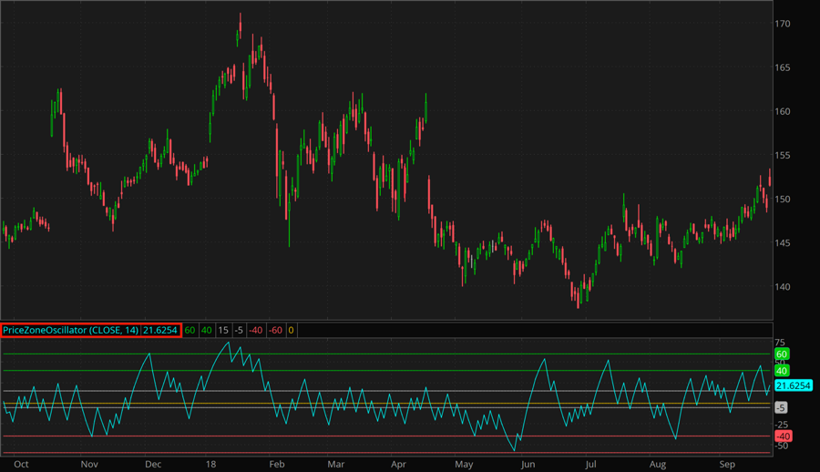

## Table of Contents

## What is a Price Zone Oscillator (PZO) and what is its basic purpose?

A Price Zone Oscillator (PZO) is a technical analysis tool used by traders to understand the momentum of a financial asset's price. It helps traders see if the price is going up or down strongly, or if it's just moving sideways. The PZO is calculated by comparing the current price of an asset to its price over a certain period in the past. This comparison helps create a visual representation that traders can use to make decisions.

The basic purpose of the PZO is to help traders spot potential buying or selling opportunities. When the PZO line moves above zero, it suggests that the price is gaining upward momentum, which might be a good time to buy. On the other hand, if the PZO line drops below zero, it indicates that the price is losing momentum and might be a good time to sell. By using the PZO, traders can get a clearer picture of market trends and make more informed trading choices.

## How does the Price Zone Oscillator differ from other oscillators like the RSI or MACD?

The Price Zone Oscillator (PZO) differs from other oscillators like the Relative Strength Index (RSI) and the Moving Average Convergence Divergence (MACD) in how it calculates and presents its data. The PZO focuses on the difference between the current price and a historical price over a set period, giving traders a clear view of momentum. It uses a simple formula that compares the current price to a past price, often over 14 periods, to generate a line that oscillates around zero. This makes it easy to see when the price is gaining or losing momentum.

In contrast, the RSI measures the speed and change of price movements on a scale from 0 to 100. It helps traders identify overbought or oversold conditions, which can signal potential reversals. The RSI is calculated using the average gain and loss over a period, typically 14 days, and is more focused on the internal strength of the price movement. On the other hand, the MACD uses the difference between two moving averages to show momentum. It consists of the MACD line, a signal line, and a histogram, providing a more complex view of momentum and trend changes compared to the PZO's straightforward approach.

Overall, while the PZO, RSI, and MACD all aim to help traders understand momentum, they do so in different ways. The PZO is simpler and more direct, focusing on the price difference over time. The RSI looks at the internal strength of price movements and is useful for spotting overbought or oversold conditions. The MACD provides a more detailed analysis by using moving averages and can be more effective for identifying trend changes and crossovers. Each tool has its strengths, and traders often use them together to get a fuller picture of the market.

## Can you explain the calculation method used to construct the Price Zone Oscillator?

The Price Zone Oscillator (PZO) is calculated by comparing the current price of a financial asset to its price over a certain period in the past. The most common period used is 14 days, but traders can choose any number of periods that suits their analysis. To calculate the PZO, you first find the difference between the current closing price and the closing price from 14 periods ago. This difference is then divided by the closing price from 14 periods ago. The result is then multiplied by 100 to convert it into a percentage. This percentage is the PZO value.

Once you have the PZO value, you plot it on a chart. The PZO line will oscillate around zero. When the PZO line is above zero, it means the current price is higher than it was 14 periods ago, suggesting upward momentum. When the PZO line is below zero, it indicates the current price is lower than it was 14 periods ago, suggesting downward momentum. By looking at how the PZO line moves over time, traders can get a sense of the strength and direction of the price momentum.

## What are the key components of the PZO and how do they interact?

The Price Zone Oscillator (PZO) has two main parts: the current price and the price from a set number of periods ago, often 14 days. To find the PZO value, you subtract the old price from the current price, then divide that by the old price, and finally multiply by 100 to get a percentage. This percentage shows how much the price has changed over that time. The PZO value is then plotted on a chart where it moves around a zero line.

The way the PZO works is simple. If the PZO value is above zero, it means the current price is higher than it was 14 periods ago, showing that the price has upward momentum. If the PZO value is below zero, it means the current price is lower, showing downward momentum. Traders watch the PZO line to see if it's going up or down, helping them decide when to buy or sell. The interaction between the current price and the old price in the PZO helps traders understand the strength and direction of price movements over time.

## How can traders use the Price Zone Oscillator to identify potential buy and sell signals?

Traders use the Price Zone Oscillator (PZO) to spot good times to buy or sell by watching how the PZO line moves around the zero line. When the PZO line crosses above zero, it means the price is higher than it was 14 days ago, which suggests the price is gaining upward momentum. This can be a sign for traders to consider buying because the price might keep going up. On the other hand, when the PZO line crosses below zero, it means the price is lower than it was 14 days ago, showing downward momentum. This could be a signal for traders to think about selling because the price might keep falling.

Traders also look at the strength of the PZO line's movement to get more clues. If the PZO line is moving far above zero, it shows strong upward momentum, which might mean a good time to buy. If it's moving far below zero, it shows strong downward momentum, suggesting a good time to sell. By watching these movements, traders can make better decisions on when to enter or exit the market, helping them take advantage of price trends.

## What are the typical settings for the Price Zone Oscillator and how can they be adjusted for different trading strategies?

The typical setting for the Price Zone Oscillator (PZO) is 14 periods. This means the PZO compares the current price to the price 14 days ago. Traders often use this setting because it gives a good balance between being sensitive to price changes and showing clear trends. But, the number of periods can be changed to fit different trading strategies. If you want to catch quick changes in the market, you might use a smaller number of periods, like 7 or 10. This makes the PZO more sensitive and can help you see short-term trends.

For traders who want to see longer trends, using a larger number of periods, like 20 or 30, can be better. This makes the PZO less sensitive to daily ups and downs and helps focus on bigger price movements over time. By adjusting the number of periods, traders can tailor the PZO to match their trading style, whether they are looking to make quick trades or hold onto investments for a longer time.

## How does the PZO help in identifying overbought and oversold market conditions?

The Price Zone Oscillator (PZO) helps traders see if a market is overbought or oversold by showing how the price has changed over time. When the PZO line moves far above zero, it means the price has gone up a lot compared to 14 days ago. This can be a sign that the market is overbought, which means the price might have risen too fast and could soon start to fall. Traders might see this as a signal to sell or be careful about buying more.

On the other hand, when the PZO line drops far below zero, it shows that the price has gone down a lot compared to 14 days ago. This can indicate that the market is oversold, meaning the price might have dropped too much and could start to go back up soon. Traders might see this as a good time to buy or at least not to sell more. By watching where the PZO line is, traders can get a sense of when the market might be ready for a change in direction.

## What are some common trading strategies that incorporate the Price Zone Oscillator?

Traders often use the Price Zone Oscillator (PZO) to help them decide when to buy or sell. One common strategy is to buy when the PZO line crosses above zero. This means the price is higher than it was 14 days ago, suggesting the price might keep going up. Traders might buy at this point, hoping to ride the upward trend. On the other hand, they might sell when the PZO line crosses below zero, as this shows the price is lower than it was 14 days ago, and it might keep falling. This simple strategy helps traders catch the start of new trends.

Another strategy involves looking at how far the PZO line moves from zero. If the PZO line goes very high above zero, it might mean the market is overbought, and the price could soon drop. Traders might sell at this point to avoid a fall in price. If the PZO line goes very low below zero, it might mean the market is oversold, and the price could soon rise. Traders might buy at this point, hoping to catch the price as it starts to go back up. By watching these extreme movements, traders can try to buy low and sell high.

Some traders also use the PZO along with other tools like moving averages or the RSI to make better decisions. For example, they might wait for the PZO to cross above zero and also for a moving average to start going up before they buy. This can give them more confidence that the price will keep rising. By combining the PZO with other indicators, traders can create more detailed strategies that fit their trading style and goals.

## Can the Price Zone Oscillator be used effectively in different market conditions, such as trending versus ranging markets?

The Price Zone Oscillator (PZO) can be used effectively in different market conditions, including both trending and ranging markets. In a trending market, where prices are moving clearly in one direction, the PZO helps traders spot the start and strength of the trend. When the PZO line crosses above zero, it signals that the price is higher than it was 14 days ago, which can be a good time to buy if the trend is upward. If the PZO line stays far above zero, it shows strong upward momentum, helping traders stay in the trade longer. On the other hand, when the PZO line crosses below zero, it suggests the price is lower than it was 14 days ago, which can be a good time to sell if the trend is downward. By watching these signals, traders can follow the trend and make better trading decisions.

In a ranging market, where prices move sideways without a clear trend, the PZO can help traders identify overbought and oversold conditions. When the PZO line moves far above zero, it might mean the market is overbought, and the price could soon drop. Traders might see this as a signal to sell or avoid buying more. When the PZO line drops far below zero, it might mean the market is oversold, and the price could soon rise. Traders might see this as a good time to buy or at least not to sell more. By using the PZO to spot these conditions, traders can take advantage of small price movements within the range, buying low and selling high as the price oscillates.

## What are the limitations of the Price Zone Oscillator and how can they impact trading decisions?

The Price Zone Oscillator (PZO) has some limitations that traders need to know about. One big limitation is that it can give false signals. Sometimes the PZO line might cross above or below zero, but the price doesn't keep moving in that direction. This can trick traders into buying or selling at the wrong time, leading to losses. Another limitation is that the PZO is based on a set number of periods, usually 14 days. If the market changes quickly, the PZO might not catch these fast changes, making it less useful for traders who want to react quickly to new information.

Another issue with the PZO is that it works best in certain market conditions. In a market that's moving sideways, the PZO can help find overbought and oversold times. But in a market that's going up or down strongly, the PZO might not give the best signals because it's not as good at following big trends. Traders need to be careful and use other tools along with the PZO to make better choices. By understanding these limitations, traders can avoid relying too much on the PZO and use it as part of a bigger plan to make smarter trades.

## How can the Price Zone Oscillator be combined with other technical indicators to improve trading accuracy?

Traders can use the Price Zone Oscillator (PZO) along with other tools like moving averages to make better trading choices. For example, if the PZO line crosses above zero, showing that the price is higher than it was 14 days ago, traders might wait for a short-term moving average to cross above a long-term moving average too. This double check can give them more confidence that the price will keep going up, making it a good time to buy. On the other hand, if the PZO line crosses below zero and a short-term moving average crosses below a long-term moving average, it might be a good time to sell because the price could keep falling.

Another way to use the PZO with other indicators is to combine it with the Relative Strength Index (RSI). The RSI helps traders see if a market is overbought or oversold. If the PZO line moves far above zero and the RSI is over 70, it might mean the market is overbought and the price could soon drop. Traders might see this as a signal to sell or be careful about buying more. If the PZO line drops far below zero and the RSI is below 30, it might mean the market is oversold and the price could soon rise. Traders might see this as a good time to buy. By using the PZO along with other indicators, traders can get a fuller picture of the market and make more accurate trading decisions.

## What advanced techniques can experienced traders use to refine their use of the Price Zone Oscillator?

Experienced traders can refine their use of the Price Zone Oscillator (PZO) by adjusting the number of periods used in the calculation. Instead of sticking with the standard 14 periods, they might try different numbers to see which works best for their trading style. For example, using fewer periods like 7 or 10 can make the PZO more sensitive to quick price changes, which is good for short-term trading. Using more periods like 20 or 30 can help focus on longer trends, which is better for traders who hold onto their investments for a longer time. By experimenting with these settings, traders can find the right balance that fits their strategy and helps them catch the best trading opportunities.

Another advanced technique is to use the PZO with other technical indicators in a more detailed way. Traders might set up rules where they only take action when both the PZO and another indicator, like the Moving Average Convergence Divergence (MACD), give the same signal. For instance, they might buy when the PZO crosses above zero and the MACD line crosses above its signal line at the same time. This can help filter out false signals and make their trading decisions more accurate. Additionally, traders can use the PZO to spot divergences, where the price moves in one direction but the PZO moves in the opposite direction. This can be a strong sign that the current price trend might be weakening and could reverse soon, giving traders a chance to get ahead of the market.

## How do you calculate the Price Zone Oscillator?

The calculation of the Price Zone Oscillator (PZO) is a systematic process starting with the determination of the sign of price movement and followed by the computation of exponential moving averages (EMAs). This section outlines the key steps involved in calculating the PZO to assist traders in applying this indicator effectively.

To calculate the PZO, the following steps are typically undertaken:

1. **Determine the Sign of Price Movement**: Begin by assessing the direction of price changes. This could involve calculating the difference between consecutive closing prices to understand if the market is moving upwards or downwards.

2. **Calculate Exponential Moving Averages (EMAs)**:
   - Calculate the EMA of closing positions (CP). The closing position is the outcome of multiplying each closing price by the sign of its movement (positive for an increase, negative for a decrease).
   - Calculate the EMA of the total closes (TC) over the same period. The total closes simply refer to the summation of closing prices over the window period.

3. **Formulate the Price Zone Oscillator**: Once the EMAs are computed, the PZO can be defined using the formula:
$$
   \text{Price Zone Oscillator (PZO)} = 100 \times \left(\frac{\text{EMA of Closing Positions (CP)}}{\text{EMA of Total Closes (TC)}}\right)

$$
   The multiplication by 100 scales the oscillator, facilitating easier interpretation of the resulting values.

4. **Manual Calculation Example**:
   To manually calculate the EMA, it can be helpful to apply the following formula:
$$
   \text{EMA}_t = \alpha \times \text{Price}_t + (1 - \alpha) \times \text{EMA}_{t-1}

$$
   where $\alpha = \frac{2}{n+1}$ and $n$ is the number of periods. The initial EMA value can be the simple moving average of the first few periods.

   Applying these formulas, you can manually calculate the PZO over any dataset of historical prices by appropriately substituting the closing positions and total closes.

By following these steps, traders can compute the PZO to employ in their trading strategies. This indicator provides insights into market [momentum](/wiki/momentum) and potential buying or selling opportunities based on historical price data analyzed through EMAs.

## How does the Price Zone Oscillator compare with other indicators?

The Price Zone Oscillator (PZO) and the Relative Strength Index (RSI) are both popular momentum indicators utilized by traders to assess market conditions, but they employ different calculations and perspectives. Understanding these differences is crucial for traders who wish to optimize their technical analysis.

The PZO is computed by comparing the exponential moving averages of closing positions (CP) and total closes (TC). It captures price movements over different timeframes, providing insights into buying or selling pressure in the market. A typical formula is:

$$
\text{PZO} = 100 \times \frac{\text{EMA of CP}}{\text{EMA of TC}}
$$

In contrast, the RSI is designed to evaluate the speed and change of price movements. It measures the strength of recent gains against the strength of recent losses over a specified period, often 14 days, providing a value between 0 and 100. The RSI formula is:

$$
\text{RSI} = 100 - \left(\frac{100}{1 + \frac{\text{Average Gain}}{\text{Average Loss}}} \right)
$$

Distinctively, RSI is known for its ability to identify overbought or oversold conditions with fixed thresholds, typically around 70 and 30, respectively. On the other hand, the PZO lacks fixed thresholds and is more interpretable through crossing of specific levels like 15, 40, 60, -5, -40, and -60.

When using these indicators together, traders can exploit their complementary nature. While the RSI provides a more straightforward approach to identifying momentum extremes, the PZO can offer a nuanced view of price movements relative to historical averages. Combining these tools enables traders to leverage the immediate momentum insights from RSI with the broader trend perspective afforded by PZO, balancing the strengths of both methods to achieve comprehensive market analysis.

In applying both PZO and RSI in trading strategies, traders are equipped to filter false signals from each indicator, benefiting from a more robust assessment of trading conditions. This synergy can help predict potential price reversals more accurately and define optimal entry and [exit](/wiki/exit-strategy) points in trades.

## References & Further Reading

[1]: Bergstra, J., Bardenet, R., Bengio, Y., & Kégl, B. (2011). ["Algorithms for Hyper-Parameter Optimization."](https://dl.acm.org/doi/10.5555/2986459.2986743) Advances in Neural Information Processing Systems 24.

[2]: ["Advances in Financial Machine Learning"](https://www.amazon.com/Advances-Financial-Machine-Learning-Marcos/dp/1119482089) by Marcos Lopez de Prado

[3]: ["Evidence-Based Technical Analysis: Applying the Scientific Method and Statistical Inference to Trading Signals"](https://www.amazon.com/Evidence-Based-Technical-Analysis-Scientific-Statistical/dp/0470008741) by David Aronson

[4]: ["Machine Learning for Algorithmic Trading"](https://github.com/stefan-jansen/machine-learning-for-trading) by Stefan Jansen

[5]: ["Quantitative Trading: How to Build Your Own Algorithmic Trading Business"](https://www.amazon.com/Quantitative-Trading-Build-Algorithmic-Business/dp/1119800064) by Ernest P. Chan