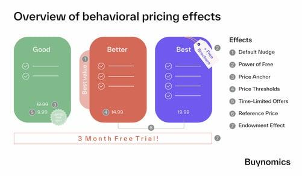

## Table of Contents

## What is behavioral economics?

Behavioral economics is a field that combines psychology and economics to understand how people make choices. It looks at why people sometimes make decisions that don't seem to make sense, like choosing a smaller reward now instead of a bigger one later. By studying these behaviors, experts can help people make better choices.

This field challenges the traditional idea that people always make rational decisions. Instead, it shows that emotions, biases, and other mental shortcuts can influence our choices. For example, people might spend more money if a product is on sale, even if they don't need it, just because it feels like a good deal. Understanding these patterns helps in designing better policies and products that guide people towards more beneficial decisions.

## How does pricing affect consumer behavior?

Pricing can really change how people decide to buy things. When something is priced lower, more people might want to buy it because it feels like a good deal. But if the price is too high, people might think it's too expensive and not buy it at all. Sometimes, stores use sales and discounts to make people feel like they're saving money, which can make them buy more than they planned.

Another way pricing affects people is through something called 'price anchoring.' This is when a store shows a higher original price next to a lower sale price. Seeing the higher price first makes the sale price seem like a better deal, even if it's still expensive. This trick can make people feel good about buying something they might not have bought otherwise. So, pricing isn't just about the numbers; it's about how those numbers make people feel and decide.

## What does it mean to be 'priced out' in the context of behavioral economics?

When someone is 'priced out,' it means they can't afford something because the price is too high for them. In behavioral economics, this idea shows how prices can affect what people do and choose. If the price of something important, like a house or healthcare, goes up a lot, people might have to give up on buying it. They might feel frustrated or stressed because they can't get what they need.

This situation can also change how people behave in other ways. For example, if someone is priced out of their neighborhood because rent is too high, they might have to move to a cheaper area. This can change their daily life, like where they work or go to school. Behavioral economics helps us understand these choices and feelings, and how prices can push people to do things they might not want to do.

## Can you explain the concept of price sensitivity?

Price sensitivity means how much the price of something affects whether people will buy it. If people are very sensitive to price, a small change in price can make them decide to buy or not buy something. For example, if a store raises the price of a soda by just a little bit, people might choose not to buy it if they think it's too expensive now.

On the other hand, if people are not very sensitive to price, they might still buy something even if the price goes up a lot. This can happen with things people really need or want, like medicine or a favorite brand of chocolate. Understanding price sensitivity helps businesses set prices in a way that keeps people buying their products without losing too much money.

## How do psychological pricing strategies impact the feeling of being priced out?

Psychological pricing strategies can make people feel like they are being priced out, even if the actual prices haven't changed much. For example, when stores use a high original price and then show a lower sale price next to it, it's called price anchoring. This can trick people into thinking the sale price is a good deal, but if the sale price is still too high for them, they might feel left out because they can't afford it. It's like the store is saying, "Look at this great deal!" but the deal is still out of reach for some people.

These strategies can also make people feel more frustrated if they see prices going up and down a lot. When prices keep changing, it can be hard for people to know if they're getting a good deal or if they're just being tricked into thinking they are. If someone really wants to buy something but the price keeps going up, they might feel like they're being pushed away from buying it. This can make them feel priced out, even if the final price isn't that different from what it was before.

## What role does income disparity play in being priced out?

Income disparity means that some people have a lot more money than others. When prices go up, people with less money feel it more because they can't afford to pay more. If the price of something important, like rent or food, goes up, people with lower incomes might have to stop buying it. This makes them feel priced out because they can't keep up with the costs.

This problem is bigger when there's a big gap between rich and poor. When prices rise, rich people might not even notice, but for poor people, it can mean they can't afford basic things they need. This can make them feel left out and stressed because they see others buying things they can't. So, income disparity makes the feeling of being priced out much stronger for those who don't have much money.

## How do companies use behavioral economics to set prices that might lead to consumers feeling priced out?

Companies use behavioral economics to set prices in ways that might make some people feel priced out. They do this by using tricks like showing a high original price next to a lower sale price, which is called price anchoring. This makes the sale price seem like a good deal, but if the sale price is still too high for some people, they might feel left out because they can't afford it. Companies also use something called dynamic pricing, where prices change based on how much people want to buy something or how much they can afford. This can make prices go up and down a lot, which can be confusing and frustrating for people with less money, making them feel like they can't keep up with the costs.

Another way companies use behavioral economics is by setting prices that seem to target certain groups of people. For example, they might raise the price of a product that people with more money are likely to buy, knowing that those with less money won't be able to afford it. This can make people with lower incomes feel like they are being pushed away from buying things they might want or need. By understanding how people think and feel about prices, companies can set them in a way that makes some people feel priced out, even if the actual prices haven't changed much.

## What are some common behavioral biases that influence perceptions of being priced out?

One common behavioral bias that influences perceptions of being priced out is the anchoring effect. This happens when people see a high original price next to a lower sale price. The high price makes the sale price seem like a good deal, but if the sale price is still too high for someone, they might feel left out. They think they're missing out on a good deal, even if the sale price is still too expensive for them.

Another bias is loss aversion, where people feel the pain of losing something more than the joy of gaining something. If prices go up, people might feel like they're losing the ability to buy things they used to afford. This can make them feel priced out, even if the price increase is small. They focus more on what they're losing than on what they can still afford.

A third bias is the endowment effect, where people value something more if they own it or feel like it's theirs. If prices rise and people can't afford to keep something they feel belongs to them, like their home or a regular purchase, they might feel strongly priced out. This feeling can be even stronger because they think they're losing something they already consider theirs.

## How can understanding loss aversion help in analyzing the phenomenon of being priced out?

Loss aversion is when people feel the pain of losing something more than the joy of gaining something. When prices go up, people might feel like they are losing the ability to buy things they used to afford. This feeling can make them think they are being priced out, even if the price increase is small. They focus more on what they are losing than on what they can still afford. For example, if the price of a favorite snack goes up a little bit, someone might feel like they can't enjoy it anymore, even though they could still buy other snacks.

Understanding loss aversion helps us see why people feel priced out. It's not just about the money; it's about how they feel about losing what they had. When people feel they are losing things they value, like their home or regular purchases, the feeling of being priced out becomes stronger. This can lead to stress and frustration, making people feel left out of the things they used to enjoy or need. By knowing this, we can better understand and help people who feel priced out because of rising prices.

## What empirical studies have been conducted on the effects of pricing strategies on different socioeconomic groups?

Researchers have done many studies to see how different pricing strategies affect people from different income levels. One big study looked at how dynamic pricing, where prices change based on demand, affects people. They found that people with less money are more likely to feel left out when prices go up a lot because they can't afford to buy things anymore. This study showed that when stores change prices a lot, it can make people with lower incomes feel priced out more than those with more money.

Another study focused on how sales and discounts affect different groups. It found that people with lower incomes are more likely to buy things during sales because they feel like they're saving money. But if the sale price is still too high, they might still feel priced out. This study showed that while sales can help people with less money buy things they need, it can also make them feel frustrated if they can't afford the sale price. Understanding these effects helps companies and policymakers make better choices about pricing to help everyone, not just those with more money.

## How can policy interventions based on behavioral economics principles address the issue of being priced out?

Policy interventions can use ideas from behavioral economics to help people who feel priced out. One way is by making sure prices are clear and easy to understand. When prices are confusing or change a lot, it can make people feel left out, especially if they don't have a lot of money. By keeping prices steady and showing them clearly, people can better plan their spending and feel less stressed about buying things they need.

Another way is by using nudges, which are small changes that help people make better choices. For example, a policy could offer discounts or subsidies for important things like healthcare or housing to people with lower incomes. This can help them afford these things without feeling priced out. By understanding how people think and feel about prices, policies can be made to help everyone, not just those with more money, feel included and able to buy what they need.

## What are the future research directions in the field of pricing and behavioral economics related to being priced out?

Future research in pricing and behavioral economics could look more into how different groups of people feel about prices. Researchers might study how people from different income levels react to things like sales, discounts, and price changes. They could also look at how people's feelings and choices change over time as prices go up or down. This would help us understand better why some people feel left out when prices change and what can be done to help them.

Another important area for future studies is finding new ways to use behavioral economics to make prices fairer for everyone. Researchers could test new pricing strategies that help people with less money feel less priced out. They might look at how different policies, like subsidies or clear pricing, can make a difference. By doing this, they can find the best ways to help people feel included and able to buy what they need, no matter how much money they have.

## What are the Dynamics of Being Priced Out?

The concept of being "priced out" refers to the inability of individuals to afford a product or service because of rising costs. In financial markets, this scenario often emerges due to several contributing factors such as wage stagnation and excessive market speculation. Wage stagnation occurs when the growth of wages fails to keep pace with inflation, leading to diminished purchasing power. This lag means that even moderate price increases can disproportionally affect those with stagnant incomes, resulting in them being priced out.

Excessive market speculation is another [factor](/wiki/factor-investing) that can lead to being priced out. It occurs when traders and investors drive up prices based on speculation rather than intrinsic value, causing asset prices to inflate beyond reasonable levels. This is prevalent in real estate markets where speculation may result in prices that far exceed the sustainable income levels of average buyers, thereby excluding them from the market.

Behavioral economics provides a framework for understanding how price increases affect perceived value and decision-making processes. Cognitive biases, such as anchoring, influence how individuals assess value in the context of rising prices. For instance, potential buyers may anchor to past prices as a baseline, unwilling or unable to adapt to new pricing realities, thus finding themselves priced out.

Traders and market participants must grasp the concept of elasticity of demand—how sensitive the quantity demanded is to a change in price. Understanding elasticity assists in predicting the impact of price changes on market accessibility for different consumer segments. Generally, assets or goods with inelastic demand are less likely to see consumers priced out, as changes in price do not significantly alter the quantity demanded. Conversely, in markets with elastic demand, even small price increases can exclude broader swathes of consumers, exacerbating the problem of being priced out.

To illustrate these dynamics computationally, consider a simple Python function to calculate price elasticity of demand, expressed as:

$$
\text{Elasticity} = \frac{\%\ \text{Change in Quantity Demanded}}{\%\ \text{Change in Price}}
$$

Here is an example function:

```python
def calculate_elasticity(change_in_quantity, initial_quantity, change_in_price, initial_price):
    percentage_change_quantity = (change_in_quantity / initial_quantity) * 100
    percentage_change_price = (change_in_price / initial_price) * 100
    elasticity = percentage_change_quantity / percentage_change_price
    return elasticity

# Example usage
elasticity = calculate_elasticity(change_in_quantity=-10, initial_quantity=100, change_in_price=5, initial_price=100)
print(f"The price elasticity of demand is {elasticity:.2f}")
```

Understanding these dynamics is critical for policymakers, economists, and financial professionals alike, as they seek to mitigate the risks of individuals being priced out of essential markets.

## How do Algorithmic Trading and Economic Behavior interact?

Algorithmic trading involves the use of automated systems designed to execute trades according to a set of predefined criteria. These systems leverage mathematical models, quantitative analysis, and vast computational power to make trading decisions at speeds and frequencies that a human trader cannot match. While [algorithmic trading](/wiki/algorithmic-trading) offers numerous advantages, such as increased [liquidity](/wiki/liquidity-risk-premium) and reduced transaction costs, it can also amplify existing market trends that are often driven by cognitive biases.

One significant example of how algorithmic trading can influence market behavior is through herding. Herding occurs when traders follow the majority's actions rather than relying on their independent analysis. Algorithms, especially those relying on trend-following strategies, can intensify this behavior by executing trades that mirror the prevailing market sentiment, thereby accelerating price movements and potentially contributing to market bubbles or crashes.

To counteract biases such as herding, behavioral insights can be integrated into algorithmic models. By incorporating behavior-based logic into their algorithms, traders can create systems that identify and mitigate irrational behavior patterns. For instance, algorithms can be programmed to recognize overbought or oversold market conditions and make adjustments accordingly, helping to temper the effects of impulsive trading.

Moreover, algorithms can include sentiment analysis tools to provide qualitative assessments of market psychology. Sentiment analysis involves the use of natural language processing and [machine learning](/wiki/machine-learning) techniques to evaluate public opinion from news articles, social media, and other sources. This information can be processed to gauge the market's emotional state, allowing for more informed decision-making. For example, a sentiment-fueled rise in asset prices can be identified and assessed against fundamental indicators before decisions are made.

Integrating principles of behavioral economics with algorithmic trading methods allows for enhanced trading efficacy and reduced emotional intervention. By designing algorithms that negate overconfidence and encourage diversification, traders can achieve a more balanced approach to market participation. An example formula for adjusting the weight of a trading position based on sentiment could be:

$$
\text{Adjusted Weight} = \text{Base Weight} \times (1 + \alpha \times \text{Sentiment Score})
$$

where $\alpha$ is a factor that determines how much influence sentiment should have, and the Sentiment Score is a numerical value derived from sentiment analysis.

Finally, by implementing these behavioral modifiers, algorithms can facilitate a more disciplined approach to trading, prioritizing data-driven decisions over emotional reactions. This results in a more rational and systematic trading process, aligned with the objectives of both minimizing risk and maximizing returns.

## References & Further Reading

[1]: Thaler, R. H., & Sunstein, C. R. (2008). ["Nudge: Improving Decisions About Health, Wealth, and Happiness."](https://www.researchgate.net/publication/257178709_Nudge_Improving_Decisions_About_Health_Wealth_and_Happiness_RH_Thaler_CR_Sunstein_Yale_University_Press_New_Haven_2008_293_pp) Penguin Books.

[2]: Kahneman, D. (2011). ["Thinking, Fast and Slow."](https://link.springer.com/article/10.1007/s00362-013-0533-y) Farrar, Straus and Giroux.

[3]: Barberis, N., & Thaler, R. (2003). ["A Survey of Behavioral Finance."](https://www.semanticscholar.org/paper/A-Survey-of-Behavioral-Finance-Barberis-Thaler/a4ab7d7161deac0f532d121b1614cf7b97d90e78) National Bureau of Economic Research.

[4]: Lo, A. W. (2005). ["Reconciling Efficient Markets with Behavioral Finance: The Adaptive Markets Hypothesis."](http://www.empirical.net/wp-content/uploads/2014/12/Andrew-Lo-Reconciling-Efficient-Markets-with-Behavioral-Finance.pdf) Journal of Investment Consulting.

[5]: Pardo, R. (2008). ["The Evaluation and Optimization of Trading Strategies"](https://onlinelibrary.wiley.com/doi/book/10.1002/9781119196969) Wiley Trading.