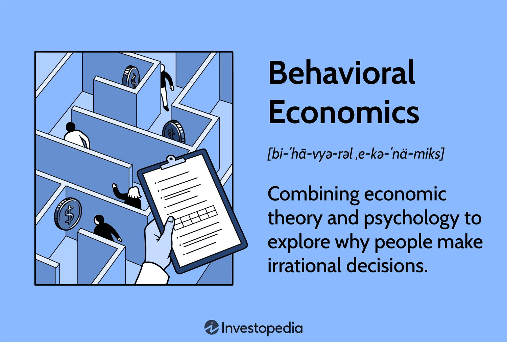

In today’s fast-paced financial markets, the convergence of behavioral economics and algorithmic trading has become a pivotal element in shaping trading strategies and economic behavior. As markets grow increasingly complex, understanding how these fields interact can provide valuable insights for traders and financial analysts alike.

Behavioral economics, which studies the impact of psychological factors on economic decision-making, challenges the traditional notion of rational actors prevailing in financial markets. This discipline highlights how human biases like loss aversion, overconfidence, and anchoring affect trading decisions, often leading to suboptimal outcomes. Such biases manifest in traders' decisions, influencing not only individual performance but also market dynamics on a broader scale.



On the other hand, algorithmic trading utilizes sophisticated systems to automate and optimize trade execution. These systems, driven by mathematical models and pre-defined criteria, can execute trades with speed and precision beyond human capability. However, if not carefully designed, algorithms can amplify market trends associated with cognitive biases, potentially exacerbating phenomena like market bubbles or crashes.

This article examines the synergy between behavioral economics and algorithmic trading, particularly in the context of individuals being "priced out" of markets. Rising costs, driven by factors like wage stagnation and market speculation, can lead to exclusion from market participation. Understanding the psychological mechanisms underlying buying and selling behaviors provides a framework for navigating these challenges.

Cognitive biases significantly influence market behavior, as they direct traders’ perceptions and strategic actions. By analyzing these biases, traders can develop strategies that mitigate emotional decision-making, thus enhancing their trading efficiency. Moreover, the integration of behavioral insights into algorithmic trading methodologies offers a pathway to counteract biases like herding and overconfidence through algorithmic interventions.

The primary aim of this article is to offer a comprehensive guide that merges the principles of behavioral economics with algorithmic strategies. In doing so, traders can refine their approaches to better adapt to the complexities of today's markets. By enhancing their understanding of cognitive biases and algorithmic techniques, traders are empowered to make more rational and informed decisions, ultimately improving their market outcomes.

## Table of Contents

## Understanding Behavioral Economics

Behavioral economics is a field that scrutinizes the psychological influences affecting economic decision-making processes. Unlike traditional economic frameworks that assume market participants behave rationally, behavioral economics recognizes that individuals frequently act irrationally due to innate cognitive biases. These biases can substantially alter decision-making, leading to systematic errors in judgment that ultimately impact traders' behaviors in the financial markets.

Among the principal cognitive biases are loss aversion, overconfidence, and anchoring. Loss aversion refers to the tendency for individuals to prefer avoiding losses over acquiring equivalent gains. This bias is grounded in the principle that losses generally have a more significant psychological impact than gains of the same magnitude. For example, losing $100 might cause more distress than the pleasure derived from gaining $100, leading traders to avoid taking necessary risks or to retain failing investments longer than logical analysis would dictate.

Overconfidence is another prevalent bias where individuals overestimate their knowledge or ability to predict future events accurately. In trading, overconfidence can lead market participants to take excessive risks, relying too heavily on their judgment instead of objective data. This could result in trading too frequently or choosing riskier financial instruments without thorough analysis, potentially resulting in undesirable consequences.

Anchoring bias occurs when individuals fixate on specific information, often irrelevant or outdated, and base their decisions on it. In financial markets, traders might anchor to an asset's previous high price, expecting it to return to that level without consideration of the current market conditions. Such fixation can cloud judgment and prevent the adoption of a flexible trading strategy adapted to evolving market dynamics.

The impact of these cognitive biases underscores the importance of understanding them to mitigate associated risks and optimize trading strategies. Traders can employ various strategies to counteract these biases, such as maintaining a disciplined trading plan, adhering to objective analysis metrics, and seeking external validation or feedback. Awareness and acknowledgment of these biases enable traders to refine their decision-making processes, resulting in more rational and effective market engagement.

## The Dynamics of Being Priced Out

The concept of being "priced out" refers to the inability of individuals to afford a product or service because of rising costs. In financial markets, this scenario often emerges due to several contributing factors such as wage stagnation and excessive market speculation. Wage stagnation occurs when the growth of wages fails to keep pace with inflation, leading to diminished purchasing power. This lag means that even moderate price increases can disproportionally affect those with stagnant incomes, resulting in them being priced out.

Excessive market speculation is another [factor](/wiki/factor-investing) that can lead to being priced out. It occurs when traders and investors drive up prices based on speculation rather than intrinsic value, causing asset prices to inflate beyond reasonable levels. This is prevalent in real estate markets where speculation may result in prices that far exceed the sustainable income levels of average buyers, thereby excluding them from the market.

Behavioral economics provides a framework for understanding how price increases affect perceived value and decision-making processes. Cognitive biases, such as anchoring, influence how individuals assess value in the context of rising prices. For instance, potential buyers may anchor to past prices as a baseline, unwilling or unable to adapt to new pricing realities, thus finding themselves priced out.

Traders and market participants must grasp the concept of elasticity of demand—how sensitive the quantity demanded is to a change in price. Understanding elasticity assists in predicting the impact of price changes on market accessibility for different consumer segments. Generally, assets or goods with inelastic demand are less likely to see consumers priced out, as changes in price do not significantly alter the quantity demanded. Conversely, in markets with elastic demand, even small price increases can exclude broader swathes of consumers, exacerbating the problem of being priced out.

To illustrate these dynamics computationally, consider a simple Python function to calculate price elasticity of demand, expressed as:

$$
\text{Elasticity} = \frac{\%\ \text{Change in Quantity Demanded}}{\%\ \text{Change in Price}}
$$

Here is an example function:

```python
def calculate_elasticity(change_in_quantity, initial_quantity, change_in_price, initial_price):
    percentage_change_quantity = (change_in_quantity / initial_quantity) * 100
    percentage_change_price = (change_in_price / initial_price) * 100
    elasticity = percentage_change_quantity / percentage_change_price
    return elasticity

# Example usage
elasticity = calculate_elasticity(change_in_quantity=-10, initial_quantity=100, change_in_price=5, initial_price=100)
print(f"The price elasticity of demand is {elasticity:.2f}")
```

Understanding these dynamics is critical for policymakers, economists, and financial professionals alike, as they seek to mitigate the risks of individuals being priced out of essential markets.

## Algorithmic Trading and Economic Behavior

Algorithmic trading involves the use of automated systems designed to execute trades according to a set of predefined criteria. These systems leverage mathematical models, quantitative analysis, and vast computational power to make trading decisions at speeds and frequencies that a human trader cannot match. While [algorithmic trading](/wiki/algorithmic-trading) offers numerous advantages, such as increased [liquidity](/wiki/liquidity-risk-premium) and reduced transaction costs, it can also amplify existing market trends that are often driven by cognitive biases.

One significant example of how algorithmic trading can influence market behavior is through herding. Herding occurs when traders follow the majority's actions rather than relying on their independent analysis. Algorithms, especially those relying on trend-following strategies, can intensify this behavior by executing trades that mirror the prevailing market sentiment, thereby accelerating price movements and potentially contributing to market bubbles or crashes.

To counteract biases such as herding, behavioral insights can be integrated into algorithmic models. By incorporating behavior-based logic into their algorithms, traders can create systems that identify and mitigate irrational behavior patterns. For instance, algorithms can be programmed to recognize overbought or oversold market conditions and make adjustments accordingly, helping to temper the effects of impulsive trading.

Moreover, algorithms can include sentiment analysis tools to provide qualitative assessments of market psychology. Sentiment analysis involves the use of natural language processing and [machine learning](/wiki/machine-learning) techniques to evaluate public opinion from news articles, social media, and other sources. This information can be processed to gauge the market's emotional state, allowing for more informed decision-making. For example, a sentiment-fueled rise in asset prices can be identified and assessed against fundamental indicators before decisions are made.

Integrating principles of behavioral economics with algorithmic trading methods allows for enhanced trading efficacy and reduced emotional intervention. By designing algorithms that negate overconfidence and encourage diversification, traders can achieve a more balanced approach to market participation. An example formula for adjusting the weight of a trading position based on sentiment could be:

$$
\text{Adjusted Weight} = \text{Base Weight} \times (1 + \alpha \times \text{Sentiment Score})
$$

where $\alpha$ is a factor that determines how much influence sentiment should have, and the Sentiment Score is a numerical value derived from sentiment analysis.

Finally, by implementing these behavioral modifiers, algorithms can facilitate a more disciplined approach to trading, prioritizing data-driven decisions over emotional reactions. This results in a more rational and systematic trading process, aligned with the objectives of both minimizing risk and maximizing returns.

## Cognitive Biases Impacting Trading

Cognitive biases play a significant role in trading, often leading to suboptimal decisions that can impact financial outcomes. One prominent bias is overconfidence, where traders exhibit an unwarranted level of assurance in their judgment, potentially leading to excessive risk-taking. This may manifest in making larger trades than advisable or ignoring signals that suggest a need for caution. Overconfidence can be exacerbated by positive reinforcement from past successes, resulting in a cycle of escalating risk.

Another critical bias is loss aversion, a tendency to prefer avoiding losses over acquiring equivalent gains. This bias can lead traders to hold onto losing positions longer than rational analysis would suggest, hoping for a turnaround despite evidence to the contrary. Research in behavioral finance indicates that losses are typically perceived as more impactful than gains of the same magnitude, encouraging irrational decision-making to avoid materializing a loss.

Anchoring bias is the reliance on the initial piece of information encountered when making decisions. For traders, this could mean basing future trading strategies on outdated or irrelevant information, such as an initial security price point or prior market conditions. This can lead to faulty decision-making, as new, more relevant data might be overshadowed by outdated anchors.

Herding behavior reflects the natural inclination to mimic the actions and decisions of a larger group, often without independent analysis. In financial markets, this can lead to bubbles or market crashes, as individuals collectively drive prices up or down. Herding can create feedback loops where initial price movements are magnified by the actions of traders following the majority.

Addressing these biases involves adopting specific strategies. Maintaining a detailed trading journal can provide insights into decision patterns and illuminate biases that may need correction. Regularly seeking external feedback ensures that a trader's decisions are not made in isolation, helping to mitigate overconfidence and anchoring biases. Implementing rule-based strategies assists in adhering to objective, predefined criteria instead of emotional reactions, thereby reducing the influence of herding behavior. By incorporating these techniques, traders can enhance rational decision-making, leading to more consistent performance in the market.

## Implementing Behavioral Economics in Trading

Traders in contemporary financial markets must actively engage with the principles of behavioral economics to refine their decision-making strategies. Recognizing cognitive biases and implementing targeted interventions can significantly mitigate the adverse effects these biases can have on trading outcomes. A primary method to counter emotional decision-making during market [volatility](/wiki/volatility-trading-strategies) is the establishment of predefined stop-loss levels. These thresholds enable traders to limit potential losses by automatically selling a security when its price falls to a certain level. Predefined stop-loss levels prevent knee-jerk reactions to sudden market shifts, which are often influenced by fear or panic.

In addition to stop-loss strategies, the adoption of rule-based trading systems serves as an effective mechanism to overcome biases such as overconfidence. By focusing on objective, data-driven criteria for making trades, investors can reduce the influence of emotional or irrational judgments. Rule-based systems operate on algorithms that convert subjective analysis into quantitative data, offering a more detached perspective on market conditions.

Sentiment analysis tools provide another valuable resource for traders seeking to integrate behavioral insights into their strategies. These tools utilize data from social media, news, and other sources to gauge the psychological climate of the market. By analyzing variables such as investor sentiment and public opinion, traders can make more informed decisions that reflect the broader market context rather than individual cognitive biases.

Moreover, cultivating self-awareness is crucial for traders aiming to improve their rational decision-making abilities. Behavioral prompts, such as regular reflections on past trades and journaling, can enhance a trader's understanding of their own biases and tendencies. This practice involves assessing previous decisions and learning from outcomes, thereby fostering a more analytical and less reactive approach to future trades.

By implementing these strategies, traders can substantially improve their capacity to make rational, well-informed decisions. Emphasizing education on cognitive biases, establishing logical rule-based systems, utilizing sentiment analysis tools, and developing self-awareness are essential components of a trading strategy that successfully incorporates the principles of behavioral economics.

## Conclusion

Understanding and integrating the principles of behavioral economics into trading can significantly enhance decision-making. Financial markets are often influenced by cognitive biases, which can lead to suboptimal trading outcomes. However, by recognizing these biases and implementing proactive strategies, traders can mitigate their negative effects. Key cognitive biases such as overconfidence, loss aversion, and anchoring can distort an individual's perception and judgment, potentially leading to adverse financial decisions. 

Traders who effectively apply behavioral economics principles are better equipped to handle the complexities of modern financial markets. By employing strategies such as maintaining discipline, setting predefined criteria for trades, and developing self-awareness, they can reduce the emotional impact on trading decisions. For instance, the implementation of rule-based systems helps counteract overconfidence by ensuring decisions are based on objective analysis rather than subjective judgment.

Moreover, the integration of behavioral insights with algorithmic trading methods provides a robust framework for success. Algorithms can be designed to account for [statistics](/wiki/bayesian-statistics) and trends in market behavior influenced by human psychology. These programs can incorporate advanced techniques such as sentiment analysis to better gauge market conditions and make informed decisions. By reducing human emotional interference, algorithmic strategies aim to improve trading consistency and effectiveness.

Continued education and adaptation are crucial for traders striving for rationality in their economic behavior. The financial landscape is continually evolving, and traders must remain vigilant in updating their knowledge and strategies. This commitment to continuous improvement helps ensure that traders not only react to changes in the market but are also capable of proactive decision-making based on behavioral economics principles. By staying informed and adaptable, traders can enhance their likelihood of success in an unpredictable market environment.

## References & Further Reading

[1]: Thaler, R. H., & Sunstein, C. R. (2008). ["Nudge: Improving Decisions About Health, Wealth, and Happiness."](https://www.researchgate.net/publication/257178709_Nudge_Improving_Decisions_About_Health_Wealth_and_Happiness_RH_Thaler_CR_Sunstein_Yale_University_Press_New_Haven_2008_293_pp) Penguin Books.

[2]: Kahneman, D. (2011). ["Thinking, Fast and Slow."](https://link.springer.com/article/10.1007/s00362-013-0533-y) Farrar, Straus and Giroux.

[3]: Barberis, N., & Thaler, R. (2003). ["A Survey of Behavioral Finance."](https://www.semanticscholar.org/paper/A-Survey-of-Behavioral-Finance-Barberis-Thaler/a4ab7d7161deac0f532d121b1614cf7b97d90e78) National Bureau of Economic Research.

[4]: Lo, A. W. (2005). ["Reconciling Efficient Markets with Behavioral Finance: The Adaptive Markets Hypothesis."](http://www.empirical.net/wp-content/uploads/2014/12/Andrew-Lo-Reconciling-Efficient-Markets-with-Behavioral-Finance.pdf) Journal of Investment Consulting.

[5]: Pardo, R. (2008). ["The Evaluation and Optimization of Trading Strategies"](https://onlinelibrary.wiley.com/doi/book/10.1002/9781119196969) Wiley Trading.