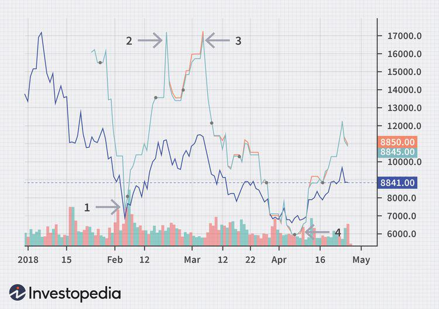

## Table of Contents

## What are Bitcoin futures?

Bitcoin futures are financial contracts that allow people to bet on the future price of Bitcoin without actually owning the cryptocurrency. They work like this: if you think the price of Bitcoin will go up, you can buy a futures contract. If the price does go up by the time the contract ends, you make money. If it goes down, you lose money. It's a way for people to try to make money from Bitcoin's price changes without having to buy and store the actual coins.

These contracts are traded on special exchanges, like the Chicago Mercantile Exchange (CME). They are popular because they let investors and traders get involved with Bitcoin without dealing with the complexities of buying and securing the cryptocurrency directly. Bitcoin futures also help to set a standard price for Bitcoin, which can make the market more stable. However, they can be risky because the price of Bitcoin can be very unpredictable, and you could lose a lot of money if the price moves against your bet.

## Why were Bitcoin futures introduced?

Bitcoin futures were introduced to give people a new way to invest in Bitcoin without having to buy the actual cryptocurrency. Before futures, if you wanted to bet on Bitcoin's price, you had to buy and store the coins yourself, which can be complicated and risky. With futures, you can simply buy a contract that tracks Bitcoin's price, making it easier and more accessible for regular investors and big financial institutions to get involved.

Another reason for introducing Bitcoin futures was to help stabilize the [cryptocurrency](/wiki/cryptocurrency) market. Bitcoin's price can jump around a lot, which makes it hard for people to trust and use it. Futures contracts help set a standard price for Bitcoin, which can make the market less wild. This can make people feel more comfortable using Bitcoin and might encourage more businesses to accept it. However, futures can also be risky because the price of Bitcoin can still be very unpredictable, and you could lose money if the price doesn't go the way you expected.

## How does the pricing of Bitcoin futures work?

The pricing of Bitcoin futures is based on what people think Bitcoin's price will be in the future. When you buy a futures contract, you're making a bet on whether Bitcoin's price will go up or down by a certain date. The price of the contract is set by what other people on the exchange are willing to pay for it. If a lot of people think Bitcoin's price will go up, the price of the futures contract will go up too. If they think it will go down, the price of the contract will go down.

The final price of a Bitcoin futures contract is settled at the end of the contract term, which could be a few months away. At that time, the contract's value is based on the actual market price of Bitcoin. If you bought a contract betting that Bitcoin's price would go up and it does, you make money. If it goes down, you lose money. This system helps set a standard price for Bitcoin and can make the market more stable, but it can also be risky because Bitcoin's price can change a lot.

## What factors influence the price of Bitcoin futures?

The price of Bitcoin futures is influenced by what people think Bitcoin's price will be in the future. If a lot of people believe Bitcoin's price will go up, they will buy more futures contracts, which makes the price of those contracts go up too. On the other hand, if people think Bitcoin's price will go down, they will sell their futures contracts or not buy new ones, which makes the price of the contracts go down. This is all about what people expect to happen, not what is happening right now.

Another big [factor](/wiki/factor-investing) is the actual market price of Bitcoin. The futures contracts are tied to Bitcoin's real price, so if Bitcoin's price goes up or down, the price of the futures contracts will follow. News and events that affect Bitcoin, like new laws, big companies accepting Bitcoin, or changes in how easy it is to use Bitcoin, can also change what people think about its future price. All these things together help set the price of Bitcoin futures.

## How do Bitcoin futures differ from spot Bitcoin?

Bitcoin futures and spot Bitcoin are two different ways to get involved with Bitcoin, but they work in different ways. Spot Bitcoin is just buying the actual Bitcoin. When you buy spot Bitcoin, you own the cryptocurrency and can use it or hold onto it. The price you pay is the current market price of Bitcoin at that moment. It's like buying a real thing, and you have to think about how to keep it safe and secure.

Bitcoin futures, on the other hand, are contracts that let you bet on what the price of Bitcoin will be in the future. You don't actually own any Bitcoin when you buy a futures contract. Instead, you're making a bet on whether the price will go up or down by a certain date. The price of the futures contract is based on what other people think Bitcoin's price will be in the future, not the current price. This can be a simpler way to invest in Bitcoin without dealing with the real cryptocurrency, but it can also be riskier because the price can change a lot.

## What are the key differences between Bitcoin futures on different exchanges?

Bitcoin futures can be traded on different exchanges, like the Chicago Mercantile Exchange (CME) and the Intercontinental Exchange (ICE). Each exchange might have its own rules and ways of doing things. For example, the size of the futures contract might be different. On the CME, one Bitcoin futures contract is for 5 Bitcoins, while on other exchanges it might be for a different amount. Also, the way they settle the contract at the end can be different. Some exchanges might use cash to settle the contract, while others might use actual Bitcoin.

Another difference is how much it costs to trade on these exchanges. Each exchange might have its own fees for buying and selling futures contracts. The rules about who can trade on the exchange can also be different. Some exchanges might have stricter rules about who can trade, while others might be more open. All these things can make a big difference in how you trade Bitcoin futures and what you might expect to happen.

## How can one calculate the fair value of Bitcoin futures?

Calculating the fair value of Bitcoin futures means figuring out what the futures contract should be worth based on what people think Bitcoin's price will be in the future. To do this, you start with the current price of Bitcoin, called the spot price. Then, you think about what might make Bitcoin's price go up or down before the futures contract ends. This includes things like interest rates, how much it costs to store Bitcoin, and how much people expect Bitcoin's price to change. If people think Bitcoin's price will go up, the fair value of the futures contract will be higher than the spot price.

To make this calculation more exact, you can use something called the cost of carry model. This model looks at the costs of holding onto Bitcoin until the futures contract ends, like the interest you could have earned if you put your money somewhere else instead. You add these costs to the spot price of Bitcoin to get the fair value of the futures contract. If the futures contract is trading at a price that's different from this fair value, it might mean that people are betting more on Bitcoin's price going up or down than the model expects. This can help you decide if the futures contract is a good deal or not.

## What are the risks associated with trading Bitcoin futures?

Trading Bitcoin futures can be risky because Bitcoin's price can change a lot. If you bet that the price will go up and it goes down instead, you could lose a lot of money. This is called market risk. Also, trading futures often involves using borrowed money, which can make your wins bigger but also your losses. This is called leverage, and it can make trading Bitcoin futures even riskier.

Another risk is something called [liquidity](/wiki/liquidity-risk-premium) risk. This means that it might be hard to buy or sell your futures contract when you want to, especially if not many people are trading. If you can't sell your contract quickly, you might have to wait or sell it for less than you wanted. There's also the chance that the exchange you're using might have problems or even go out of business, which is called counterparty risk. All these risks together make trading Bitcoin futures something you should be careful about.

## How do market participants use Bitcoin futures for hedging?

Market participants use Bitcoin futures for hedging to protect themselves from big changes in Bitcoin's price. If someone owns a lot of Bitcoin and is worried that the price might go down, they can sell a futures contract. This way, if Bitcoin's price does drop, they lose money on their Bitcoin but make money on the futures contract. It's like buying insurance for their Bitcoin. By doing this, they can feel safer about holding onto their Bitcoin without worrying as much about losing money if the price goes down.

On the other hand, if someone is planning to buy Bitcoin in the future and is worried that the price might go up, they can buy a futures contract. This way, if Bitcoin's price does go up, they will have to pay more for the Bitcoin when they buy it, but they will make money on the futures contract. This helps them lock in a price for Bitcoin now, even though they won't actually buy it until later. Using Bitcoin futures for hedging helps people manage the risk of Bitcoin's unpredictable price changes.

## What is the impact of Bitcoin futures on the overall cryptocurrency market?

Bitcoin futures have had a big impact on the overall cryptocurrency market. They have made it easier for more people to get involved with Bitcoin without having to buy the actual cryptocurrency. This is because futures let people bet on Bitcoin's price without dealing with the complicated parts of owning and storing the coins. As a result, more investors and big financial companies can now take part in the Bitcoin market. This has helped make Bitcoin more popular and can make the market more stable because there are more people trading.

At the same time, Bitcoin futures can also make the market more unpredictable. Because futures are based on what people think Bitcoin's price will be in the future, they can cause big swings in the market. If a lot of people think Bitcoin's price will go up, they might buy more futures, which can push the price up even higher. But if they think the price will go down, they might sell their futures, which can make the price drop a lot. This can make the market more exciting but also more risky for everyone involved.

## How have regulatory changes affected Bitcoin futures pricing?

Regulatory changes can have a big impact on Bitcoin futures pricing. When governments make new rules about cryptocurrencies, it can change what people think about Bitcoin's future. If a new law makes it harder to use Bitcoin, people might think its price will go down, which can make the price of Bitcoin futures go down too. On the other hand, if a new rule makes it easier to use Bitcoin, people might think its price will go up, which can make the price of Bitcoin futures go up.

These changes can also affect how many people are willing to trade Bitcoin futures. If new rules make it harder for people to buy and sell futures, there might be fewer people trading, which can make the market less lively and cause bigger price swings. But if new rules make trading easier, more people might get involved, which can help make the market more stable. Either way, regulatory changes are something that people trading Bitcoin futures need to keep an eye on because they can change the game.

## What advanced trading strategies can be applied to Bitcoin futures?

One advanced trading strategy for Bitcoin futures is called arbitrage. This means taking advantage of the difference in Bitcoin's price between different exchanges. If Bitcoin's price is higher on one exchange than another, you can buy Bitcoin on the cheaper exchange and sell it on the more expensive one at the same time. You can do the same thing with Bitcoin futures if the futures price is different on different exchanges. This can help you make money from the price difference without betting on whether Bitcoin's price will go up or down.

Another strategy is called spread trading. This involves buying and selling different Bitcoin futures contracts at the same time. For example, you might buy a futures contract that ends in one month and sell a contract that ends in three months. If you think the difference between these two prices will change, you can make money from that change without caring too much about whether Bitcoin's price goes up or down overall. This can be a safer way to trade because you're not betting on the whole market, just on the difference between two contracts.

A third strategy is using technical analysis to predict Bitcoin's price. This means looking at charts and using math to guess where Bitcoin's price might go next. Traders might use things like moving averages or other tools to decide when to buy or sell Bitcoin futures. This can be tricky because Bitcoin's price can be very unpredictable, but if you're good at reading the charts, it can help you make better trades.

## What are the Mechanics of Bitcoin Futures Pricing?

Bitcoin futures pricing is intricately linked to several key factors that influence their valuation. Primarily, the spot price of Bitcoin significantly affects futures prices given that futures are essentially agreements to buy or sell the cryptocurrency at a future date, based on current expectations. The cost of [carry](/wiki/carry-trading) is another pivotal component. This encompasses the costs associated with holding the underlying asset until the contract's expiration such as storage costs, interest rates, and opportunity costs, all factored into the futures price.

A theoretical framework often employs a model called the Cost of Carry Model, which can be depicted using the formula:

$$
F = S \times e^{(r+u-d)T}
$$

Where:
- $F$ is the futures price,
- $S$ is the current spot price,
- $r$ is the risk-free interest rate,
- $u$ is the storage cost (cost of carry),
- $d$ is the dividend yield (not applicable to Bitcoin but may represent negative costs such as lending fees),
- $T$ is the time to maturity,
- $e$ is the base of the natural logarithm.

The [volatility](/wiki/volatility-trading-strategies) of the Bitcoin market further impacts futures pricing. High volatility can lead to significant disparities between the expected future spot price and the present futures price, driven by traders' uncertainties.

Deviations from theoretical prices regularly occur due to market perception, which triggers changes in demand and supply dynamics of the futures contracts. For instance, if market participants anticipate a rise in Bitcoin's future spot price, they might be willing to pay a premium on the futures contract, elevating its price beyond what the theoretical model suggests.

Arbitrage opportunities also influence futures pricing. Traders might exploit price differences across different markets or between the futures and spot markets to obtain risk-free profits, thus aligning the futures price closer to theoretical valuations. This practice helps maintain market equilibrium but can also temporarily skew prices under certain conditions.

In summary, while theoretical models provide a foundation for understanding Bitcoin futures pricing, real-world factors such as market sentiment, volatility, and [arbitrage](/wiki/arbitrage) ensure that actual futures prices often diverge from these calculations.

## What are real-world examples of Bitcoin futures pricing?

Bitcoin futures pricing can exhibit notable differences from the spot prices of Bitcoin due to several influencing factors. These deviations are primarily driven by unexpected market events and global news, which can alter trader sentiment and market dynamics.

Graphical analysis is crucial in understanding these price discrepancies. A common observation in futures pricing is its basis, defined as the difference between the futures price and the spot price. The futures price $F$ can be represented as:

$$
F = S \times (1 + r)^t
$$

where:
- $S$ is the spot price of Bitcoin.
- $r$ is the annualized risk-free interest rate.
- $t$ is the time to maturity of the futures contract expressed in years.

Despite this theoretical model, real-world pricing often deviates due to several factors:

1. **Market Events**: Events such as institutional investments, regulatory announcements, or significant technological upgrades can lead to rapid changes in market sentiment. For example, the announcement of Bitcoin's acceptance by a major company can swiftly increase demand, affecting both spot and futures prices.

2. **Global News**: Economic indicators, geopolitical tensions, or major cybersecurity incidents can impose unexpected pressures on the market. For instance, regulatory crackdowns in key markets may instill fear, leading to abrupt sell-offs that impact futures prices more sharply than spot prices.

Historical analyses of Bitcoin futures during significant geopolitical events reveal patterns of increased basis volatility. For example, during periods of heightened economic instability, such as the COVID-19 pandemic, large deviations were observed as uncertainty spiked, influencing trader behavior and risk assessment.

In practice, [algorithmic trading](/wiki/algorithmic-trading) systems often exploit these deviations to identify arbitrage opportunities, thus providing liquidity and correcting price inconsistencies over time. However, the inherent volatility of Bitcoin frequently challenges these corrections, maintaining a dynamic interplay between spot and futures markets.

Understanding these real-world examples is crucial for traders looking to navigate the complexities of Bitcoin futures pricing effectively, ensuring they can anticipate potential deviations and adjust their strategies accordingly.

## References & Further Reading

[1]: ["Bitcoin Futures: What Are They and How Do They Work?"](https://www.forbes.com/advisor/investing/cryptocurrency/what-are-bitcoin-futures/) on Investopedia.

[2]: ["Algorithmic and High-Frequency Trading"](https://assets.cambridge.org/97811070/91146/frontmatter/9781107091146_frontmatter.pdf) by Álvaro Cartea, Sebastian Jaimungal, and José Penalva.

[3]: ["Trading and Exchanges: Market Microstructure for Practitioners"](https://www.amazon.com/Trading-Exchanges-Market-Microstructure-Practitioners/dp/0195144708) by Larry Harris.

[4]: Garman, M. B., & Klass, M. J. (1980). ["On the Estimation of Security Price Volatilities from Historical Data."](https://www.jstor.org/stable/2352358) Journal of Business.

[5]: Hull, J. C. (2009). ["Options, Futures, and Other Derivatives,"](https://archive.org/details/isbn_9788131722992) Pearson Prentice Hall.

[6]: Lo, A. W., & Hasanhodzic, J. (2010). ["The Evolution of Technical Analysis: Financial Prediction from Babylonian Tablets to Bloomberg Terminals"](https://archive.org/details/evolutionoftechn0000loan) by Andrew Lo and Jasmina Hasanhodzic.