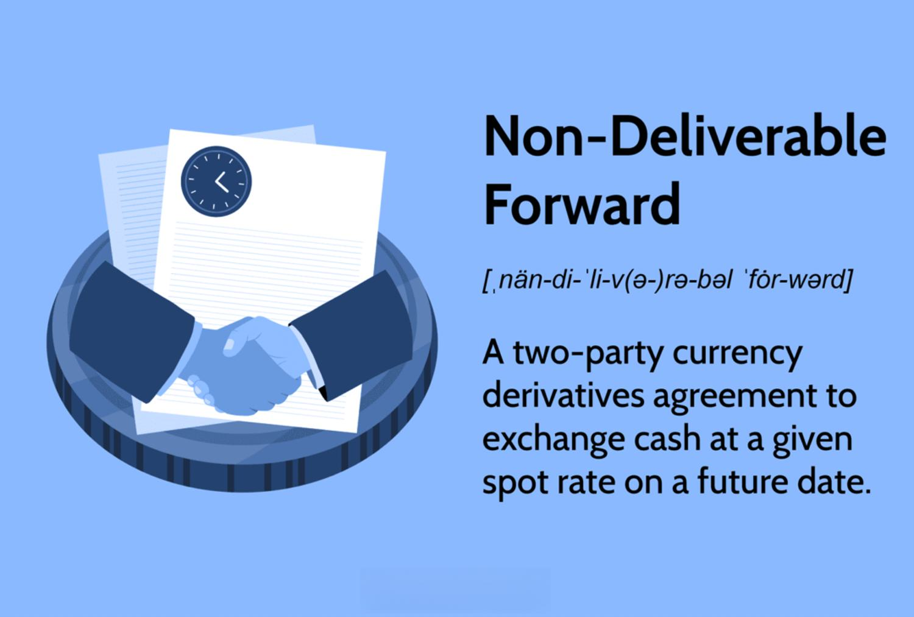

The financial derivatives and foreign exchange trading sector has undergone considerable transformation, driven in large part by technological innovations such as algorithmic trading and the introduction of non-deliverable forwards (NDFs). NDFs have emerged as essential tools for managing currency risks, particularly in markets where currencies are not freely convertible. These financial instruments facilitate hedging strategies for companies and financial institutions facing exposure to volatile exchange rates, especially in emerging economies. Throughout this article, we will explore how NDFs are priced, the influence of algorithmic trading, and the implications for global financial markets.

The infusion of technology, especially algorithmic trading, into NDF markets aims to streamline trading processes and enhance market liquidity. The shift towards more sophisticated trading platforms and automation signifies a pivotal change in how NDF contracts are executed and managed. This is particularly relevant in today's fast-paced financial environment, where the ability to respond to market changes rapidly and efficiently is crucial.

Technological advancements are reshaping the landscape of NDF trading by increasing transparency and improving the efficiency of operations. As the popularity of NDFs continues to grow, understanding the mechanisms behind their pricing and execution becomes increasingly important for market participants. Such insights empower traders, investors, and financial professionals to optimize their strategies and capitalize on the evolving dynamics of the foreign exchange markets.

By examining the intersection of NDFs and algorithmic trading, we aim to provide a comprehensive overview of recent developments and future prospects within this domain. Understanding these elements is critical for professionals seeking to leverage these innovative financial instruments effectively and anticipate the impacts of new trends on global markets.

## Table of Contents

## Understanding Non-Deliverable Forwards (NDFs)

Non-Deliverable Forwards (NDFs) are a specialized form of forward contract that facilitates the trading of currencies which are not freely convertible on international markets. The central utility of NDFs lies in their ability to manage currency risk in emerging markets where exchange controls or other regulatory barriers restrict the free exchange of local currency.

The primary characteristic that distinguishes NDFs from traditional forward contracts is their settlement method. Unlike standard forwards, which involve the actual exchange of the underlying currencies, NDFs are settled in cash. The cash settlement process typically occurs in a major reserve currency such as the US dollar. This settlement method circumvents the need for physical delivery of the non-convertible currency, thereby mitigating the counterparty risk associated with currency conversion restrictions. 

Companies and financial institutions frequently use NDFs as hedging instruments to manage exposure to non-deliverable currencies. Hedging through NDFs allows these entities to lock in an exchange rate in the future without being subject to the fluctuating demand and supply dynamics of the currency involved. This is particularly advantageous for businesses operating in volatile markets where local currency depreciation or appreciation can significantly impact financial performance.

Understanding the structured nature of NDF contracts is crucial, involving an appreciation of both the financial mechanisms employed and their pricing dynamics. At the contract's inception, the parties agree on a notional amount, an agreed-upon exchange rate (the NDF rate), and a settlement date. On maturity, the difference between the agreed NDF rate and the prevailing spot rate is calculated. The net difference is then settled in the agreed-upon settlement currency, commonly a freely convertible currency.

From a pricing perspective, NDFs are primarily governed by [interest rate](/wiki/interest-rate-trading-strategies) parity, encapsulating the differential between the domestic interest rate of the non-deliverable currency and the interest rate of the settlement currency. Other market factors, such as [liquidity](/wiki/liquidity-risk-premium), geopolitical risks, and the speculative activities of market participants, can also influence their pricing. Understanding these dynamics aids in comprehensively utilizing NDFs as both hedging and speculative instruments, providing crucial risk management tools in the increasingly complex world of global finance.

## Pricing NDF Contracts

Non-Deliverable Forward (NDF) contract pricing is a sophisticated process, fundamentally anchored in the interest rate parity theorem. This theorem suggests that NDF prices are influenced by the differential between the interest rates of the two currencies involved and the current spot exchange rate. Mathematically, this relationship can be represented as:

$$
\text{Forward Rate} = \text{Spot Rate} \times \left( \frac{1 + \text{Interest Rate of Domestic Currency}}{1 + \text{Interest Rate of Foreign Currency}} \right)
$$

Even though this formula provides a theoretical basis, actual NDF pricing is affected by several additional factors. Key among these are market liquidity, counterparty risk, and speculative positions. Market liquidity impacts how easily contracts can be bought or sold without causing significant price changes, while counterparty risk pertains to the likelihood that the other party in the transaction may default. These risks are especially pertinent in emerging markets where NDFs are commonly used.

Speculative positions within the market also exert influence. Traders often engage in NDFs not only for hedging purposes but also for speculative gains, potentially driving price fluctuations depending on the speculative sentiment.

Moreover, trading flows between the countries in question, alongside the discrepancies between onshore and offshore currency rates, further complicate NDF pricing. For instance, regulatory or economic developments in one of the involved countries might influence the onshore rate, which in turn affects the offshore rate quoted in the NDF market. This divergence necessitates an adaptive pricing strategy.

In practice, different strategies are employed to address the complexities of NDF pricing. While some practitioners might rely on forecasted spot exchange rates and interest differential projections, others may opt for models that focus less on interest rates, taking advantage of computational algorithms to forecast more immediate price changes. These strategies are guided by both quantitative models and qualitative insights drawn from each involved market's specific conditions.

Ultimately, the dynamic nature of currency markets and the particular characteristics of NDF-traded currencies demand a nuanced approach to pricing that aligns with both theoretical models and real-world variables.

## Algorithmic Trading in the NDF Market

Algorithmic trading has significantly altered the landscape of foreign exchange markets, and non-deliverable forwards (NDFs) represent a burgeoning area for these technologies. The recent evolution of electronic trading platforms has laid the groundwork for increased algorithmic activity in the NDF arena. Traditionally characterized by limited liquidity and transparency, NDF markets are ripe for the efficiencies that [algorithmic trading](/wiki/algorithmic-trading) can provide. Automation in these markets is intended to simplify trading operations, reduce latency, and enhance precision.

These advancements allow market participants to execute trades swiftly, relying on complex algorithms that analyze vast datasets and make decisions based on pre-defined criteria. Among the benefits expected are improved market depth and enhanced transparency, which have historically been challenges in the NDF sector.

Algorithmic trading also brings about more robust participant engagement. As more entities adopt algorithmic strategies, the NDF market stands to benefit from greater liquidity. This evolution is driven by algorithms capable of predicting market movements and adjusting strategies based upon real-time data analysis. Machine learning and [artificial intelligence](/wiki/ai-artificial-intelligence) are key technologies that empower these algorithms to learn from market dynamics, thus optimizing trading strategies over time.

Despite these advancements, challenges persist. The non-standard nature of NDF contracts, such as varying maturity dates and specific country-related risks, requires sophisticated algorithmic models capable of integrating multiple variables. However, as technology progresses, these complexities are increasingly being managed more effectively.

In this evolving landscape, the gradual incorporation of algorithmic trading into the NDF market is anticipated to foster a more vibrant trading environment, encouraging participation from a diverse range of market actors and ultimately leading to more efficient market outcomes.

## The Role of Asia in NDF Trading Developments

Asia plays a pivotal role in the development and expansion of the Non-Deliverable Forwards (NDF) market. Countries such as Korea, Taiwan, and India are at the forefront of NDF currency trading. Their leadership is attributed to the necessity of managing currency risks associated with non-convertible local currencies and the strategic adoption of technological infrastructures that enable such financial activities.

Asian markets have been proactive in integrating electronic trading platforms, which offer significant advantages in terms of speed, efficiency, and accessibility. The integration of these platforms facilitates smoother transaction processes and supports institutions operating across different time zones. This level of technological adoption makes Asian financial markets appealing to multinational corporations and financial institutions that require seamless currency risk management solutions.

Singapore, in particular, has emerged as a critical global hub for NDF trading. It has developed a regulatory framework conducive to foreign exchange ([FX](/wiki/fx-anomaly)) trading, which encourages global participation and innovation in NDF markets. The Monetary Authority of Singapore (MAS) has been instrumental in creating a stable and transparent environment, fostering a dynamic ecosystem for financial innovation and growth. As a result, Singapore's financial sector has attracted leading financial institutions looking to base their NDF operations in a jurisdiction known for its strong regulatory oversight and market-friendly approach.

The continued advancements in Asia's technological and regulatory landscapes contribute significantly to the global NDF market. Countries in this region are increasingly capitalizing on algorithmic trading innovations, which enhance trade execution speeds and market efficiencies. Algorithmic trading is becoming an integral part of the NDF market, addressing liquidity challenges by facilitating larger transaction volumes and improving price discovery mechanisms.

Such advancements suggest that Asia's influence on the global NDF market will continue to grow, driving both innovation and participation. These developments are not only shaping the economic prospects of the participating countries but are also instrumental in influencing global NDF trading practices and technologies.

## Challenges and Future Prospects

Non-deliverable forwards (NDFs) face several challenges that hinder the optimal functioning of these financial instruments in global markets. One of the principal challenges is the need for better liquidity aggregation. NDFs are inherently less liquid than deliverable forwards due to the restricted nature of the underlying currencies. This limited liquidity can affect pricing efficiency and market participant access. As market participants increasingly use sophisticated trading systems, ensuring effective liquidity aggregation becomes crucial to prevent market fragmentation and enhance pricing accuracy.

Another significant challenge is addressing non-standard maturity dates. NDFs often tailor to specific settlement requirements, leading to a range of non-standard maturities. This variability can complicate pricing and hedging strategies, requiring advanced financial models and trading algorithms capable of accommodating such diversity in contract specifications.

Order book transparency is a further area requiring optimization. Historically, the NDF market has lacked transparency compared to other financial markets, partly due to its over-the-counter (OTC) nature. Enhanced transparency in order [books](/wiki/algo-trading-books) can facilitate better price discovery, reduce information asymmetry, and encourage broader market participation. As algorithmic trading systems become more prevalent, improving transparency will be essential to maintain market confidence and integrity.

The anticipated growth of algorithmic trading presents both opportunities and challenges for the NDF market. As more participants adopt algorithmic systems, market practices could transform significantly. Automation promises to streamline trading processes, lower transaction costs, and increase market depth. However, these changes also necessitate robust risk management frameworks and regulatory oversight to prevent systemic risks and market abuse.

Regulatory developments and financial technologies will continue to shape NDF trading. Regulators worldwide are increasingly focused on the risks associated with derivatives and algorithmic trading. Adapting to evolving regulatory requirements will be critical for market participants to ensure compliance and foster a stable trading environment.

The ongoing development of infrastructures and trading platforms will likely drive greater adoption and efficiency in NDF markets. As trading technologies advance, platforms that support efficient execution, clearing, and settlement of NDFs become more critical. Emerging technologies such as blockchain may also offer novel solutions for improving the transparency and efficiency of NDF transactions.

In summary, while challenges such as liquidity aggregation, non-standard maturities, and [order book](/wiki/order-book-trading-strategies) transparency persist, the future prospects for NDF trading appear promising. Technological advancements and market maturation are expected to enhance the efficiency, transparency, and robustness of NDF markets, offering significant opportunities for traders and investors.

## Conclusion

NDFs and algorithmic trading are pivotal in reshaping the [forex](/wiki/forex-system) derivatives markets, driven by technological progress and evolving market needs. The adoption of algorithmic trading in the NDF sector is particularly significant, as it promises enhanced liquidity, greater transparency, and improved efficiency in currency trading. These technological advancements facilitate quicker and more accurate pricing, reduce transaction costs, and enable traders to manage risk more effectively.

The intersection of NDF contracts and algorithmic trading unlocks a multitude of opportunities for market participants. Traders and investors stand to gain from the improved market dynamics, as the automation of trading strategies allows them to respond swiftly to market movements and leverage sophisticated analytics for informed decision-making. As electronic platforms become more prevalent, the barrier to entry is lowered, inviting a broader range of participants, including those previously constrained by a lack of direct access to these instruments.

To thrive in this dynamic environment, staying informed about the latest innovations and adapting to technological developments is crucial. As algorithmic trading continues to evolve, embracing these changes will enable participants to capitalize on the efficiency gains and strategic benefits they provide. Continuous learning and adaptation are essential for navigating the rapidly changing landscape of financial derivatives trading, ensuring that traders and investors remain competitive in this transformative market.

## References & Further Reading

[1]: ["Non-Deliverable Forwards: Impact on Monetary Operations"](https://www.investopedia.com/terms/n/ndf.asp), Bank for International Settlements

[2]: Dufey, G., & Giddy, I. H. (1994). ["The Management of Foreign Exchange Risk."](https://pages.stern.nyu.edu/~igiddy/fxrisk.htm) Journal of Finance

[3]: ["FX Forwards and NDFs: Their Use and Pricing"](https://www.investopedia.com/ask/answers/072915/how-are-ndfs-nondeliverable-forwards-priced.asp), Risk.net

[4]: Sheppard, D. (2012). ["Algorithmic Trading and High-Frequency Trading in Foreign Exchange Markets."](https://www.jstor.org/stable/pdf/43612951.pdf) InfoQ

[5]: ["Non-Deliverable Forwards: Can an Asian Clearing Solution Work?"](https://www.investopedia.com/terms/n/ndf.asp), Clarus Financial Technology

[6]: Lopez de Prado, M. (2018). ["Advances in Financial Machine Learning."](https://www.amazon.com/Advances-Financial-Machine-Learning-Marcos/dp/1119482089) Wiley

[7]: ["The Growth of Singapore as an FX and Derivatives Hub"](https://flextrade.com/resources/singapore-spurs-development-of-fx-trading-hub-ecosystem/), Monetary Authority of Singapore