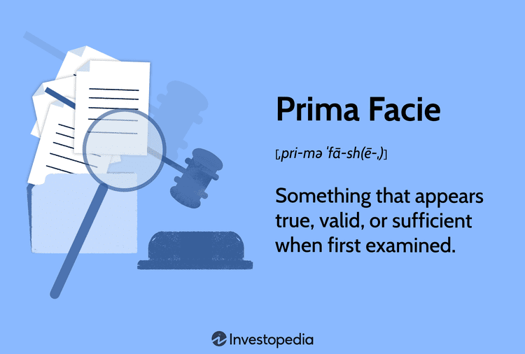

The concept of 'prima facie' plays a pivotal role in the domain of law. Derived from the Latin term meaning 'at first sight,' prima facie evidence is considered sufficient to establish a fact or case unless countered by further evidence. This legal principle serves as an initial threshold assessment to evaluate whether the presented evidence is adequate to support a claim. A prima facie case requires an initial demonstration of sufficient proof to suggest the claim holds merit, thereby warranting further inquiry or possibly advancing to a full trial. 

Establishing a prima facie case is fundamental in legal proceedings as it dictates the forward momentum of litigation. If a party successfully establishes a prima facie case, the burden of proof may shift to the opposing side to refute the initial evidence. Conversely, failure to establish prima facie validity can result in premature dismissal of the claim without a comprehensive trial.



In legal contexts, understanding the nuances of prima facie evidence is not only critical in conventional litigation but is also significant in sectors like finance and trading, where complex transactions can lead to intricate disputes. With advancements in technology, particularly algorithmic trading, the necessity to comprehend prima facie implications becomes more pronounced. Here, prima facie assessments may involve scrutiny of transaction patterns, compliance with fiduciary duties, and potential regulatory infringements, requiring both legal and technical expertise.

## Table of Contents

## Understanding the Legal Concept of Prima Facie

Prima facie is a Latin term meaning "at first sight." It is a crucial concept in law that refers to evidence appearing sufficient to support a legal claim upon initial examination. This designation is significant because it serves as a preliminary threshold that must be met for a case to advance to more detailed scrutiny or a full trial.

In both civil and criminal law, establishing a prima facie case is essential to demonstrate that the claim has the requisite merit. In civil law, prima facie evidence must demonstrate that the basic elements of a claim have been met initially. For example, in a negligence case, the claimant must show evidence suggesting the defendant owed a duty of care, breached that duty, and caused harm as a result.

In criminal law, the burden of proof at the prima facie stage involves showing sufficient evidence that each element of the alleged crime has been preliminarily satisfied. This ensures that only cases with a plausible basis are pursued in court, thereby filtering out baseless claims. For instance, in a fraud case, prima facie evidence might involve demonstrating intent to deceive, actual deception, and subsequent harm.

Different legal systems may apply the concept of prima facie in varied ways. In common law jurisdictions, it functions as a judicial standard to evaluate if the party bearing the burden of proof has presented enough evidence, if uncontested, to support a verdict in their favor. If the threshold is met, the burden may then shift to the opposing party to refute or provide contrary evidence.

The prima facie standard underlines fundamental differences in the burdens of proof between civil and criminal proceedings. While civil cases often revolve around the "preponderance of the evidence," meaning that something is more likely true than not, criminal cases demand a more stringent "beyond a reasonable doubt" standard. However, the prima facie evaluation acts as a preliminary filter in both instances, ensuring that only claims with initial merit receive further judicial resources and consideration.

Understanding these legal nuances surrounding prima facie evidence assists lawyers, judges, and claimants in navigating the intricacies of legal processes efficiently, ensuring that justice is served through systematic evaluations of presented evidence.

## Prima Facie in Tort Law

Prima facie in tort law is essential for proving wrongful actions that cause harm or infringe on rights. This legal concept serves as the initial threshold that a plaintiff must satisfy to establish the basis of their claim. To meet this requirement, four critical elements must be demonstrated: duty, breach, causation, and damages.

1. **Duty**: The plaintiff must first establish that the defendant owed a duty of care towards them. This duty arises from the legal obligation to act reasonably and avoid causing harm to others. For example, a doctor has a duty to provide adequate medical care to their patients.

2. **Breach**: Once duty is established, the plaintiff must show that the defendant breached this duty. This implies that the defendant's actions or omissions fell short of the standard of care expected under the circumstances. For instance, if a driver fails to stop at a red light, they breach their duty to drive safely.

3. **Causation**: The plaintiff must prove that the defendant's breach of duty directly caused the harm or injury sustained. This involves demonstrating both actual cause (cause-in-fact) and proximate cause (legal causation). Actual cause requires showing that the harm would not have occurred "but for" the defendant’s actions, while proximate cause involves demonstrating that the harm was a foreseeable result of the breach.

4. **Damages**: Finally, the plaintiff must provide evidence of actual damages incurred as a result of the breach. Damages may include physical injuries, financial losses, or emotional distress. For example, in a business dispute, a plaintiff might claim financial loss due to a partner's negligence in managing company assets, thus necessitating proof of such financial harm.

A practical example highlighting prima facie in tort law could involve a scenario where a business claims that another company's negligence caused a significant financial loss. Suppose Company A entrusted Company B with sensitive financial data under the expectation of confidentiality (duty). If Company B inadvertently disclosed this data, resulting in a financial setback for Company A (breach), it would need to prove that the breach directly caused monetary damage (causation and damages). If these criteria are met, a prima facie case is established, allowing the claim to proceed to trial.

Understanding these elements in tort law is crucial for effectively navigating legal disputes and ensuring that claims proceed on a solid evidential foundation.

## Prima Facie in Criminal Law

In criminal law, establishing a prima facie case is a fundamental requirement for the prosecution. This legal benchmark ensures that there is adequate initial evidence for each element of the alleged crime before the matter can move forward to a full trial. The burden of proof lies with the prosecution, which must demonstrate that the evidence is sufficient to create a presumption of guilt that needs to be rebutted by the defendant.

The concept of prima facie is essential because it acts as a filter, determining which cases have enough substance to merit judicial consideration. If the prosecution cannot establish prima facie evidence for all components of the alleged crime, the case may be dismissed at a preliminary stage. This prevents the legal system from being inundated with unsubstantiated claims and ensures that the defendant is not unfairly subjected to a full trial without a basis.

In fraud allegations involving [algorithmic trading](/wiki/algorithmic-trading), the role of prima facie evidence can be particularly intricate due to the complex nature of transactions and the technology used. To satisfy the prima facie standard in such cases, the prosecution might need to present transaction records that show irregular patterns indicative of misrepresentation or deceit. Evidence must not only include the raw data from transaction logs but also a demonstration of intent, which can be more challenging to establish. The intent can be inferred from communication records or patterns that align with fraudulent activity.

For example, consider a scenario where an individual is accused of manipulating stock prices using a high-frequency trading algorithm. The prosecution would need to provide evidence such as anomalous trading patterns that deviate from market norms, possibly suggesting intentional market manipulation. Additionally, communications between parties involved in setting up or executing the trades could serve as supplementary prima facie evidence of intent to defraud.

Thus, the prima facie requirement in criminal cases ensures that there is a solid evidential foundation before a defendant is required to answer charges, preserving the integrity and efficiency of the criminal justice system.

## Examples and Real-World Applications

A prima facie case in employment discrimination, particularly under the Civil Rights Act of 1964, necessitates evidence that establishes fundamental elements of discrimination at the outset. To demonstrate a prima facie case, an individual typically must show that they belong to a protected class, experienced adverse employment action, and possess qualifications comparable to those who did not experience such discrimination ([EEOC](https://www.eeoc.gov/)). These foundational requirements set the stage for the possibility of further litigation, compelling employers to provide a legitimate, non-discriminatory reason for their employment decisions.

In the trading and finance sectors, the establishment of prima facie cases often revolves around fiduciary duty and compliance disputes. For instance, breaches of fiduciary duty might be alleged if a party entrusted with management responsibilities demonstrates a conflict of interest or fails to act in the best interests of stakeholders. Regulatory compliance disputes can arise when initial evidence suggests violations of securities laws or trading regulations. These may involve factors like insider trading allegations or misleading financial disclosures.

In algorithmic trading, prima facie evidence requires a nuanced approach due to the complex nature of automated transactions. Characteristics like high-frequency trading patterns can be scrutinized for signs of unlawful activities such as market manipulation or collusion. Data analysis might reveal irregularities in trade execution speed, [volume](/wiki/volume-trading-strategy), or timing, prompting further investigation.

An example of identifying suspicious trading patterns might involve examining large volumes of trades executed within milliseconds, which deviate from expected market behavior. Programmatic analysis using Python could be employed to sift through large datasets, detecting anomalies that suggest potential regulatory breaches. Here's a basic illustration using Python:

```python
import pandas as pd

# Load trading data
trading_data = pd.read_csv('trading_data.csv')

# Define a threshold for what constitutes suspicious trading volumes or times
suspicious_volume = 10000
suspicious_time = 0.001 # seconds

# Flag trades that exceed suspicious thresholds
suspicious_trades = trading_data[(trading_data['volume'] > suspicious_volume) & 
                                 (trading_data['execution_time'] < suspicious_time)]

# Review flagged trades for potential issues
print(suspicious_trades)
```

This script helps identify transactions that might contribute to a prima facie case by evaluating patterns that could signify misconduct. Overall, understanding prima facie evidentiary requirements across different legal contexts ensures parties effectively navigate legal disputes to support or refute claims.

## Prima Facie Cases in Algorithmic Trading

Algorithmic trading introduces a set of complexities when attempting to establish prima facie cases due to its inherently fast-paced and intricate nature. The rapid execution and substantial data involved create difficulty in tracing and analyzing actions that may constitute regulatory violations or trading malpractice. To effectively establish a prima facie case in this setting, one must pinpoint initial evidence that strongly suggests non-compliance or malfeasance.

One of the initial indicators of potential violations in algorithmic trading can be observed through suspicious trading patterns. These might include abrupt spikes in trade volume, unexpected price movements, or anomalies that deviate from market norms without clear justification. Such patterns may suggest activities like market manipulation, insider trading, or the exploitation of non-public information.

Moreover, another crucial area to investigate involves the breach of fiduciary duties by trading algorithms. Algorithms are often designed to maximize profits for clients, but they must also adhere to legal and ethical standards. When a trading algorithm engages in practices that conflict with a client's best interests or violate regulatory stipulations, it is vital to uncover instances where these duties have been compromised. For example, actions such as front-running, where an algorithm preemptively executes orders to benefit from an anticipated market movement at the expense of the client, would constitute a breach.

To aid in the detection and analysis of such potential breaches, algorithmic forensic tools and techniques can be employed. Tools that scrutinize trade logs and monitor algorithmic behavior are essential for identifying patterns indicative of misconduct. Machine learning algorithms, for instance, can be utilized to detect anomalies in trading sequences, helping to uncover possible infringements.

Here is a basic Python example showcasing how one might begin detecting unusual trading patterns:

```python
import pandas as pd
import numpy as np

# Load trading data
# Assume df is a DataFrame with columns: 'timestamp', 'price', 'volume'
df = pd.read_csv('trading_data.csv')

# Calculate moving average and standard deviation
window_size = 50
df['moving_avg'] = df['price'].rolling(window=window_size).mean()
df['std_dev'] = df['price'].rolling(window=window_size).std()

# Identify anomaly when the current price deviates significantly from the moving average
threshold = 3  # e.g., 3 standard deviations
df['anomaly'] = np.abs(df['price'] - df['moving_avg']) > (threshold * df['std_dev'])

anomalies = df[df['anomaly']]

print("Potential suspicious trading patterns detected at:")
print(anomalies[['timestamp', 'price', 'volume']])
```

This example demonstrates the foundational steps for identifying trading irregularities; however, building a comprehensive case requires a deeper investigation. It is crucial to compile detailed reports, cross-reference regulatory guidelines, and possibly conduct interviews with relevant parties. Only then can these initial observations form the basis of a strong prima facie case in the complex environment of algorithmic trading.

## Conclusion

In legal and financial contexts, grasping the concept of prima facie is essential. Its role as an initial threshold of evidence helps litigants determine the viability of their claims early in the legal process. By establishing sufficient preliminary proof, cases can proceed with greater clarity and efficiency. This foundational standard is applicable across various domains, including civil, tort, and criminal law.

In specific fields like algorithmic trading, the significance of prima facie becomes even more pronounced. Here, the rapid and automated nature of transactions demands clear initial evidence to detect and address potential legal violations. Patterns suggesting regulatory breaches or breaches of fiduciary duties can set the stage for more comprehensive investigations and legal proceedings.

The ability to identify and articulate a prima facie case effectively hinges on understanding its fundamental components and applications. By doing so, parties involved in legal disputes can better navigate their cases toward resolution. Whether in traditional legal settings or emerging areas like algorithmic trading, the power of prima facie evidence serves as a guiding element in shaping the trajectory and outcome of potential cases.

## References & Further Reading

[1]: Twerski, A.D., & Cohen, R. L. (2012). ["Prima Facie Tort: From Holmes to the Restatement (Second) and Beyond."](https://www.cornelllawreview.org/wp-content/uploads/2020/08/Twerski-essay-final.pdf) Cornell Law Review, 79(5), 995-1051.

[2]: Lopez de Prado, M. (2018). ["Advances in Financial Machine Learning."](https://www.amazon.com/Advances-Financial-Machine-Learning-Marcos/dp/1119482089) Wiley.

[3]: Aronson, D. (2007). ["Evidence-Based Technical Analysis: Applying the Scientific Method and Statistical Inference to Trading Signals."](https://www.amazon.com/Evidence-Based-Technical-Analysis-Scientific-Statistical/dp/0470008741) Wiley.

[4]: Jansen, S. (2020). ["Machine Learning for Algorithmic Trading."](https://github.com/stefan-jansen/machine-learning-for-trading) Packt Publishing.

[5]: Chan, E. P. (2008). ["Quantitative Trading: How to Build Your Own Algorithmic Trading Business."](https://github.com/ftvision/quant_trading_echan_book) Wiley.

[6]: Baldus, D. C., & Cole, J. W. (1974). ["A Comparison of the Work of Federal District Judges: The Productivity and Reputation of Judges Appointed by President Johnson and President Nixon."](https://journals.asm.org/doi/full/10.1128/ecosalplus.esp-0021-2015) The University of Chicago Law Review, 41(3), 491-508.