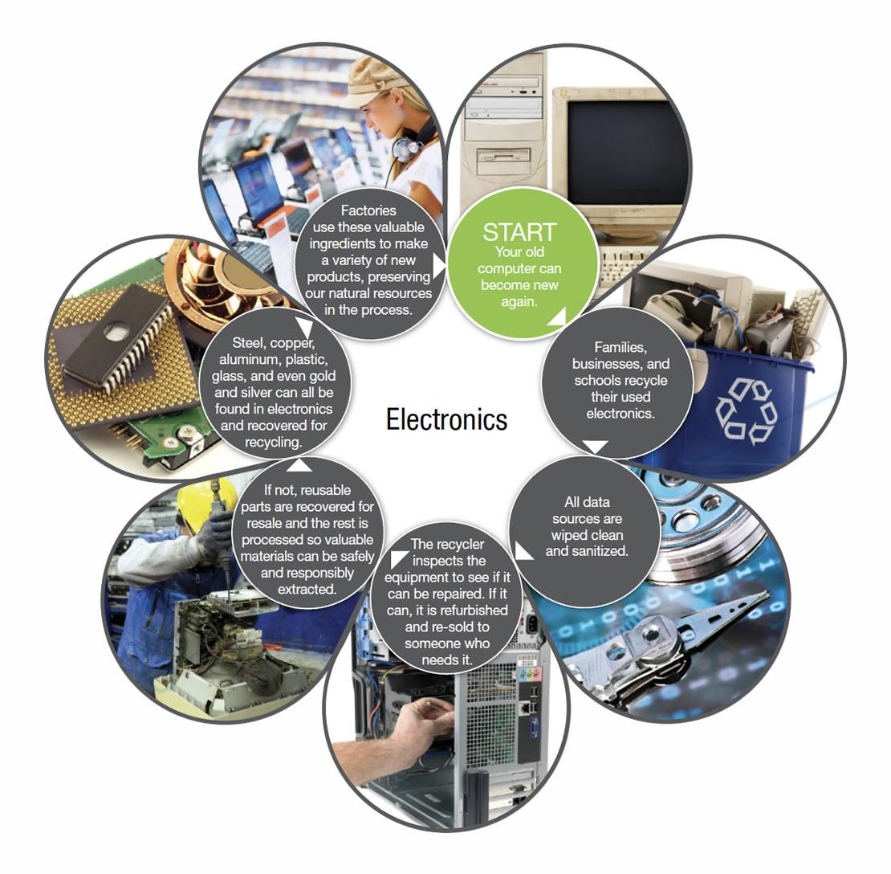

## Table of Contents

## What are primary commodities in the context of the electronics industry?

Primary commodities in the electronics industry are the basic raw materials used to make electronic devices. These include metals like copper, which is used in wires and circuits, and silicon, which is essential for making computer chips. Other important commodities are gold and silver, used in connectors and circuit boards because they conduct electricity well and do not corrode easily.

These materials are crucial because they form the building blocks of all electronic products. Without them, it would be impossible to create the complex circuits and components that make up smartphones, computers, and other gadgets. The availability and price of these commodities can affect the cost and production of electronic devices, making them a key factor in the industry.

## Which metals are commonly used in electronic devices?

In electronic devices, many different metals are used because they help electricity flow and do important jobs. Copper is one of the most common metals you'll find. It's used a lot in wires and circuit boards because it's a great conductor of electricity. That means it can carry electric current really well. Another important metal is silicon. It's used to make the tiny chips that control how devices work. These chips are in everything from your phone to your computer.

Gold and silver are also used in electronics. They are great at conducting electricity and they don't rust or wear out easily, which makes them perfect for small parts like connectors on circuit boards. Even though they are more expensive, their special properties make them worth using. Aluminum is another metal you might find in electronics. It's light and strong, so it's often used in the cases of devices like laptops and smartphones.

These metals are really important because they help make electronic devices work properly. Without them, we wouldn't have the technology we use every day. The cost and availability of these metals can affect how much electronic devices cost and how easy they are to make.

## How are rare earth elements utilized in electronics?

Rare earth elements are special metals that are used a lot in electronic devices. They help make things like smartphones, computers, and TVs work better. For example, neodymium is used to make strong magnets that are found in the speakers and hard drives of these devices. These magnets are much smaller and stronger than regular magnets, which helps make electronics smaller and more powerful.

Another important rare earth element is lanthanum, which is used in rechargeable batteries. These batteries are in many of our gadgets, like cell phones and laptops. Without lanthanum, these batteries wouldn't work as well. Also, elements like yttrium and europium are used in the screens of TVs and smartphones to make the colors brighter and more vibrant. So, rare earth elements are really important for making our electronics work the way we want them to.

## What role do semiconductors play in electronic components?

Semiconductors are very important in electronic components. They are materials that can control the flow of electricity. This is really useful because it lets us make things like computer chips and transistors. These chips are the brains of devices like smartphones and computers. They help process information and make the device work. Without semiconductors, we wouldn't be able to have the technology we use every day.

Semiconductors can be made to act like switches. They can turn the flow of electricity on or off, which is how they help control and direct the flow of electricity in a circuit. This ability to switch and control electricity is what makes semiconductors so important in electronics. They are used in everything from simple devices like calculators to complex systems like satellites. So, semiconductors are a key part of making our electronic devices work the way we need them to.

## How is copper used in the electronics industry?

Copper is really important in the electronics industry. It's used a lot because it's a great conductor of electricity. That means it can carry electric current really well. In electronic devices, copper is used to make wires and circuit boards. These wires and boards help electricity move around inside the device, making it work properly. Without copper, it would be hard to make the tiny circuits that are in things like smartphones and computers.

Copper is also used because it's strong and can be shaped easily. This makes it good for making the parts of electronic devices that need to be small and precise. For example, copper is used in the connectors that link different parts of a circuit board together. These connectors need to be reliable and work well, and copper helps make that happen. So, copper is a key material in the electronics industry, helping to make our devices smaller, faster, and more efficient.

## What are the sources of silicon used in electronics, and why is it important?

Silicon used in electronics mostly comes from sand and quartz, which are found all over the world. These materials are made up of silicon dioxide, which can be turned into pure silicon through a process called reduction. This pure silicon is then used to make the tiny chips that are found in electronic devices. Countries like China, Russia, and the United States have a lot of these resources, so they are big producers of silicon.

Silicon is really important in electronics because it's used to make semiconductors. Semiconductors are special materials that can control the flow of electricity. This ability to control electricity is what makes silicon so useful. It's used to make the computer chips that are the brains of devices like smartphones, laptops, and TVs. Without silicon, we wouldn't have the technology we use every day. So, silicon is a key part of making our electronic devices work the way we need them to.

## How do primary commodities impact the cost of electronic devices?

Primary commodities like copper, silicon, and rare earth elements are really important for making electronic devices. They are the basic materials that go into making things like smartphones, computers, and TVs. When the prices of these commodities go up, it can make electronic devices more expensive. For example, if the price of copper goes up, the cost of making circuit boards and wires goes up too. This means that the companies making the devices might have to charge more money for them.

The availability of these commodities also matters. If there's not enough of a certain material, like silicon, it can slow down production and make devices more expensive. Sometimes, countries that have a lot of these resources might control how much is available, which can affect prices. So, the cost and availability of primary commodities can have a big impact on how much we pay for our electronic devices.

## What are the environmental impacts of extracting primary commodities for electronics?

Extracting primary commodities for electronics can harm the environment. Mining for metals like copper and gold often involves digging big holes in the ground and using a lot of water and chemicals. This can pollute rivers and lakes, making it hard for plants and animals to live there. Also, the machines used for mining release a lot of carbon dioxide into the air, which adds to climate change.

Another issue is with rare earth elements. These are hard to get and need a lot of processing, which can create toxic waste. This waste can leak into the soil and water, hurting the environment and people's health. For example, mining for neodymium, which is used in magnets, can leave behind radioactive materials that are dangerous.

Overall, the demand for electronics means more mining and processing of these commodities. This can lead to deforestation, loss of habitats, and pollution. It's important for companies and governments to find ways to reduce these impacts and protect the environment while still meeting the need for electronic devices.

## How has the demand for primary commodities in electronics changed over the last decade?

Over the last ten years, the demand for primary commodities used in electronics has grown a lot. This is because more and more people around the world are using smartphones, computers, and other gadgets. As technology gets better, we need more of these materials to make the devices smaller and more powerful. For example, the need for silicon, which is used to make computer chips, has gone up because chips are now in everything from cars to home appliances. Also, the demand for copper, which is used in wires and circuit boards, has increased as more devices are made.

The rise in demand for rare earth elements has been big too. These elements are used in things like magnets and batteries, which are important parts of many electronics. As electric cars and renewable energy technologies become more popular, the need for rare earth elements like neodymium and lanthanum has grown even more. This increased demand has put pressure on the supply of these commodities, sometimes making them harder to get and more expensive. Overall, the growing use of electronics has led to a bigger need for these primary commodities over the last decade.

## What are the challenges in recycling primary commodities from electronic waste?

Recycling primary commodities from electronic waste is hard because electronic devices are made up of many different materials mixed together. It's tough to take apart these devices and separate the metals like copper, gold, and rare earth elements. The process needs special equipment and can be expensive. Also, some of the materials in electronics can be harmful if they are not handled the right way. This means that recycling centers need to follow strict rules to keep workers and the environment safe.

Another challenge is that not enough electronic waste is collected for recycling. Many people don't know how to recycle their old devices or where to take them. Some countries don't have good systems for collecting electronic waste, so a lot of it ends up in landfills. When electronic waste is not recycled properly, valuable materials are wasted, and harmful substances can leak into the ground and water. So, it's important to improve how we collect and recycle electronic waste to make better use of these primary commodities and protect the environment.

## How do geopolitical factors influence the supply of primary commodities for the electronics industry?

Geopolitical factors can really affect how much primary commodities are available for the electronics industry. Some countries have a lot of these materials, like China, which has a big supply of rare earth elements. If these countries decide to limit how much they export, it can make it harder for other countries to get the materials they need to make electronics. For example, if China puts restrictions on exporting rare earth elements, it can slow down production of devices like smartphones and electric cars in other parts of the world. This can lead to higher prices and delays in getting new technology to people.

Also, political tensions and trade policies can change how these commodities move around the world. If two countries don't get along, they might put tariffs or other limits on trading with each other. This can make it more expensive and difficult to get the materials needed for electronics. For instance, if there's a trade war between the U.S. and China, it could affect the supply of silicon and other key materials. So, the politics between countries can have a big impact on the electronics industry, making it important for companies to plan carefully and find different ways to get the commodities they need.

## What future trends are expected in the use of primary commodities in electronics?

In the future, the use of primary commodities in electronics is expected to keep growing. As more people around the world use smartphones, computers, and other gadgets, the need for materials like copper, silicon, and rare earth elements will go up. New technologies, like electric cars and renewable energy systems, will also need more of these materials. For example, electric cars use a lot of copper in their batteries and motors, and renewable energy systems like wind turbines use rare earth elements in their magnets. So, the demand for these commodities will likely increase as these technologies become more common.

Another trend is that companies will try to find new ways to use these materials more efficiently. This means they will work on making devices smaller and using less material to make them. They will also look for new materials that can replace some of the primary commodities we use now. For example, researchers are looking into using graphene instead of silicon for some electronic parts because it's very thin and conducts electricity well. Also, recycling will become more important. As electronic waste grows, finding better ways to recycle materials like copper and rare earth elements will help meet the demand for these commodities and reduce the need to mine new resources.

## References & Further Reading

[1]: Veiga, L. F., & Salazar, D. (2017). ["What's behind the increasing cause of equity market volatility? The role of algorithmic trading and high-frequency trading."](https://digital.csic.es/bitstream/10261/373872/1/1-s2.0-S0269749124020621-main.pdf) Research in International Business and Finance, 39, 194-205.

[2]: Lopez de Prado, M. (2018). ["Advances in Financial Machine Learning."](https://www.amazon.com/Advances-Financial-Machine-Learning-Marcos/dp/1119482089) Wiley Finance.

[3]: Hayes, B. J. (2018). ["The Importance and Impacts of Lithium Ion Batteries."](https://www.sciencedirect.com/science/article/pii/S2214629624003475) IEEE Electromagnetic Compatibility Magazine, 7(3), 23-26.

[4]: Jansen, S. (2020). ["Machine Learning for Algorithmic Trading."](https://github.com/stefan-jansen/machine-learning-for-trading) Packt Publishing.

[5]: Green, J. M., Weeks, J., & Liu, E. K. (2013). ["Rare Earth Elements: The Global Supply Chain."](https://www.researchgate.net/publication/369737109_Global_rare_earth_elements_projects_New_developments_and_supply_chains) Congressional Research Service.

[6]: U.S. Geological Survey. (2021). ["Minerals Yearbook."](https://www.usgs.gov/centers/national-minerals-information-center/minerals-yearbook-metals-and-minerals) U.S. Department of the Interior.

[7]: Chan, E. P. (2009). ["Quantitative Trading: How to Build Your Own Algorithmic Trading Business."](https://github.com/ftvision/quant_trading_echan_book) John Wiley & Sons.